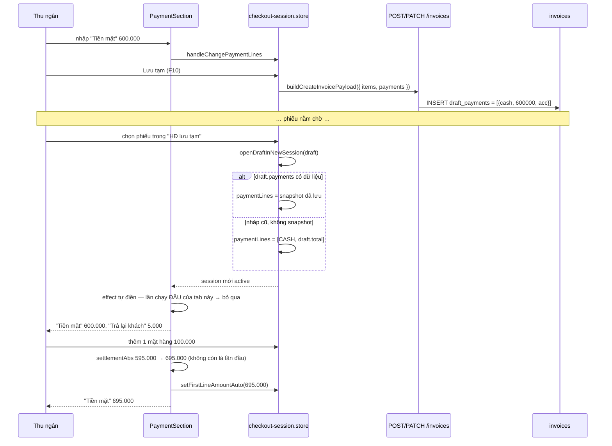
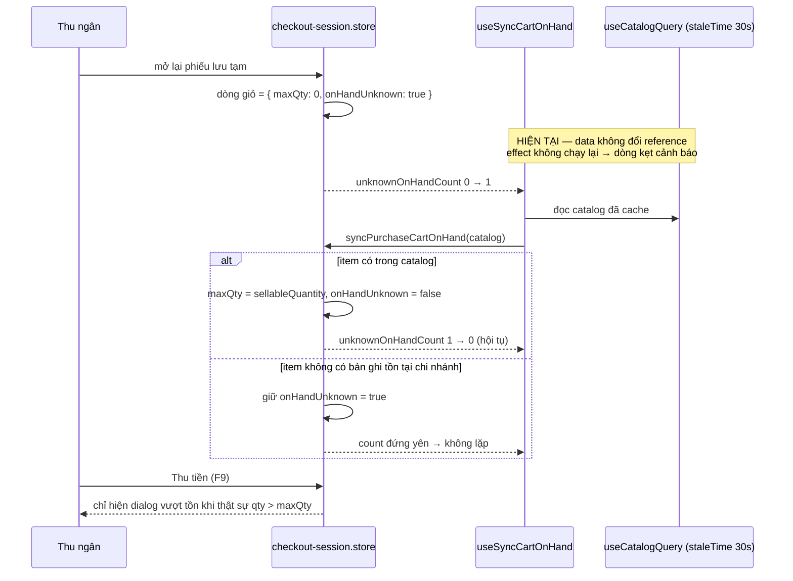

# Logical design — Hoá đơn lưu tạm

## Approach

Ba lỗi độc lập nhau về mã nguồn, gộp một plan vì cùng một hành trình người dùng.

1. **Tiền thanh toán (US-01)** — thêm một cột `jsonb` `draft_payments` trên `invoices` để
   chụp lại các dòng thanh toán tại thời điểm "Lưu tạm". Đường khôi phục
   (`openDraftInNewSession`) gán thẳng các dòng đó vào tab mới; nếu phiếu không có snapshot
   (nháp cũ) thì gán một dòng "Tiền mặt" bằng tổng phải thu của phiếu. Song song, effect tự
   điền của `PaymentSection` bỏ qua lần chạy đầu của mỗi tab, để số vừa khôi phục không bị
   ghi đè ngay lúc mở — nhưng vẫn bám theo tổng khi giỏ hàng đổi sau đó.

2. **Cảnh báo tồn (US-02)** — không đụng backend. `useSyncCartOnHand` hiện chỉ chạy lại khi
   *reference* dữ liệu catalog đổi, nên dòng vừa được thêm vào giỏ sau lần fetch cuối không
   bao giờ được điền tồn. Thêm một dep vô hướng: số dòng đang mang cờ `onHandUnknown`. Khôi
   phục nháp làm số này 0 → n, effect chạy, sync điền tồn thật, số về 0 lại và hội tụ.

3. **Danh sách hoá đơn (US-03)** — thêm đúng một mệnh đề `status <> 'draft'` vào
   `SearchInvoicesV2Handler.buildQuery()`. Vì `buildQuery` được dùng cho cả truy vấn dòng lẫn
   truy vấn tổng, dòng "Tổng tiền" và ô đếm kết quả tự khớp, không cần sửa thêm.

## Alternatives rejected

| Option | Why not |
| --- | --- |
| Giữ chỗ tồn kho cho hoá đơn nháp | Không phải lỗi: backend không hề ghi sổ kho khi tạo nháp (A-02/A-10). Đây là tính năng mới, và nó kéo theo cả bài toán nhả chỗ khi nháp bị bỏ quên |
| Lưu dòng thanh toán nháp vào `invoice_payments` | `account_id` NOT NULL và bảng đó là chân tiền của journal entries. Nháp chưa giải được COA, mà nhét vào là để số liệu chưa bán chảy vào kế toán (A-05) |
| Bảng `invoice_draft_payments` riêng | Snapshot đọc nguyên khối, ghi đè nguyên khối, chỉ sống cùng vòng đời phiếu nháp. Một bảng + FK + migration cho dữ liệu không ai join tới là thừa |
| Lọc nháp ở client trong `useInvoiceList` | Server vẫn đếm và cộng tổng cả nháp → "Tổng tiền" và "1-4/4 kết quả" sai lệch với lưới. Đúng cái lỗi đang than phiền |
| Đồng bộ tồn ngay trong `handleRestoreDraft` bằng cache React Query | Chỉ vá đúng đường khôi phục nháp, và bỏ sót ca catalog chưa tải xong (AC-09). Dep vô hướng phủ cả hai mà ít mã hơn |
| Khoá cứng số tiền khôi phục (không bao giờ auto-fill lại) | Vi phạm AC-04: thêm hàng vào giỏ mà số tiền đứng yên là lỗi mới, tệ hơn lỗi đang sửa |

## Domain model

| Entity | Fields | Notes |
| --- | --- | --- |
| `invoices.draft_payments` | `jsonb`, nullable | Mảng `{ method, amount, paymentAccountId }`. Chỉ có nghĩa khi `is_draft = true`; không đọc ở bất kỳ đường ghi sổ nào |
| `DraftPaymentSnapshotDto` | `method: InvoicePaymentMethod`, `amount: number ≥ 0`, `paymentAccountId?: uuid` | Dùng chung cho create + update; validate qua class-validator như mọi DTO khác |
| `DraftInvoice.payments` (FE) | `{ method, label, amount, paymentAccountId }[]` | Đã tồn tại trong `checkout.interface.ts`, hiện không có nguồn nào điền. Bổ sung `paymentAccountId` |

## Contracts

### POST /invoices  ·  PATCH /invoices/:id
Thêm trường tuỳ chọn vào body:
```json
{ "payments": [{ "method": "cash", "amount": 595000, "paymentAccountId": "…uuid…" }] }
```
Bỏ trống = không đổi snapshot (PATCH) / không có snapshot (POST). Mảng rỗng = xoá snapshot.
Failure modes: 400 khi `method` ngoài enum hoặc `amount < 0`; 404 khi id không thuộc tổ chức.

### POST /v2/invoices/drafts/search
`DraftInvoiceResponseDto` kế thừa `InvoiceEntity` nên `draftPayments` đi kèm sẵn khi cột được
thêm. Không đổi shape request.

### POST /v2/invoices/search
Không đổi request/response. Đổi **hành vi**: kết quả không còn hoá đơn `status = 'draft'`,
và `total` / `totals.totalAmount` cũng không tính chúng.

## Sequence — Lưu tạm rồi mở lại (US-01)



## Sequence — Cảnh báo tồn trên phiếu mở lại (US-02)



## State ownership

| State | Owner | Lifetime |
| --- | --- | --- |
| `draft_payments` | `invoices` (Postgres) | Vòng đời phiếu nháp; không xoá khi nháp thành hoá đơn (không ai đọc sau đó) |
| Dòng thanh toán của tab | `InvoiceSession.draft.payment` (zustand, persist) | Theo tab, sống qua reload |
| Cờ "đã settle lần đầu" của tab | `useRef` trong `PaymentSection`, khoá theo `activeSessionId` | Theo lần mount; cố tình KHÔNG persist |
| `maxQty` / `onHandUnknown` | `InvoiceSession.purchaseCart` | Theo tab; luôn bị catalog mới ghi đè |

## Error taxonomy

| Condition | Failure | UI |
| --- | --- | --- |
| `payments[].method` ngoài enum / `amount < 0` | 400 `BadRequestException` từ global ValidationPipe | Toast lỗi lưu tạm (đường sẵn có trong `useCheckoutDraft`) |
| `draft_payments` là jsonb rác (dữ liệu tay) | Mapper FE bỏ qua snapshot | Rơi về nhánh "nháp cũ": một dòng CASH = tổng phải thu |
| Catalog lỗi tải | `syncPurchaseCartOnHand` không chạy | Dòng giữ "Chưa xác định được tồn kho" — đúng ý A-08 |

## Cache & offline

Không thêm cache mới. `useCatalogQuery` giữ nguyên `staleTime: 30_000`; thay đổi ở US-02 chỉ
là *khi nào chạy lại phép đồng bộ*, không phải *khi nào fetch*.

## Observability

Không thêm event. Ba lỗi đều nhìn thấy trực tiếp trên UI và đã có script demo ở mỗi UoW.

## ADRs

### ADR-01 — Effect tự điền bỏ qua lần settle đầu tiên của mỗi tab
**Context:** `PaymentSection` ghi đè dòng thanh toán mỗi khi `settlementAbs` đổi, kể cả ở lần
chạy đầu ngay sau khi tab được dựng. Số tiền vừa khôi phục sẽ bị xoá trước khi thu ngân kịp
nhìn thấy.
**Decision:** Giữ `useRef` `{ sessionId, total }`. Effect chỉ tự điền khi đã thấy tab đó ít
nhất một lần **và** `settlementAbs` khác lần trước. Lần đầu của mỗi `activeSessionId` chỉ ghi
nhận, không ghi đè.
**Consequences:** Số khôi phục sống sót; số gõ tay cũng sống sót qua reload và qua chuyển tab
(hôm nay đang bị stomp) — thay đổi hành vi có lợi nhưng nằm ngoài khiếu nại, phải nêu rõ khi
demo. Đổi lại, tab mới dựng bằng `addSession()` không còn được auto-fill ở lần đầu; điều đó
vô hại vì giỏ rỗng nên tổng bằng 0.

Giới hạn đo được ở G4: phiếu nháp KHÔNG lưu khuyến mại, nên mở lại là preview chạy lại và
kéo tổng xuống thật. Nhịp đó không phân biệt được với "thu ngân vừa sửa giỏ", nên số vừa
khôi phục vẫn bị ghi đè theo tổng mới. Đã thử gác thêm bằng trạng thái preview và **bỏ**:
preview khởi động ở `idle` chứ không phải `loading` nên cái gác không bắt được nhịp đầu, mà
gác theo `ready` thì phiếu không có CTKM sẽ kẹt mãi không auto-fill. Chốt: chấp nhận, vì số
cũ vốn được gõ cho một tổng khác — bám theo tổng mới đúng hơn. AC-05 được khoanh lại cho
đúng điều này.
**Status:** accepted

### ADR-02 — `draft_payments` là cột jsonb trên `invoices`
**Context:** Cần lưu số tiền đã nhập của phiếu chưa bán. `invoice_payments` bắt buộc
`account_id` và là chân tiền kế toán.
**Decision:** Cột `jsonb` nullable `draft_payments` trên `invoices`, ghi/đọc nguyên khối, chỉ
`POST /invoices`, `PATCH /invoices/:id` và endpoint tìm nháp chạm tới.
**Consequences:** Không index được theo phương thức thanh toán — chấp nhận, vì không có truy
vấn nào cần. Không có ràng buộc DB trên nội dung; DTO là nơi validate duy nhất. Không đụng
`checkout-saga` nên không có rủi ro cho đường ghi sổ.
**Status:** accepted

### ADR-03 — Đồng bộ tồn kích hoạt bằng số dòng chưa-biết-tồn
**Context:** `useSyncCartOnHand` chỉ phản ứng với reference dữ liệu catalog, nên giỏ đổi sau
lần fetch cuối không bao giờ được đồng bộ.
**Decision:** Thêm selector vô hướng đếm dòng `onHandUnknown` trên mọi session và đưa vào dep
của effect.
**Consequences:** Sửa cả lớp lỗi chứ không riêng đường nháp. Effect có thể chạy hai nhịp
(điền tồn → count về 0 → chạy lại → no-op); `syncPurchaseCartOnHand` vốn đã chỉ `set` khi có
thay đổi nên hội tụ. Vô hướng nên không thêm re-render ngoài lúc con số thật sự đổi.
**Status:** accepted

### ADR-04 — Lọc nháp ở server, trong chính `buildQuery`
**Context:** `/v2/invoices/search` dựng truy vấn hai lần (dòng + tổng) từ cùng một
`buildQuery`.
**Decision:** Đặt `status <> 'draft'` trong `buildQuery`, không phải ở nhánh lấy dòng.
**Consequences:** Lưới, số đếm và "Tổng tiền" không thể lệch nhau. Client truyền
`status = draft` sẽ nhận rỗng — đúng, vì màn này không còn là nơi xem nháp.

Ba handler v2 anh em lọc bằng cờ boolean (`inv.isDraft = false` ở returnable và
purchase-history, `= true` ở drafts), handler này thì lọc bằng `status`. Cố ý lệch: hai
trường luôn được ghi cùng nhau ở cả bốn đường ghi và trên `erp_dev` không có dòng nào
phân kỳ, nhưng nếu một ngày chúng lệch thì `status <> 'draft'` **hiện thừa một phiếu nháp**
còn `isDraft = false` **giấu mất một hoá đơn đã bán**. Với màn danh sách hoá đơn, hỏng theo
chiều thứ nhất rẻ hơn hẳn. Badge trạng thái trên lưới cũng đọc từ `status`, nên điều kiện
lọc khớp đúng thứ người dùng nhìn thấy.
**Status:** accepted

### ADR-05 — Không xoá `draft_payments` khi nháp thành hoá đơn
**Context:** Sau khi thanh toán, snapshot trở nên vô nghĩa.
**Decision:** Để nguyên. `checkout-saga` không đọc và không ghi cột này.
**Consequences:** Hoá đơn đã bán mang theo một trường lịch sử vô hại. Đổi lại, đường ghi sổ
không bị thêm một lần ghi nào, và bất biến "hoá đơn đã post là bất biến" không bị chạm.
**Status:** accepted
