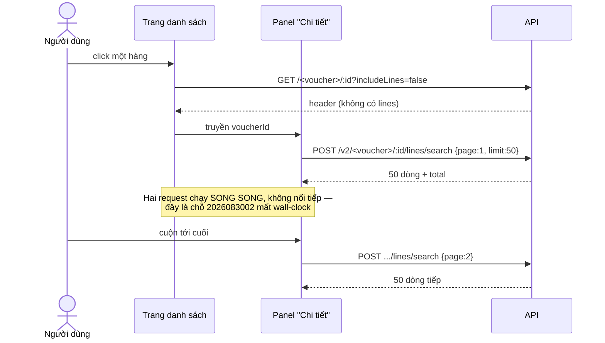
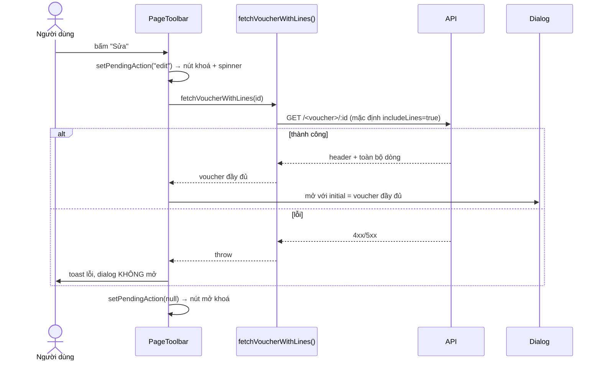
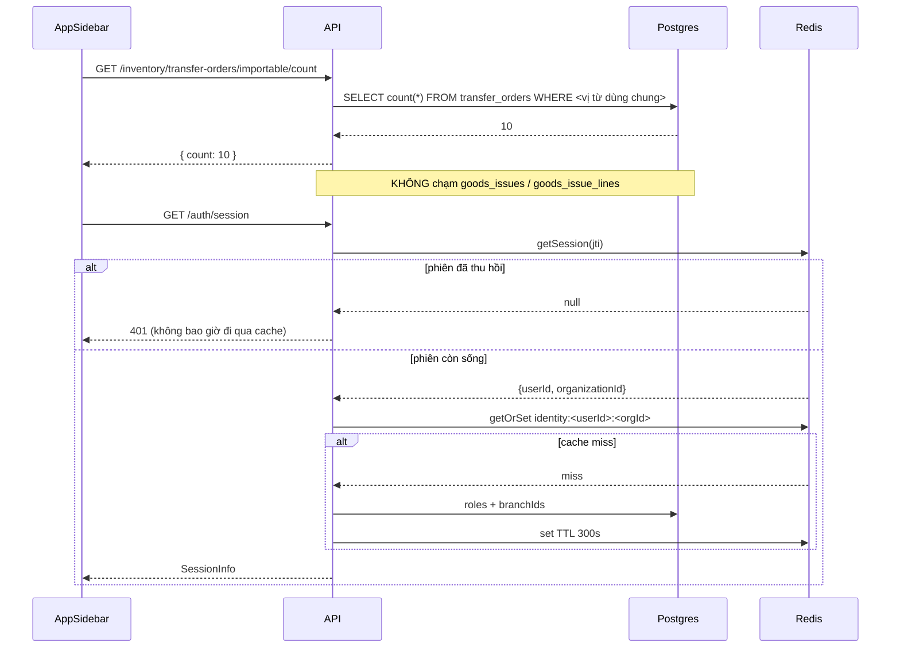

# Logical design — Cắt payload đường đọc

## Approach

Ba nhóm việc, ba cơ chế khác nhau, chung một nguyên tắc: **payload phải tỉ lệ với thứ người
dùng đang nhìn, không tỉ lệ với kích thước chứng từ.**

1. **Đường chọn-dòng (P1).** Hai trang đã đủ hạ tầng (Nhập kho, Xuất kho) chỉ sửa client.
   Ba trang còn thiếu (Lệnh điều chuyển, Chuyển kho, Kiểm kê) phải dựng nốt hạ tầng theo
   đúng khuôn `2026083002`: cột thứ tự → endpoint CQRS `/lines/search` → cờ `includeLines`
   → panel cuộn vô hạn.
2. **Badge (P2).** Một route đếm, chia sẻ vị từ với `listImportable` qua một hàm dựng `where`
   duy nhất.
3. **Danh tính phiên (P3).** Redis cache cho phần dẫn xuất từ `userId + organizationId`, đặt
   đúng ở đường đọc và **không** đặt ở đường phát hành token.

### Luồng 1 — chọn phiếu (sau khi sửa)

### Luồng 2 — bấm "Sửa" / "Nhân bản" / "In tem mã" (A-02)

### Luồng 3 — badge và cache danh tính

## Decisions

### ADR-01 — Cắt dòng ở client; mặc định `includeLines` của BE giữ nguyên `true`
**Status:** accepted
**Context:** Cờ `includeLines` đã tồn tại từ `2026083002` và tài liệu hoá mặc định `true`
trong OpenAPI. Đảo mặc định là cách sửa ít dòng code nhất và **cũng là cách hỏng nhiều thứ
nhất**: mọi consumer không biết cờ này — kể cả `getPrintPayload`, export, và các đường trong
`transfer-in` — sẽ lặng lẽ nhận phiếu rỗng dòng.
**Decision:** BE không đổi mặc định. Client nào không cần dòng thì tự khai `includeLines=false`.
**Rejected:** đảo mặc định thành `false` (breaking, im lặng); thêm cờ `lite=true` thứ hai
(hai cờ nói cùng một chuyện).

### ADR-02 — Nạp-khi-bấm bằng một helper dùng chung, không prefetch
**Status:** accepted
**Context:** Ba nút cần cả mảng dòng (A-02). Prefetch-khi-hover xoá được độ trễ nhưng rê
chuột qua 20 hàng là 20 lượt tải toàn bộ dòng — ngược hẳn mục tiêu.
**Decision:** Một helper cho mỗi trang (`fetchVoucherWithLines(id)`), gọi `GET /:id` mặc định.
Nút giữ trạng thái `pendingAction` để khoá đúng nút đang chờ, không khoá cả thanh công cụ.
Lỗi thì không mở dialog (AC-04).
**Rejected:** prefetch-on-hover; mở dialog trước rồi để lưới tự tải (dialog Sửa sẽ có một
khoảnh khắc `lines` rỗng — bấm Lưu lúc đó là **xoá sạch dòng của phiếu**).

### ADR-03 — Mỗi bảng dòng có nguồn thứ tự riêng cho backfill
**Status:** accepted
**Context:** Đo trên `erp_dev_3008` (bản restore prod). Bài học `ctid` của `2026083002` áp
được, nhưng kết luận **không** giống nhau giữa các bảng:

| bảng | có `created_at`? | mã tăng theo `ctid` | theo `id` | nguồn backfill |
| --- | --- | --- | --- | --- |
| `transfer_order_lines` | có, nhưng 248/392 phiếu trùng | 84,1 % | 49,3 % | `ORDER BY created_at, ctid` |
| `stock_transfer_lines` | **không** | 53,7 % | 49,3 % | `ORDER BY ctid` |
| `stock_take_lines` | có | không đo được (bảng rỗng) | — | `ORDER BY created_at, ctid` |

**Decision:** Ba migration riêng, mỗi cái nêu rõ nguồn thứ tự và lý do trong comment.
Với `stock_transfer_lines`, ghi thẳng vào migration rằng đây **không** phải khôi phục thứ tự
gõ (tín hiệu 53,7 % gần bằng ngẫu nhiên) mà là đóng băng thứ tự đang hiển thị: FE hôm nay đọc
`row.lines` từ `leftJoinAndSelect` **không có `ORDER BY`**, tức đang xem theo thứ tự vật lý,
nên `ctid` giữ nguyên hiện trạng.
**Rejected:** một migration chung cho cả ba (chép nguồn thứ tự sai sang bảng khác = xáo tung
phiếu cũ — đúng cái bẫy `2026083002` đã dính); sắp theo `id` (UUID v4 ngẫu nhiên).

**Bổ sung 8/9/2026, đo trên `erp_mig_t0301`:** backfill phá tie bằng `ctid` là thao tác **một
chiều**. `UPDATE` của lần backfill viết lại `ctid` của chính bảng đó, nên `down()` rồi `up()` lần
hai đọc một thứ tự vật lý đã bị chính lần đầu xáo: 9/5 825 dòng `transfer_order_lines` (1/392
lệnh, đúng nhóm có `created_at` trùng) ra thứ tự khác. Kết quả vẫn **hợp lệ** (NOT NULL + unique
giữ nguyên), chỉ không y hệt. Hệ quả thực tế: `down()` là công cụ dev, không phải đường lùi trên
môi trường mà thứ tự hiển thị có ý nghĩa — ở đó phải phục hồi bằng snapshot. Cả ba migration đều
ghi cảnh báo này trong comment.

### ADR-04 — `/lines/search` theo khuôn CQRS goods-receipt, giai đoạn này chỉ phân trang
**Status:** accepted
**Context:** `search-goods-receipt-lines-v2.{query,handler}.ts` + `goods-receipt-v2.controller.ts`
là khuôn đã chạy. `2026083002` còn làm cả lọc theo cột trên lưới dialog; ở đây panel "Chi tiết"
chỉ phân trang (xem `PurchaseOrdersPage.tsx:986-989`, "This panel only paginates").
**Decision:** Ba endpoint mới nhận `{ page, limit }`, trả `{ data, page, limit, total }`, sắp
theo `line_no ASC`. Không mở lọc cột. `@RequirePermission` khớp đúng quyền của `GET /:id`
tương ứng, và 404 khi phiếu ngoài phạm vi tổ chức/chi nhánh (AC-11) chứ không trả trang rỗng.
**Rejected:** thêm lọc cột ngay (chưa có màn nào dùng); dùng `GET` với query param (khác khuôn
V2 hiện có, và `POST /search` là quy ước của repo).

### ADR-05 — Chuyển kho: bỏ 6 join `lines`, `totalAmount` lấy từ subquery đã có
**Status:** accepted
**Context:** `search-stock-transfers-v2.handler.ts:67-72` join `lines` + 5 quan hệ của dòng
cho **mọi hàng** trên trang, rồi cộng `totalAmount` trong bộ nhớ (`:115`) — trong khi chính
file đó đã có `TOTAL_AMOUNT_SUBQUERY` (`:27`) dùng cho chân lưới.
**Decision:** Bỏ 6 mệnh đề join; `totalAmount` từng hàng chọn thẳng từ subquery đó. Thay thế
1-1, không đổi con số (AC-14), và `transferTotal` phía FE vốn đã ưu tiên `t.totalAmount` nên
không phải sửa gì để cột tiền chạy đúng.
**Rejected:** giữ join và chỉ cắt `lines` lúc trả về (server vẫn trả giá đắt); tính
`totalAmount` bằng vòng thứ hai qua repo (thêm truy vấn để thay một truy vấn đã có).

### ADR-06 — `/importable/count` là route riêng, chia sẻ một hàm dựng `where`
**Status:** accepted
**Context:** Badge và danh sách phải nói cùng một con số. `listImportable` có 5 điều kiện
(`organizationId`, `destinationBranchId`, `status IN`, `exportGoodsIssueId NOT NULL`,
`importGoodsReceiptId IS NULL` khi không `includeCompleted`) — chép ra hai nơi là sớm muộn
lệch nhau.
**Decision:** Trích `buildImportableWhere(params, actor)` thành hàm private dùng chung; route
đếm gọi `this.toRepo.count({ where: buildImportableWhere(...) })` và trả `{ count }`. Đặt
route **trước** `@Get(":id")` (route-order, đúng cái bẫy đã ghi trong `branch.controller.ts:112`).
Quyền `inventory.transfer.read`, khớp `listImportable`.
**Rejected:** `?countOnly=true` (một route trả hai kiểu dữ liệu, OpenAPI tả rất tệ); đổi
`/importable` sang `{data,total}` (breaking cho 2 consumer đang đọc mảng thẳng).

### ADR-07 — Cache đọc trong `getSession`, KHÔNG trong `buildSessionInfo`
**Status:** accepted (bản 2, viết lại 2026-09-08 sau khi bản 1 sai và T-07-01 bị trả về)

**Bản 1 sai như thế nào.** ADR-07 bản đầu nói "chỉ `buildSessionInfo` đọc cache" và liệt kê hai
đường cấm cache là `refresh` (`:149-156`) và "chuyển chi nhánh / handoff" (`:280-292`). Cả hai vế
đều hỏng:

1. Dải `:280-292` nằm trong `createHandoffCode` (`:278`), **không phải** `switchBranch` (`:208`).
   Tôi gán nhầm số dòng rồi xây quyết định lên trên đó.
2. `buildSessionInfo` không phải một đường đọc. Nó có **bốn** caller:

| Caller | Dòng | Nó làm gì với kết quả |
| --- | --- | --- |
| `login` | `:98` | đúc JWT mang `roles` + `branchIds` |
| `switchBranch` | `:212` | lấy `branchIds` ở `:216`, rồi **`if (!branchIds.includes(branchId)) throw branchAccessDenied`** ở `:218` — đây là **cổng phân quyền** — rồi đúc token mới |
| `exchangeHandoffCode` | `:336` | đúc JWT |
| `getSession` | `:430` | trả `SessionInfo` cho `GET /auth/session` — đường đọc duy nhất |

Đặt cache trong `buildSessionInfo` vì thế rò vào cả ba đường đúc token, và biến cổng phân quyền
của `switchBranch` thành một quyết định đọc từ cache: người dùng chuyển được vào chi nhánh vừa bị
thu hồi, tối đa bằng TTL. Đúng y cái ADR-07 tuyên bố sẽ ngăn.

**Context.** Bốn loại tiêu thụ khác nhau dùng chung hai hàm `resolveUserRoles` /
`resolveUserBranches`: báo cáo danh tính, đúc token, cổng phân quyền, và liệt kê chi nhánh
(`/branches/me`). Chỉ loại thứ nhất và thứ tư chịu được dữ liệu cũ.

**Decision.** Quy tắc phát biểu theo hướng khẳng định, không theo tên hàm — tên hàm là thứ đã lừa
bản 1:

> Cache được phép phục vụ **báo cáo danh tính**. Nó không bao giờ được vào một payload token, và
> không bao giờ được là đầu vào của một quyết định phân quyền.

Cụ thể:
- Lượt đọc cache nằm trong **`getSession`**, không nằm trong `buildSessionInfo`.
- `buildSessionInfo` giữ nguyên **không cache**, nên `login`, `switchBranch` và
  `exchangeHandoffCode` tự động đúng mà không cần ai nhớ luật.
- `refresh` và `createHandoffCode` vẫn gọi resolver trần như hiện tại.
- `BranchService.listMyBranches` được cache: nó chỉ nuôi danh sách chọn chi nhánh trên UI, còn
  quyết định thật vẫn nằm ở `switchBranch` (nay không cache). Xấu nhất là UI hiện một chi nhánh
  rồi bị từ chối khi bấm — đúng hành vi, không phải lỗ hổng.

**Consequences.** `login` / `switchBranch` / `exchangeHandoffCode` vẫn trả 2 truy vấn mỗi lượt.
Đó là **giá đúng**: chúng chạy một lần mỗi sự kiện phiên, còn `/auth/session` và `/branches/me`
chạy mỗi lần tải trang — và đó mới là chỗ P3 nhắm tới.

**Rejected:** cache trong `buildSessionInfo` (bản 1 — rò vào 3/4 caller); cache nguyên phản hồi
`/auth/session` (`getSession(jti)` tra `sessionStore` để phát hiện thu hồi; bọc ngoài là giữ phiên
đã thu hồi sống thêm bằng TTL); thêm tham số `opts.cached` cho `buildSessionInfo` (mặc định nào
cũng sai với một nửa caller, và caller mới sẽ chọn nhầm); cache ở tầng interceptor theo URL (không
phân biệt được đường đọc với đường đúc token).

### ADR-08 — Invalidate tường minh, TTL dùng chung hằng số với RBAC
**Status:** accepted
**Context:** Cache mà chỉ trông vào TTL thì đổi vai trò 5 phút sau mới có tác dụng — AC-24 cấm.
Sáu điểm đã gọi `invalidateUserPermissions` (`users.service.ts:343,381,430,471`,
`roles.service.ts:181,228`) chính là sáu điểm danh tính đổi.
**Decision:** `invalidateUserIdentity(userId, orgId)` gọi ngay cạnh mỗi lời gọi
`invalidateUserPermissions` hiện có, cộng thêm đường đổi trạng thái chi nhánh trong
`branch.service.ts` (một chi nhánh bị ngưng phải rơi khỏi `/branches/me` ngay). TTL lấy từ một
hằng số chung để hai cache không bao giờ lệch.
**Rejected:** chỉ dựa vào TTL; invalidate bằng pattern `identity:*` ở mọi mutation (xoá cache
của cả tổ chức vì một người đổi vai trò).

**Hệ quả phải nói ra, phát hiện khi viết e2e (T-07-04):** mọi lượt invalidate đều móc vào **code
ứng dụng**. Ai sửa thẳng `user_branch_assignments`, `user_roles` hay `branches.status` bằng SQL —
script hỗ trợ, sửa tay trên prod, seed — sẽ **không** kích hoạt lượt xoá nào, và `/auth/session`
cùng `/branches/me` tiếp tục trả dữ liệu cũ tới hết TTL (300 s). Trước feature này hai endpoint đó
luôn đọc thẳng DB nên không có cửa sổ đó.

Đây là đánh đổi chấp nhận được (300 s, và đường phân quyền thật vẫn không cache theo ADR-07 bản 2),
nhưng nó **là hành vi mới** và phải nằm trong runbook: sau khi sửa tay quyền/chi nhánh bằng SQL,
hoặc đợi 300 s, hoặc xoá tay hai khoá `identity:<userId>:<orgId>` và `my-branches:<userId>:<orgId>`.
Cùng cái bẫy đã tồn tại sẵn với cache quyền của `RbacService` — e2e phải tự gọi
`invalidateUserPermissions` sau khi cấp quyền bằng SQL thô.

### ADR-09 — Kiểm kê: cắt `lines`, giữ `members`
**Status:** accepted
**Context:** `StockTakeEntity` eager cả `lines` lẫn `members` (`stock-take.entity.ts:89-97`).
Panel "Chi tiết" cần members (danh sách người đếm — vài dòng), và members không tỉ lệ với kích
thước phiếu.
**Decision:** `includeLines=false` chỉ bỏ `lines`; `members` vẫn đi kèm header.
**Rejected:** cắt cả hai rồi thêm endpoint members thứ hai (một round-trip nữa để tiết kiệm
vài trăm byte).

## Alternatives rejected

Các phương án ở mức **toàn feature** đã cân nhắc rồi bỏ (phương án ở mức từng quyết định nằm
trong dòng `Rejected:` của mỗi ADR).

| Phương án | Vì sao bỏ |
| --- | --- |
| Chỉ sửa Nhập kho, đúng phạm vi ảnh chụp | Xuất kho có **đúng** cùng một lỗi ở `GoodsIssuePage.tsx:353`; sửa một bỏ một là để lại nợ ngay cạnh chỗ vừa dọn. Akenzy chọn mở rộng ra cả sáu trang (A-01) |
| Cắt danh sách + nạp nguyên mảng dòng của phiếu đang chọn (không phân trang) cho ba trang còn thiếu | Rẻ hơn nhiều (không migration, không endpoint mới) và đã cắt được ~20× cho Chuyển kho, nhưng phiếu kiểm kê thật có thể hàng nghìn dòng nên vẫn còn đúng hình dạng vấn đề. Akenzy chọn phân trang đầy đủ (A-05) |
| Đảo mặc định `includeLines` thành `false` ở BE | Ít dòng code nhất, hỏng im lặng nhiều nhất — xem ADR-01 |
| Cắt `lines` khỏi `/inventory/transfer-orders/importable` | Gỡ được eager-load nặng nhất còn lại, nhưng `TransferInPage.tsx:541` đọc `selectedRow.lines` nên phải làm lại panel đó. Akenzy chọn giữ nguyên và chỉ thêm `/count` (A-06): sau khi có `/count`, chi phí này chỉ còn phát sinh khi người dùng thật sự mở trang đó |
| Thêm `Cache-Control: private, max-age` cho `/auth/session` và `/branches/me` | Phản hồi khác nhau theo người dùng **và** theo header `X-Branch-Id`; một proxy hay service worker đặt sai một lần là rò dữ liệu chéo tài khoản. Lợi ích trùng với cache Redis đã chọn |
| Bọc cache quanh toàn bộ `/auth/session` | Giữ phiên đã thu hồi sống thêm đúng bằng TTL — xem ADR-07 |
| Cache bên trong `buildSessionInfo` (ADR-07 bản 1, đã bỏ) | Hàm đó có 4 caller và 3 trong số đó đúc token; một caller còn dùng kết quả làm cổng phân quyền. Đặt cache theo tên hàm thay vì theo *mục đích sử dụng kết quả* là cách bản 1 trượt |
| Dùng `@nestjs/cache-manager` / `CacheInterceptor` cho P3 | Repo đã có `CacheService` với `getOrSet` + `invalidate` + `invalidatePattern` và `RbacService` đã dùng; dựng cơ chế thứ hai là hai mặt phẳng invalidation phải bảo trì song song |

## Error taxonomy

| Tình huống | Mã | Thông điệp | Ai xử lý |
| --- | --- | --- | --- |
| `/lines/search` với id ngoài phạm vi tổ chức/chi nhánh | 404 | `Voucher not found` | Handler, trước khi phân trang (AC-11) |
| `/lines/search` với `page`/`limit` sai kiểu | 400 | ValidationPipe | DTO — `forbidNonWhitelisted` bắt cả param lạ |
| `includeLines` truyền giá trị không phải boolean | 400 | ValidationPipe | `VoucherDetailQueryDto` đã xử lý (Transform trả nguyên giá trị cho `@IsBoolean` từ chối) |
| Nạp-khi-bấm thất bại | — | toast lỗi từ `getUserFacingApiErrorMessage` | Trang; **không** mở dialog (AC-04) |
| `/importable/count` thiếu quyền | 403 | PermissionGuard | Không được gọi từ FE khi thiếu quyền (AC-22) |
| Phiên bị thu hồi trong lúc cache danh tính còn nóng | 401 | `No active session` | `getSession(jti)` tra `sessionStore` **trước** khi chạm cache (ADR-07) |
| Chi nhánh bị thu hồi trong lúc cache còn nóng, người dùng bấm chuyển chi nhánh | 403 | `branchAccessDenied` | `switchBranch` đọc `buildSessionInfo` **không cache** (ADR-07 bản 2) |
| Redis chết khi đọc cache danh tính | — | rơi về truy vấn DB | `CacheService.getOrSet` — hành vi hiện có, không tự dựng lại |

## Rủi ro mang sang từ `2026083002`

1. **Payload giảm không đồng nghĩa nhanh hơn.** Feature đó cắt payload còn 42 % nhưng
   wall-clock lên 136–172 % vì đổi 1 round-trip thành 2 **nối tiếp**; điểm hoà vốn ≈ 447 dòng.
   Ở đây header và dòng phải chạy **song song** (Luồng 1) — đó là điều kiện để tiêu chí 1 của
   intent thành sự thật, không phải chi tiết tối ưu.
2. **`LineItemGrid` chạy ở chế độ không kiểm soát** (`packages/ui/src/components/line-item-grid.tsx:89`):
   nó tự lọc trên mảng `rows` nhận được. Panel nào chuyển sang phân trang mà vẫn để ô lọc bật
   sẽ lặng lẽ đổi "tìm cả phiếu" thành "tìm trong một trang". Panel "Chi tiết" của Nhập kho
   hiện dùng `<table>` viết tay nên không dính; ba panel mới phải kiểm lại từng cái.
3. **Truyền `onFilterChange` là chuyển lưới sang chế độ có kiểm soát**, và từ đó `rowIndex` là
   chỉ số trong mảng **đã lọc** — ở chế độ sửa, lọc rồi bấm xoá sẽ xoá nhầm dòng. Chỉ truyền
   khi `isView`.
4. **Đo backfill trên `erp_dev` cho dương tính giả.** Mọi khẳng định về thứ tự dòng phải đo
   trên `erp_dev_3008` (bản restore prod).
