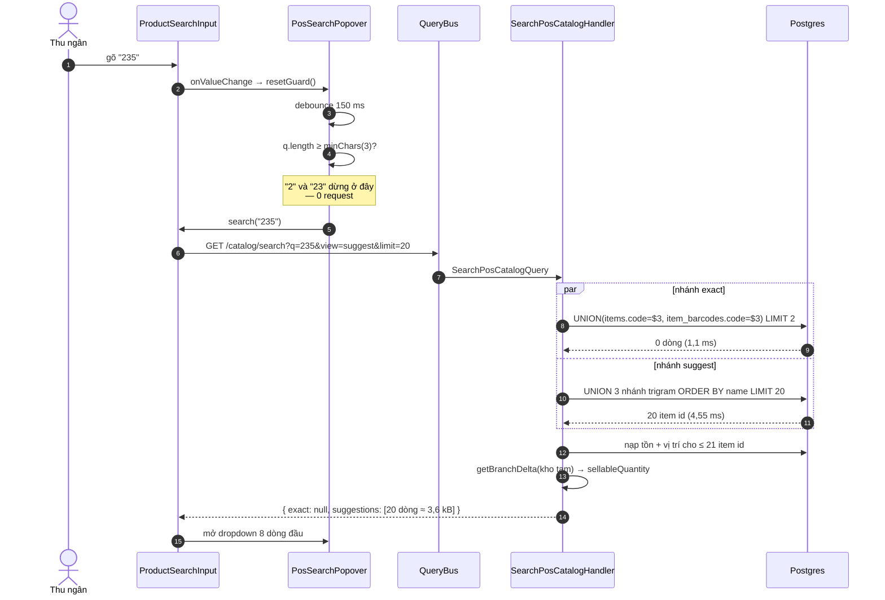
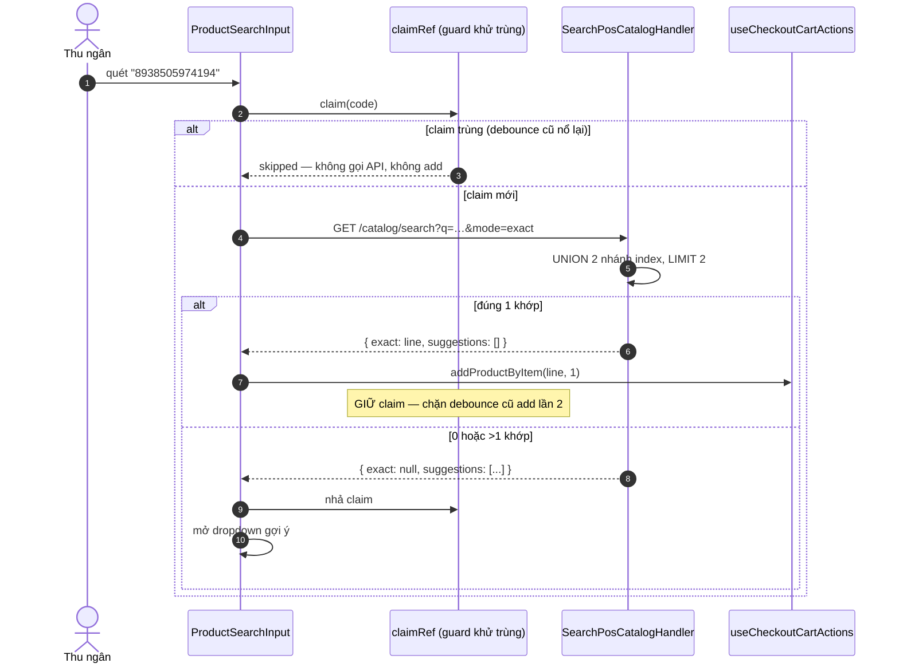
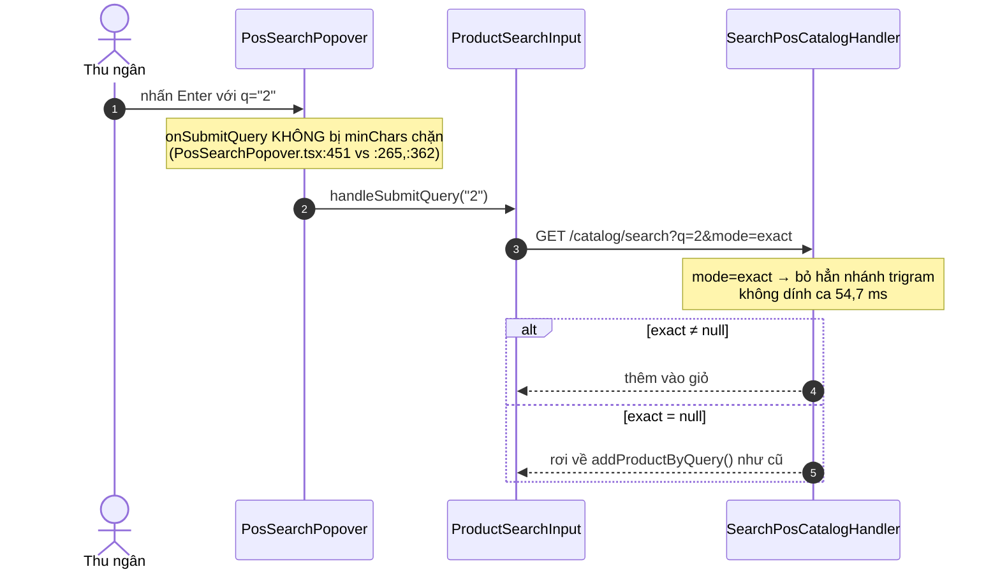

# Logical design — pos-catalog-search-perf

## Approach

Một endpoint mới, `GET /pos/branches/:branchId/catalog/search`, gộp hai việc mà FE
đang phải làm bằng hai request nối tiếp: **tra khớp tuyệt đối** (mã SKU / mã vạch,
để auto-add) và **gợi ý mờ** (ILIKE, để đổ dropdown). Endpoint đi theo chuẩn CQRS +
controller riêng của repo (`controllers/*-v2.controller.ts` + `queries/*.handler.ts`),
không nhét thêm route vào `pos.controller.ts`.

Điểm cốt lõi **không** phải "gộp cho ít request" — đó chỉ là phần dễ. Điểm cốt lõi là
**hình dạng SQL**: cả hai đường hiện tại đều viết điều kiện tìm kiếm dưới dạng
`OR` bắc qua một `LEFT JOIN`, và Postgres không có cách nào đẩy dạng đó vào index.
Cả hai phải viết lại thành **`UNION` các nhánh, mỗi nhánh tự đi được index của nó**.

Đo trên `erp_dev_3008` (org `e60e5f49…`, chi nhánh Nha Trang, 21 024 item POS-visible,
41 714 mã vạch):

| Dạng truy vấn | Term | Plan | Thời gian |
|---|---|---|---|
| **Hiện tại** `i.code=$3 OR b.code=$3` qua LEFT JOIN | `2` | Seq Scan `items` 21 024 + Seq Scan `item_barcodes` 21 023 | **25,3 ms** |
| **UNION hai nhánh** | `2` | 2 × Index Scan (`UQ_..._org_code`) | **1,1 ms** |
| **Hiện tại** ILIKE qua LEFT JOIN, không LIMIT | `2` | 11 519 dòng → 10 394 phần tử ≈ 3 922 kB | **88,3 ms** |
| `OR EXISTS(...)` + LIMIT 20 *(cái bẫy)* | `235` | Bitmap trên `IDX_items_org_pos_catalog` 21 024 dòng, EXISTS chạy làm filter từng dòng | **98,8 ms** ❌ |
| **UNION ba nhánh** + LIMIT 20, chưa có index mã vạch | `235` | Seq Scan `item_barcodes` 41 714 | 18,5 ms |
| **UNION ba nhánh** + LIMIT 20, **có** index mã vạch | `235` | 5 × Bitmap Index Scan trigram, 0 seq scan | **4,55 ms** ✅ |
| UNION ba nhánh + LIMIT 20 | `2` | trigram vô dụng (pg_trgm cần ≥3 ký tự) | **54,7 ms** |

Ba kết luận rút thẳng từ bảng trên, và mỗi cái loại bỏ một "giải pháp hiển nhiên" sai:

1. `/catalog/lookup` **không thiếu index nào** — chỉ thiếu đúng hình dạng truy vấn.
2. Viết lại nhánh mã vạch thành `OR EXISTS(...)` — cách gần như ai cũng nghĩ tới đầu tiên —
   làm truy vấn **chậm đi 20 lần**. Phải là `UNION`, không phải `EXISTS`.
3. Với term 1–2 ký tự thì **không index nào cứu được** (54,7 ms kể cả đã LIMIT).
   Đó là lý do `minChars` phải lên 3; nó không phải tinh chỉnh UX mà là điều kiện
   để mọi thứ còn lại có tác dụng.

### Hợp đồng endpoint mới

```
GET /pos/branches/:branchId/catalog/search
  ?q=<string, bắt buộc>
  &mode=exact|full           (mặc định full)
  &view=full|suggest         (mặc định full)
  &limit=<1..100>            (mặc định 20, kẹp trần 100)
  &includeUntracked=true     (mặc định false)
→ 200 { exact: PosCatalogLine | null, suggestions: PosCatalogLine[] | PosCatalogSuggestion[] }
```

- `exact` **chỉ khác null khi khớp đúng 1 item**. Quy tắc `lines.length === 1` đang
  nằm ở FE (`use-checkout-barcode-auto-add.ts:63`) chuyển về server — server biết
  nó khớp bao nhiêu mà không cần trả cả danh sách về để FE đếm.
- `mode=exact` bỏ hẳn nhánh gợi ý. Đường Enter (`onSubmitQuery`) chỉ cần biết có
  khớp tuyệt đối hay không, không cần dropdown.
- `view=suggest` bỏ `locations[]` và `quantityOnHand`; **giữ** `sellableQuantity`
  (cơ sở cảnh báo bán vượt tồn — xem [[project_pos_stock_warning_temp_warehouse]]).

### Sơ đồ tuần tự — đường gõ (debounce), sau thay đổi



### Sơ đồ tuần tự — đường quét mã vạch (auto-add)



`claimRef` **ở lại FE nguyên vẹn**. Nó không phải logic tìm kiếm mà là khử trùng
giữa hai đường kích hoạt (debounce + Enter) cùng trỏ vào một chuỗi; server không
nhìn thấy chuyện đó. Đã có tiền lệ hỏng ở [[project_temp_warehouse_scan_add_line]] —
đụng vào guard này là cách chắc chắn nhất để tái tạo lỗi cũ.

### Sơ đồ tuần tự — đường Enter



## Alternatives rejected

| Option | Why not |
|---|---|
| Đổi `LEFT JOIN item_barcodes` thành `OR EXISTS(SELECT 1 FROM item_barcodes …)` | Cách sửa hiển nhiên nhất, và đo ra **98,8 ms** — chậm hơn cả bản gốc 88 ms. Planner quét bitmap toàn bộ 21 024 item POS-visible rồi chạy subplan làm filter từng dòng, không dùng được trigram index nào trên `items`. Phải là `UNION` (ADR-01) |
| Thêm index cho `/catalog/lookup` | Đã đo: `UQ(organization_id, code)` trên `items` và `item_barcodes` là đủ — dạng `UNION` chạy 1,1 ms mà không thêm index nào. Cái thiếu là hình dạng truy vấn, không phải index. Thêm index ở đây là trả chi phí ghi trên bảng 41 K dòng mà không mua được gì |
| Chỉ thêm `LIMIT`, giữ nguyên `minChars = 1` | Cứu payload (3 922 kB → ~4 kB) nhưng không cứu DB: `%2%` vẫn 54,7 ms và quét 21 024 dòng **mỗi keystroke**, nhân với số quầy đang gõ. LIMIT cắt cái trả về, không cắt cái phải đọc |
| Chỉ nâng `minChars`, không đụng SQL | Chặn được ca 1–2 ký tự nhưng term ≥3 ký tự vẫn trả **toàn bộ** kết quả khớp kèm `locations[]` (term `235` khớp 87 item; term phổ biến hơn thì nhiều hơn), và nhánh mã vạch vẫn seq scan 41 714 dòng |
| Bỏ hẳn `locations[]` khỏi `PosCatalogLine` cho mọi consumer | Có consumer thật: `fast-stock-transfer-pickers.ts:20` và `picker-cache.ts:59`. Bỏ đi thì màn Chuyển kho nhanh không chọn được kho nguồn. `view=suggest` cho phép cắt mà không phá hợp đồng (ADR-03) |
| Gộp bằng cách để FE gọi song song hai endpoint cũ (`Promise.all`) | Bỏ được độ trễ cộng dồn nhưng vẫn 2 request, vẫn 3 922 kB, và vẫn hai seq scan. Chữa triệu chứng dễ thấy nhất và bỏ qua cả ba nguyên nhân |
| Cache Redis kết quả tìm kiếm theo `(branchId, term)` | Term tìm kiếm đuôi dài, tỉ lệ trúng cache thấp; và cache một truy vấn 88 ms để tránh chạy lại nó là giấu vấn đề chứ không sửa. Sau ADR-01 thì truy vấn còn 4,55 ms — không đáng cache. `PosCatalogProductService` đã cache phần *khung* catalog (`pos-catalog-cache.constants.ts`), đó là chỗ cache thực sự có lãi |
| Chuyển sang full-text search (`tsvector`) thay vì trigram | `tsvector` tách từ theo ranh giới từ, không khớp được chuỗi con giữa mã SKU/mã vạch (`235` trong `AB235X`) — đúng thứ thu ngân gõ. Trigram là công cụ đúng cho `ILIKE '%…%'`, và repo đã dựng sẵn `pg_trgm` |

## Contracts

| Thành phần | Đường dẫn | Trạng thái |
|---|---|---|
| `PosCatalogSearchQueryDto` | `modules/pos/dto/pos-catalog-search.query.dto.ts` | mới |
| `PosCatalogSearchResponseDto`, `PosCatalogSuggestionDto` | `modules/pos/dto/pos-catalog-search.response.dto.ts` | mới |
| `SearchPosCatalogQuery` | `modules/pos/queries/search-pos-catalog.query.ts` | mới |
| `SearchPosCatalogHandler` | `modules/pos/queries/search-pos-catalog.handler.ts` | mới |
| `CatalogSearchV2Controller` | `modules/pos/controllers/catalog-search-v2.controller.ts` | mới |
| Index trigram `item_barcodes.code`, `products.code` | `database/migrations/…-AddCatalogSearchTrigramIndexes.ts` | mới |
| `PosCatalogService.lookupByCode` | `modules/pos/services/pos-catalog.service.ts:296` | sửa (UNION) |
| `PosCatalogService.searchCatalogByTerm` | `modules/pos/services/pos-catalog.service.ts:128` | sửa (UNION + limit) |
| `ProductSearchInput` | `apps/pos-web/.../POSToolbar/ProductSearchInput/ProductSearchInput.tsx` | sửa |
| `use-checkout-barcode-auto-add.ts` | `apps/pos-web/src/hooks/page-hooks/checkout/` | sửa |
| `catalog.service.ts`, `use-query-catalog.ts` | `apps/pos-web/src/services/`, `.../hooks/react-query/` | sửa |
| `GET /catalog`, `GET /catalog/lookup` | `pos.controller.ts:48,64` | **hợp đồng không đổi** |

Quyền: `@RequirePermission('inventory.read')` — giống hai endpoint hiện có, **không**
phải `pos.sale.create`; cùng picker phục vụ cả checkout lẫn chuyển kho tạm
(`pos.controller.ts:45-47`).

## Error taxonomy

| Tình huống | Mã | Hành vi |
|---|---|---|
| `branchId` không phải UUID | **403** | Đo thật 2026-09-08, không phải 400 như dự kiến: `BranchScopeGuard` chạy **trước** pipe nên chặn ở tầng phạm vi chi nhánh, `ParseUUIDPipe` không bao giờ tới lượt. Kết quả an toàn hơn — không tiết lộ chuỗi sai định dạng hay chi nhánh không tồn tại |
| `q` rỗng / chỉ khoảng trắng | 400 | `class-validator` `@IsNotEmpty` sau `@Transform(trim)` |
| `limit` > 100 | 200 | Kẹp về 100, **không** báo lỗi (AC-06) |
| `limit` không phải số | 400 | `ValidationPipe` (`forbidNonWhitelisted: true`) |
| `mode` / `view` ngoài enum | 400 | `@IsEnum` |
| Chi nhánh không thuộc org của actor | 200, rỗng | Truy vấn lọc `organization_id = actor.organizationId`; không rò dữ liệu chéo org, cũng không xác nhận branch có tồn tại hay không |
| Ký tự `%` `_` `\` trong `q` | 200 | Loại bỏ trước khi ghép pattern, như `getCatalog` đang làm (`pos-catalog.service.ts:50`) |
| Kho tạm (`getBranchDelta`) lỗi | 500 | Không nuốt lỗi: `sellableQuantity` sai làm cảnh báo tồn sai, tệ hơn là báo lỗi |

## ADRs

### ADR-01 — `UNION` các nhánh index, không `OR` bắc qua `JOIN`, cũng không `OR EXISTS`
**Status:** accepted

Cả hai truy vấn catalog hiện tại đặt điều kiện tìm kiếm dưới dạng `OR` giữa một cột
của `items` và một cột của bảng được `LEFT JOIN`. Postgres không đẩy được dạng đó vào
index nào: nó quét toàn bộ tập rồi lọc.

Cách sửa **hiển nhiên nhưng sai** là đổi `LEFT JOIN` thành `OR EXISTS(...)`. Đã đo:
98,8 ms — chậm hơn cả bản gốc (planner quét bitmap toàn bộ 21 024 item POS-visible
rồi chạy subplan làm filter từng dòng). Cách đúng là `UNION` từng nhánh để mỗi nhánh
tự chọn index của nó: 4,55 ms, năm Bitmap Index Scan, không seq scan.

Quyết định này áp cho **cả ba** truy vấn: `lookupByCode`, `searchCatalogByTerm`, và
handler mới.

### ADR-02 — Cắt dòng ở SQL, không ở client
**Status:** accepted

`LIMIT` đặt trong CTE chọn item id (`ORDER BY i.name LIMIT $n`), **trước** khi join
`stock_balances`/`locations`/`storages`. Cắt sau khi join sẽ nhân bản mỗi item thành
n dòng vị trí rồi mới bỏ đi. Cùng khuôn "row cap pushdown" đã dùng ở
[[project_report_row_cap_pushdown]].

Trần 100 là kẹp im lặng chứ không phải lỗi 400: client duy nhất truyền `limit` là của
chính ta, và một dropdown bị 400 vì gõ nhầm số thì tệ hơn một dropdown 100 dòng.

### ADR-03 — `view=suggest` cắt trường, mặc định giữ nguyên shape cũ
**Status:** accepted

`locations[]` có consumer thật: `fast-stock-transfer-pickers.ts:20` và
`picker-cache.ts:59`. Bỏ trường này khỏi shape mặc định sẽ làm màn Chuyển kho nhanh
không chọn được kho nguồn. Nên `view` mặc định là `full`; chỉ checkout truyền
`view=suggest`.

`sellableQuantity` **không** bị cắt: nó là cơ sở cảnh báo bán vượt tồn, và
`addProductByItem` nhận nguyên `PosCatalogLine`. `quantityOnHand` thì bị cắt — không
consumer nào của checkout đọc nó (`use-checkout-cart-actions.ts`: 0 match).

### ADR-04 — CQRS + controller riêng, không thêm route vào `pos.controller.ts`
**Status:** accepted

Ranh giới trong `CLAUDE.md` ("CQRS cho query multi-join động") không phủ rõ ca này —
đây là truy vấn hai nhánh cố định, không phải bộ lọc động. Nhưng chuẩn Akenzy đã chốt
là "report/search → full CQRS + 1 dedicated controller"
([[feedback_cqrs_standard_dedicated_controller]]), và repo đã có sẵn khuôn
`controllers/*-v2.controller.ts` + `queries/*.handler.ts` cho bốn search khác của
module `pos`. Theo chuẩn đó.

Hệ quả có chủ ý: `pos.controller.ts` giữ nguyên, hai endpoint cũ không đụng vào
hợp đồng, nên FastStockTransfer và mọi consumer khác không phải sửa gì.

### ADR-05 — `minChars = 3` là điều kiện, không phải tinh chỉnh
**Status:** accepted

`pg_trgm` cần tối thiểu 3 ký tự mới sinh được trigram để tra index. Với `%2%`, kể cả
sau khi đã UNION và đã LIMIT 20, truy vấn vẫn mất 54,7 ms và quét 21 024 dòng — mọi
tối ưu khác trong feature này vô hiệu ở ca đó.

Đánh đổi: gõ 1–2 ký tự không còn ra gợi ý. Chấp nhận được vì đường quét mã vạch
**không** đi qua ngưỡng này — `onSubmitQuery` (Enter) không bị `minChars` chặn
(`PosSearchPopover.tsx:451`, đối chiếu `:265` và `:362`), và mã vạch thực tế dài
≥ 8 ký tự.

### ADR-06 — Thêm trigram cho `item_barcodes.code` và `products.code`; không thêm gì khác
**Status:** accepted

Migration `1781800000000-AddTrigramSearchIndexes` phủ `items.{code,name,brand,variant_label}`,
`customers.*`, `inventory_item_categories.name`, `products.name` — bỏ sót đúng hai cột
mà truy vấn catalog dùng: `item_barcodes.code` và `products.code`.

Đo được nhánh mã vạch: **18,5 ms → 4,55 ms**. Chi phí: 240 ms build, 1 296 kB.
Nhỏ đến mức không cần `CREATE INDEX CONCURRENTLY`, nên migration chạy trong
transaction bình thường, không phải bận tâm [[reference_migrations_transaction_mode_each]].

**Không** thêm index nào cho `/catalog/lookup`: đã đo, `UQ(organization_id, code)`
trên cả hai bảng là đủ khi truy vấn viết đúng dạng (ADR-01). Thêm index ở đó là trả
chi phí ghi mà không mua được gì.
