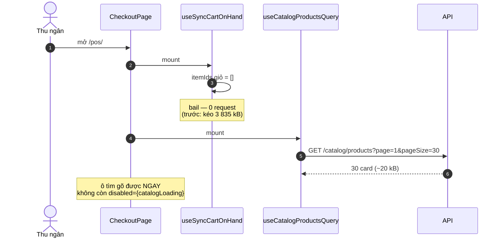
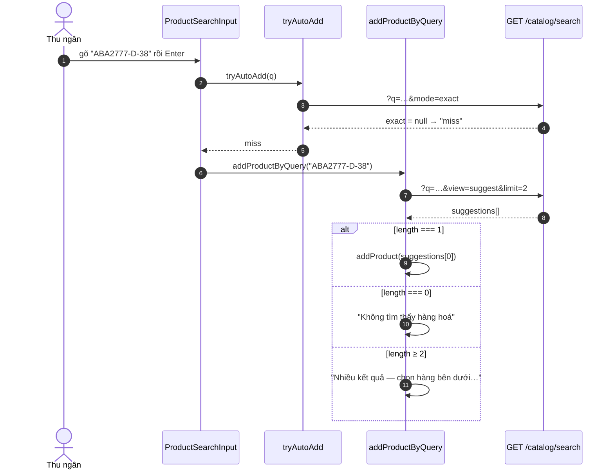

# Logical design — pos-catalog-page-load

## Approach

Gỡ trang POS khỏi `GET /catalog` bằng cách trả lời **riêng** hai câu hỏi mà mảng
10 400 phần tử đang phục vụ, thay vì tải sẵn tất cả rồi lọc trên client:

| Câu hỏi thật | Trước | Sau |
|---|---|---|
| "Tồn hiện tại của mấy món trong giỏ là bao nhiêu?" | tải 10 400 item rồi tra theo `itemId` | `POST /catalog/stock` với đúng `itemIds` của giỏ |
| "Chuỗi này khớp đúng một mặt hàng không?" | `catalog.filter(matchesCatalogQuery)` | `GET /catalog/search?view=suggest&limit=2`, đếm |
| ~~"Card này ứng với item nào?"~~ | `catalog.find(...)` | **xoá** — đường code chết, `ProductCard` vốn đi `openForCatalogCard` |

Sau đó `useCatalogQuery` không còn consumer nào và được gỡ khỏi
`use-checkout-catalog.ts`. Endpoint backend **không** đụng tới: Chuyển kho nhanh và
mọi consumer khác giữ nguyên hợp đồng (AC-12).

Cả hai đường thay thế đều đi qua `PosCatalogService.aggregateStockRows` +
`stagedStock.getBranchDelta` — cùng nguồn `sellableQuantity` với đường cũ, nên cảnh
báo bán vượt tồn không thể lệch (AC-07).

### Sơ đồ tuần tự — mở trang, giỏ rỗng (ca thường gặp nhất)



### Sơ đồ tuần tự — đồng bộ tồn khi giỏ có hàng

```mermaid
sequenceDiagram
    autonumber
    participant Cart as checkout-session store
    participant S as useSyncCartOnHand
    participant API as POST /catalog/stock
    participant Svc as PosCatalogService

    Cart-->>S: purchaseCart đổi (thêm hàng / khôi phục HĐ lưu tạm)
    S->>S: itemIds = distinct(cart.itemId)
    alt itemIds rỗng
        Note over S: không gọi gì
    else
        S->>API: { itemIds: [I1, I2, I3] }
        API->>Svc: getStockForItems(branchId, actor, itemIds)
        Svc->>Svc: queryStockRows (index org+branch+item)
        Svc->>Svc: getBranchDelta(kho tạm) — 1 lần
        Svc->>Svc: aggregateStockRows → sellableQuantity
        API-->>S: PosCatalogLine[3]
        S->>Cart: syncPurchaseCartOnHand(lines)
        Note over Cart: maxQty của 3 dòng được điền;<br/>onHandUnknown về 0 → vòng lặp dừng
    end
```

Vòng lặp `unknownOnHandLines` **giữ nguyên**: nó là thứ duy nhất bắt được ca "dòng
được thêm sau lần fetch cuối", và hoá đơn lưu tạm rơi đúng vào ca đó
([[project_pos_draft_invoice_fixes]]). Đổi nguồn dữ liệu, không đổi điều kiện dừng.

### Sơ đồ tuần tự — Enter khi không khớp mã tuyệt đối



`limit=2` chứ không phải 20: ba nhánh của `addProductByQuery` chỉ rẽ theo
`=== 1`, `=== 0`, `else`; phần tử thứ ba trở đi không bao giờ được đọc (A-05).

## Alternatives rejected

| Option | Why not |
|---|---|
| Phân trang `GET /catalog` (thêm `page`/`pageSize`) | Chữa triệu chứng. Không consumer nào của trang POS muốn "trang đầu của catalog" — một cái muốn *đúng mấy item trong giỏ*, cái kia muốn *đếm khớp theo chuỗi*. Phân trang cho cả hai đều sai câu hỏi |
| Giữ tải toàn catalog nhưng cắt trường (`view=suggest`) | 10 400 × ~180 B vẫn ≈ 1,8 MB, và vẫn phải parse 10 400 object mỗi lần mở trang. Cắt trường chữa được payload, không chữa được "tải thứ không ai đọc" |
| Cache `GET /catalog` vào IndexedDB / localStorage, làm tươi nền | Tồn kho đổi liên tục; cache tồn là cách chắc chắn nhất để cảnh báo bán vượt tồn sai. Và vẫn phải tải lần đầu |
| Gọi `/catalog/search?mode=exact` cho **từng dòng giỏ** thay cho endpoint mới | Không thêm file backend nào, nhưng giỏ 15 dòng = 15 round-trip, và vòng lặp `unknownOnHandLines` sẽ nhân số đó lên mỗi lần nó chạy lại |
| `GET /catalog?itemIds=a,b,c` — tái dụng endpoint cũ | Nhét chế độ thứ tư vào một endpoint đã có `search`/`direction`/`includeUntracked`, và URL dài theo số dòng giỏ. `POST` với body là chỗ đúng cho một danh sách id |
| Enter đọc lại kết quả dropdown đang hiện (0 request thêm) | Hỏng đúng hai ca hay xảy ra: gõ nhanh rồi Enter ngay (debounce 150 ms chưa bắn) và chuỗi <3 ký tự (`minChars` chặn) — cả hai đều để state rỗng, và Enter sẽ báo "không tìm thấy" cho chuỗi có khớp |
| Giữ `addProductByCatalogCard` và nối nó sang endpoint mới | Tốn một ticket để làm sống một đường chưa component nào gọi. Nếu sau này cần, viết lại rẻ hơn là bảo trì nó suốt |

## Contracts

| Thành phần | Đường dẫn | Trạng thái |
|---|---|---|
| `PosCatalogStockQueryDto` (`itemIds: string[]`) | `modules/pos/dto/pos-catalog-stock.dto.ts` | mới |
| `PosCatalogService.getStockForItems` | `modules/pos/services/pos-catalog.service.ts` | mới (public) |
| `buildItemIdsCte` | `modules/pos/services/pos-catalog-sql.ts` | mới |
| `POST /pos/branches/:branchId/catalog/stock` | `modules/pos/controllers/catalog-search-v2.controller.ts` | mới (route) |
| `catalogService.stockForItems` | `apps/pos-web/src/services/catalog.service.ts` | mới |
| `useCatalogStockQuery` | `apps/pos-web/src/hooks/react-query/use-query-catalog.ts` | mới |
| `useSyncCartOnHand` | `apps/pos-web/src/hooks/page-hooks/checkout/` | sửa |
| `useCheckoutCatalog` | `.../use-checkout-catalog.ts` | sửa — gỡ `catalog`, `filteredProducts`, `catalogLoading`, `catalogError`, `refetchCatalog` |
| `addProductByQuery`, `addProductByCatalogCard` | `.../use-checkout-cart-actions.ts` | sửa + **xoá** |
| `handleCatalogSelect` | `.../use-checkout-session-cart.ts` | **xoá** |
| `openForQuery` | `.../use-checkout-variant-selection.ts` | sửa |
| `POSToolbar`, `CatalogErrorAlert` | `.../CheckoutLeftPane/` | sửa |
| `GET /catalog`, `GET /catalog/search`, `GET /catalog/lookup` | `pos.controller.ts`, `catalog-search-v2.controller.ts` | **hợp đồng không đổi** |

Quyền: `@RequirePermission('inventory.read')` — như ba endpoint catalog còn lại.

## Error taxonomy

| Tình huống | Mã | Hành vi |
|---|---|---|
| `itemIds` rỗng | 400 | `@ArrayNotEmpty` — client đã bail trước khi gọi (A-09), nên rỗng nghĩa là lỗi lập trình, không nên im lặng |
| `itemIds` chứa chuỗi không phải UUID | 400 | `@IsUUID('4', { each: true })` |
| `itemIds` quá dài | 400 | `@ArrayMaxSize(200)` — giỏ POS không bao giờ tới đó; trần là để một client hỏng không quét cả bảng |
| `itemIds` chứa id không thuộc org/chi nhánh | **201** | Trả ít phần tử hơn số gửi. Không lỗi: item bị ngừng bán giữa phiên là chuyện thật, và caller xử được (dòng đó giữ `onHandUnknown` → cảnh báo bật, đúng phía an toàn) |
| `branchId` không phải UUID | 403 | `BranchScopeGuard` chạy trước pipe — đã đo ở [[project_pos_catalog_search_perf]], ghi lại để không ai kỳ vọng 400 |
| `/catalog/stock` lỗi mạng | — | Hook không nuốt: dòng giỏ giữ `onHandUnknown`, `lineExceedsOnHandSnapshot` coi đó là vượt tồn nên cảnh báo **bật**. Thà hỏi thừa còn hơn im lặng cho bán khống |

### Ghi chú mã trạng thái (bổ sung sau khi đo, 2026-09-08)

`POST /catalog/stock` trả **201**, không phải 200 — NestJS mặc định vậy cho `@Post`,
dù đây là đường đọc. Client không được assert `=== 200`.

Một field lạ tên `branchId` trong body trả **403** chứ không 400: `BranchScopeGuard`
đọc `branchId` từ body và chặn trước `ValidationPipe`. Field lạ tên khác thì đúng 400.

## ADRs

### ADR-01 — Hỏi đúng câu hỏi, không tải sẵn rồi lọc
**Status:** accepted

Ba consumer của mảng catalog hỏi ba câu khác nhau, và **không câu nào** là "cho tôi
toàn bộ catalog". Tải sẵn là cách trả lời cả ba bằng một request — hợp lý khi catalog
có vài trăm dòng, và là 3 835 kB khi nó có 10 400.

Nên mỗi câu hỏi được trả lời riêng: `POST /catalog/stock` cho câu về tồn của giỏ,
`GET /catalog/search` (đã có) cho câu về khớp chuỗi, và câu thứ ba biến mất cùng đường
code chết hỏi nó.

### ADR-02 — Giỏ rỗng không phát request
**Status:** accepted

Mở trang với giỏ trống là ca thường gặp nhất. Hook bail ở `itemIds.length === 0` chứ
không gọi rồi nhận mảng rỗng — nếu không, ta thay một request 3 835 kB bằng một request
0 phần tử, vẫn là một round-trip cho hư không.

Hệ quả: DTO đặt `@ArrayNotEmpty`. Một request rỗng chạm tới server nghĩa là client
hỏng, và 400 nói điều đó to hơn 200 với mảng rỗng.

### ADR-03 — Enter đổi luật khớp, và đó là sửa lỗi bất nhất
**Status:** accepted

`matchesCatalogQuery` so `name`/`code` bằng `includes`, phân biệt hoa thường sau khi
`toLowerCase`. Server so `name`, `code`, **mã vạch**, và `products.code`/`name` bằng
`ILIKE`. Tập khớp của server **rộng hơn**.

Hệ quả có thể thấy được: một chuỗi trước đây khớp đúng 1 (nên Enter thêm được hàng)
nay có thể khớp 2 (nên báo "Nhiều kết quả"). Chấp nhận, vì bất nhất hiện tại tệ hơn:
cùng chuỗi đó gõ vào ô tìm **đã** ra dropdown theo luật server kể từ
[[project_pos_catalog_search_perf]], nên Enter đang trả lời theo một luật khác với
dropdown ngay phía trên nó.

### ADR-04 — `POST` với body, không `GET` với query string
**Status:** accepted

Danh sách `itemIds` là dữ liệu có độ dài thay đổi; 15 UUID đã là ~600 ký tự URL. `POST`
tránh trần URL và tránh nhét chế độ thứ tư vào `GET /catalog`.

Đánh đổi: `POST` đi qua `IdempotencyInterceptor` toàn cục. Không sao — đây là đường
đọc, không có `X-Idempotency-Key` thì interceptor cho qua; và nếu FE có mint key thì
replay cùng body trả cùng kết quả, vẫn đúng.

Route đặt ở `CatalogSearchV2Controller` (đã có, cùng `@Controller('pos')`, cùng guard)
chứ không mở controller thứ hai — nó cùng một nhóm câu hỏi "đọc catalog theo nhu cầu
hẹp".

### ADR-05 — Xoá đường code chết thay vì nuôi nó
**Status:** accepted

`addProductByCatalogCard` + `handleCatalogSelect` không có lời gọi nào. Chúng cũng là
lý do **duy nhất** mảng `catalog` thô còn được truyền ra khỏi `useCheckoutCatalog`.
Giữ lại và truyền mảng rỗng để lại một hàm luôn trả `null` — hỏng im lặng cho người
nối vào sau.

`CLAUDE.md` cấm tự ý xoá code chết có sẵn, nên đây là quyết định của Akenzy
(2026-09-08), không phải của tôi.

### ADR-06 — Ô tìm không chờ gì nữa
**Status:** accepted

`disabled={catalogLoading}` có nghĩa khi ô tìm lọc trên mảng client: gõ trước khi mảng
về thì ra 0 kết quả. Từ [[project_pos_catalog_search_perf]] ô tìm đã hỏi server, nên
nó **không phụ thuộc** thứ gì tải trước. Bỏ khoá là gỡ một cái chờ đã hết lý do tồn
tại — và ở chi nhánh 10 400 item, cái chờ đó là vài giây.

`CatalogErrorAlert` chuyển sang đọc lỗi của `/catalog/products` (lưới): vẫn còn một
thứ tải được/hỏng được để báo, và nút "Tải lại" vẫn có việc để làm.
