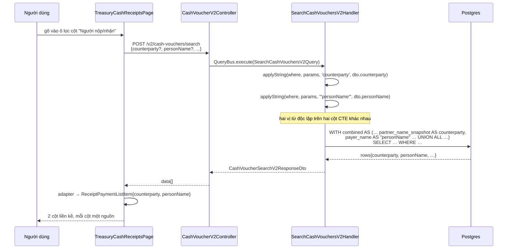

# Logical design — voucher-party-person-columns

## Approach

Không có cột CSDL nào phải thêm: `partner_name_snapshot` và `payer_name`/`payee_name` đã tồn
tại trên cả 4 bảng chứng từ. Việc phải làm là **gỡ phép `COALESCE` gộp hai trường thành một
cột** ở 4 câu SQL đọc, cho mỗi trường một cột riêng, rồi chiếu cột mới xuyên suốt
`row DTO → api-client → kiểu FE → adapter → cột lưới`.

Đường thay đổi cho **mỗi** trong 4 nguồn là như nhau, nên 4 UoW đối xứng:

```
SQL (bỏ COALESCE gộp, thêm cột)  →  filter DTO (+1 StringFilterDto)
   →  row DTO (+1 string)  →  applyString(cột mới)  →  openapi:generate
   →  kiểu FE (+1 field)   →  adapter  →  hook cột lưới (+1 TableColumn)
```

Ba biến thể phải nhớ, vì chúng khác nhau ở đúng chỗ dễ sai:

| Nguồn | Hình dạng | Cột "đối tượng" sau khi sửa | Cột "người" sau khi sửa |
|---|---|---|---|
| `search-cash-vouchers-v2.handler.ts` | UNION ALL 2 bảng | `r.partner_name_snapshot` / `p.partner_name_snapshot` | `r.payer_name` / `p.payee_name` |
| `search-deposit-vouchers-v2.handler.ts` | UNION ALL 2 bảng | như trên trên `bank_*` | như trên trên `bank_*` |
| `cash-ledger.service.ts` | 2 LEFT JOIN LATERAL trên cùng một dòng movement | `COALESCE(cp.partner_name_snapshot, cr.partner_name_snapshot, '')` | `COALESCE(cp.payee_name, cr.payer_name, '')` |
| `deposit-ledger.service.ts` | 2 LEFT JOIN LATERAL | `COALESCE(bp.partner_name_snapshot, br.partner_name_snapshot, '')` | `COALESCE(bp.payee_name, br.payer_name, '')` |

Ở hai sổ, `COALESCE` **vẫn còn** nhưng đổi nghĩa: nó chọn giữa *nhánh chứng từ thu* và *nhánh
chứng từ chi* của cùng một dòng sổ (một dòng chỉ có một trong hai, cái kia NULL) — chứ không
còn chọn giữa *đối tượng* và *người*. Đây là điều kiện đủ để giữ A-02: hai nhánh coalesce đọc
**cùng một loại trường**.

### Luồng đọc (lưới Thu chi tiền mặt, tiêu biểu cho cả 4)



Đường **xuất khẩu** dùng lại đúng DTO + query đó (ADR-06 của feature 2026090804), nên chỉ cần
thêm một mục vào `EXPORT_COLUMNS`; không có nhánh dữ liệu thứ hai để lệch.

## Alternatives rejected

| Option | Why not |
|---|---|
| Giữ một cột, chỉ đảo thứ tự `COALESCE` cho đồng nhất 4 màn | Vẫn giấu một trong hai giá trị — đúng cái khiếu nại. Chỉ đổi *giá trị nào* bị giấu. |
| Giữ một cột, hiển thị ghép `"kkkk (123123)"` | Không lọc riêng được, không xuất riêng được, và một cột 160px không chứa nổi hai tên. |
| Trả `partnerNameSnapshot` + `payerName` + `payeeName` thô, để FE tự chọn theo `kind` | Lưới gộp cả thu lẫn chi nên FE phải rẽ nhánh theo `kind` ở 4 hook cột + 2 adapter. SQL đã biết mình đang ở nhánh nào; rẽ ở đó rẻ hơn và không lặp lại. |
| Đổi tên khoá `counterparty` → `partnerName` cho khớp `VoucherPartySnapshot` | Churn 4 DTO + 4 kiểu FE + 2 adapter mà không đổi hành vi. Nhãn hiển thị "Đối tượng nộp/nhận" không đổi, nên `counterparty` = đối tác vốn đã là tên đúng; cái sai trước nay là *nội dung*, không phải tên. (A-09) |
| Thêm cột dẫn xuất vào CSDL / migration | Không có gì để lưu thêm: cả hai trường đã có sẵn trên cả 4 bảng. |
| Backfill `partner_name_snapshot` từ `payer_name` cho phiếu cũ | Bịa dữ liệu: một cái tên gõ ở ô "Người nộp" không chứng minh được đó là đối tác. Ô trống là kết quả đúng (A-07). |

## Contracts

Bốn DTO tìm kiếm, mỗi cái thêm **đúng hai** thứ — một trường lọc và một trường hàng:

```ts
// cash-voucher-search-v2.dto.ts, deposit-voucher-search-v2.dto.ts,
// cash-ledger-search-v2.dto.ts, deposit-ledger-search-v2.dto.ts
personName?: StringFilterDto;   // filter DTO
personName!: string;            // row DTO — '' khi không có, không bao giờ null
```

Đổi **nghĩa** (không đổi tên, không đổi kiểu) của trường sẵn có:

```ts
// trước: 'Payer/payee, falling back to the partner snapshot ("" when none)'
// sau:   'Partner name snapshot only ("" when the voucher has no catalogue/free-text party)'
counterparty!: string;
```

Kiểu FE tương ứng: `ReceiptPaymentListItem`, `ReceiptDepositListItem`, `LedgerCashRow`, và
kiểu dòng nội tuyến trong `LedgerDepositPage.tsx` — mỗi cái thêm `personName: string`.

`EXPORT_COLUMNS` (`cash-voucher-v2.controller.ts:44-53`) chèn thêm một mục
`{ col: 'personName', label: 'Người nộp/nhận', type: STRING }` ngay sau `counterparty`.

## Error taxonomy

| Lỗi | Biểu hiện | Xử lý |
|---|---|---|
| UNION ALL lệch số cột / lệch thứ tự sau khi thêm cột | `SELECTs have different number of columns` lúc chạy, 500 cho mọi lượt tải lưới | Bắt bằng unit test handler (đã có `*.handler.spec.ts` cho cả 2 handler) — test phải khẳng định cả **thứ tự** cột trong SQL sinh ra, không chỉ sự tồn tại |
| Ký tự `%` `_` `\` trong ô lọc cột mới | Lọc ra nhiều dòng hơn mong đợi | Dùng lại `applyString` sẵn có — nó đã escape; **không** viết vị từ mới |
| `openapi:generate` chưa chạy hoặc sinh từ build cũ | `personName` không có trong `schema.ts`; FE `tsc` đỏ, hoặc tệ hơn: dựng từ stub im lặng | Sinh từ build riêng ở `:4100` và **đọc dòng log `Wrote … from <url>`** để xác nhận (không tin exit code) |
| Cột mới trong SQL thô nhưng thiếu ở danh sách `SELECT` ngoài cùng của sổ | Cột luôn `undefined` → lưới trống lặng lẽ, không lỗi | `cash-ledger.service.ts:559` và `deposit-ledger.service.ts:638` là hai danh sách cột phẳng phải sửa cùng lúc với `DERIVED_COLUMNS` |
| Phiếu cũ trống cả hai cột | Người dùng báo "mất dữ liệu" | Không phải lỗi (A-07); ghi rõ trong ghi chú bàn giao |

## ADRs

### ADR-01 — Giữ khoá `counterparty` cho cột đối tượng; đặt tên cột mới là `personName`
**Status:** accepted

`counterparty` (đối tác) vốn là tên đúng cho `partner_name_snapshot`; sai lầm hiện tại nằm ở
*nội dung* nó chứa, không ở cái tên. Đổi tên sẽ kéo theo 4 DTO + 4 kiểu FE + 2 adapter mà
không đổi hành vi nào.

Tên cột mới lấy đúng từ vựng repo đã dùng: `VoucherPartySnapshot.personName`
(`shared/voucher-party.ts:16-19`) đã ánh xạ `personName -> payee_name | payer_name` cho cả 4
bảng. Dùng lại tên đó thay vì bịa `payerPayeeName`. Giải quyết A-09.

### ADR-02 — Bỏ hẳn fallback giữa hai trường; mỗi cột một nguồn
**Status:** accepted

`COALESCE(x, '')` chỉ còn nhiệm vụ đổi NULL thành chuỗi rỗng và chọn giữa hai *nhánh chứng
từ* ở sổ. Không có đường nào để giá trị của cột này rơi sang cột kia. Hệ quả cố ý: phiếu cũ
chỉ điền một trường sẽ có một ô trống — đó là bằng chứng trực quan rằng fallback đã biến mất
(AC-03, AC-10). Chốt bởi Akenzy 2026-09-09 (A-02).

### ADR-03 — Cột mới lọc ở server, dùng lại `applyString` của chính handler đó
**Status:** accepted

Cả 4 nguồn đều là SQL thô, và cả 4 đã có sẵn `applyString` với escape wildcard. Cột mới thêm
một `StringFilterDto` vào filter DTO và một lời gọi `applyString` — không có vị từ tự viết,
không lọc trong RAM (đúng luật row-cap pushdown của repo). Giải quyết A-04.

### ADR-04 — Không migration, không backfill
**Status:** accepted

Cả `partner_name_snapshot` lẫn `payer_name`/`payee_name` đã tồn tại trên 4 bảng. Feature này
không chạm CSDL. Backfill bị từ chối vì suy diễn dữ liệu (xem bảng Alternatives). Giải quyết
A-07.

### ADR-05 — Sổ tiền gửi giữ nhãn "Đối tượng" cũ, chỉ thêm cột "Người nộp/nhận"
**Status:** accepted

`LedgerDepositPage.tsx:371` dùng nhãn ngắn "Đối tượng" trong khi 3 lưới kia dùng "Đối tượng
nộp/nhận". Đổi nhãn ở đây là thay đổi không ai yêu cầu và nằm ngoài diff cần thiết; ghi lại
để lần sau không tưởng là sót. Giải quyết A-10.

### ADR-06 — Cột "Người nộp/nhận" đặt ngay sau cột đối tượng, cả trên lưới lẫn trong Excel
**Status:** accepted

`EXPORT_COLUMNS` được viết ra với chú thích "in the same order the treasury grid renders
them"; giữ hai cột liền kề ở cả hai nơi là cách rẻ nhất để lời hứa đó vẫn đúng. Giải quyết
A-06 và A-08 (nhãn "Người nộp/nhận", cùng lối đặt với "Đối tượng nộp/nhận" và với
`personLabel` trong `treasury-print-labels.ts`).
