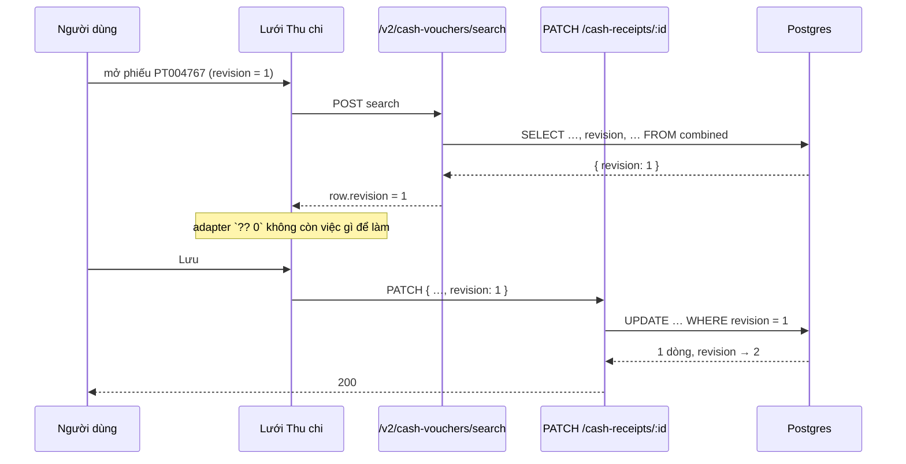

# Logical design — voucher-revision-projection

## Approach

Một từ, hai chỗ: thêm `revision` vào danh sách cột của câu `SELECT` ngoài cùng trong
`dataSql` của hai handler. Cột đã tồn tại trong CTE ở cả hai nhánh `UNION ALL`, DTO đã khai,
adapter đã map, FE đã gửi — mắt xích đứt nằm đúng ở phép chiếu cuối.

```
CTE combined ─ revision ✅ ─┬─ dataSql SELECT   ❌ THIẾU  → row.revision undefined
                            │                              → adapter `?? 0`
                            │                              → PATCH revision: 0 → 409
                            └─ totalsSql        (không cần, chỉ COUNT/SUM)
```

### Vì sao lỗi này im lặng

Ba lớp lần lượt nuốt tín hiệu, và không lớp nào sai một mình:

1. Postgres không phàn nàn: một cột không được chiếu chỉ là không được chọn.
2. `manager.query<CashVoucherRowDto[]>(...)` là **ép kiểu**, không phải kiểm tra — TypeScript
   tin lời khai, hàng thật thiếu trường mà `tsc` vẫn xanh.
3. `revision: row.revision ?? 0` biến `undefined` thành một số **hợp lệ**. Nếu chỗ này để
   `undefined` đi tiếp thì `ValidationPipe` đã trả 400 ngay từ phiếu đầu tiên và lỗi lộ ra
   trong ngày đầu.

Đó là lý do ADR-01 đặt lưới an toàn ở tầng truy vấn: hai tầng dưới về bản chất không thể
phát hiện được thiếu sót này.

### Luồng sửa phiếu (sau khi vá)



Trước khi vá, `DB-->>S` trả về hàng không có khoá `revision`; mọi bước sau đó vẫn chạy trơn
tru với con số 0 và chỉ vỡ ở `UPDATE … WHERE revision = 0` — cách xa nguyên nhân bốn tầng.

## Alternatives rejected

| Option | Why not |
|---|---|
| Bỏ `?? 0` để `undefined` đi tiếp và nổ sớm | Làm hỏng đường **tạo mới**, nơi 0 là giá trị đúng, để đổi lấy một cảnh báo mà một dòng test rẻ hơn cho được. Xem ADR-02. |
| Cho FE đọc `revision` từ lời gọi chi tiết (`useCashReceipt`) thay vì từ dòng lưới | Thêm một phụ thuộc mạng vào đường lưu, cho một giá trị lưới lẽ ra đã có. Và không sửa được hợp đồng vẫn đang nói dối. |
| `SELECT *` ở câu ngoài cùng | Kéo theo mọi cột nội bộ của CTE và làm phép chiếu hết là hợp đồng — đúng thứ khiến lần sau không ai nhận ra thiếu gì. |
| Bỏ `revision` khỏi row DTO cho khớp truy vấn | Giải quyết sự bất nhất bằng cách gỡ mất tính năng chống ghi đè. |

## Contracts

Không đổi. `CashVoucherRowDto.revision` và `DepositVoucherRowDto.revision` đã khai sẵn; feature
này làm cho truy vấn giữ lời hứa đó. Không có `openapi:generate`, không có migration.

## Error taxonomy

| Lỗi | Biểu hiện | Xử lý |
|---|---|---|
| Thêm `revision` vào `totalsSql` | `column "revision" must appear in the GROUP BY` hoặc tổng sai | Không đụng `totalsSql`; spec khẳng định nó **không** chứa cột này |
| Chèn `revision` lệch vị trí giữa hai nhánh UNION | Không lỗi; payload lệch cột im lặng | Cột đã nằm sẵn trong cả hai nhánh CTE — feature này không chạm CTE |
| Vá một handler, quên handler kia | Tiền mặt hết 409, tiền gửi vẫn 409 | Một ticket ôm cả hai; AC-02/AC-03 và AC-04 kiểm hai phía |
| Một trường khác của DTO cũng thiếu | Cùng kiểu im lặng, phát hiện sau nhiều tuần | AC-06: spec đối chiếu **toàn bộ** danh sách cột, không chỉ `revision` |

## ADRs

### ADR-01 — Lưới an toàn đặt ở tầng truy vấn, không ở tầng hiển thị
**Status:** accepted

Ba lớp giữa SQL và người dùng đều không có khả năng phát hiện một cột thiếu (xem "Vì sao lỗi
này im lặng"). Chỗ duy nhất còn biết đủ thông tin là spec của chính handler, nơi vừa thấy câu
SQL sinh ra vừa thấy hình dạng DTO. Vì vậy AC-06 đối chiếu **cả danh sách cột** chứ không chỉ
khẳng định `revision` có mặt — kiểm đúng một trường sẽ để lọt trường thứ hai y hệt.

### ADR-02 — Giữ nguyên `?? 0` ở hai adapter
**Status:** accepted

`0` là revision đúng của một phiếu vừa tạo, nên toán tử này có việc thật để làm trên đường
tạo mới. Nó chỉ trở thành đồng phạm khi dữ liệu vào đã sai. Sửa nó sẽ là chữa triệu chứng ở
sai tầng và làm hỏng một đường đang đúng. Giải quyết A-04.

### ADR-03 — Một ticket cho cả hai handler, không tách theo loại tiền
**Status:** accepted

Hai handler là bản sao của nhau và cùng một dòng bị thiếu. Tách đôi tạo ra đúng cái rủi ro mà
`03-logical-design` của feature trước đã cảnh báo: sửa một bên, quên bên kia. Ticket ≈ 2h nên
không vi phạm trần 4h.
