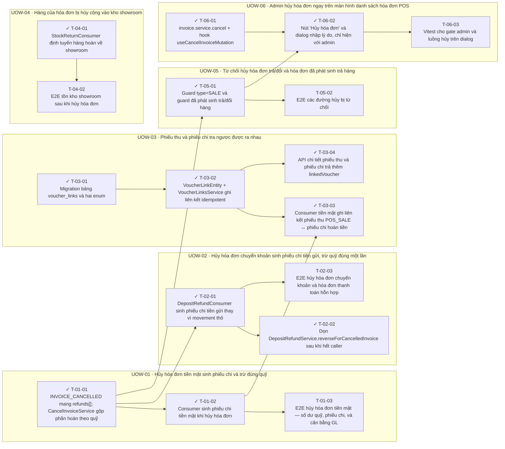

<!-- GENERATED by scripts/uow_graph.py — do not edit by hand -->

# Ticket graph — cancel-invoice-refund

- Units of Work: **6**
- Tickets: **17** (12 done)
- Total effort: **6.4d**
- Critical path: **1.6d** across 4 tickets
- Theoretical minimum duration with unlimited parallelism: **1.6d**

## Units of Work

| UoW | Title | Risk | Effort | Elapsed | Depends on | Status |
|-----|-------|------|--------|---------|-----------|--------|
| UOW-01 | Hủy hóa đơn tiền mặt sinh phiếu chi và trừ đúng quỹ | high | 1.4d | 1.4d | — | todo |
| UOW-02 | Hủy hóa đơn chuyển khoản sinh phiếu chi tiền gửi, trừ quỹ đúng một lần | high | 1.1d | 7h | UOW-01 | todo |
| UOW-03 | Phiếu thu và phiếu chi tra ngược được ra nhau | medium | 1.4d | 1.1d | UOW-01 | todo |
| UOW-04 | Hàng của hóa đơn bị hủy cộng vào kho showroom | low | 6h | 6h | — | todo |
| UOW-05 | Từ chối hủy hóa đơn trả/đổi và hóa đơn đã phát sinh trả hàng | medium | 5h | 5h | UOW-01 | todo |
| UOW-06 | Admin hủy hóa đơn ngay trên màn hình danh sách hóa đơn POS | low | 1.1d | 1.1d | UOW-05 | todo |

Effort is total person-hours. Elapsed is the longest dependency chain inside the
slice — the floor on how fast it can finish no matter how many people work on it.

## Dependency graph

## Execution waves

Tickets in the same wave have no dependency between them and can run in parallel.

| Wave | Tickets | Parallel capacity | Wave duration (longest ticket) |
|------|---------|-------------------|-------------------------------|
| W1 | T-01-01, T-03-01, T-04-01, T-06-01 | 4 | 4h |
| W2 | T-01-02, T-02-01, T-03-02, T-04-02, T-05-01 | 5 | 4h |
| W3 | T-01-03, T-02-02, T-02-03, T-03-03, T-03-04, T-05-02, T-06-02 | 7 | 4h |
| W4 | T-06-03 | 1 | 2h |

## Write-conflict hazards

None: every pair that writes a shared path is ordered by a dependency.

## Critical path

T-01-01 → T-05-01 → T-06-02 → T-06-03

Total: **1.6d**. Shortening the plan means shortening this chain;
adding people to tickets off this path will not make the feature ship sooner.

## Tickets

| ID | UoW | Layer | Type | Est | Depends on | Verifies | Status |
|----|-----|-------|------|-----|-----------|----------|--------|
| T-01-01 | UOW-01 | service | feature | 4h | — | AC-03 | done |
| T-01-02 | UOW-01 | consumer | feature | 4h | T-01-01 | AC-01, AC-02, AC-04, AC-08 | done |
| T-01-03 | UOW-01 | test | test | 3h | T-01-02 | AC-01, AC-02, AC-03, AC-04 | todo |
| T-02-01 | UOW-02 | consumer | refactor | 4h | T-01-01 | AC-05, AC-07, AC-08 | done |
| T-02-02 | UOW-02 | service | chore | 2h | T-02-01 | AC-05 | done |
| T-02-03 | UOW-02 | test | test | 3h | T-02-01 | AC-05, AC-06, AC-07 | todo |
| T-03-01 | UOW-03 | migration | feature | 3h | — | AC-09 | done |
| T-03-02 | UOW-03 | entity | feature | 3h | T-03-01 | AC-09 | done |
| T-03-03 | UOW-03 | consumer | feature | 2h | T-03-02, T-01-02 | AC-09 | done |
| T-03-04 | UOW-03 | api | feature | 3h | T-03-02 | AC-10 | done |
| T-04-01 | UOW-04 | consumer | feature | 3h | — | AC-11, AC-12, AC-13 | done |
| T-04-02 | UOW-04 | test | test | 3h | T-04-01 | AC-11, AC-12 | todo |
| T-05-01 | UOW-05 | service | feature | 3h | T-01-01 | AC-14, AC-15, AC-16 | done |
| T-05-02 | UOW-05 | test | test | 2h | T-05-01 | AC-14, AC-15 | todo |
| T-06-01 | UOW-06 | frontend | feature | 3h | — | AC-19 | done |
| T-06-02 | UOW-06 | frontend | feature | 4h | T-06-01, T-05-01 | AC-17, AC-18, AC-19, AC-20 | done |
| T-06-03 | UOW-06 | test | test | 2h | T-06-02 | AC-17, AC-18 | blocked |
