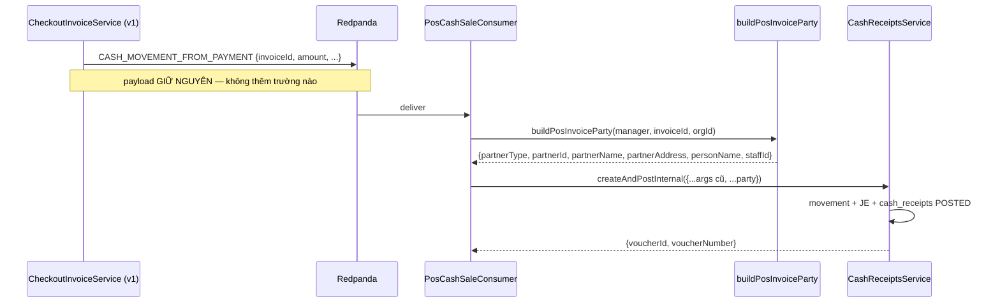
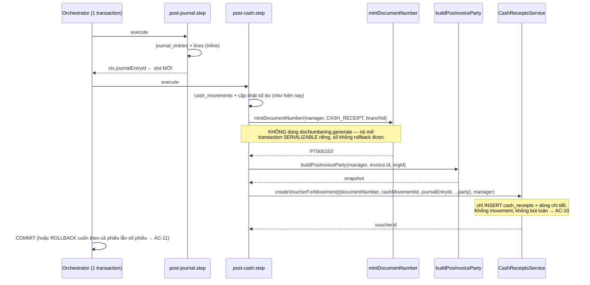

# Logical design — checkout-voucher-party

## Approach

Một hàm thuần dựng **snapshot đối tượng** từ một `invoiceId`, đặt cạnh
`resolvePartySnapshot` trong `cash-vouchers/shared/voucher-party.ts`, rồi gọi nó ở **đúng
nơi ghi phiếu** — bốn consumer và hai bước saga. Không đụng vào payload Kafka, không đụng
schema, không đụng FE.

```
                    ┌─────────────────────────────────────────┐
                    │ voucher-party.ts                        │
                    │   resolvePartySnapshot()   ← form tay    │
                    │   buildPosInvoiceParty()   ← MỚI, POS    │
                    └───────────────┬─────────────────────────┘
        ┌───────────────┬───────────┴───────┬──────────────────┐
        ▼               ▼                   ▼                  ▼
 PosCashSale      PosKeptChange       RefundCash /       post-cash.step (v2)
 Consumer (v1)    Consumer (v1+v2)    RefundBank         post-deposit.step (v2)
        │               │             Consumer                 │
        └───────────────┴─────────────────┬───────────────────┘
                                          ▼
                     cash_receipts / cash_payments / bank_receipts / bank_payments
```

`buildPosInvoiceParty` chạy **một** truy vấn tham số hoá, LEFT JOIN nên không dòng nào thiếu
làm hỏng kết quả:

```sql
SELECT i.customer_id, i.staff_id, i.salesperson_id,
       c.name    AS customer_name,
       c.address AS customer_address,
       b.address AS branch_address,
       ep.user_id AS salesperson_user_id
FROM invoices i
LEFT JOIN customers         c  ON c.id = i.customer_id AND c.organization_id = i.organization_id
LEFT JOIN branches          b  ON b.id = i.branch_id::uuid        -- branch_id là varchar
LEFT JOIN employee_profiles ep ON ep.id = i.salesperson_id AND ep.organization_id = i.organization_id
WHERE i.id = $1 AND i.organization_id = $2
```

Trả về đúng `VoucherPartySnapshot` đã có sẵn trong file đó, nên bốn bảng chứng từ map trường
theo đúng bảng đối chiếu mà docblock của file đã ghi (`personName` → `payer_name`/`payee_name`,
`staffId` → `staff_id`/`collected_by`/`paid_by`).

### Luồng v1 — consumer (không đổi kiến trúc, chỉ thêm một lệnh gọi)



### Luồng v2 — ghi phiếu inline trong transaction checkout



## Alternatives rejected

| Option | Why not |
|---|---|
| Nới `CashMovementFromPaymentPayload` và ba payload anh em, publisher nạp hoá đơn rồi nhét đối tượng vào event | Sửa 4 interface trong `shared-interfaces`, 4 publisher, và mọi event **đã nằm trong DLQ** khi replay vẫn trống bốn ô. Nơi ghi phiếu đã có sẵn `invoiceId` và một `EntityManager` — nó tự tra được, không cần ai bón |
| v2 publish `CASH_MOVEMENT_FROM_PAYMENT` qua outbox để dùng lại `PosCashSaleConsumer` | Consumer gọi `CashReceiptsService.createAndPostInternal` → `CashService.recordMovement` → `JournalService.post`. Chân tiền của đơn đã được `post-journal.step` ghi rồi → double-post GL, đúng cái A-26 đã cảnh báo. Gãy AC-10 |
| Gọi `createVoucherForMovement` nguyên trạng trong saga | Bên trong nó gọi `docNumbering.generate`, hàm này mở transaction `SERIALIZABLE` riêng và không nhận `manager` → số phiếu đã cấp **không** rollback cùng checkout. Gãy AC-11. Chỉ cần thêm một tham số `documentNumber?` là dùng lại được toàn bộ phần còn lại |
| Dùng `PartnerResolverService.resolve` cho cả đường POS | Nó throw `BadRequestException` khi id không tra được (A-R4). Trong saga, một khách bị xoá làm hỏng cả đơn hàng tại quầy. Đường tạo phiếu tay thì **cần** nó throw để chặn id rác từ form — nên không nới hàm đó, mà đi đường khác |
| Bỏ cột snapshot, để read model join sống sang `customers` / `users` khi hiển thị | Chứng từ đã post là bản đóng băng. Khách đổi tên năm sau sẽ đổi luôn tên trên phiếu cũ — sai nguyên tắc "immutable after posting" của repo, và bốn cột snapshot tồn tại chính vì lý do đó |
| Viết riêng logic "địa chỉ khách ?? địa chỉ chi nhánh" trong từng consumer | Ba đến năm bản sao của cùng một quy tắc. Thứ tự ưu tiên này đã có sẵn trong `resolvePartySnapshot` (A-10); hàm mới đặt **cùng file** để quy tắc chỉ có một chỗ để đọc và một chỗ để sửa |

## Contracts

**Mới — `cash-vouchers/shared/voucher-party.ts`**

```ts
/** Party snapshot for any voucher auto-generated from a POS invoice. Never throws. */
export async function buildPosInvoiceParty(
  manager: EntityManager,
  invoiceId: string,
  organizationId: string,
): Promise<VoucherPartySnapshot>;
```

- Hoá đơn không tra được → trả `{}` (mọi trường `undefined`), ghi log cảnh báo.
- Khách không có → `partnerType`/`partnerId`/`partnerName`/`personName` đều `undefined`,
  `partnerAddress` vẫn là địa chỉ chi nhánh.
- Dùng lại `blankToUndefined` sẵn có, nên chuỗi rỗng và chuỗi toàn khoảng trắng rơi xuống
  nhánh thoái lui chứ không được ghi.

**Sửa — `CashReceiptCreateForMovementArgs` (và bản tương ứng của `cash_payments`,
`bank_receipts` nếu cần cho UOW-03/04)**

```ts
export interface CashReceiptCreateForMovementArgs extends CashReceiptCreateAndPostArgs {
  cashMovementId: string;
  journalEntryId: string;
  /** Pre-minted inside the caller's transaction. Omit to let the service mint its own. */
  documentNumber?: string;
}
```

Tương thích ngược: bỏ trống thì hành vi y như hiện nay.

**Sửa — `CheckoutContext`**

```ts
journalEntryId?: string;   // set by post-journal, read by post-cash / post-deposit
cashReceiptId?: string;    // set by post-cash, để close-saga / trace nhìn thấy
```

**Không đổi:** mọi payload Kafka, mọi endpoint HTTP, mọi DTO, `packages/api-client`,
`openapi.snapshot.json`, toàn bộ FE.

## Error taxonomy

| Tình huống | Đường v1 (consumer) | Đường v2 (trong transaction) |
|---|---|---|
| Hoá đơn không tra được theo `invoiceId` | log warn, snapshot rỗng, phiếu vẫn tạo | như v1 — không thể xảy ra thật vì hoá đơn vừa được ghi trong cùng transaction |
| Khách đã bị xoá / `customer_id` trỏ trượt | LEFT JOIN cho NULL → ba ô đối tượng trống | như v1 |
| Chi nhánh chưa khai địa chỉ | `partner_address_snapshot` NULL | như v1 |
| Nhân viên bán hàng không có `employee_profiles` hoặc profile không có `user_id` | thoái lui `invoices.staff_id` (A-05) | như v1 |
| Không có cả `salesperson_id` lẫn `staff_id` | ô nhân viên NULL, phiếu vẫn tạo | như v1 |
| Lỗi hạ tầng thật (mất kết nối DB) khi chạy truy vấn | để exception bay lên → retry ×3 → DLQ, đúng cơ chế đang có | **không bọc try/catch**: trong Postgres, một câu lệnh lỗi đã đưa transaction vào trạng thái aborted, bắt lỗi rồi đi tiếp cũng không cứu được gì ngoài việc che mất nguyên nhân. Đơn hàng fail và cashier thử lại — đúng hành vi mong muốn cho một sự cố hạ tầng |
| `mintDocumentNumber` không tìm thấy rule `CASH_RECEIPT` | không áp dụng | **tự tạo rule mặc định rồi đi tiếp** (ADR-06). Ô này trước đây ghi "ném lỗi, đây là lỗi cấu hình phải sửa" — E2E chứng minh nhận định đó sai, xem ADR-06 |

Nguyên tắc phân định: **thiếu dữ liệu định danh thì im lặng thoái lui; hỏng hạ tầng thì ồn
ào.** Bốn ô hiển thị không đáng đổi lấy một đơn hàng, nhưng cũng không đáng để che một sự cố.

## ADRs

### ADR-01 — Suy ra đối tượng tại nơi ghi phiếu, không nới payload sự kiện
**Status:** accepted
**Context:** Bốn publisher khác nhau đẩy sự kiện tới bốn consumer khác nhau; v2 lại không đi
qua sự kiện nào. Muốn phiếu có đối tượng thì hoặc bơm dữ liệu vào event, hoặc để nơi ghi
phiếu tự tra.
**Decision:** Nơi ghi phiếu tự tra từ `invoiceId`.
**Consequences:** Một điểm sửa cho cả sáu đường ghi; event cũ trong DLQ replay ra phiếu đầy
đủ; đổi lại mỗi lần ghi phiếu tốn một truy vấn LEFT JOIN — không đáng kể so với movement +
bút toán ngay cạnh nó.

### ADR-02 — `staff_id` mang `employee_profiles.user_id`, thoái lui về `invoices.staff_id`
**Status:** accepted
**Context:** `invoices.salesperson_id` là khoá của `employee_profiles`; dialog phiếu tra ô
"Nhân viên thu" bằng `GET /admin/users/:id`. Hai không gian id.
**Decision:** Đi thêm một chặng sang `employee_profiles.user_id`. Không có nhân viên bán
hàng thì lấy `invoices.staff_id` — vốn đã là một `users.id`.
**Consequences:** Ô luôn có giá trị hiển thị được. Ngữ nghĩa "ai thu tiền" hơi rộng hơn "ai
được ghi công doanh số", nhưng đó đúng là điều chủ sở hữu yêu cầu và đúng cách MISA dùng ô
này. Test đơn vị **không** bắt được lỗi ghi nhầm id — chỉ click thật mới thấy, nên UOW nào
cũng phải chốt bằng demo (A-R3).

### ADR-03 — v2 ghi phiếu inline, voucher-only, với số phiếu mint trong transaction
**Status:** accepted
**Context:** v2 hôm nay không sinh phiếu (A-R1). Ba cách để có phiếu: publish event như v1
(double-post GL), gọi service nguyên trạng (số phiếu không rollback), hoặc ghi inline với số
phiếu tự mint.
**Decision:** Cách thứ ba. `post-cash.step` mint số bằng `mintDocumentNumber(manager, ...)`
rồi gọi `createVoucherForMovement(..., manager)` với tham số `documentNumber` mới.
**Consequences:** v2 đạt parity chứng từ mà vẫn giữ đúng bất biến "một đơn một bút toán".
`CashReceiptsService` nhận thêm một tham số tuỳ chọn — nhỏ và tương thích ngược. Đổi lại,
`post-cash.step` dài thêm và phải test cả nhánh rollback (AC-11).

### ADR-04 — Hàm dựng snapshot nằm cùng file với `resolvePartySnapshot`
**Status:** accepted
**Context:** Quy tắc "địa chỉ của đối tượng ?? địa chỉ truyền vào" đã tồn tại trong
`resolvePartySnapshot`. Đường POS không dùng được hàm đó vì nó throw (A-R4), nhưng cần **cùng
một** quy tắc.
**Decision:** Thêm `buildPosInvoiceParty` vào chính `voucher-party.ts`, dùng chung
`VoucherPartySnapshot` và `blankToUndefined`.
**Consequences:** Ai sửa quy tắc địa chỉ sẽ thấy cả hai đường ngay cạnh nhau. File thuộc
module `cash-vouchers` nhưng được `deposit-vouchers` và `pos` import — tiền lệ đã có
(`supplier-deposit-payment-saga.service.ts` import chính file này), và nó là hàm thuần, không
DI, nên không tạo vòng phụ thuộc module.

### ADR-05 — v2 gộp các dòng CASH vào một phiếu thu; v1 giữ nguyên
**Status:** accepted
**Context:** v1 publish một event cho **mỗi** dòng thanh toán tiền mặt, còn consumer dedupe
theo `(INVOICE, invoiceId)` — hai dòng tiền mặt thì phiếu chỉ mang số tiền dòng đầu (A-06).
**Decision:** v2 tạo một phiếu cho tổng các dòng CASH. Không sửa hành vi v1 trong feature
này.
**Consequences:** Với hoá đơn một dòng tiền mặt — tức mọi hoá đơn POS UI sinh ra hôm nay —
hai đường cho kết quả giống hệt. Nếu A-06 sai thì v1 có một lỗi tiền có sẵn; feature này ghi
lại chứ không chữa, và v2 sẽ đúng còn v1 sai. Ranh giới đó phải được nêu khi bàn giao.

### ADR-06 — `mintDocumentNumber` tự tạo rule mặc định khi ghi phiếu thu
**Status:** accepted (thêm sau khi reopen G2 — xem `aidlc audit`)
**Context:** Chạy E2E `checkout-saga-voucher` sau khi T-03-03 xong: **mọi** checkout v2 tiền
mặt fail với `No active document numbering rule found for CASH_RECEIPT`. Nguyên nhân không
phải bug của bước mới mà là một chênh lệch giữa hai bản đánh số:

- `DocumentNumberingService.generate` (v1 dùng) gọi `ensureDefaultActiveRule` khi không có
  rule — nó **tự tạo** rule từ `DEFAULT_DOC_NUMBER_CONFIG` (`PT`, liên tục, 6 chữ số) rồi đi
  tiếp. Vì thế v1 chưa bao giờ vấp: phiếu thu đầu tiên của một tổ chức tự sinh rule.
- `mintDocumentNumber` (bản composable của saga, T-02-03) **không** port phần đó — không có
  rule là ném `DOC_NUMBER_RULE_MISSING`.

`erp_test` không có rule `CASH_RECEIPT` (v2 chưa từng tạo phiếu thu), nên lỗi lộ ra ngay.
Điều đáng sợ hơn là hệ quả trên production: **bất kỳ tổ chức nào chưa từng tạo một Phiếu thu
nào sẽ mất khả năng bán hàng tiền mặt trên v2** ngay khi feature này lên. Trước feature thì
đơn vẫn chốt được (chỉ là không có phiếu).

**Decision:** Thêm tuỳ chọn `ensureDefault` cho `mintDocumentNumber`, port đúng logic của
`ensureDefaultActiveRule`, và **chỉ** `post-cash` (và sau này `post-deposit`) bật nó.
`next-document-number.step` (INVOICE) và `post-journal` (JOURNAL) giữ nguyên hành vi ném lỗi.

**Consequences:** v2 đạt đúng mức chịu lỗi của v1, không hơn không kém. Rule được tạo trong
transaction checkout nên nếu đơn rollback thì rule biến mất — lần bán kế tiếp tạo lại, vô
hại. Không mở rộng hành vi tự tạo sang INVOICE/JOURNAL: đó là quyết định riêng của T-02-03,
không phải việc của feature này để lật.

**Vì sao không chọn hai phương án kia:**

| Phương án | Vì sao không |
|---|---|
| Bỏ qua phiếu khi thiếu rule, chỉ log lỗi | Đơn sống nhưng tiền vào quỹ không có chứng từ, và không ai biết cho tới lúc đối soát. Im lặng đúng loại nguy hiểm nhất |
| Bắt admin khai rule trước khi deploy | Biến một bản vá hiển thị thành một bước vận hành bắt buộc, và tổ chức nào quên thì mất quầy. v1 không đòi hỏi điều đó |
