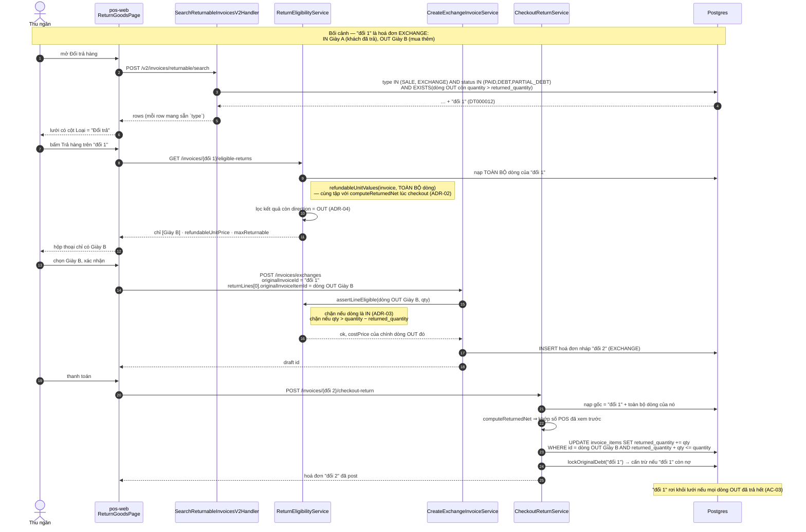

# Logical design — Đổi trả theo hoá đơn trên hoá đơn đổi trả

## Approach

Hoá đơn `EXCHANGE` **đã là** một chứng từ bán hàng đầy đủ cho phần "Mua thêm": dòng
`direction = OUT` trừ kho showroom, mang `costPrice` đã chốt, sinh điểm tích luỹ, và có
`returned_quantity` riêng như bất kỳ dòng bán nào. Toàn bộ máy móc trả-theo-hoá-đơn ở
`CheckoutReturnService` cũng đã tổng quát: nó cộng dồn `returned_quantity` theo
`originalInvoiceItemId` mà không đọc `invoices.type`, và cấn trừ công nợ theo
`invoice_debts.invoiceId` + `documentType = CREDIT_INVOICE`.

Cái duy nhất chặn là **hai vị từ đọc** đặt cứng `type = SALE`, và một chỗ **thiếu vị từ**:

```
search-returnable-invoices-v2.handler.ts:114   inv.type = SALE           → hoá đơn đổi không hiện
return-eligibility.service.ts:116              type !== SALE → 400        → mở ra thì lỗi
return-eligibility.service.ts:127-147          không lọc direction        → sẽ chào cả dòng khách đã trả
return-eligibility.service.ts:151-176          không kiểm direction       → client vẫn gửi được dòng IN
```

Vậy thiết kế là **nới hai vị từ đọc và thêm một vị từ lọc**, không thêm bảng, không
migration, không đụng đường ghi. Mặt POS thêm một cột `Loại` để thu ngân không chọn
nhầm chứng từ.

Điểm tinh tế duy nhất: vị từ `EXISTS (... direction = OUT AND quantity > returned_quantity)`
đã có sẵn trong handler tìm kiếm **tự** làm hai việc miễn phí — loại hoá đơn `RETURN`
(không có dòng OUT nào) và loại hoá đơn đổi đã trả hết. Không cần vị từ riêng cho hai
trường hợp đó (AC-02, AC-03).

## Sơ đồ tuần tự — lần đổi thứ hai



## Alternatives rejected

| Option | Why not |
|---|---|
| Tách mỗi lần đổi thành phiếu trả + hoá đơn bán mới | Đổi mô hình chứng từ: đánh số hai lần cho một giao dịch, tách bút toán, đếm lại doanh thu ở mọi báo cáo. Và dữ liệu `EXCHANGE` lịch sử vẫn kẹt ⇒ vẫn phải làm hướng này nữa. Người dùng đã chọn hướng nới vị từ (A-01) |
| Sửa `refundable-value.util.ts` để loại dòng IN khỏi mẫu số | `refundableFactor = max(0, 1 − headerResidual/sumNetLine)`, mà `headerResidual` = 0 trên mọi hoá đơn `EXCHANGE` ⇒ hệ số bằng 1 dù mẫu số thế nào. Sửa util là thay đổi vô nghĩa trên đường đi của **mọi** hoá đơn bán (A-15) |
| Rẽ nhánh `if (invoice.type === EXCHANGE) lọc OUT` | Dòng `SALE` toàn bộ là `OUT` (ghi tường minh ở `persist-invoice.step.ts:226`, DB default `OUT`), nên một vị từ không điều kiện phủ cả hai và không có nhánh riêng để trôi lệch về sau (ADR-04) |
| Thêm `type = SALE` vào `create-exchange/create-return` để chặn sớm | Hai service đó vốn không kiểm `type` gốc — thêm kiểm rồi lại nới ra là công vô ích. Chốt chặn đúng chỗ là `assertLineEligible`, nơi đã kiểm số lượng (ADR-03) |
| Bộ lọc `Loại` bằng ô text khớp nhãn tiếng Việt | Backend phải hiểu chuỗi "Đổi trả" ⇒ tiếng Việt lọt vào source backend, trái quy ước repo. Dùng enum + `PosSelect` (ADR-05) |

## Domain model

Không có entity mới. Các cột đã dùng, đúng nghĩa sẵn có:

| Cột | Bảng | Vai trò trong tính năng này |
|---|---|---|
| `type` | `invoices` | `SALE` \| `RETURN` \| `EXCHANGE`; vị từ tìm kiếm nới từ `= SALE` thành `IN (SALE, EXCHANGE)` |
| `direction` | `invoice_items` | `OUT` = hàng bán ra (trả được), `IN` = hàng khách trả về (không trả lại được). Default DB = `OUT` |
| `returned_quantity` | `invoice_items` | Accumulator trên dòng **gốc**; đã dùng chung cho cả huỷ (`cancel-return.service.ts:296`) |
| `original_invoice_item_id` | `invoice_items` | Trỏ dòng gốc; nay có thể trỏ vào một dòng OUT của hoá đơn `EXCHANGE` — chuỗi nối dài qua nhiều lần đổi |

## Contracts

### POST /v2/invoices/returnable/search

Request: `ReturnableInvoiceSearchV2Dto` — **thêm** một trường tuỳ chọn:

```jsonc
{
  "page": 1, "limit": 20,
  "type": "EXCHANGE"        // mới, optional; bỏ trống = cả SALE lẫn EXCHANGE
}
```

Response 200: không đổi hình dạng. Mỗi phần tử `data[]` là `InvoiceEntity` đầy đủ nên
đã mang sẵn `type` — FE không cần trường mới để vẽ cột `Loại`.

Thay đổi hành vi: tập kết quả nay gồm cả hoá đơn `EXCHANGE` còn dòng `OUT` chưa trả hết.
`totals.totalAmount` vẫn dùng `invoiceSignedTotalSql` (EXCHANGE → `net_amount`), nên chân
lưới và lưới không lệch (AC-05).

### GET /invoices/:id/eligible-returns

Request: không đổi. Response: cùng hình dạng `EligibleLine[]`, hai thay đổi hành vi:

- nhận `id` là hoá đơn `EXCHANGE` (trước ném 400);
- chỉ trả các dòng `direction = OUT`.

Failure modes: 404 → không tìm thấy hoá đơn · 400 → `type` ngoài `SALE`/`EXCHANGE` ·
400 → `status` ngoài `PAID`/`DEBT`/`PARTIAL_DEBT`.

### POST /invoices/exchanges · POST /invoices/returns

Không đổi hình dạng. `assertLineEligible` thêm một điều kiện từ chối: dòng gốc có
`direction = IN`.

## State ownership

| State | Owner | Lifetime |
|---|---|---|
| Bộ lọc cột + phân trang lưới | `useReturnGoods` | Màn hình |
| Bộ lọc `Loại` (mới) | `useReturnGoods` → `searchBody.type` | Màn hình |
| Danh sách dòng trả được | `useEligibleReturnsQuery` (TanStack) | Vòng đời hộp thoại |
| `returned_quantity` | Postgres, dưới `UPDATE … WHERE returned_quantity + $1 <= quantity` | Vĩnh viễn |

## Error taxonomy

| Condition | HTTP | Nơi ném | UI |
|---|---|---|---|
| Hoá đơn gốc không tồn tại | 404 | `getEligibleLines` | toast lỗi |
| `type` ngoài `SALE`/`EXCHANGE` | 400 | `getEligibleLines` | toast lỗi |
| `status` không trả được | 400 | `getEligibleLines` | toast lỗi |
| **Dòng gốc là `direction = IN`** | **400** | **`assertLineEligible` (mới)** | toast lỗi |
| Trả quá số lượng còn lại | 400 | `assertLineEligible` | toast lỗi |
| Hai quầy trả cùng dòng đồng thời | 409 | `checkout-return.service.ts` (`UPDATE … WHERE` không khớp dòng nào) | toast lỗi, tải lại lưới |

## Cache & offline

Không có cache riêng. TanStack Query giữ key theo `searchBody`; thêm `type` vào body làm
key tự đổi, không cần invalidate thủ công. Sau khi post một phiếu trả, key `eligible-returns`
của hoá đơn gốc phải hết hạn — hành vi này đã có sẵn từ luồng trả trên hoá đơn bán.

## Observability

Không thêm sự kiện. `CreateExchangeInvoiceService` đã log `mode=quick|regular` kèm
`returnSubtotal/newSubtotal/net`; một lần đổi-của-đổi hiện ra dưới dạng `mode=regular`
với `originalInvoiceId` trỏ vào một hoá đơn `EXCHANGE` — truy vết chuỗi bằng cách lần
theo `invoices.original_invoice_id`.

## ADRs

### ADR-01 — Mở khoá tại chỗ, không tách chứng từ
**Context:** Hoá đơn `EXCHANGE` có phần "Mua thêm" là hàng đã bán thật nhưng không trả
lại được theo hoá đơn. Hai hướng: nới vị từ để chính nó trả được, hay tách mỗi lần đổi
thành phiếu trả + hoá đơn bán mới.
**Decision:** Nới vị từ. Giữ một chứng từ `EXCHANGE` cho một giao dịch đổi.
**Consequences:** Sửa gọn ba chỗ đọc, không migration, không đụng hạch toán. Đổi lại,
"hoá đơn" trong màn hình đổi trả từ nay là hai loại chứng từ chứ không còn một — cần cột
`Loại` (ADR-05) và mọi mã đọc lưới phải chấp nhận `netAmount` âm.
**Status:** accepted — Akenzy chốt 2026-08-22 (A-01)

### ADR-02 — Xem trước và tính tiền phải cùng một tập dòng
**Context:** `getEligibleLines` tính `refundableUnitValues(invoice, items)` để POS hiện
giá hoàn; `CheckoutReturnService.computeReturnedNet` tính lại trên `originalItems` — là
**toàn bộ** dòng của hoá đơn gốc. Nếu bên đọc lọc dòng trước khi tính còn bên ghi thì
không, hai số có thể lệch, và lệch giá hoàn là lớp lỗi đã sinh ra nợ ảo ở
`[[project_pos_promotion_apply_construction]]`.
**Decision:** `getEligibleLines` truyền **toàn bộ** dòng vào `refundableUnitValues`, rồi
mới lọc **kết quả** xuống dòng `OUT`. Thứ tự này làm hai bên bằng nhau theo cấu trúc,
không phải theo trùng hợp.
**Consequences:** Hôm nay hai cách cho cùng con số vì `headerResidual` = 0 trên hoá đơn
`EXCHANGE`; ngày mai ai đó cho phép dùng điểm/đặt cọc trên luồng đổi thì vẫn không lệch.
Một test khoá đẳng thức này lại (AC-09).
**Status:** accepted

### ADR-03 — Chốt chặn `direction` nằm ở đường ghi, không chỉ ở đường đọc
**Context:** `getEligibleLines` quyết định POS **chào** dòng nào; `assertLineEligible`
quyết định server **nhận** dòng nào. Trước tính năng này chưa hoá đơn nào vừa có dòng IN
vừa trả được, nên khoảng trống không lộ ra.
**Decision:** Thêm điều kiện từ chối `direction = IN` vào `assertLineEligible`, cạnh chỗ
đã kiểm số lượng.
**Consequences:** Một client cũ hoặc gọi thẳng API không thể "trả" món hàng khách đã trả
— thứ sẽ xuất kho khống và chi tiền khống. Không phủ lỗ hổng có sẵn *khác*:
`assertLineEligible` vẫn không kiểm dòng gốc có thuộc `originalInvoiceId` mà client khai
hay không. Ghi nhận, để ngoài phạm vi.
**Status:** accepted

### ADR-04 — Lọc `direction = OUT` không điều kiện, không rẽ theo `type`
**Context:** Chỉ hoá đơn `EXCHANGE` mới có dòng `IN`, nên có thể chỉ lọc khi
`type === EXCHANGE`.
**Decision:** Lọc `direction = OUT` cho mọi loại hoá đơn.
**Consequences:** Dòng `SALE` toàn bộ là `OUT` (`persist-invoice.step.ts:226`, DB default
`OUT`) nên hành vi hoá đơn bán không đổi một ly. Một vị từ, không nhánh theo `type` để
trôi lệch khi thêm loại chứng từ thứ tư.
**Status:** accepted

### ADR-05 — Cột `Loại` lọc bằng enum, không bằng ô text
**Context:** Lưới nay trộn hai loại chứng từ. Bộ lọc cột hiện có chỉ hai kiểu, `TEXT` và
`NUMBER`, đều kèm toán tử.
**Decision:** Cột `Loại` hiện nhãn tiếng Việt ("Bán hàng" / "Đổi trả"), ô lọc là một
`PosSelect` ba lựa chọn dựng thẳng trong `filterRender`, gửi lên `type` dạng enum
(`SALE` / `EXCHANGE`) qua trường mới của `ReturnableInvoiceSearchV2Dto`.
**Consequences:** Không phải thêm kiểu lọc thứ ba vào `PosDataTableFilterCell`; backend
không phải hiểu chuỗi tiếng Việt. Đổi lại, ô lọc cột này trông khác các ô còn lại (không
có ô chọn toán tử đứng trước).
**Status:** accepted
