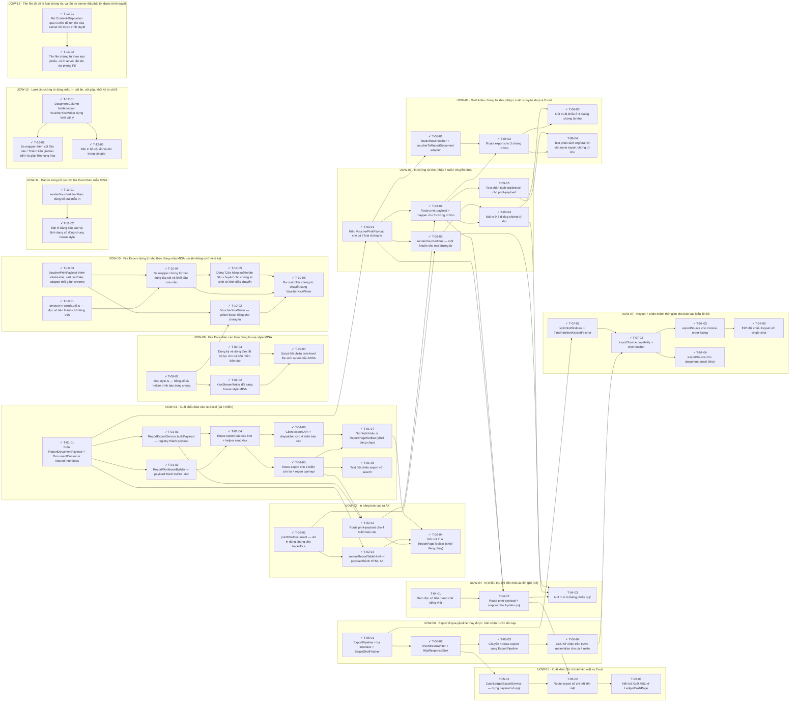

<!-- GENERATED by scripts/uow_graph.py — do not edit by hand -->

# Ticket graph — export-print

- Units of Work: **13**
- Tickets: **53** (45 done)
- Total effort: **19.9d**
- Critical path: **3.4d** across 8 tickets
- Theoretical minimum duration with unlimited parallelism: **3.4d**

## Units of Work

| UoW | Title | Risk | Effort | Elapsed | Depends on | Status |
|-----|-------|------|--------|---------|-----------|--------|
| UOW-01 | Xuất khẩu báo cáo ra Excel (cả 4 miền) | medium | 3.1d | 1.9d | — | todo |
| UOW-02 | In bảng báo cáo ra A4 | low | 1.6d | 1.2d | UOW-01 | todo |
| UOW-03 | In chứng từ kho (nhập / xuất / chuyển kho) | medium | 1.9d | 1.1d | UOW-02 | todo |
| UOW-04 | In phiếu thu chi tiền mặt và tiền gửi (A5) | low | 1.5d | 1.5d | UOW-03 | todo |
| UOW-05 | Xuất khẩu Sổ chi tiết tiền mặt ra Excel | low | 1.0d | 1.0d | UOW-01, UOW-04, UOW-06 | todo |
| UOW-06 | Export đi qua pipeline thay được, trần chặn trước khi nạp | medium | 1.6d | 1.6d | UOW-01 | todo |
| UOW-07 | Keyset + phân mảnh thời gian cho báo cáo kiểu liệt kê | medium | 2.1d | 1.6d | UOW-06 | todo |
| UOW-08 | Xuất khẩu chứng từ kho (nhập / xuất / chuyển kho) ra Excel | low | 1.2d | 1.0d | UOW-01, UOW-03 | todo |
| UOW-09 | File Excel báo cáo theo đúng house style MISA | medium | 1.4d | 1.0d | UOW-01, UOW-06 | todo |
| UOW-10 | File Excel chứng từ kho theo đúng mẫu MISA (có tiền-bằng-chữ và ô ký) | medium | 2.1d | 1.5d | UOW-08, UOW-09 | todo |
| UOW-11 | Bản in trùng bố cục với file Excel theo mẫu MISA | low | 6h | 6h | UOW-10 | todo |
| UOW-12 | Lưới cột chứng từ đúng mẫu — cột ẩn, cột gộp, khối ký từ cột B | low | 1.1d | 7h | UOW-10, UOW-11 | todo |
| UOW-13 | Tên file tải về là loại chứng từ, và tên do server đặt phải tới được trình duyệt | low | 3h | 3h | UOW-10 | todo |

Effort is total person-hours. Elapsed is the longest dependency chain inside the
slice — the floor on how fast it can finish no matter how many people work on it.

## Dependency graph

## Execution waves

Tickets in the same wave have no dependency between them and can run in parallel.

| Wave | Tickets | Parallel capacity | Wave duration (longest ticket) |
|------|---------|-------------------|-------------------------------|
| W1 | T-01-01, T-02-01, T-04-01, T-06-01, T-09-01, T-09-03, T-10-01, T-10-03, T-11-01, T-12-01, T-13-01 | 11 | 4h |
| W2 | T-01-02, T-01-03, T-02-03, T-03-01, T-06-02, T-07-01, T-09-02, T-10-02, T-10-04, T-11-02, T-12-02, T-12-03, T-13-02 | 13 | 4h |
| W3 | T-01-04, T-03-03, T-05-01, T-06-03, T-08-01, T-09-04, T-10-05 | 7 | 4h |
| W4 | T-01-05, T-01-06, T-06-04, T-10-06 | 4 | 4h |
| W5 | T-01-07, T-01-08, T-02-02, T-07-02 | 4 | 3h |
| W6 | T-02-04, T-03-02, T-07-03, T-07-04 | 4 | 4h |
| W7 | T-03-04, T-03-05, T-04-02, T-07-05, T-08-02 | 5 | 4h |
| W8 | T-04-03, T-05-02, T-08-03, T-08-04 | 4 | 4h |
| W9 | T-05-03 | 1 | 2h |

## Write-conflict hazards

These pairs have no ordering constraint, so a scheduler may run them at the
same time — and they write the same path. Sequential execution is safe;
parallel agents will lose one side's work.

| A | B | Contested path |
|---|---|---|
| T-01-01 | T-12-01 | `packages/shared-interfaces/src/reporting/document-payload.ts` |
| T-01-03 | T-06-03 | `apps/api/src/modules/reporting/report-core/report-export.service.spec.ts`, `apps/api/src/modules/reporting/report-core/report-export.service.ts` |
| T-01-03 | T-06-04 | `apps/api/src/modules/reporting/report-core/report-export.service.spec.ts`, `apps/api/src/modules/reporting/report-core/report-export.service.ts` |
| T-01-03 | T-07-02 | `apps/api/src/modules/reporting/report-core/report-export.service.spec.ts`, `apps/api/src/modules/reporting/report-core/report-export.service.ts` |
| T-01-03 | T-07-03 | `apps/api/src/modules/reporting/report-core/report-export.service.ts` |
| T-01-03 | T-09-03 | `apps/api/src/modules/reporting/report-core/report-export.service.ts` |
| T-01-04 | T-06-03 | `apps/api/src/common/utils/send-xlsx.util.ts`, `apps/api/src/modules/inventory-reports/inventory-report-v2.controller.ts` |
| T-01-05 | T-06-03 | `apps/api/src/modules/reporting/debt-report/debt-report.controller.ts`, `apps/api/src/modules/reporting/invoice-report/invoice-report.controller.ts`, `apps/api/src/modules/reporting/profit-report/profit-report.controller.ts` |
| T-01-08 | T-07-05 | `apps/api/test/e2e/report-export.e2e-spec.ts` |
| T-02-02 | T-06-03 | `apps/api/src/modules/inventory-reports/inventory-report-v2.controller.ts`, `apps/api/src/modules/reporting/debt-report/debt-report.controller.ts`, `apps/api/src/modules/reporting/invoice-report/invoice-report.controller.ts`, `apps/api/src/modules/reporting/profit-report/profit-report.controller.ts`, `apps/api/src/modules/reporting/report-core/report-export.service.ts` |
| T-02-02 | T-06-04 | `apps/api/src/modules/reporting/report-core/report-export.service.ts` |
| T-02-02 | T-07-02 | `apps/api/src/modules/reporting/report-core/report-export.service.ts` |
| T-02-02 | T-07-03 | `apps/api/src/modules/reporting/report-core/report-export.service.ts` |
| T-02-02 | T-09-03 | `apps/api/src/modules/reporting/report-core/report-export.service.ts` |
| T-02-03 | T-11-02 | `apps/backoffice-web/src/lib/print/render-report-table-html.ts` |
| T-03-01 | T-10-03 | `packages/shared-interfaces/src/printing/voucher-payload.ts` |
| T-03-02 | T-10-04 | `apps/api/src/modules/inventory/goods-issue/goods-issue-print.mapper.spec.ts`, `apps/api/src/modules/inventory/goods-issue/goods-issue-print.mapper.ts`, `apps/api/src/modules/inventory/goods-issue/goods-issue.service.ts`, `apps/api/src/modules/inventory/goods-receipt/goods-receipt-print.mapper.spec.ts`, `apps/api/src/modules/inventory/goods-receipt/goods-receipt-print.mapper.ts`, `apps/api/src/modules/inventory/goods-receipt/goods-receipt.service.ts`, `apps/api/src/modules/inventory/transfer-order/transfer-order-print.mapper.spec.ts`, `apps/api/src/modules/inventory/transfer-order/transfer-order-print.mapper.ts` |
| T-03-02 | T-10-05 | `apps/api/src/modules/inventory/goods-issue/goods-issue.service.ts`, `apps/api/src/modules/inventory/goods-receipt/goods-receipt.service.ts`, `apps/api/src/modules/inventory/location/services/voucher-print-context.util.ts` |
| T-03-02 | T-10-06 | `apps/api/src/modules/inventory/goods-issue/goods-issue.controller.ts`, `apps/api/src/modules/inventory/goods-receipt/goods-receipt.controller.ts`, `apps/api/src/modules/inventory/transfer-order/transfer-order.controller.ts` |
| T-03-02 | T-12-02 | `apps/api/src/modules/inventory/goods-issue/goods-issue-print.mapper.spec.ts`, `apps/api/src/modules/inventory/goods-issue/goods-issue-print.mapper.ts`, `apps/api/src/modules/inventory/goods-receipt/goods-receipt-print.mapper.spec.ts`, `apps/api/src/modules/inventory/goods-receipt/goods-receipt-print.mapper.ts`, `apps/api/src/modules/inventory/transfer-order/transfer-order-print.mapper.spec.ts`, `apps/api/src/modules/inventory/transfer-order/transfer-order-print.mapper.ts` |
| T-03-02 | T-13-02 | `apps/api/src/modules/inventory/goods-issue/goods-issue.controller.ts`, `apps/api/src/modules/inventory/goods-receipt/goods-receipt.controller.ts`, `apps/api/src/modules/inventory/transfer-order/transfer-order.controller.ts` |
| T-03-03 | T-11-01 | `apps/backoffice-web/src/lib/print/render-voucher-html.test.ts`, `apps/backoffice-web/src/lib/print/render-voucher-html.ts` |
| T-03-03 | T-11-02 | `apps/backoffice-web/src/lib/print/print-format.util.ts` |
| T-03-03 | T-12-03 | `apps/backoffice-web/src/lib/print/render-voucher-html.test.ts`, `apps/backoffice-web/src/lib/print/render-voucher-html.ts` |
| T-04-01 | T-10-01 | `apps/api/src/common/utils/amount-in-words.util.spec.ts`, `apps/api/src/common/utils/amount-in-words.util.ts` |
| T-04-02 | T-08-02 | `packages/api-client/openapi.snapshot.json`, `packages/api-client/src/generated/schema.ts` |
| T-05-02 | T-08-02 | `packages/api-client/openapi.snapshot.json`, `packages/api-client/src/generated/schema.ts` |
| T-06-02 | T-09-02 | `apps/api/src/modules/reporting/report-core/export/xlsx-stream.writer.spec.ts`, `apps/api/src/modules/reporting/report-core/export/xlsx-stream.writer.ts` |
| T-06-02 | T-09-04 | `apps/api/src/modules/reporting/report-core/export/xlsx-stream.writer.spec.ts` |
| T-06-03 | T-09-03 | `apps/api/src/modules/inventory-reports/queries/get-inventory-report-document.handler.ts`, `apps/api/src/modules/reporting/debt-report/queries/get-debt-report-document.handler.ts`, `apps/api/src/modules/reporting/invoice-report/queries/get-invoice-report-document.handler.ts`, `apps/api/src/modules/reporting/profit-report/queries/get-profit-report-document.handler.ts`, `apps/api/src/modules/reporting/report-core/report-export.service.ts` |
| T-06-04 | T-09-03 | `apps/api/src/modules/reporting/report-core/report-export.service.ts` |
| T-07-02 | T-09-03 | `apps/api/src/modules/reporting/report-core/report-export.service.ts` |
| T-07-03 | T-09-03 | `apps/api/src/modules/reporting/report-core/report-export.service.ts` |
| T-08-01 | T-10-03 | `apps/api/src/modules/reporting/report-core/export/voucher-export.adapter.spec.ts`, `apps/api/src/modules/reporting/report-core/export/voucher-export.adapter.ts` |
| T-08-02 | T-10-06 | `apps/api/src/modules/inventory/goods-issue/goods-issue.controller.ts`, `apps/api/src/modules/inventory/goods-receipt/goods-receipt.controller.ts`, `apps/api/src/modules/inventory/transfer-order/transfer-order.controller.ts` |
| T-08-02 | T-13-02 | `apps/api/src/modules/inventory/goods-issue/goods-issue.controller.ts`, `apps/api/src/modules/inventory/goods-receipt/goods-receipt.controller.ts`, `apps/api/src/modules/inventory/transfer-order/transfer-order.controller.ts` |
| T-08-03 | T-13-02 | `apps/backoffice-web/src/lib/print/voucher-export.api.ts` |
| T-10-02 | T-12-01 | `apps/api/src/modules/reporting/report-core/export/voucher-xlsx.writer.spec.ts`, `apps/api/src/modules/reporting/report-core/export/voucher-xlsx.writer.ts` |
| T-10-04 | T-12-02 | `apps/api/src/modules/inventory/goods-issue/goods-issue-print.mapper.spec.ts`, `apps/api/src/modules/inventory/goods-issue/goods-issue-print.mapper.ts`, `apps/api/src/modules/inventory/goods-receipt/goods-receipt-print.mapper.spec.ts`, `apps/api/src/modules/inventory/goods-receipt/goods-receipt-print.mapper.ts`, `apps/api/src/modules/inventory/transfer-order/transfer-order-print.mapper.spec.ts`, `apps/api/src/modules/inventory/transfer-order/transfer-order-print.mapper.ts` |
| T-10-06 | T-13-02 | `apps/api/src/modules/inventory/goods-issue/goods-issue.controller.ts`, `apps/api/src/modules/inventory/goods-receipt/goods-receipt.controller.ts`, `apps/api/src/modules/inventory/transfer-order/transfer-order.controller.ts` |
| T-11-01 | T-12-03 | `apps/backoffice-web/src/lib/print/render-voucher-html.test.ts`, `apps/backoffice-web/src/lib/print/render-voucher-html.ts` |

## Critical path

T-01-01 → T-01-02 → T-01-04 → T-01-05 → T-02-02 → T-03-02 → T-04-02 → T-04-03

Total: **3.4d**. Shortening the plan means shortening this chain;
adding people to tickets off this path will not make the feature ship sooner.

## Tickets

| ID | UoW | Layer | Type | Est | Depends on | Verifies | Status |
|----|-----|-------|------|-----|-----------|----------|--------|
| T-01-01 | UOW-01 | shared | feature | 2h | — | AC-04 | done |
| T-01-02 | UOW-01 | application | feature | 4h | T-01-01 | AC-01, AC-03 | done |
| T-01-03 | UOW-01 | application | feature | 4h | T-01-01 | AC-02, AC-03, AC-05, AC-06, AC-07 | done |
| T-01-04 | UOW-01 | api | feature | 3h | T-01-02, T-01-03 | AC-01, AC-06 | done |
| T-01-05 | UOW-01 | api | feature | 3h | T-01-04 | AC-04 | done |
| T-01-06 | UOW-01 | web | feature | 3h | T-01-04 | AC-04 | done |
| T-01-07 | UOW-01 | web | feature | 3h | T-01-05, T-01-06 | AC-01, AC-03 | done |
| T-01-08 | UOW-01 | test | test | 3h | T-01-05 | AC-02, AC-05 | done |
| T-02-01 | UOW-02 | web | feature | 3h | — | AC-08 | done |
| T-02-02 | UOW-02 | api | feature | 3h | T-01-03, T-01-05 | AC-08 | done |
| T-02-03 | UOW-02 | web | feature | 4h | T-02-01, T-01-01 | AC-08, AC-09 | done |
| T-02-04 | UOW-02 | web | feature | 3h | T-02-02, T-02-03, T-01-07 | AC-08, AC-09, AC-10 | done |
| T-03-01 | UOW-03 | shared | feature | 2h | T-01-01 | AC-12 | done |
| T-03-02 | UOW-03 | api | feature | 4h | T-03-01, T-02-02 | AC-12, AC-13 | done |
| T-03-03 | UOW-03 | web | feature | 4h | T-03-01, T-02-01 | AC-11, AC-12 | done |
| T-03-04 | UOW-03 | web | feature | 3h | T-03-02, T-03-03 | AC-11, AC-12 | done |
| T-03-05 | UOW-03 | test | test | 2h | T-03-02 | AC-13 | in_progress |
| T-04-01 | UOW-04 | application | feature | 4h | — | AC-14 | todo |
| T-04-02 | UOW-04 | api | feature | 4h | T-03-01, T-04-01, T-03-02 | AC-15 | todo |
| T-04-03 | UOW-04 | web | feature | 4h | T-04-02, T-03-03, T-03-04 | AC-14, AC-15 | todo |
| T-05-01 | UOW-05 | application | feature | 4h | T-06-02 | AC-16, AC-17, AC-21 | todo |
| T-05-02 | UOW-05 | api | feature | 2h | T-05-01, T-04-02 | AC-16 | todo |
| T-05-03 | UOW-05 | web | feature | 2h | T-05-02 | AC-16, AC-17 | todo |
| T-06-01 | UOW-06 | application | refactor | 4h | — | AC-04 | done |
| T-06-02 | UOW-06 | application | refactor | 3h | T-06-01 | AC-01, AC-03 | done |
| T-06-03 | UOW-06 | api | refactor | 2h | T-06-02 | AC-04, AC-01, AC-03 | done |
| T-06-04 | UOW-06 | application | feature | 4h | T-06-03 | AC-19, AC-05 | done |
| T-07-01 | UOW-07 | application | feature | 4h | T-06-01 | AC-20, AC-22 | done |
| T-07-02 | UOW-07 | application | feature | 2h | T-06-04, T-07-01 | AC-04 | done |
| T-07-03 | UOW-07 | application | feature | 4h | T-07-02 | AC-18 | done |
| T-07-04 | UOW-07 | application | feature | 4h | T-07-02 | AC-18 | done |
| T-07-05 | UOW-07 | test | test | 3h | T-07-03 | AC-18, AC-20, AC-02 | done |
| T-08-01 | UOW-08 | application | feature | 2h | T-03-01 | AC-24 | done |
| T-08-02 | UOW-08 | api | feature | 3h | T-08-01, T-03-02 | AC-23, AC-24, AC-25 | done |
| T-08-03 | UOW-08 | web | feature | 3h | T-08-02, T-03-04 | AC-23, AC-24 | done |
| T-08-04 | UOW-08 | test | test | 2h | T-08-02, T-03-05 | AC-25 | todo |
| T-09-01 | UOW-09 | shared | feature | 2h | — | AC-26 | done |
| T-09-02 | UOW-09 | infra | feature | 4h | T-09-01 | AC-26 | done |
| T-09-03 | UOW-09 | application | feature | 3h | — | AC-33 | done |
| T-09-04 | UOW-09 | test | test | 2h | T-09-02, T-09-03 | AC-26, AC-33 | done |
| T-10-01 | UOW-10 | shared | feature | 3h | — | AC-31 | done |
| T-10-02 | UOW-10 | infra | feature | 4h | T-09-01, T-10-03 | AC-27, AC-28 | done |
| T-10-03 | UOW-10 | shared | refactor | 1h | — | AC-28 | done |
| T-10-04 | UOW-10 | application | feature | 4h | T-10-01, T-10-03 | AC-28, AC-29 | done |
| T-10-05 | UOW-10 | service | feature | 3h | T-10-04 | AC-32 | done |
| T-10-06 | UOW-10 | api | feature | 2h | T-10-02, T-10-04, T-10-05 | AC-27, AC-29 | done |
| T-11-01 | UOW-11 | web | feature | 4h | — | AC-30 | done |
| T-11-02 | UOW-11 | web | feature | 2h | T-11-01 | AC-30 | done |
| T-12-01 | UOW-12 | infra | feature | 4h | — | AC-34 | done |
| T-12-02 | UOW-12 | application | feature | 3h | T-12-01 | AC-34 | done |
| T-12-03 | UOW-12 | web | feature | 2h | T-12-01 | AC-34 | done |
| T-13-01 | UOW-13 | api | chore | 1h | — | AC-35 | done |
| T-13-02 | UOW-13 | api | feature | 2h | T-13-01 | AC-35 | done |
