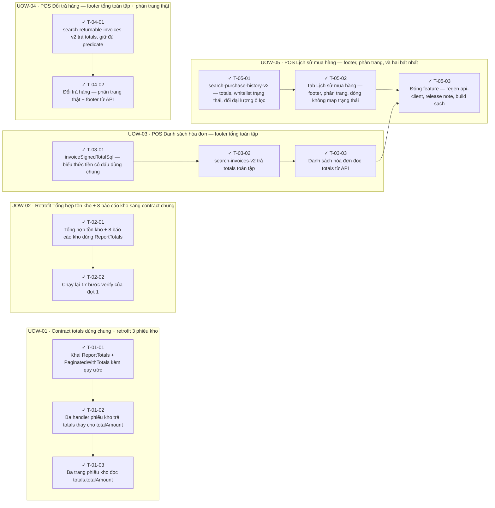

<!-- GENERATED by scripts/uow_graph.py — do not edit by hand -->

# Ticket graph — footer-grand-totals-standard

- Units of Work: **5**
- Tickets: **13** (13 done)
- Total effort: **4.1d**
- Critical path: **1.1d** across 4 tickets
- Theoretical minimum duration with unlimited parallelism: **1.1d**

## Units of Work

| UoW | Title | Risk | Effort | Elapsed | Depends on | Status |
|-----|-------|------|--------|---------|-----------|--------|
| UOW-01 | Contract totals dùng chung + retrofit 3 phiếu kho | low | 7h | 7h | — | todo |
| UOW-02 | Retrofit Tổng hợp tồn kho + 8 báo cáo kho sang contract chung | medium | 5h | 5h | UOW-01 | todo |
| UOW-03 | POS Danh sách hóa đơn — footer tổng toàn tập | medium | 7h | 7h | UOW-01 | todo |
| UOW-04 | POS Đổi trả hàng — footer tổng toàn tập + phân trang thật | high | 6h | 6h | UOW-03 | todo |
| UOW-05 | POS Lịch sử mua hàng — footer, phân trang, và hai bất nhất | high | 1.0d | 1.0d | UOW-03 | todo |

Effort is total person-hours. Elapsed is the longest dependency chain inside the
slice — the floor on how fast it can finish no matter how many people work on it.

## Dependency graph

## Execution waves

Tickets in the same wave have no dependency between them and can run in parallel.

| Wave | Tickets | Parallel capacity | Wave duration (longest ticket) |
|------|---------|-------------------|-------------------------------|
| W1 | T-01-01, T-02-01, T-03-01, T-04-01, T-05-01 | 5 | 3h |
| W2 | T-01-02, T-02-02, T-03-02, T-04-02, T-05-02 | 5 | 3h |
| W3 | T-01-03, T-03-03 | 2 | 2h |
| W4 | T-05-03 | 1 | 2h |

## Write-conflict hazards

None: every pair that writes a shared path is ordered by a dependency.

## Critical path

T-03-01 → T-03-02 → T-03-03 → T-05-03

Total: **1.1d**. Shortening the plan means shortening this chain;
adding people to tickets off this path will not make the feature ship sooner.

## Tickets

| ID | UoW | Layer | Type | Est | Depends on | Verifies | Status |
|----|-----|-------|------|-----|-----------|----------|--------|
| T-01-01 | UOW-01 | shared | feature | 2h | — | AC-01, AC-02 | done |
| T-01-02 | UOW-01 | application | refactor | 3h | T-01-01 | AC-03, AC-04 | done |
| T-01-03 | UOW-01 | web | refactor | 2h | T-01-02 | AC-03, AC-04 | done |
| T-02-01 | UOW-02 | service | refactor | 3h | — | AC-01, AC-04 | done |
| T-02-02 | UOW-02 | test | test | 2h | T-02-01 | AC-03 | done |
| T-03-01 | UOW-03 | service | feature | 2h | — | AC-06 | done |
| T-03-02 | UOW-03 | application | feature | 3h | T-03-01 | AC-05, AC-06, AC-07, AC-08 | done |
| T-03-03 | UOW-03 | web | feature | 2h | T-03-02 | AC-05, AC-08 | done |
| T-04-01 | UOW-04 | application | feature | 3h | — | AC-07, AC-09 | done |
| T-04-02 | UOW-04 | web | feature | 3h | T-04-01 | AC-10, AC-11, AC-12 | done |
| T-05-01 | UOW-05 | application | feature | 3h | — | AC-07, AC-13, AC-14 | done |
| T-05-02 | UOW-05 | web | feature | 3h | T-05-01 | AC-10, AC-11, AC-13, AC-15 | done |
| T-05-03 | UOW-05 | test | chore | 2h | T-05-02, T-03-03 | AC-14, AC-16 | done |
