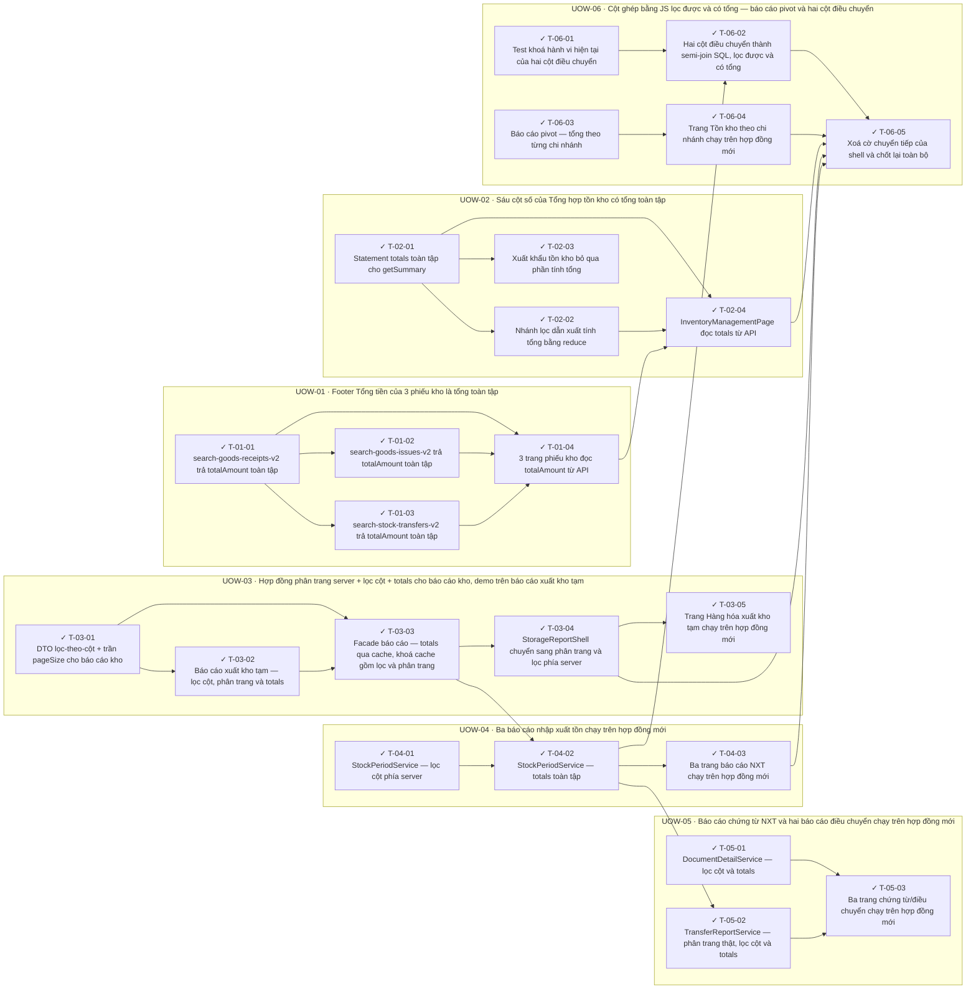

<!-- GENERATED by scripts/uow_graph.py — do not edit by hand -->

# Ticket graph — footer-grand-totals

- Units of Work: **6**
- Tickets: **24** (24 done)
- Total effort: **9.2d**
- Critical path: **2.6d** across 6 tickets
- Theoretical minimum duration with unlimited parallelism: **2.6d**

## Units of Work

| UoW | Title | Risk | Effort | Elapsed | Depends on | Status |
|-----|-------|------|--------|---------|-----------|--------|
| UOW-01 | Footer Tổng tiền của 3 phiếu kho là tổng toàn tập | low | 1.2d | 1.0d | — | todo |
| UOW-02 | Sáu cột số của Tổng hợp tồn kho có tổng toàn tập | high | 1.2d | 1.1d | UOW-01 | todo |
| UOW-03 | Hợp đồng phân trang server + lọc cột + totals cho báo cáo kho, demo trên báo cáo xuất kho tạm | high | 2.0d | 2.0d | UOW-01 | todo |
| UOW-04 | Ba báo cáo nhập xuất tồn chạy trên hợp đồng mới | medium | 1.4d | 1.4d | UOW-03 | todo |
| UOW-05 | Báo cáo chứng từ NXT và hai báo cáo điều chuyển chạy trên hợp đồng mới | medium | 1.4d | 1.0d | UOW-03 | todo |
| UOW-06 | Cột ghép bằng JS lọc được và có tổng — báo cáo pivot và hai cột điều chuyển | high | 2.0d | 1.2d | UOW-04, UOW-05 | todo |

Effort is total person-hours. Elapsed is the longest dependency chain inside the
slice — the floor on how fast it can finish no matter how many people work on it.

## Dependency graph

## Execution waves

Tickets in the same wave have no dependency between them and can run in parallel.

| Wave | Tickets | Parallel capacity | Wave duration (longest ticket) |
|------|---------|-------------------|-------------------------------|
| W1 | T-01-01, T-02-01, T-03-01, T-04-01, T-05-01, T-06-01, T-06-03 | 7 | 4h |
| W2 | T-01-02, T-01-03, T-02-02, T-02-03, T-03-02, T-06-04 | 6 | 4h |
| W3 | T-01-04, T-03-03 | 2 | 3h |
| W4 | T-02-04, T-03-04, T-04-02 | 3 | 4h |
| W5 | T-03-05, T-04-03, T-05-02, T-06-02 | 4 | 4h |
| W6 | T-05-03, T-06-05 | 2 | 4h |

## Write-conflict hazards

None: every pair that writes a shared path is ordered by a dependency.

## Critical path

T-03-01 → T-03-02 → T-03-03 → T-04-02 → T-05-02 → T-05-03

Total: **2.6d**. Shortening the plan means shortening this chain;
adding people to tickets off this path will not make the feature ship sooner.

## Tickets

| ID | UoW | Layer | Type | Est | Depends on | Verifies | Status |
|----|-----|-------|------|-----|-----------|----------|--------|
| T-01-01 | UOW-01 | application | feature | 3h | — | AC-01, AC-02, AC-03, AC-04 | done |
| T-01-02 | UOW-01 | application | feature | 2h | T-01-01 | AC-05 | done |
| T-01-03 | UOW-01 | application | feature | 2h | T-01-01 | AC-05 | done |
| T-01-04 | UOW-01 | web | feature | 3h | T-01-01, T-01-02, T-01-03 | AC-01, AC-02, AC-05, AC-22 | done |
| T-02-01 | UOW-02 | service | feature | 4h | — | AC-06, AC-07, AC-09 | done |
| T-02-02 | UOW-02 | service | feature | 2h | T-02-01 | AC-10 | done |
| T-02-03 | UOW-02 | service | chore | 1h | T-02-01 | AC-11 | done |
| T-02-04 | UOW-02 | web | feature | 3h | T-02-01, T-02-02, T-01-04 | AC-06, AC-07, AC-08 | done |
| T-03-01 | UOW-03 | api | feature | 3h | — | AC-13, AC-16 | done |
| T-03-02 | UOW-03 | service | feature | 4h | T-03-01 | AC-15, AC-18 | done |
| T-03-03 | UOW-03 | service | feature | 3h | T-03-01, T-03-02 | AC-21 | done |
| T-03-04 | UOW-03 | web | refactor | 4h | T-03-03 | AC-12, AC-13, AC-14, AC-18 | done |
| T-03-05 | UOW-03 | web | feature | 2h | T-03-04 | AC-12, AC-15, AC-16, AC-18 | done |
| T-04-01 | UOW-04 | service | feature | 4h | — | AC-15, AC-16 | done |
| T-04-02 | UOW-04 | service | feature | 3h | T-04-01, T-03-03 | AC-18 | done |
| T-04-03 | UOW-04 | web | feature | 4h | T-04-02 | AC-12, AC-18, AC-19 | done |
| T-05-01 | UOW-05 | service | feature | 3h | — | AC-15, AC-18 | done |
| T-05-02 | UOW-05 | service | feature | 4h | T-04-02 | AC-13, AC-15, AC-18 | done |
| T-05-03 | UOW-05 | web | feature | 4h | T-05-01, T-05-02 | AC-12, AC-18 | done |
| T-06-01 | UOW-06 | test | test | 2h | — | AC-17 | done |
| T-06-02 | UOW-06 | service | feature | 4h | T-06-01, T-04-02 | AC-17 | done |
| T-06-03 | UOW-06 | service | feature | 4h | — | AC-20 | done |
| T-06-04 | UOW-06 | web | feature | 3h | T-06-03 | AC-20 | done |
| T-06-05 | UOW-06 | web | chore | 3h | T-06-02, T-06-04, T-02-04, T-03-04, T-04-03 | AC-17, AC-22 | done |
