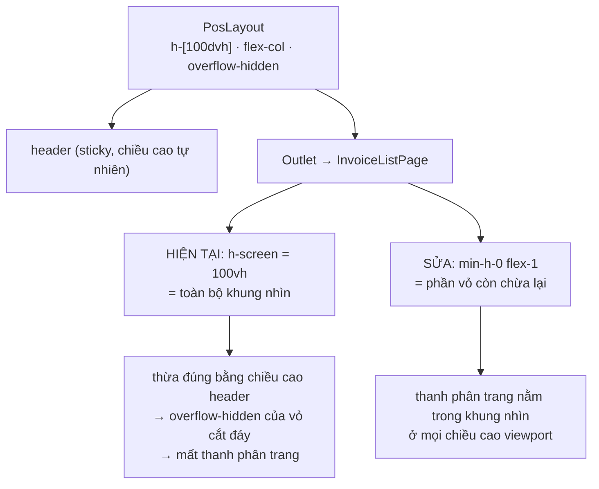

# Logical design — Danh sách hoá đơn POS

## Approach

Hai đường sửa độc lập, không chạm nhau, nên chạy song song được:

**Đường A (dữ liệu).** Kéo việc lấy thông tin khách từ FE về BE. Handler CQRS đã có sẵn
một khối "lấy thêm rồi gắn inline" cho `items` (`search-invoices-v2.handler.ts:52-67`);
đường A **nhân đúng khối đó** cho customer, với chiếu cột tường minh 4 trường. FE bỏ
vòng `Promise.all(customerService.get)` và đọc thẳng `inv.customer`.

**Đường B (bố cục).** Trang thôi tự khai `h-screen`, chuyển sang tiêu phần chiều cao vỏ
`PosLayout` còn chừa lại — đúng pattern `DailyReportPage`/`FastStockTransferPage` đang dùng.

### Trước

```mermaid
sequenceDiagram
    participant U as Thu ngân
    participant P as InvoiceListPage
    participant Q as useInvoiceListV2Query
    participant API as POST /v2/invoices/search
    participant C as GET /customers/:id

    U->>P: mở /invoices (limit=100)
    P->>Q: searchBody
    Q->>API: 1 request
    API-->>Q: data[100] — chỉ có customerId
    Note over Q: Set(customerId) → tối đa 100 id
    loop mỗi customerId riêng biệt
        Q->>C: GET /customers/<uuid>
        C-->>Q: CustomerDetail (toàn bộ hồ sơ)
    end
    Note over Q: try/catch nuốt lỗi → lỗi tải hiện y hệt khách lẻ
    Q-->>P: rows[]
    Note over U,P: chờ tới 101 round-trip; lặp lại mỗi lần lật trang / đổi lọc
```

### Sau

```mermaid
sequenceDiagram
    participant U as Thu ngân
    participant P as InvoiceListPage
    participant Q as useInvoiceListV2Query
    participant H as SearchInvoicesV2Handler
    participant DB as Postgres

    U->>P: mở /invoices (limit=100)
    P->>Q: searchBody
    Q->>H: POST /v2/invoices/search (1 request)
    par một lượt đi DB cho lưới và cho tổng
        H->>DB: rows — invoices LEFT JOIN customers (lọc), LIMIT/OFFSET
        H->>DB: totals — COUNT(*) + SUM(signed) trên cùng bộ lọc
    end
    H->>DB: invoice_items WHERE invoice_id IN (:ids)
    H->>DB: customers WHERE id IN (:ids) — chiếu 4 cột id, code, name, phone
    Note over H: gắn inline vào từng invoice: inv.customer = {…}
    H-->>Q: data[] kèm customer inline + totals
    Q-->>P: rows[] (mapInvoiceToListRow đọc inv.customer)
    Note over U,P: 1 request HTTP; số truy vấn DB không phụ thuộc số dòng
```

### Bố cục — vì sao trang cao hơn chỗ nó được cấp



## Alternatives rejected

| Phương án | Vì sao loại |
|---|---|
| `leftJoinAndMapOne` như ba endpoint anh em | Select **mọi** cột của `CustomerEntity` — kéo CCCD, ngày sinh, địa chỉ, mã số thuế, ghi chú nội bộ lên wire. Nhân bản một chỗ rò PII sang endpoint thứ tư (A-13, ADR-01) |
| `leftJoin` + `addSelect` + `getRawAndEntities()` | TypeORM không map cột raw của alias rời vào `inv.customer`; phải tự bóc `customer_id`/`customer_code`… từ raw. Dài hơn, vỡ khi ai đó đổi alias |
| Thêm `POST /customers/batch` cho FE gọi 2 lượt | Vẫn 2 round-trip, và giữ việc ghép dữ liệu ở client — đúng thứ đang phải bỏ |
| Cache customer ở TanStack Query, dựa `staleTime` để giảm N+1 | Chỉ giấu triệu chứng: lần đầu vẫn 101 request, và bộ lọc mới luôn cho ra tập customer mới |
| Sửa bố cục bằng `h-[calc(100dvh-52px)]` | Đóng cứng chiều cao header vào trang; đổi header là trang sai, không ai biết |
| Bỏ `overflow-hidden` của `PosLayout` | Cho cả app cuộn dọc, phá vỏ POS toàn màn hình |
| Sửa `PosDataTable.fillHeight` | Component dùng chung nhiều lưới; sửa ở đó là rủi ro hồi quy lan rộng để chữa một lỗi cấp trang (ADR-03) |
| Gộp luôn việc thu hẹp 3 endpoint anh em | Blast radius rộng (trang đổi trả, lịch sử mua, HĐ lưu tạm) — việc riêng, ghi ở `00-intent.md` mục Out of scope |

## Contracts

### `POST /v2/invoices/search` — phần tử `data[]` thêm `customer`

```jsonc
{
  "id": "…", "code": "INV-202608-01006", "status": "paid",
  "customerId": "1f34c50d-7e0e-475b-9e6f-68a5f98ba6fd",
  "customer": {                    // ← MỚI. null khi customerId null hoặc không khớp
    "id":    "1f34c50d-7e0e-475b-9e6f-68a5f98ba6fd",
    "code":  "KH792650",
    "name":  "chị vy",
    "phone": "09xxxxxxxx"
  }
  // … các field sẵn có giữ nguyên; envelope { data, total, page, limit, totals } không đổi
}
```

Bốn trường, không hơn (AC-04). Ba endpoint anh em giữ nguyên hình dạng cũ của chúng.

### pos-web

| Nơi | Trước | Sau |
|---|---|---|
| `CustomerRow` | `{ id, name, phone?, email? }` | `+ code?: string \| null` |
| `useInvoiceListV2Query` | search → `Promise.all(customerService.get)` → map | search → map |
| `mapInvoiceToListRow` | chữ ký không đổi | chữ ký không đổi; caller truyền `inv.customer ?? null` |
| `useInvoiceListQuery` | tồn tại, không ai gọi | xoá (AC-11) |

## ADRs

### ADR-01 — Truy vấn customer riêng theo trang, chiếu 4 cột — không `leftJoinAndMapOne`

**Status:** accepted · **Closes:** A-02, A-03

**Context.** Ba endpoint anh em (`returnable`, `purchase-history`, `drafts`) đều dùng
`leftJoinAndMapOne('inv.customer', CustomerEntity, …)`. Nhân bản là lựa chọn hiển nhiên
nhất và tốn đúng một từ khoá.

**Vấn đề.** `leftJoinAndMapOne` select **mọi** cột của alias — TypeORM không có tham số
chiếu cột cho nó. `CustomerEntity` mang `nationalId` (CCCD), `birthDate`, `address`,
`taxCode`, `note` (ghi chú nội bộ), `email`, `assignedStaffId`. Trên endpoint này,
`@RequirePermission('pos.read')` đang bị comment (`invoice-v2.controller.ts:18`), nên
mọi user đã đăng nhập trong org đọc được — nhân 100 dòng/trang.

**Quyết định.** Sau `getMany()`, chạy một truy vấn thứ hai
`customerRepo.find({ where: { id: In(ids), organizationId }, select: ['id','code','name','phone'] })`
rồi gắn `inv.customer` theo map — **cùng hình dạng khối gắn `items` ngay bên trên**.

**Hệ quả.**
- Payload chỉ mang thứ lưới thực sự vẽ; không kéo theo hồ sơ khách.
- Thêm 1 truy vấn DB / trang (không phải / dòng) — đổi lấy việc bỏ tối đa 100 round-trip HTTP.
- `organizationId` vào thẳng mệnh đề `where`, giữ nguyên rào multi-tenant của điều kiện join sẵn có.
- Lệch pattern so với ba endpoint anh em, **có chủ ý**. Ghi lại ở A-13 để người đọc sau
  không "sửa cho đồng bộ".

**Đã cân nhắc và loại.**
- *`leftJoinAndMapOne` như anh em* — loại: nhân bản một chỗ rò PII (A-13).
- *`leftJoin` + `addSelect([...])` + `getRawAndEntities()`* — loại: TypeORM không map cột
  raw của alias rời vào `inv.customer`; phải tự bóc `customer_id`/`customer_code`… từ raw,
  dài hơn và dễ vỡ hơn khi đổi alias.
- *Endpoint `POST /customers/batch` cho FE gọi 2 lượt* — loại: vẫn là 2 round-trip, và
  đẩy việc ghép dữ liệu về client — đúng thứ đang phải bỏ.

### ADR-02 — `buildQuery` giữ nguyên `leftJoin`; truy vấn totals không đụng tới

**Status:** accepted · **Closes:** A-04

**Context.** `buildQuery` được gọi hai lần mỗi request (lưới, totals) đúng để tổng cuối
bảng không bao giờ lệch với lưới. Test `search-invoices-v2.handler.spec.ts:163` khoá
điều đó lại.

**Quyết định.** Không sửa `buildQuery`. Việc lấy customer nằm hoàn toàn trong `execute()`,
sau khi `getMany()` đã trả về — nên truy vấn totals giữ nguyên từng ký tự.

**Hệ quả.** Rủi ro hồi quy lên tổng cuối bảng ≈ 0; các test totals sẵn có xanh mà không
cần sửa; mock `FakeQb` trong spec không cần thêm `leftJoinAndMapOne`.

### ADR-03 — Sửa bố cục ở container gốc trang, không đụng `PosDataTable`

**Status:** accepted · **Closes:** A-01, A-08, A-11

**Context.** Hai nghi phạm: `h-screen` ở gốc trang, và `fillHeight` của `PosDataTable`
(`h-full` trên `<table>` + hàng đệm `!h-full`).

**Quyết định.** Sửa ở gốc trang: `flex h-screen flex-col bg-white` →
`flex min-h-0 flex-1 flex-col bg-white`, áp cho `InvoiceListPage` và `ReturnGoodsPage`.
`PosDataTable` không đổi. T-02-01 **đo trước khi sửa** để A-01 được đóng bằng số đo chứ
không bằng suy luận.

**Hệ quả.**
- `PosDataTable` là component dùng chung của nhiều lưới — không đụng tới nghĩa là không
  có hồi quy lan sang lưới khác.
- Nếu số đo bác bỏ A-01, T-02-01 dừng lại và báo cáo thay vì sửa mò; ADR này được `reopen`.
- Bốn trang trong vỏ POS về cùng một pattern chiều cao.

**Đã cân nhắc và loại.**
- *`h-[calc(100dvh-52px)]`* — loại: đóng cứng chiều cao header vào trang; header đổi là trang sai.
- *Bỏ `overflow-hidden` của `PosLayout`* — loại: cho cả app cuộn dọc, phá vỏ POS toàn màn hình.

### ADR-04 — `customer` là field bổ sung, mapper đọc thẳng; không thêm bước enrich nào ở FE

**Status:** accepted · **Closes:** A-07

**Context.** `mapInvoiceToListRow(inv, customer)` hiện nhận customer qua tham số thứ hai
vì dữ liệu đến từ nguồn khác.

**Quyết định.** Giữ nguyên chữ ký hai tham số (`mapInvoiceToReturnRow` đã có tiền lệ:
BE trả inline, caller truyền `inv.customer ?? null`), thêm `code?: string | null` vào
`CustomerRow` của pos-web. `useInvoiceListV2Query` gọi
`mapInvoiceToListRow(inv, inv.customer ?? null)`.

**Hệ quả.** Diff FE gọn: xoá vòng lặp + import `customerService`, đổi một dòng gọi mapper.
`InvoiceListRowCustomer` và `CustomerRow` hội tụ về cùng bốn trường.

## Error taxonomy

| Tình huống | Trước | Sau | Xử lý |
|---|---|---|---|
| Hoá đơn không gắn khách (`customerId = null`) | 3 cột trống | 3 cột trống | Không đổi. `inv.customer` là `null` |
| `customerId` trỏ tới bản ghi không còn/khác org | `GET /customers/:id` 404 → `catch` → trống, **im lặng** | `In(ids)` không khớp → `customer = null` → trống | Không đổi bề ngoài, nhưng không còn là lỗi mạng bị nuốt |
| Khách `status = INACTIVE` / `MERGED` | Hiện tên bình thường | Hiện tên bình thường | Không lọc theo status (A-09) |
| Truy vấn customer lỗi (DB down) | Chỉ mất cột khách, lưới vẫn hiện | **Cả request 500** | Có chủ ý: một truy vấn cùng transaction hỏng thì cả trang hỏng — thà báo lỗi rõ còn hơn hiện lưới với cột khách trống giả |
| Bộ lọc khách không khớp ai | Lưới rỗng | Lưới rỗng | Không đổi — lọc vẫn ở `buildQuery` |
| Viewport thấp hơn chiều cao tối thiểu của filter bar + header bảng | Cắt đáy | Vùng bảng co lại, phân trang vẫn hiện | `min-h-0` cho vùng bảng cuộn, phân trang không co |
