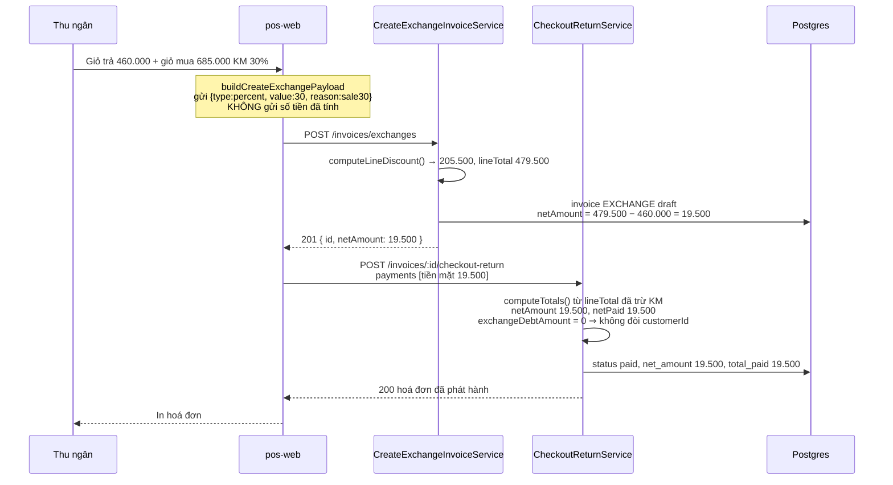
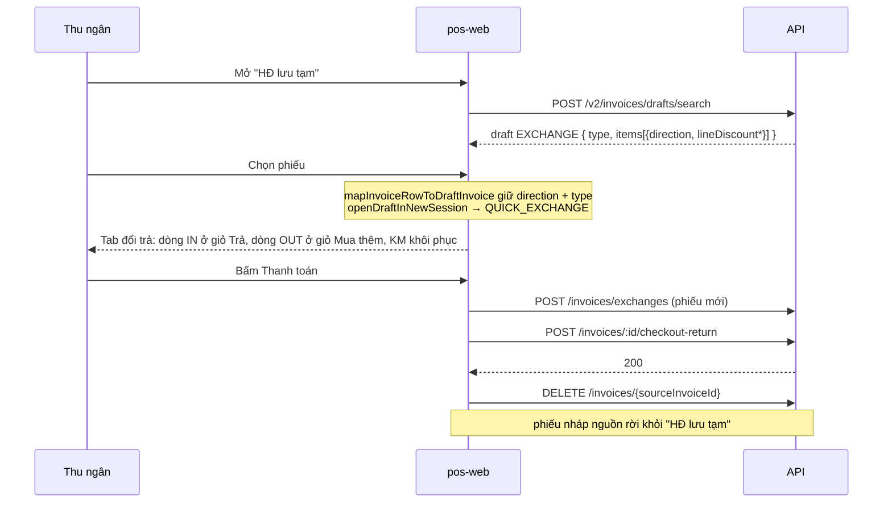

# Logical design — KM theo dòng trên đơn đổi trả nhanh

## Approach

Ba đường sửa độc lập, mỗi đường bịt một mắt xích của chuỗi lỗi đã xảy ra:

1. **Một công thức KM dòng duy nhất.** `InvoiceService.computeLineDiscount` (đang là
   private, chỉ luồng SALE dùng) được tách thành util dùng chung. FE gửi bộ ba
   `{lineDiscountType, lineDiscountValue, lineDiscountReason}` — **không gửi số tiền đã tính** —
   và BE tự suy ra `lineDiscount` + `lineTotal` cho mọi loại chứng từ. `returnSubtotal`,
   `newSubtotal`, `netAmount` do đó luôn tính trên số đã trừ KM.
2. **Khôi phục phiếu nháp giữ đúng chiều.** `mapInvoiceRowToDraftInvoice` chuyển tiếp
   `direction` của từng dòng và `type` của phiếu; `openDraftInNewSession` dựng tab theo
   `checkoutVariant` suy từ `type` thay vì luôn rơi về SALE.
3. **Lưới an toàn ở BE.** `/invoices/:id/checkout` từ chối mọi draft `type != SALE`, nên kể
   cả khi FE còn đường vòng (tab cũ trong localStorage, client khác) thì DB vẫn không sinh
   được hoá đơn EXCHANGE có `net_amount` mồ côi.

Đường 1 sửa nguyên nhân gốc (HTTP 400 trong ảnh). Đường 2 và 3 sửa hậu quả (`2608260051`).
Ba đường không phụ thuộc nhau nên chạy song song được.

## Alternatives rejected

| Option | Why not |
| --- | --- |
| FE tự tính số tiền KM rồi gửi `lineDiscount` (amount) | Hai nguồn sự thật cho cùng một con số; lệch làm tròn giữa FE và BE là đúng loại lỗi đang phải sửa hôm nay, chỉ đổi hình dạng |
| Gộp `POST /invoices/exchanges` + `POST /invoices/:id/checkout-return` thành một endpoint atomic | Diệt tận gốc phiếu nháp mồ côi, nhưng phá hợp đồng 2-call mà `use-checkout-actions` và ticket `quick-exchange-single-invoice` đang dựa vào; vượt xa ngưỡng "small bolts". Để lại cho epic sau |
| Chỉ recompute `netAmount` trong `InvoiceService.update()` | Vá triệu chứng: phiếu EXCHANGE vẫn được bán qua luồng SALE, chỉ là con số nhìn đẹp hơn |
| Lọc `type = SALE` khỏi danh sách "HĐ lưu tạm" | A-02 đã loại: thu ngân mất luôn đường mở lại phiếu đổi trả bỏ dở, phiếu nháp tích tụ âm thầm trong DB |
| Xoá draft ngay khi `checkout-return` lỗi | Mất giỏ hàng thu ngân vừa quét; A-02 chọn hướng giữ + khôi phục |

## Domain model

Không thêm/sửa entity, không migration — ba cột đã tồn tại trên `invoice_items`.

| Trường | Nơi lưu | Ghi chú |
| --- | --- | --- |
| `line_discount` | `invoice_items` | Số tiền KM đã tính, **do BE ghi**, không nhận thẳng từ client khi có `type` |
| `line_discount_type` / `_value` / `_reason` | `invoice_items` | `percent` \| `amount`; nguồn sự thật để dựng lại `CartLineDiscount` khi khôi phục phiếu nháp |
| `line_total` | `invoice_items` | `quantity × unit_price − line_discount`; là số duy nhất mà `computeTotals`/`computeReturnedNet` đọc |
| `net_amount` | `invoices` | `newSubtotal − returnedNet`, cả hai vế đã trừ KM sau khi sửa |
| `direction` | `invoice_items` | `IN` (trả) \| `OUT` (mua thêm) — mắt xích bị đánh rơi khi khôi phục phiếu nháp |

## Contracts

### POST /invoices/exchanges

`newLines[]` (`CreateInvoiceItemDto`) — **đã có sẵn** ba field KM, chỉ thiếu FE gửi và
service đọc. `returnLines[]` (`ReturnInvoiceLineDto`) — thêm ba field, tất cả `@IsOptional()`:

```json
{
  "returnLines": [{ "itemId": "…", "quantity": 1, "unitPrice": 500000,
                    "lineDiscountType": "percent", "lineDiscountValue": 10, "lineDiscountReason": "sale10" }],
  "newLines":    [{ "itemId": "…", "quantity": 1, "unitPrice": 685000,
                    "lineDiscountType": "percent", "lineDiscountValue": 30, "lineDiscountReason": "sale30" }]
}
```

Failure modes: 400 `lineDiscountValue is required and must be >= 0 when lineDiscountType is set`;
400 `lineDiscountValue must be <= 100 for percent discounts`.

### POST /invoices/returns

`lines[]` nhận cùng ba field, cùng ràng buộc.

### POST /invoices/:id/checkout

Thêm một lý do từ chối: draft có `type != SALE` → 400 `INVOICE_NOT_CHECKOUTABLE`.
Phiếu không đổi trạng thái, không tiêu số chứng từ.

## State ownership

| State | Owner | Lifetime |
| --- | --- | --- |
| Giỏ trả / giỏ mua thêm | `checkout-session.store` (`InvoiceSession`) | Theo tab, persist localStorage |
| `CartLine.lineDiscount {type,value,reason}` | `checkout-session.store` | Theo tab; gửi nguyên bộ ba lên BE mỗi lần tạo phiếu |
| `sourceInvoiceId` | `InvoiceSession` | Theo tab; chỉ có khi tab mở từ "HĐ lưu tạm" |
| `checkoutVariant` | `InvoiceSession` | Theo tab; sau khi sửa được suy từ `invoice.type` khi khôi phục |
| Số tiền KM đã tính, `lineTotal`, `netAmount` | Backend | Chứng từ; FE chỉ hiển thị |

## Error taxonomy

| Condition | Failure subtype | UI |
| --- | --- | --- |
| Có `lineDiscountType` nhưng thiếu/âm `lineDiscountValue` | `BadRequestException` (400) | Toast đỏ, giữ nguyên giỏ hàng |
| `percent` > 100 | `BadRequestException` (400) | Toast đỏ |
| Đơn đổi net > 0, thu thiếu, không có `customerId` | `BadRequestException` (400) — thông điệp hiện tại | Toast đỏ. Sau khi sửa chỉ còn xảy ra khi thu ngân **thực sự** thu thiếu, không phải do KM bị đánh rơi |
| `checkout` trên draft `type != SALE` | `BadRequestException` code `INVOICE_NOT_CHECKOUTABLE` (400) | Toast đỏ; phiếu vẫn nằm trong "HĐ lưu tạm" để mở lại đúng luồng |
| `checkout-return` lỗi bất kỳ (mạng, tồn kho, tài khoản) | Toast đỏ; phiếu nháp EXCHANGE ở lại "HĐ lưu tạm" | Thu ngân mở lại → tab đổi trả đúng chiều (UOW-02) |

## Luồng tất toán đổi trả nhanh sau khi sửa



## Luồng khôi phục phiếu nháp đổi trả



## Observability

- `CreateExchangeInvoiceService` đã log `returnSubtotal=… newSubtotal=… net=…` mỗi lần tạo
  draft — sau khi sửa, ba số này phải khớp số POS hiển thị; đây là dấu vết rẻ nhất để đối
  chiếu khi có khiếu nại.
- Guard mới ở `/checkout` log kèm `invoiceId` và `type` bị từ chối: một cụm log này xuất
  hiện nghĩa là còn client cũ đang chạy đường vòng.

## ADRs

### ADR-01 — Backend là nơi duy nhất tính tiền KM dòng
**Context:** Bug hôm nay sinh ra vì FE hiển thị 479.500 còn payload nói 685.000. Bất kỳ
thiết kế nào để hai bên cùng tính đều tái tạo lại được lỗi này.
**Decision:** Client gửi *ý định* (`type`, `value`, `reason`); server tính `lineDiscount`
và `lineTotal` bằng `computeLineDiscount` dùng chung cho SALE / EXCHANGE / RETURN. Trường
`lineDiscount` (amount) do client gửi bị bỏ qua khi có `lineDiscountType` — giữ nguyên
quy ước sẵn có của luồng SALE.
**Consequences:** FE không hiển thị được số cuối cùng trước khi gọi API (đã đúng như hiện
tại: FE tính để hiển thị, BE tính để lưu). Đổi lại chỉ còn một công thức phải test.
**Status:** accepted

### ADR-02 — Chặn ở `/checkout`, không chỉ sửa phía FE
**Context:** Hoá đơn `2608260051` hỏng vì một draft EXCHANGE đi lọt qua luồng bán thường.
FE là nơi phát sinh, nhưng không phải nơi duy nhất có thể phát sinh.
**Decision:** Thêm guard `type === SALE` ở cả `checkout-invoice.service.ts` (v1) và
`load-draft.step.ts` (saga v2), trả 400 `INVOICE_NOT_CHECKOUTABLE`.
**Consequences:** Nếu còn tab POS cũ trong localStorage trỏ tới draft EXCHANGE, thu ngân
sẽ gặp lỗi thay vì âm thầm tạo hoá đơn sai — đúng đánh đổi mong muốn.
**Status:** accepted

### ADR-03 — Khôi phục phiếu nháp đổi/trả, và xoá phiếu nguồn sau khi tất toán
**Context:** A-02 chọn giữ phiếu nháp. Nhưng luồng đổi trả luôn tạo phiếu mới bằng
`POST /invoices/exchanges`, nên nếu chỉ khôi phục mà không dọn, mỗi lần mở lại sẽ đẻ thêm
một phiếu nháp mồ côi nữa.
**Decision:** Tab khôi phục giữ `sourceInvoiceId`; sau khi `checkout-return` trả 200, FE
gọi `DELETE /invoices/{sourceInvoiceId}`. Xoá thất bại chỉ log, không chặn — hoá đơn thật
đã phát hành xong.
**Consequences:** Phiếu nháp nguồn biến mất khỏi "HĐ lưu tạm" sau khi bán xong (A-07).
Nếu DELETE lỗi, hậu quả xấu nhất là một phiếu nháp thừa — thu ngân bấm × xoá tay được.
**Status:** accepted
