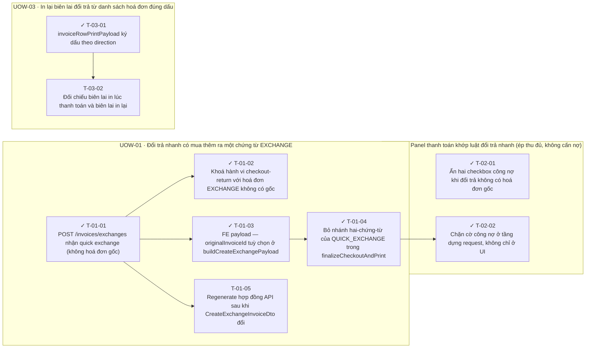

<!-- GENERATED by scripts/uow_graph.py — do not edit by hand -->

# Ticket graph — quick-exchange-single-invoice

- Units of Work: **3**
- Tickets: **9** (7 done)
- Total effort: **2.9d**
- Critical path: **1.4d** across 4 tickets
- Theoretical minimum duration with unlimited parallelism: **1.4d**

## Units of Work

| UoW | Title | Risk | Effort | Elapsed | Depends on | Status |
|-----|-------|------|--------|---------|-----------|--------|
| UOW-01 | Đổi trả nhanh có mua thêm ra một chứng từ EXCHANGE | medium | 1.6d | 1.1d | — | todo |
| UOW-02 | Panel thanh toán khớp luật đổi trả nhanh (ép thu đủ, không cấn nợ) | low | 4h | 2h | UOW-01 | todo |
| UOW-03 | In lại biên lai đổi trả từ danh sách hoá đơn đúng dấu | low | 6h | 6h | UOW-01 | todo |

Effort is total person-hours. Elapsed is the longest dependency chain inside the
slice — the floor on how fast it can finish no matter how many people work on it.

## Dependency graph

## Execution waves

Tickets in the same wave have no dependency between them and can run in parallel.

| Wave | Tickets | Parallel capacity | Wave duration (longest ticket) |
|------|---------|-------------------|-------------------------------|
| W1 | T-01-01, T-02-01, T-03-01 | 3 | 4h |
| W2 | T-01-02, T-01-03, T-01-05, T-03-02 | 4 | 3h |
| W3 | T-01-04 | 1 | 4h |
| W4 | T-02-02 | 1 | 2h |

## Write-conflict hazards

None: every pair that writes a shared path is ordered by a dependency.

## Critical path

T-01-01 → T-01-03 → T-01-04 → T-02-02

Total: **1.4d**. Shortening the plan means shortening this chain;
adding people to tickets off this path will not make the feature ship sooner.

## Tickets

| ID | UoW | Layer | Type | Est | Depends on | Verifies | Status |
|----|-----|-------|------|-----|-----------|----------|--------|
| T-01-01 | UOW-01 | api | feature | 3h | — | AC-01, AC-05, AC-07 | done |
| T-01-02 | UOW-01 | test | test | 3h | T-01-01 | AC-02, AC-03, AC-06, AC-08, AC-09 | done |
| T-01-03 | UOW-01 | frontend | feature | 2h | T-01-01 | AC-01 | done |
| T-01-04 | UOW-01 | frontend | refactor | 4h | T-01-03 | AC-01, AC-02, AC-03, AC-04, AC-12 | done |
| T-01-05 | UOW-01 | shared | chore | 1h | T-01-01 | AC-07 | todo |
| T-02-01 | UOW-02 | frontend | feature | 2h | — | AC-10, AC-11 | done |
| T-02-02 | UOW-02 | frontend | feature | 2h | T-01-04 | AC-10, AC-11 | done |
| T-03-01 | UOW-03 | frontend | feature | 4h | — | AC-13, AC-14 | done |
| T-03-02 | UOW-03 | test | test | 2h | T-03-01 | AC-13, AC-14 | todo |
