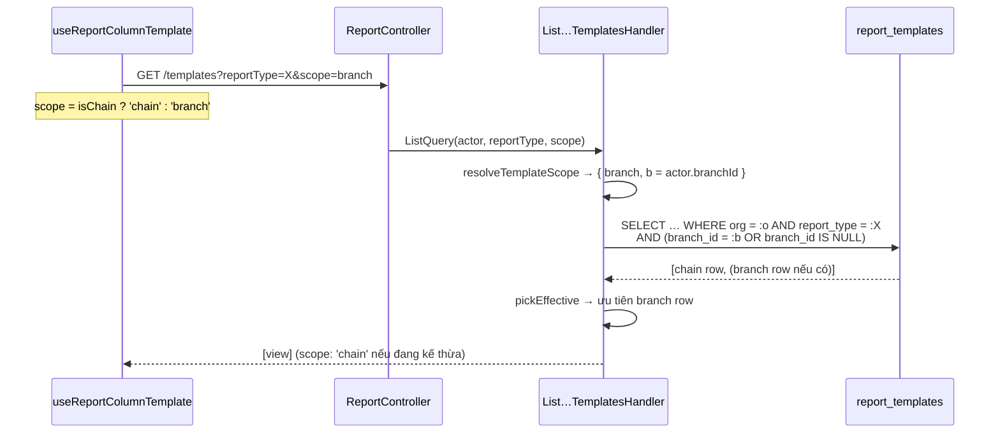
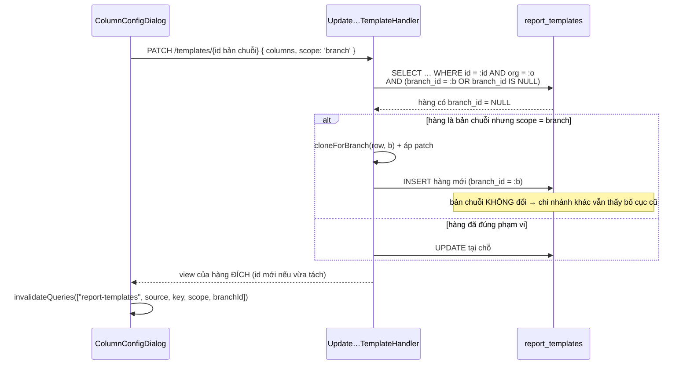
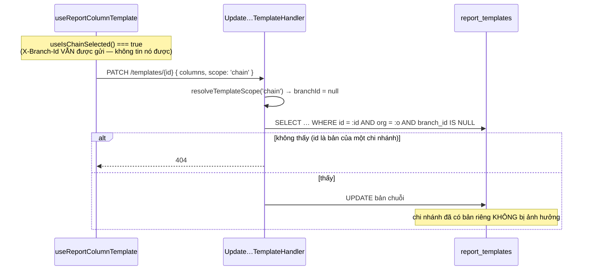
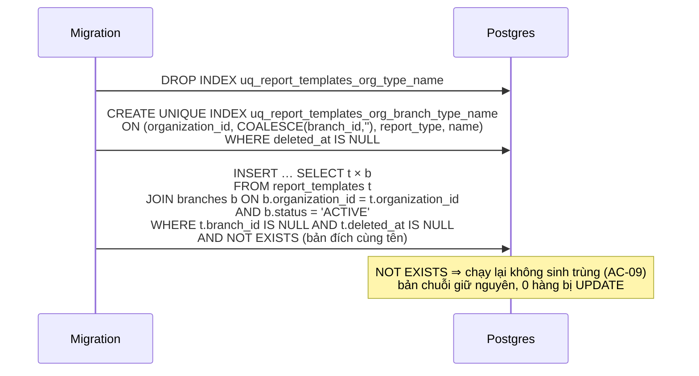

# Logical design — Lưu cấu hình cột báo cáo theo từng chi nhánh

## Approach

`report_templates` giữ nguyên hình dạng; thứ đổi là **khoá phạm vi**. Cột `branch_id` mà
`BaseEntity` đã sinh sẵn nhưng chưa ai ghi trở thành cột phân tầng:

- `branch_id IS NULL` → **bản chuỗi**: mặc định của tổ chức, mọi chi nhánh chưa cấu hình
  đều đọc được.
- `branch_id = <id>` → **bản chi nhánh**: đè lên bản chuỗi cho đúng chi nhánh đó.

Đọc là "chi nhánh trước, chuỗi sau" trong **một** câu SELECT (`branch_id = :b OR branch_id
IS NULL`) rồi chọn ưu tiên trên RAM — hợp với lối `prefer in-memory aggregation` của repo và
giữ NFR một-truy-vấn. Ghi luôn ghi vào đúng tầng mà client khai bằng `scope`.

Hai mươi handler của bốn miền (invoice / inventory / debt / profit) hiện **giống nhau đến
từng dòng** và đều chỉ lọc `organizationId`. Thay vì sửa 20 chỗ theo 20 cách, phạm vi được
gom vào một module dùng chung `modules/reporting/report-core/template-scope.ts`; mỗi handler
đổi 1–3 dòng để gọi nó. Đây là trừu tượng dùng 20 lần, không phải trừu tượng dự phòng.

## Alternatives rejected

| Option | Why not |
| ------ | ------- |
| Bỏ hẳn bản chuỗi, `branch_id` NOT NULL | Ngay sau deploy mọi chi nhánh mất bố cục cho tới khi backfill xong; và chi nhánh mở sau này không có gì để kế thừa (A-01, A-04) |
| Server tự suy "đang xem chuỗi" từ request | Không suy được: `api-axios` luôn đính `X-Branch-Id` từ `active_branch_id`, và `ActorContext` còn ưu tiên `branchId` trong JWT trước header (A-11 bị bác) |
| Tự nhân bản khi chi nhánh mở báo cáo lần đầu | Biến GET thành có ghi; phải chống đua khi nhiều người mở cùng lúc — đổi lấy việc bỏ được một khối SQL trong migration là lỗ |
| Consumer nghe `branch.created` để gieo sẵn | Thêm một consumer phải dedupe qua `processed_events` cho một việc mà fallback đã lo (A-04) |
| Script CLI đứng riêng, chạy lặp được | Người dùng chọn "một lần trong migration" (A-03). Đánh đổi đã biết: mở chi nhánh mới thì hoặc bấm Lưu, hoặc chạy tay khối SQL trong migration |
| Sửa từng handler trong 4 miền độc lập | 20 điểm sửa, 4 miền lệch nhau chỉ cần một chỗ quên là rò cấu hình chéo chi nhánh |

## Domain model

| Khái niệm | Biểu diễn | Ghi chú |
| --------- | --------- | ------- |
| `TemplateScope` | `'chain' \| 'branch'` | Chỉ tồn tại ở tầng hợp đồng; DB chỉ biết `branch_id` NULL hay không |
| Bản chuỗi | `report_templates` với `branch_id IS NULL` | Mặc định kế thừa được; chỉ sửa được ở chế độ "Xem theo chuỗi" |
| Bản chi nhánh | `report_templates` với `branch_id = <id>` | Đè bản chuỗi cùng `(reportType, name)` |
| `ResolvedScope` | `{ scope, branchId: string \| null }` | Kết quả của `resolveTemplateScope(scope, actor)` |

## Contracts

### `resolveTemplateScope(scope: TemplateScope | undefined, actor): ResolvedScope`

```
scope === 'chain'              → { scope: 'chain',  branchId: null }
scope === 'branch'             → { scope: 'branch', branchId: actor.branchId }
                                 ↳ actor.branchId rỗng ⇒ 400 BadRequest
scope === undefined            → 'branch' nếu actor.branchId có, ngược lại 'chain'
```

### Vị từ kho dữ liệu dùng chung (`report-core/template-scope.ts`)

| Hàm | Vị từ | Dùng ở |
| --- | ----- | ------ |
| `readScopeWhere(actor, resolved)` | `scope=branch` → `organizationId = :o AND (branchId = :b OR branchId IS NULL)`; `scope=chain` → `organizationId = :o AND branchId IS NULL` | list, get |
| `pickEffective(rows, resolved)` | gom theo `(reportType, name)`, ưu tiên hàng có `branchId` khớp, không có thì lấy hàng `branchId = null` | list |
| `writeScopeWhere(actor, resolved)` | `organizationId = :o AND branchId = :b` (`b` có thể là NULL, so bằng `IS NULL`) | update (đích), delete |
| `cloneForBranch(row, branchId, userId)` | dựng entity mới sao y `columns/filters/description/sortOrder`, gắn `branchId` | update copy-on-write |

### HTTP — áp cho cả 4 bộ route `/reports/{invoices,inventory,debts,profit}/templates`

```
GET    /templates?reportType=<key>&scope=chain|branch
GET    /templates/:id?scope=chain|branch
POST   /templates            body: { …, scope?: 'chain'|'branch' }
PATCH  /templates/:id        body: { …, scope?: 'chain'|'branch' }
DELETE /templates/:id?scope=chain|branch
```

`scope` là **tuỳ chọn** trong DTO: client cũ không gửi vẫn chạy, rơi về mặc định ở bảng
trên. Response `InvoiceReportTemplateView` thêm hai trường đọc-được:

```json
{ "…": "…", "scope": "chain" | "branch", "branchId": "<uuid>" | null }
```

## Flows

### 1. Đọc — chi nhánh kế thừa bản chuỗi (AC-03)



### 2. Lưu lần đầu ở chi nhánh đang kế thừa — copy-on-write (AC-04)



### 3. Lưu ở chế độ "Xem theo chuỗi" (AC-05)



### 4. Migration — nhân bản chuỗi → chi nhánh (AC-08, AC-09)



## Error taxonomy

| Điều kiện | Mã | Thông điệp |
| --------- | -- | ---------- |
| `scope=branch` mà `actor.branchId` rỗng | 400 | `Branch scope requires an active branch` |
| PATCH/DELETE trúng id của chi nhánh **khác** | 404 | `<Domain> report template not found` (giữ nguyên chuỗi cũ) |
| DELETE bản chuỗi từ ngữ cảnh chi nhánh | 404 | như trên — bản chuỗi không xoá được từ chi nhánh (AC-06) |
| Trùng `(org, branch, reportType, name)` còn sống | 409 | `Template name already exists` (giữ nguyên) |
| Cột không nằm trong catalog | 400 | `Unknown report columns` (không đổi) |

## State ownership

| State | Owner | Lifetime |
| ----- | ----- | -------- |
| `scope` hiện hành | `useIsChainSelected()` (zustand `bo-active-branch`) | Toàn app, persist localStorage |
| `branchId` hiện hành | `useBranchStore` + `localStorage.active_branch_id` | Toàn app; đổi chi nhánh gọi `window.location.reload()` nên cache TanStack rụng sạch |
| Template đang áp | TanStack Query `["report-templates", source, backendKey, scope, branchId]` | Màn báo cáo, `staleTime` 60s |

## Cache & offline

Không có offline. Điểm cần nhớ: `queryKey` phải mang `scope` **và** `branchId`; tuy đổi chi
nhánh có reload trang, chuyển giữa "Xem theo chuỗi" ↔ "Xem theo chi nhánh" trong `BranchSelector`
cũng đi qua `moveTo()` (có reload), nhưng `setView()` thì **không** reload — nên khoá cache
phải tự phân biệt, không dựa vào reload.

## ADRs

### ADR-01 — Phạm vi hai tầng (chi nhánh đè chuỗi), không phải một tầng chi nhánh
**Context:** Đang có dữ liệu cấu hình cấp chuỗi chạy thật; đổi thẳng sang chỉ-chi-nhánh làm mọi chi nhánh trông như bị reset.
**Decision:** `branch_id IS NULL` giữ nghĩa "mặc định chuỗi"; đọc là chi-nhánh-trước-chuỗi-sau.
**Consequences:** Mọi truy vấn đọc phải mang mệnh đề `OR branch_id IS NULL`; đổi lại không có bước di dữ liệu bắt buộc và chi nhánh mới luôn có cái để kế thừa.
**Status:** accepted

### ADR-02 — `scope` do client khai tường minh
**Context:** Backoffice có chế độ "Xem theo chuỗi" nhưng `api-axios` vẫn đính `X-Branch-Id` từ `active_branch_id`, và `ActorContext` ưu tiên `branchId` trong JWT trước header.
**Decision:** Thêm `scope: 'chain' | 'branch'` vào query/DTO của cả 4 miền; server không đoán.
**Consequences:** Đổi hợp đồng ⇒ phải chạy `openapi:generate`. Client cũ không gửi `scope` vẫn chạy nhờ mặc định suy từ `actor.branchId`.
**Status:** accepted

### ADR-03 — PATCH lên bản chuỗi ở ngữ cảnh chi nhánh là copy-on-write, không phải lỗi
**Context:** FE lấy `data[0]` rồi PATCH thẳng id đó. Chi nhánh đang kế thừa thì `data[0]` chính là bản chuỗi — PATCH nguyên trạng sẽ sửa bản chuỗi, đúng cái lỗi đang muốn bỏ.
**Decision:** Handler phát hiện "hàng đích là bản chuỗi + scope là branch" thì CHÈN bản sao cho chi nhánh và trả về hàng mới.
**Consequences:** PATCH có thể trả về `id` khác `id` gửi lên — FE phải đọc id từ response chứ không giữ id cũ. Đổi lại FE không phải tự quyết create-hay-update.
**Status:** accepted

### ADR-04 — Khoá duy nhất dùng `COALESCE(branch_id,'')`, không đổi cột sang NOT NULL
**Context:** Postgres coi hai `NULL` là khác nhau, nên thêm thẳng `branch_id` vào khoá duy nhất sẽ **không** chặn được hai bản chuỗi trùng tên.
**Decision:** `CREATE UNIQUE INDEX … ON (organization_id, COALESCE(branch_id,''), report_type, name) WHERE deleted_at IS NULL`.
**Consequences:** Chỉ mục biểu thức, planner vẫn dùng được vì mọi truy vấn ghi đều so bằng đúng bộ khoá đó. Giữ `branch_id` nullable là điều kiện sống của ADR-01.
**Status:** accepted

### ADR-05 — Gom logic phạm vi vào `report-core/template-scope.ts`
**Context:** 20 handler ở 4 miền giống nhau đến từng dòng, tất cả chỉ lọc `organizationId`.
**Decision:** Một module thuần (không TypeORM decorator) xuất `resolveTemplateScope` / `readScopeWhere` / `pickEffective` / `cloneForBranch`; mỗi handler gọi nó.
**Consequences:** Một điểm sửa cho ngữ nghĩa phạm vi và một điểm để test kỹ; đổi lại `report-core` trở thành phụ thuộc của `modules/inventory-reports` (hiện đã import `ReportTemplateEntity` từ đó nên không thêm cạnh mới).
**Status:** accepted

### ADR-06 — `down()` xoá **mềm** bản theo chi nhánh
**Context:** Revert phải dựng lại chỉ mục `(organization_id, report_type, name)`; nếu còn bản theo chi nhánh thì chỉ mục đó đụng ngay.
**Decision:** `down()` set `deleted_at = now()` cho hàng `branch_id IS NOT NULL` rồi mới dựng lại chỉ mục cũ (chỉ mục cũ có `WHERE deleted_at IS NULL` nên hàng xoá mềm không tính).
**Consequences:** Revert không phá dữ liệu người dùng; chạy `up` lại thì `NOT EXISTS` bỏ qua hàng đã xoá mềm… nên `NOT EXISTS` phải **không** lọc `deleted_at` ở nhánh đích, nếu không sẽ chèn trùng với hàng đã xoá mềm và đụng chỉ mục — xem T-01-01.
**Status:** accepted

### ADR-07 — Nhân bản nằm trong migration, chấp nhận không dùng lại được
**Context:** Người dùng chọn "một lần trong migration" thay vì script CLI (A-03).
**Decision:** Khối `INSERT … SELECT` idempotent nằm ngay trong migration `up()`.
**Consequences:** Chi nhánh mở sau ngày deploy không được gieo sẵn — rơi về kế thừa chuỗi (A-04), muốn tách bản riêng thì bấm Lưu một lần. Nếu sau này cần chạy lại cho một tổ chức cụ thể thì copy khối SQL đó ra chạy tay; nó viết idempotent sẵn cho tình huống đó.
**Status:** accepted
