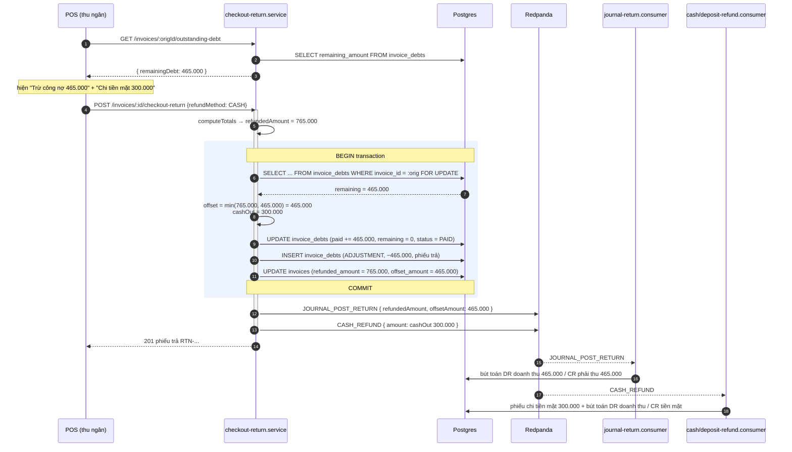

# Logical design — Tách khoản hoàn giữa công nợ và tiền chi ra

## Approach

Một câu: **`refundMethod` thôi không còn quyết định số phận của cả khoản hoàn.** Nó chỉ
còn trả lời "phần tiền *còn lại* chi qua quỹ nào". Việc cấn trừ công nợ trở thành khoản
khấu trừ **đầu tiên và bắt buộc**, tính trong cùng transaction, không do người dùng bật.

```
offsetAmount = min(refundedAmount, dư nợ hoá đơn gốc)     ← luôn chạy, có khoá
cashOutAmount = refundedAmount − offsetAmount              ← chi qua quỹ thu ngân chọn
```

### Vì sao không cần trần theo "số tiền đã thực thu" (chứng minh cho A-06)

`invoice_debts` được dựng lúc checkout bằng đúng phần chưa thu:

```
debt.originalAmount = amountDue − totalPaid(lúc checkout)
debt.remaining      = debt.originalAmount − debt.paidAmount    (paidAmount = Σ trả nợ sau này)
```

Suy ra, với `D = amountDue`, `R = debt.remaining`:

```
đã thực thu = totalPaid(lúc checkout) + Σ debt_payments
            = (D − debt.originalAmount) + debt.paidAmount
            = D − (debt.originalAmount − debt.paidAmount)
            = D − R
```

Nghĩa là **dư nợ đã mang sẵn thông tin "khách đã trả bao nhiêu"**, không cần chạm vào
`invoices.total_paid` (đang đóng băng) hay quét `debt_payments`. Với `r = refundedAmount`
và `r ≤ D` (bất biến của `returnedNet` — trả toàn bộ rơi đúng vào `amountDue`):

```
cashOut = r − min(r, R)
        = max(0, r − R)
        ≤ max(0, D − R)
        = đã thực thu                                        ∎
```

Nhiều lần trả một phần vẫn đúng vì phép lấy `min` là tham lam trên dư nợ giảm dần:
`Σ offset = min(Σr, R₀)` ⟹ `Σ cashOut = Σr − min(Σr, R₀) ≤ D − R₀`. Khách trả thêm nợ
xen giữa hai lần trả hàng chỉ làm `R` giảm và "đã thực thu" tăng tương ứng — bất đẳng
thức không đổi chiều.

Đây là lý do phương án này thay thế được ý tưởng "kẹp theo `total_paid`" đã bị bác ở
`promotion-qa-defects` (A-R1) mà không dựng lại chính cái bẫy đó.

### Thay đổi theo tầng

| Tầng | Tệp | Thay đổi |
|---|---|---|
| infra | migration mới + `pos/entities/invoice.entity.ts` | thêm `invoices.offset_amount numeric(18,2) NOT NULL DEFAULT 0` |
| service | `pos/services/checkout-return.service.ts` | bỏ `wantsOffset`/`canOffset`/`effectiveRefundMethod`; luôn `lockOriginalDebt()`; tính `offsetAmount` + `cashOutAmount`; `needsCashFund`/`needsDeposit` bám `cashOutAmount > 0`; `validateRefundMatrix` bỏ nhánh OFFSET do client gửi |
| service | `pos/services/checkout-return.service.ts` (`offsetOriginalDebt`) | thêm `lock: pessimistic_write` + lọc `documentType = CREDIT_INVOICE`; nhận sẵn `offsetAmount` đã tính thay vì tự `min` |
| api | `pos/dto/checkout-return.dto.ts` | `refundMethod = OFFSET` từ client được xem như `CASH` (tương thích ngược, không 400) |
| consumer | `accounting/consumers/journal-return.consumer.ts` + `publishers/journal-return.publisher.ts` | payload thêm `offsetAmount`; chân "DR doanh thu / CR phải thu" chạy khi `offsetAmount > 0` thay vì khi `refundMethod = OFFSET`; số tiền là `offsetAmount`, không phải `refundedAmount` |
| service | `pos/services/checkout-return.service.ts` (`fanOutEvents`) | `CASH_REFUND` / `DEPOSIT_REFUND` phát với `cashOutAmount` và chỉ khi `> 0` |
| service | `pos/services/cancel-return.service.ts` | `restoreOriginalDebt` bỏ điều kiện `refundMethod === OFFSET` (dựa vào dòng ADJUSTMENT); `buildCollectionLegs` thu lại `refundedAmount − offsetAmount` |
| api | `pos/controllers/*` + `return-eligibility.service.ts` | endpoint mới `GET /invoices/:id/outstanding-debt` → `{ remainingDebt }` |
| web | `pos-web` PaymentSection, `returnInvoicePayloadMapper`, `use-checkout-payment` | hiện "Trừ công nợ" + "Chi tiền mặt/CK"; gỡ `RefundToDebtRow`; không gửi `OFFSET` nữa |

## Luồng



Nhánh `cashOut = 0` (AC-05, AC-02): bước `CASH_REFUND` không phát, không phiếu chi.
Nhánh không có dòng công nợ (AC-03, AC-04): `offset = 0`, `cashOut = refundedAmount`,
`journal-return` không sinh chân phải thu — y hệt hành vi hiện tại.

## Alternatives rejected

| Phương án | Vì sao loại |
|---|---|
| **Kẹp khoản hoàn theo `invoices.total_paid`** | `total_paid` đóng băng lúc checkout; hoá đơn bán chịu đã trả hết vẫn đọc 0 → hoàn 0đ cho khách sòng phẳng. Chính là A-R1 đã bị bác ở `promotion-qa-defects` |
| **Kẹp theo `total_paid + Σ debt_payments` rồi vẫn chi tiền mặt** | Đúng số chi nhưng **không** giảm công nợ: cửa hàng nhận hàng về mà vẫn treo nợ 465.000 trên hàng đó. Chỉ chữa nửa lỗi, lại phải quét thêm một bảng mà §Bất biến cho thấy là thừa |
| **Chặn cứng 400 khi chi vượt số thực thu** | Akenzy loại ở vòng hỏi G0: đẩy việc suy luận sang thu ngân giữa giờ cao điểm, và không nói được họ phải làm gì tiếp |
| **Giữ ô "Tính vào công nợ" làm override toàn phần** | Vẫn còn đúng một cú click làm mất tiền; ô này chính là nguồn của cả hai chiều lỗi. Akenzy chọn bỏ hẳn |
| **Đẩy phần chênh thành store credit thay vì chi tiền** | POS không có luồng phát hành/tiêu store credit; `returnInvoicePayloadMapper` chưa từng emit `STORE_CREDIT`. Sẽ là tính năng mới, không phải bản vá lỗi mất tiền |
| **Suy `offsetAmount` từ `invoice_debts` thay vì lưu cột riêng** | Đọc được nhưng phải join mỗi lần in phiếu / dựng báo cáo, và dòng ADJUSTMENT có thể bị huỷ phiếu ghi đè — mất nguồn sự thật cho `cancel-return` |
| **Thêm `remainingDebt` vào response `GET /invoices/:id/eligible-returns`** | Đang trả `EligibleLine[]`; đổi thành object là phá hợp đồng với POS đang chạy. Endpoint nhỏ riêng rẻ hơn |

## Contracts

Hợp đồng thay đổi:

- `POST /invoices/:id/checkout-return` — body giữ nguyên; `refundMethod = OFFSET` trở thành alias của `CASH`. Response bổ sung `offsetAmount`.
- `GET /invoices/:id/outstanding-debt` — mới, trả `{ remainingDebt: number }`.
- Sự kiện `JOURNAL_POST_RETURN` — payload bổ sung `offsetAmount` (mặc định 0 với sự kiện cũ).
- Sự kiện `CASH_REFUND` / `DEPOSIT_REFUND` — `amount` đổi nghĩa từ `refundedAmount` sang `cashOutAmount`; chỉ phát khi `> 0`.

## Error taxonomy

| Mã / tình huống | Nguyên nhân | Xử lý | HTTP |
|---|---|---|---|
| Không lấy được khoá dòng công nợ (`lock_timeout`) | Phiếu thu nợ đang chạy đồng thời trên cùng hoá đơn | Không nuốt lỗi — trả 409 "Hoá đơn gốc đang được cập nhật công nợ, thử lại" | 409 |
| `remaining_amount < 0` (dữ liệu bẩn) | Sai sót lịch sử | Coi như 0, `logger.warn`, vẫn chi đủ — không tự sửa số cũ (A-05) | 201 |
| `offsetAmount > 0` nhưng thiếu tài khoản phải thu | Org chưa cấu hình `RECEIVABLE` | Fail nhanh **trước** transaction, thông báo cấu hình thiếu | 400 |
| Client cũ gửi `refundMethod = OFFSET` | Bản POS chưa cập nhật | Xem như `CASH` (tách tự động cho kết quả đúng), không 400 | 201 |
| `journal-return` nhận `offsetAmount > 0` mà thiếu `receivableAccountId` | Publisher lỗi | `throw` → DLQ, đã có cơ chế | — |
| POS không lấy được `remainingDebt` | Mạng / endpoint lỗi | Ẩn khối tách, vẫn cho xác nhận — BE mới là nguồn sự thật; không chặn bán hàng | — |
| Huỷ phiếu trả đã cấn trừ nhưng khách đã trả thêm nợ sau đó | `debt.paidAmount` đã đổi | Giữ nguyên cơ chế hiện có của `restoreOriginalDebt` (cộng/trừ theo dòng ADJUSTMENT), không khoá theo trạng thái | 201 |

---

### ADR-01 — `refundMethod` chỉ còn mô tả quỹ chi phần còn lại

**Status:** accepted
**Context:** `refundMethod` đang là một enum duy nhất quyết định *toàn bộ* khoản hoàn:
CASH chi hết, OFFSET cấn trừ hết. Không có cách biểu diễn "vừa cấn vừa chi", nên mọi ca
hoá đơn còn nợ đều sai một trong hai chiều (mất tiền cửa hàng hoặc nuốt tiền khách).
**Decision:** `refundMethod` giữ nguyên kiểu nhưng đổi nghĩa: **quỹ chi phần
`cashOutAmount`**. Khoản cấn trừ tách ra thành đại lượng độc lập `offsetAmount`, luôn
được tính, không do client điều khiển. Giá trị `OFFSET` do client gửi được xem như `CASH`
để tương thích ngược với POS chưa cập nhật.
**Consequences:** `journal-return` và `cancel-return` không được phân nhánh theo
`refundMethod` nữa (chúng đang làm vậy — sửa trong UOW-01/UOW-02). Bản ghi lịch sử mang
`refundMethod = OFFSET` vẫn đọc đúng vì `offset_amount` mặc định 0 và dòng ADJUSTMENT vẫn
là nguồn sự thật cho việc huỷ.

### ADR-02 — Lưu `invoices.offset_amount` thay vì suy lại từ công nợ

**Status:** accepted
**Context:** Phiếu in, báo cáo và `cancel-return` đều cần biết một phiếu trả đã cấn trừ
bao nhiêu. Có thể suy từ dòng `invoice_debts` ADJUSTMENT, nhưng dòng đó có thể bị vòng
đời huỷ phiếu tác động.
**Decision:** Thêm cột `invoices.offset_amount numeric(18,2) NOT NULL DEFAULT 0`, ghi
trong cùng transaction với `refunded_amount`. `refunded_amount` giữ nguyên nghĩa = tổng
khoản hoàn; `cashOut = refunded_amount − offset_amount`.
**Consequences:** Một migration viết tay (theo quy ước repo: không dùng
`migration:generate`). Dữ liệu cũ mặc định 0 → mọi phiếu lịch sử đọc ra "chi toàn bộ",
đúng với hành vi khi đó.

### ADR-03 — Khoá bi quan dòng công nợ khi tính khoản cấn trừ

**Status:** accepted
**Context:** `offsetOriginalDebt` hiện `findOne` không khoá rồi ghi đè `paidAmount`. Một
phiếu thu nợ chạy song song có thể làm mất bản cập nhật hoặc đẩy `remaining` xuống âm.
`cancel-return.restoreOriginalDebt` đã dùng `pessimistic_write` — hai đường đang lệch nhau.
**Decision:** Đọc dòng công nợ với `lock: { mode: 'pessimistic_write' }` **bên trong**
transaction của checkout, và tính `offsetAmount` sau khi đã có khoá. Lọc thêm
`documentType = CREDIT_INVOICE` để không bao giờ chạm nhầm dòng ADJUSTMENT.
**Consequences:** Có thể timeout khi tranh chấp → 409 (xem error taxonomy). Đổi lại
`offsetAmount` không thể vượt dư nợ thật, kể cả dưới tải quầy.

### ADR-04 — Bút toán phân nhánh theo `offsetAmount`, không theo `refundMethod`

**Status:** accepted
**Context:** `journal-return.consumer` chỉ sở hữu các chân **không** có chứng từ quỹ
tương ứng (store credit, phải thu); chân tiền mặt/ngân hàng do chứng từ quỹ tự post, nếu
post thêm ở đây sẽ trùng bút toán. Hiện nó nhận biết bằng `refundMethod === OFFSET` và
dùng **toàn bộ** `refundedAmount`.
**Decision:** Chân "DR doanh thu / CR phải thu" chạy khi `offsetAmount > 0`, với số tiền
đúng bằng `offsetAmount`. Chân tiền vẫn thuộc chứng từ quỹ, số tiền `cashOutAmount`. Một
phiếu tách sinh hai bút toán từ hai nguồn, không chồng nhau.
**Consequences:** Payload `JOURNAL_POST_RETURN` thêm trường `offsetAmount`; consumer phải
chịu được sự kiện cũ không có trường này (mặc định 0 → giữ nhánh `refundMethod` cũ cho
STORE_CREDIT).

### ADR-05 — Endpoint riêng `GET /invoices/:id/outstanding-debt` cho khối xem trước ở POS

**Status:** accepted
**Context:** POS chỉ giữ `originalInvoiceId` trong phiên checkout, không giữ dòng hoá đơn
gốc. Để hiện "Trừ công nợ / Chi tiền mặt" trước khi xác nhận, FE cần dư nợ hiện tại.
`GET /invoices/:id/eligible-returns` đang trả mảng `EligibleLine[]` — đổi shape là phá
hợp đồng.
**Decision:** Thêm endpoint đọc nhỏ `GET /invoices/:id/outstanding-debt` trả
`{ remainingDebt: number }`, scope theo `organizationId`, quyền như các endpoint POS khác.
**Consequences:** Thêm một lượt gọi khi mở màn hình thanh toán của luồng hoàn tiền. Số
hiển thị là *xem trước*: BE tính lại dưới khoá lúc post, nên lệch do đua vẫn ra kết quả
đúng ở chứng từ.

---

## Ghi chú phạm vi

`cancel-return.service` (huỷ **phiếu trả**) nằm trong phạm vi vì chính thay đổi này làm
hai giả định của nó sai. Đây **không** phải `cancel-invoice.service` (huỷ **hoá đơn bán**),
thứ Akenzy đã chốt để ra feature riêng (A-04).
