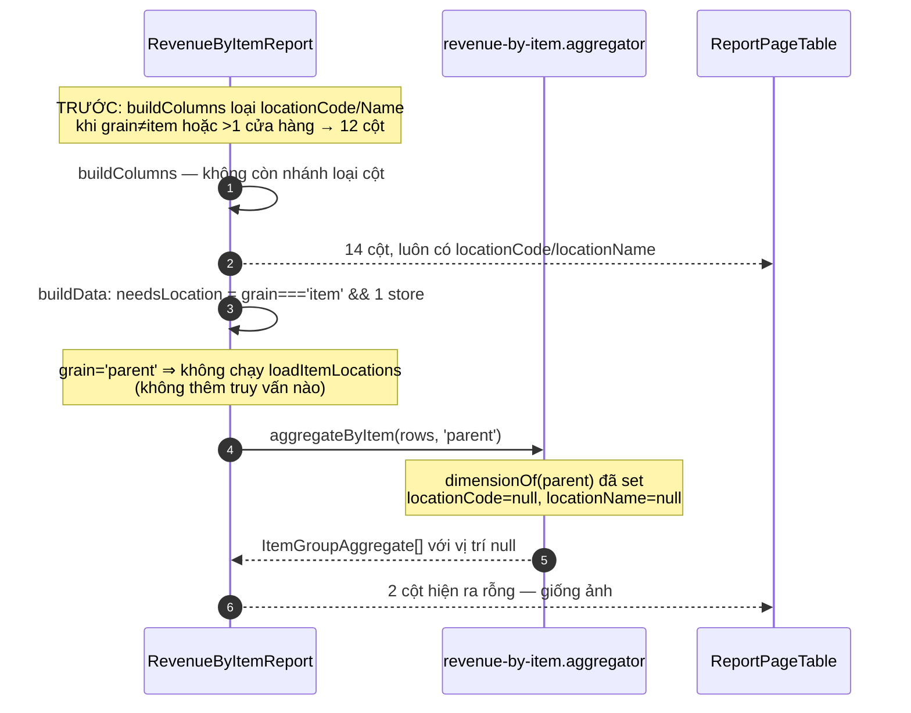

# Logical design — Doanh thu theo mặt hàng: parity cột với MISA

## Approach

Ba thay đổi độc lập, xếp theo độ sâu trong hệ thống, cộng một vòng đối chiếu thật.

**Một, catalog.** `REVENUE_BY_ITEM_COLUMNS` được xếp lại theo thứ tự A→N của MISA và
`buildColumns` bắt đầu trả `desc`. Nhãn riêng của báo cáo này (`Số lượng bán`,
`Đơn giá TB`, `Doanh thu`) không sửa vào map dùng chung mà nằm ở hai map override mới
đặt cạnh nó trong `packages/shared-interfaces` — 3 báo cáo hóa đơn khác đọc cùng map
dùng chung và không được đổi (ADR-01). Điều kiện lọc bỏ 2 cột vị trí theo grain bị bỏ:
cột luôn có, giá trị `null` khi không resolve được (ADR-03). Aggregator không bị chạm —
số liệu đã đúng (A-01).

**Hai, đường dẫn của `desc`.** Hôm nay `desc` chết ở `ReportExportService.resolveColumns`
vì `DocumentColumn` không có field đó. Thêm `desc?: string | null` vào `DocumentColumn`,
cho `resolveColumns` mang nó theo, rồi hai renderer vẽ tiêu đề 2 dòng: `XlsxStreamWriter`
ghi `label\ndesc` trong một ô (`wrapText` đã bật sẵn, chỉ cần tăng chiều cao dòng), và
`renderReportTableHtml` chèn thêm một `<span>` trong `<th>`. Cả hai đọc cùng payload nên
file Excel và trang in không thể lệch nhau (ADR-01 của `export-print`).

**Ba, dòng tham số.** `invoiceFilterSummary` hiện chỉ in filter đang bật, có chủ ý. Feature
này không đổi hàm đó mà thêm một builder riêng cho `revenue-by-item` bên cạnh
(ADR-02), in đủ 6 phần theo MISA kể cả giá trị mặc định. Builder cần tên thật của cửa
hàng và của nhóm hàng hóa nên nó là `async` và nhận 2 repository — khác `invoiceFilterSummary`
vốn là hàm thuần. Đó là lý do nó nằm ở một service riêng chứ không phải một nhánh `if`
trong hàm cũ.

**Bốn, grain `Mẫu mã`.** *(Sửa 2026-07-30, reopen G2 — xem A-20)* FE gửi giá trị đúng
`item|parent|group` sẵn (`STAT_BY_OPTIONS`, không phải `productTemplate` như khảo sát ban
đầu tưởng — chuỗi đó thuộc một filter line khác của báo cáo công nợ nhà cung cấp, không
liên quan). Việc còn lại chỉ ở BE: `GROUP_BY_LABELS_VI` trong export handler bị đảo
ngược so với `resolveGrain` và được sửa lại. Không đổi gì ở FE.

Thứ tự triển khai bị ràng buộc bởi verification, không bởi code: UOW-04 chỉ chạy được
sau khi UOW-03 xong (grain Mẫu mã mở ra) — nhưng UOW-01/02/03 độc lập hoàn toàn với nhau
và chạy song song được.

## Alternatives rejected

| Option | Why not |
|---|---|
| Sửa `INVOICE_REPORT_COLUMN_LABELS_VI` tại chỗ cho gọn | Đổi nhãn `Số lượng`/`Đơn giá`/`Tổng` của 3 báo cáo hóa đơn khác mà không ai yêu cầu (A-13). Vi phạm "touch only what you must" |
| Đặt nhãn tiếng Việt vào `revenue-by-item.columns.ts` cho gần chỗ dùng | Source BE phải là tiếng Anh; nhãn VI sống ở `packages/shared-interfaces` như `PERMISSION_LABELS_VI` và các map hiện có |
| Nhồi ký hiệu vào chính `label` (`"Đơn giá TB (2)=(3)/(1)"`) | Không cần đổi `DocumentColumn` nhưng phá cột trên màn hình (`ReportColumnHeader.desc` đã là field riêng, FE đã render riêng qua `formulaDisplay`), và làm `columnLabels` do người dùng đặt lại xóa mất ký hiệu (AC-09) |
| Header Excel 2 **dòng ô** (nhãn ở dòng 9, ký hiệu ở dòng 10) | `WorkbookWriter` không quay lại dòng đã commit để merge (ADR-08 của `export-print`); và ảnh #2 cho thấy MISA dùng **một** ô cao 2 dòng, không phải 2 dòng ô |
| Một lớp override cột riêng cho đường export | Tạo 2 nguồn sự thật về cột — đúng thứ ADR-01 của `export-print` tồn tại để chặn. Người dùng cũng đã chọn phạm vi cả 3 mặt (A-07) |
| Thêm nhánh `if (reportType === 'revenue-by-item')` vào `invoiceFilterSummary` | Hàm đang là hàm thuần, được 4 báo cáo dùng chung; builder mới cần `await` 2 repository. Nhồi vào sẽ biến cả 4 báo cáo thành async không lý do |
| ~~Sửa BE nhận thêm `"productTemplate"` như alias của `parent`~~ | *(Bỏ 2026-07-30 — tiền đề sai, xem A-20)* `productTemplate` không phải giá trị `revenue-by-item` gửi; hàng này giữ lại để không ai đề xuất lại cùng một hướng sai |

## Domain model

Không có entity mới, không có migration. Thay đổi duy nhất về kiểu:

| Type | Field | Notes |
|---|---|---|
| `DocumentColumn` | `+ desc?: string \| null` | Ký hiệu công thức, mang từ `ReportColumnHeader.desc` sang. Optional ⇒ 7 loại chứng từ không bị ảnh hưởng (A-14) |
| `REVENUE_BY_ITEM_COLUMNS` | thứ tự phần tử | Thứ tự mảng LÀ thứ tự hiển thị và thứ tự cột Excel |

## Contracts

### GET /reports/invoices/columns?reportType=revenue-by-item

Không đổi hình dạng, đổi nội dung. `desc` chuyển từ luôn-`null` sang có giá trị:

```json
{
  "summaryLabel": "Tổng",
  "columns": [
    { "col": "sku",          "name": "Mã SKU",       "desc": null,                "type": "string",   "group": null, "filterKind": "text",   "align": "left"  },
    { "col": "unit",         "name": "Đơn vị tính",  "desc": null,                "type": "string",   "group": null, "filterKind": "text",   "align": "left"  },
    { "col": "locationCode", "name": "Mã vị trí",    "desc": null,                "type": "string",   "group": null, "filterKind": "text",   "align": "left"  },
    { "col": "quantity",     "name": "Số lượng bán", "desc": "(1)",               "type": "number",   "group": null, "filterKind": "number", "align": "right" },
    { "col": "unitPrice",    "name": "Đơn giá TB",   "desc": "(2)=(3)/(1)",       "type": "currency", "group": null, "filterKind": "number", "align": "right" },
    { "col": "revenue.total","name": "Doanh thu",    "desc": "(6)=(3)-(4)-(9)",   "type": "currency", "group": null, "filterKind": "number", "align": "right" }
  ]
}
```

Đủ 14 phần tử theo bảng ở đầu `02-requirements.md`. Không còn nhánh nào loại bỏ
`locationCode`/`locationName` (ADR-03).

### POST /reports/invoices/print-payload — `ReportDocumentPayload`

```json
{
  "title": "DOANH THU THEO MẶT HÀNG",
  "branch": { "name": "Chi nhánh 211 TP. Đà Nẵng", "address": "211 Lê Duẩn, Thanh Khê - Đà Nẵng", "phone": "0236 382 5656" },
  "subtitleLines": [
    "Từ ngày: 01/01/2026 Đến ngày: 31/12/2026",
    "Xem theo cửa hàng: Chi nhánh 211 TP. Đà Nẵng; Nhóm hàng hóa: Tất cả nhóm; Thống kê theo: Mẫu mã; Thống kê theo chi nhánh: Không; Loại hàng hóa: Hàng hóa; Thương hiệu: Tất cả"
  ],
  "columns": [{ "col": "unitPrice", "label": "Đơn giá TB", "desc": "(2)=(3)/(1)", "type": "currency", "align": "right" }],
  "rows": [],
  "totals": {}
}
```

`POST /reports/invoices/export` dùng cùng request body, trả `.xlsx` stream — không đổi
hợp đồng HTTP.

### Dòng tham số — thứ tự và giá trị mặc định (A-03, A-09..A-11)

| # | Nhãn | Nguồn | Khi không đặt |
|---|---|---|---|
| 1 | `Xem theo cửa hàng` | `filters.store` → tên `BranchEntity`; `scope=all` → `Toàn hệ thống`; `scope=group` → `N cửa hàng được chọn` | tên chi nhánh của actor |
| 2 | `Nhóm hàng hóa` | `filters.categoryId` → `ItemCategoryEntity.name` | `Tất cả nhóm` |
| 3 | `Thống kê theo` | `filters.statBy` qua `GROUP_BY_LABELS_VI` đã sửa | `Hàng hóa` (grain mặc định là `item`) |
| 4 | `Thống kê theo chi nhánh` | — | `Không` (hằng số, A-09) |
| 5 | `Loại hàng hóa` | `filters.productType` | `Hàng hóa` (A-10) |
| 6 | `Thương hiệu` | `filters.brand` | `Tất cả` |
| + | `Thống kê theo thương hiệu` / `Phân bổ doanh thu combo` | 2 cờ riêng của ERP | bỏ hẳn khi tắt (A-19) |

Nối bằng `"; "`, không có `": False"` ở cuối.

## Sequence — export ở grain Mẫu mã (đường chính)

```mermaid
sequenceDiagram
    autonumber
    actor U as Kế toán
    participant FE as ReportPage (backoffice)
    participant API as InvoiceReportController
    participant H as GetInvoiceReportDocumentHandler
    participant PS as RevenueByItemParamsBuilder
    participant ES as ReportExportService
    participant RD as RevenueByItemReport
    participant W as XlsxStreamWriter

    U->>FE: Thống kê theo = "Mẫu mã", bấm Xuất khẩu
    Note over FE: STAT_BY_OPTIONS đã gửi "parent" sẵn — không cần sửa FE (A-20)
    FE->>API: POST /reports/invoices/export<br/>{reportType, columns[14], filters{statBy:"parent"}}
    API->>H: GetInvoiceReportDocumentQuery
    H->>PS: build(filters, actor)
    PS->>PS: resolve tên chi nhánh + tên nhóm hàng (≤2 query)
    PS-->>H: "Xem theo cửa hàng: …; Thống kê theo: Mẫu mã; …"
    H->>ES: prepareExport(registry, dto, actor, {title, subtitleLines})
    ES->>RD: buildColumns(actor)
    RD-->>ES: 14 ReportColumnHeader (kèm desc)
    ES->>ES: resolveColumns → DocumentColumn[] (mang desc theo)
    ES-->>H: PreparedExport{header, columns, fetcher}
    H-->>API: PreparedExport
    API->>W: begin(res, header, columns)
    W->>W: title block + dòng tham số + header 2 dòng ("Đơn giá TB\n(2)=(3)/(1)")
    loop từng batch
        API->>W: rows(batch)
    end
    API->>W: end(totals)
    W-->>U: bao-cao.xlsx (14 cột A→N)
```

## Sequence — cột vị trí ở grain gộp (ADR-03)



## State ownership

| State | Owner | Lifetime |
|---|---|---|
| Thứ tự + nhãn + ký hiệu cột | `REVENUE_BY_ITEM_COLUMNS` + 2 map override (shared-interfaces) | Compile-time |
| Cột đang hiện của người dùng | `report` store (Zustand) + `report_templates` | Theo người dùng — xem "Rủi ro di trú" |
| Chuỗi dòng tham số | dựng lại mỗi request, không cache | Một request |
| Grain đang chọn | `report` store, đồng bộ URL qua `ReportUrlSync` | Một phiên |

## Error taxonomy

| Condition | Failure | UI |
|---|---|---|
| `columns` chứa key không có trong catalog | `BadRequestException` — `Unknown report columns: …` (đã có ở `resolveColumns` + `buildData`) | Toast lỗi; xảy ra nếu template cũ lưu key `supplierName` |
| `statBy` không thuộc enum | 400 từ `ValidationPipe` (`@IsEnum`) | Đây chính là bug AC-17 đang sửa; sau khi sửa chỉ còn xảy ra khi gọi API trực tiếp |
| `categoryId` không resolve được tên | Không phải lỗi — lùi về `đã lọc` (AC-14) | Dòng tham số vẫn in, export vẫn thành công |
| Không có chi nhánh nào resolve được | Không phải lỗi — `loadBranch` trả `null`, khối chi nhánh bỏ trống (hành vi hiện có) | Tiêu đề bắt đầu ngay từ title |
| `filters.issuedAt.from` thiếu | `BadRequestException` (hành vi hiện có) | Toast lỗi |
| Vượt `MAX_REPORT_ROWS` | `assertUnderRowCap` (hành vi hiện có, đếm theo số hóa đơn) | Toast lỗi, gợi ý thu hẹp kỳ |

## Rủi ro di trú (đổi thứ tự cột là đổi trạng thái người dùng đang thấy)

`report_templates` lưu danh sách cột của người dùng. Đổi thứ tự trong catalog **không**
đổi template đã lưu — `resolveColumns` map theo `dto.columns` do FE gửi, nên người đã lưu
template vẫn thấy thứ tự cũ của họ. Đó là hành vi đúng (template là lựa chọn của họ),
nhưng nghĩa là:

- Người dùng **chưa** lưu template → thấy ngay thứ tự MISA mới.
- Người dùng **đã** lưu template → giữ thứ tự cũ, phải tự đặt lại hoặc xóa template.
- Template nào lưu key `supplierName` (nếu có) sẽ 400 sau khi entry bị xóa khỏi registry —
  nhưng key đó chưa từng có trong catalog BE nên không thể đã được lưu. T-01-02 xác nhận
  bằng một truy vấn đếm trên `report_templates`.

## Observability

Không thêm log mới. `ReportExportService.prepareExport` đã log
`reportType / org / path / columns / rows / ms`; số `columns=14` trong log chính là cách
xác nhận catalog mới đang được dùng trên môi trường thật.

## ADRs

### ADR-01 — Nhãn và ký hiệu override theo từng báo cáo, không sửa map dùng chung

**Context:** `INVOICE_REPORT_COLUMN_LABELS_VI` và `INVOICE_REPORT_COLUMN_DESCS` được 4 báo
cáo hóa đơn dùng chung. Ba key cần đổi nhãn (`quantity`, `unitPrice`, `revenue.total`)
đều đang được các báo cáo khác dùng với nghĩa khác — `revenue.total` ở
`daily-sales-summary` còn mang ký hiệu `(1)=(3)-(5)-(14)` hoàn toàn khác.

**Decision:** Thêm `REVENUE_BY_ITEM_COLUMN_LABELS_VI` và `REVENUE_BY_ITEM_COLUMN_DESCS`
vào `packages/shared-interfaces/src/invoice-report/column.ts`. `buildColumns` của
`RevenueByItemReport` phân giải theo thứ tự: override của báo cáo → map dùng chung → key.
Map dùng chung không bị sửa một dòng nào.

**Consequences:** Thêm 2 map và một tầng tra cứu. Bù lại, 3 báo cáo còn lại có bằng chứng
tĩnh là không đổi (AC-03), và báo cáo thứ 5 sau này muốn nhãn riêng thì đã có khuôn.
Đánh đổi được chấp nhận: một map phẳng dùng chung 4 báo cáo vốn là thứ đang giới hạn ở đây.

**Status:** accepted

### ADR-02 — Dòng tham số của `revenue-by-item` là builder riêng, không phải nhánh trong `invoiceFilterSummary`

**Context:** `invoiceFilterSummary` là hàm thuần, in filter theo luật "không bịa ra filter
không có", và được cả 4 báo cáo dùng. MISA thì in cả giá trị mặc định (A-03) và cần **tên
thật** của cửa hàng/nhóm hàng (A-11) — tức là cần `await` repository.

**Decision:** Thêm một provider `RevenueByItemParamsBuilder` (Injectable, nhận
`BranchEntity` + `ItemCategoryEntity` repository) sinh dòng tham số kiểu MISA.
`GetInvoiceReportDocumentHandler` chọn builder theo `dto.reportType`: `revenue-by-item`
dùng builder mới, mọi báo cáo khác vẫn đi qua `invoiceFilterSummary` không sửa đổi.

**Consequences:** `execute()` của handler chuyển từ sync sang async — nó đã trả `Promise`
nên chữ ký ngoài không đổi. Hai cách sinh dòng tham số cùng tồn tại; ranh giới là
`reportType` và được ghi ngay tại chỗ chọn. Nếu sau này cả 4 báo cáo đều muốn kiểu MISA thì
xóa hàm cũ — không phải hợp nhất hai luật.

**Status:** accepted

### ADR-03 — Cột vị trí luôn có trong catalog; giá trị `null` khi không resolve được

**Context:** `buildColumns` hiện loại `locationCode`/`locationName` khỏi catalog khi grain
≠ `item` hoặc khi phạm vi không về đúng 1 cửa hàng, với lý do đã ghi rõ: một dòng mẫu mã
gộp nhiều item nên không có một vị trí duy nhất. Lý do đó đúng về nghĩa. Nhưng ảnh #2 cho
thấy MISA giữ cột D/E ở grain Mẫu mã và **để trống** — và success signal là khớp cột-theo-cột
với ảnh #2, ở đúng grain đó.

**Decision:** Bỏ nhánh loại cột. Catalog luôn 14 cột. `buildData` giữ nguyên điều kiện
`needsLocation` nên grain gộp **không** phát sinh truy vấn vị trí nào; `dimensionOf` đã trả
`null` cho `parent`/`group`/`brand`, nên ô rỗng là hành vi có sẵn, không phải mã mới.

**Consequences:** Bảng trên màn hình ở grain Mẫu mã hiện thêm 2 cột rỗng — người dùng ẩn
được bằng chọn cột. Đổi lấy: một layout duy nhất cho mọi grain, không còn việc số cột nhảy
khi đổi filter, và `fetchReportColumns` không cần truyền `statBy`/`store` để lấy đúng
catalog nữa (vẫn truyền, chỉ là không còn ảnh hưởng tới danh sách cột). Đã được người dùng
phán quyết, 2026-07-30.

**Status:** accepted

### ADR-04 — ~~Sửa giá trị option ở FE, không nhận alias ở BE~~ (superseded)

**Context (2026-07-30, khảo sát ban đầu):** ngờ FE gửi `statBy: "productTemplate"`, BE
nhận enum `item|parent|group` → 400.

**Vì sao superseded (2026-07-30, reopen G2):** tiền đề sai. `revenue-by-item` dùng
`REPORT_FILTERS_LINE.STATISTIC_BY` → `STAT_BY_OPTIONS`
(`packages/shared-interfaces/src/invoice-report/options.ts:76`), giá trị đã là
`item|parent|group` — không có 400. Chuỗi `productTemplate` tìm thấy khi grep theo nhãn
"Mẫu mã" thuộc `GROUP_BY_ITEM_OR_TEMPLATE_OPTIONS` / `REPORT_FILTERS_LINE.STATISTIC_GROUP_BY_ITEM_OR_TEMPLATE`
— chỉ dùng bởi `report-supplier-debts-detail-by-document-and-product.registry.ts`, một
báo cáo công nợ nhà cung cấp hoàn toàn khác. Không có gì để sửa ở FE. Chi tiết ở A-20
(`01-assumptions.md`).

**Decision (phần còn lại vẫn đúng, giữ nguyên):** đảo `GROUP_BY_LABELS_VI` trong export
handler cho khớp nghĩa của `resolveGrain` (`ITEM`→`Hàng hóa`, `PARENT`→`Mẫu mã`) — hiện
đang ngược, và comment trong `buildColumns` (`statBy=item, "Hàng hoá"`) là bằng chứng
chiều đúng. Đây là sửa BE thuần túy, độc lập với phần FE đã bị bác bỏ ở trên.

**Consequences:** UOW-03 chỉ còn 1 ticket (T-03-02); T-03-01 (sửa FE) đã bị xóa khỏi
ticket graph. AC-17 giữ nguyên nội dung nhưng chuyển từ "cần sửa" sang "khóa lại bằng
đối chiếu tay" ở T-05-02.

**Status:** superseded

### ADR-05 — Tiêu đề 2 dòng trong MỘT ô, chiều cao dòng theo có/không có ký hiệu

**Context:** `WorkbookWriter` không quay lại dòng đã commit (ADR-08 của `export-print`) nên
không thể merge sau. Ảnh #2 cho thấy MISA dùng một ô cao 2 dòng. `writeHeaderRow` đã bật
`wrapText` và đặt `HEADER_ROW_HEIGHT = 30` — vừa 1 dòng ở cỡ chữ 12.

**Decision:** Ô header là `desc ? \`${label}\n${desc}\` : label`. Thêm
`HEADER_ROW_HEIGHT_WITH_DESC` vào `xlsx-style.ts` và dùng nó khi **bất kỳ** cột nào có
`desc`; báo cáo không có ký hiệu giữ nguyên chiều cao cũ.

**Consequences:** `xlsx-style.ts` và `xlsx-stream.writer.ts` bị chạm — cùng 2 file mà
`UOW-09-report-xlsx-house-style` của feature `export-print` sở hữu (A-15). T-02-01 phải
kiểm trạng thái 2 file đó trước khi sửa. Trang in đi đường CSS riêng, không dùng hằng số này —
đúng như `xlsx-style.ts` đã tuyên bố (không chia sẻ hằng số trình bày qua ranh giới BE/FE).

**Status:** accepted
