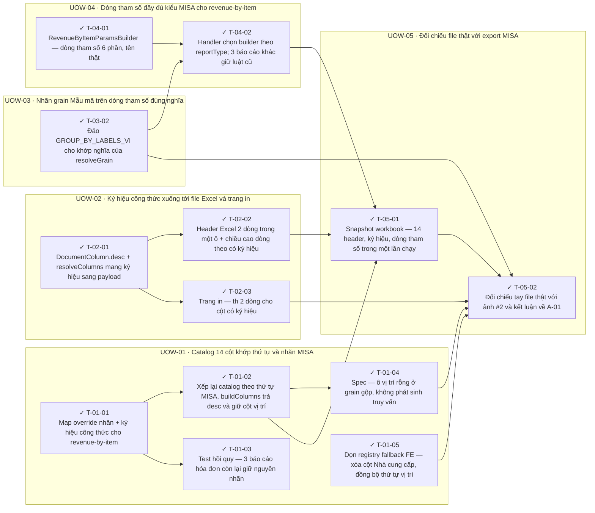

<!-- GENERATED by scripts/uow_graph.py — do not edit by hand -->

# Ticket graph — revenue-by-item-misa-parity

- Units of Work: **5**
- Tickets: **13** (13 done)
- Total effort: **3.8d**
- Critical path: **1.5d** across 4 tickets
- Theoretical minimum duration with unlimited parallelism: **1.5d**

## Units of Work

| UoW | Title | Risk | Effort | Elapsed | Depends on | Status |
|-----|-------|------|--------|---------|-----------|--------|
| UOW-01 | Catalog 14 cột khớp thứ tự và nhãn MISA | medium | 1.2d | 7h | — | todo |
| UOW-02 | Ký hiệu công thức xuống tới file Excel và trang in | medium | 7h | 5h | — | todo |
| UOW-03 | Nhãn grain Mẫu mã trên dòng tham số đúng nghĩa | low | 1h | 1h | — | todo |
| UOW-04 | Dòng tham số đầy đủ kiểu MISA cho revenue-by-item | medium | 6h | 6h | UOW-03 | todo |
| UOW-05 | Đối chiếu file thật với export MISA | low | 6h | 6h | UOW-01, UOW-02, UOW-03, UOW-04 | todo |

Effort is total person-hours. Elapsed is the longest dependency chain inside the
slice — the floor on how fast it can finish no matter how many people work on it.

## Dependency graph

## Execution waves

Tickets in the same wave have no dependency between them and can run in parallel.

| Wave | Tickets | Parallel capacity | Wave duration (longest ticket) |
|------|---------|-------------------|-------------------------------|
| W1 | T-01-01, T-01-05, T-02-01, T-03-02, T-04-01 | 5 | 4h |
| W2 | T-01-02, T-01-03, T-02-02, T-02-03, T-04-02 | 5 | 3h |
| W3 | T-01-04, T-05-01 | 2 | 3h |
| W4 | T-05-02 | 1 | 3h |

## Write-conflict hazards

None: every pair that writes a shared path is ordered by a dependency.

## Critical path

T-04-01 → T-04-02 → T-05-01 → T-05-02

Total: **1.5d**. Shortening the plan means shortening this chain;
adding people to tickets off this path will not make the feature ship sooner.

## Tickets

| ID | UoW | Layer | Type | Est | Depends on | Verifies | Status |
|----|-----|-------|------|-----|-----------|----------|--------|
| T-01-01 | UOW-01 | shared | feature | 2h | — | AC-02 | done |
| T-01-02 | UOW-01 | api | feature | 3h | T-01-01 | AC-01, AC-02, AC-04, AC-05 | done |
| T-01-03 | UOW-01 | test | test | 2h | T-01-01 | AC-03 | done |
| T-01-04 | UOW-01 | test | test | 2h | T-01-02 | AC-06 | done |
| T-01-05 | UOW-01 | frontend | chore | 1h | — | AC-01 | done |
| T-02-01 | UOW-02 | shared | feature | 2h | — | AC-07 | done |
| T-02-02 | UOW-02 | api | feature | 3h | T-02-01 | AC-08, AC-09, AC-11 | done |
| T-02-03 | UOW-02 | frontend | feature | 2h | T-02-01 | AC-10 | done |
| T-03-02 | UOW-03 | api | refactor | 1h | — | AC-18 | done |
| T-04-01 | UOW-04 | service | feature | 4h | — | AC-12, AC-13, AC-14, AC-15 | done |
| T-04-02 | UOW-04 | api | feature | 2h | T-04-01, T-03-02 | AC-16, AC-18 | done |
| T-05-01 | UOW-05 | test | test | 3h | T-01-02, T-02-02, T-04-02 | AC-01, AC-04, AC-08, AC-12 | done |
| T-05-02 | UOW-05 | test | test | 3h | T-05-01, T-03-02, T-02-03, T-01-04, T-01-05 | AC-06, AC-17 | done |
