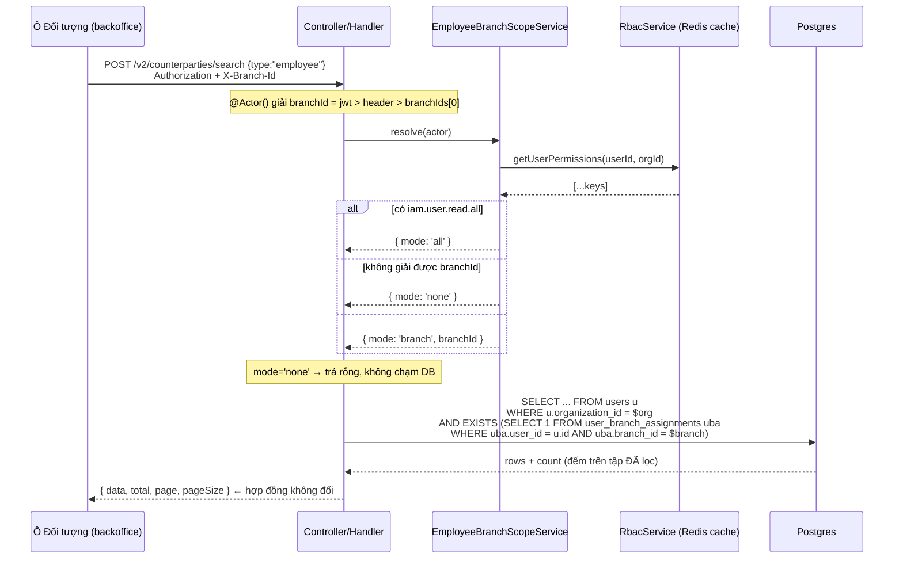
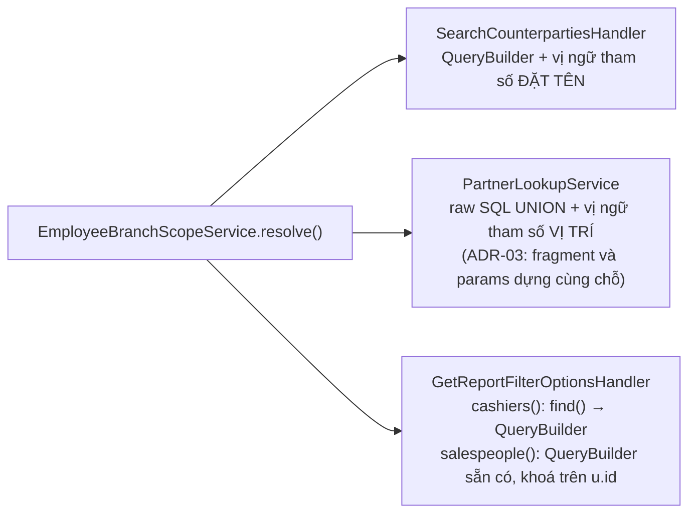

# Logical design — Ô "Đối tượng" chỉ liệt kê nhân viên của chi nhánh đang làm việc

## Approach

Một **quy tắc phạm vi duy nhất**, đặt ở `modules/rbac/`, được bốn nơi truy vấn dùng lại.
Quy tắc trả về một trong ba trạng thái rõ ràng — `all` (bỏ qua lọc), `branch` (lọc theo
đúng một chi nhánh), `none` (không trả gì) — thay vì một giá trị `branchId | undefined`
mà mỗi nơi tự diễn giải. Ba trạng thái này chính là ba nhánh cần chứng minh ở AC-10,
AC-01 và AC-12, nên chúng có mặt trong kiểu dữ liệu chứ không nằm rải rác trong `if`.

Việc lọc thực hiện bằng **vị ngữ `EXISTS` nhúng thẳng vào câu truy vấn sẵn có**, không
nạp trước danh sách id rồi `IN (...)`. Với tổ chức vài nghìn nhân viên, một danh sách id
truyền qua bind parameter là thứ vỡ trước tiên — mà số nhân viên lớn lại đúng là lý do
ticket này tồn tại.

Không có bảng mới, không migration, không đổi hợp đồng HTTP. Bốn câu truy vấn đổi mệnh đề
`WHERE`; frontend không sửa dòng nào.

## Luồng tuần tự

Cùng một quy tắc, ba cơ chế truy vấn khác nhau. Sơ đồ vẽ nhánh `branch` — hai nhánh còn
lại (`all`, `none`) rẽ ở đúng bước 3.

Ba nơi gọi khác nhau chỉ khác ở bước cuối:

## Alternatives rejected

| Option | Why not |
|---|---|
| Gọi thẳng `UsersService.visibleUserIds()` ở cả 4 nơi | Nó lọc theo **mọi** chi nhánh actor thuộc về, cộng thêm mọi tài khoản cấp cao hơn. Admin thuộc HCM+HN đứng ở HN vẫn thấy nhân viên HCM — trái A-01. Nó đúng cho màn Nhân viên (nơi câu hỏi là "tôi được quản ai"), sai cho ô Đối tượng (câu hỏi là "phiếu này thuộc chi nhánh nào") |
| Nạp trước `string[]` id rồi `IN (:...ids)` | Thêm một round-trip mỗi lần gõ phím, và vỡ khi chi nhánh có vài nghìn nhân viên. Chính kịch bản gây ra ticket này |
| Lọc ở frontend sau khi nhận trang | Phân trang nằm ở server: lọc sau khi cắt trang sẽ ra trang thiếu dòng, và người dùng vẫn tải về dữ liệu nhân sự chi nhánh khác |
| Thêm cột `branch_id` vào `employee_profiles` | Nhân viên có thể thuộc nhiều chi nhánh (`staff-03` thuộc cả hai). Một cột đơn trị làm mất thông tin, và `user_branch_assignments` đã mô hình hoá đúng quan hệ n-n |
| Chặn 403 ở đường ghi trong cùng đợt này | Là lớp phòng thủ đúng, nhưng đổi hành vi API cho dữ liệu cũ (phiếu đang sửa có đối tượng ngoài chi nhánh sẽ không lưu lại được). Tách ra, đã ghi ở Out of scope |

## Domain model

| Entity | Fields | Notes |
|---|---|---|
| `EmployeeScope` | `{ mode: 'all' }` \| `{ mode: 'branch'; branchId: string }` \| `{ mode: 'none' }` | Union rời rạc, thuần TS, không phụ thuộc TypeORM. Là toàn bộ "miền" của feature này |
| `user_branch_assignments` | `user_id`, `branch_id`, `organization_id` (tất cả `uuid`) | Bảng sẵn có, không đổi |

Không có entity mới, không migration.

## Contracts

Bốn endpoint giữ **nguyên** request và response. Chỉ tập dòng trả về hẹp lại.

### POST /v2/counterparties/search
Request: không đổi (`{ type | types, search?, page, pageSize }`)
Response 200: không đổi (`{ data, total, page, pageSize }`)
Thay đổi: nhánh `searchEmployees()` thêm vị ngữ chi nhánh; `total` đếm trên tập đã lọc.

### GET /cash-vouchers/partners
Request: không đổi (`?type&search&page&pageSize`)
Response 200: không đổi
Thay đổi: `EMPLOYEE_SELECT` thêm vị ngữ; **số thứ tự bind parameter dịch** (xem ADR-03).

### GET /reports/invoices/filter-options?type=cashier|salesperson
Request/Response: không đổi (`IDropdownOption[]`)
Thay đổi: hai nhánh `cashiers()` và `salespeople()` thêm vị ngữ. Các `type` khác không đụng.

Failure modes: không có mã lỗi mới. `mode: 'none'` trả danh sách rỗng (200), không phải 403 —
người dùng không có chi nhánh là lỗi cấu hình, không phải hành vi tấn công.

## State ownership

| State | Owner | Lifetime |
|---|---|---|
| `EmployeeScope` của một request | `EmployeeBranchScopeService.resolve(actor)` | Một request; không cache riêng |
| Tập permission của actor | `RbacService.getUserPermissions` (cache Redis sẵn có) | TTL của cache RBAC |
| Chi nhánh đang làm việc | `ActorContext.branchId`, đã do decorator giải | Một request |

## Error taxonomy

| Condition | Failure subtype | UI |
|---|---|---|
| Actor không giải được `branchId`, không có `iam.user.read.all` | không ném lỗi — `mode: 'none'` | Danh sách nhân viên rỗng; NCC/KH vẫn hiện bình thường. **Trừ `GET /cash-vouchers/partners`**: `BranchScopeGuard` trả 403 trước khi tới handler — xem ADR-05 |
| `branchId` là chuỗi không phải uuid (header bịa) | đã bị `ActorContext` loại từ trước (chỉ nhận giá trị có trong `branchIds`) | Không tới được tầng truy vấn |
| Bảng `user_branch_assignments` rỗng cho cả tổ chức | không lỗi — mọi nhân viên bị ẩn (A-02) | Ô Đối tượng > Nhân viên trống; là tín hiệu dữ liệu chưa gán chi nhánh, không phải bug |
| Phiếu cũ trỏ tới nhân viên ngoài chi nhánh | không lỗi — đường đọc không lọc (ADR-04) | Hiển thị đúng tên như cũ |

## Cache & offline

Không thêm lớp cache nào. Nhánh kiểm quyền đi qua `RbacService.getUserPermissions`, vốn
đã cache Redis theo `perms:<userId>:<orgId>`; khi vai trò đổi, `invalidateUserPermissions`
sẵn có lo việc dọn. Kết quả tìm kiếm không cache ở server.

Phía frontend, `counterpartySearchKey()` **không** chứa `branchId`, nên trên lý thuyết đổi
chi nhánh giữa phiên có thể đọc lại cache TanStack Query cũ 30 giây. Đã kiểm và **không
cần sửa**: `BranchSelector.tsx:73` gọi `window.location.reload()` ngay sau `switch-branch`
nên toàn bộ cache bị xoá; còn POS đã đưa `branchId` vào key sẵn
(`use-query-daily-report.ts:59`). Không có ticket nào cho việc này — ghi lại đây để lần sau
không ai phải tra lại.

## Observability

Không thêm event Kafka, không thêm metric. Một `logger.debug` ở `resolve()` ghi
`mode` + `branchId` là đủ để phân biệt "lọc đúng" với "lọc rỗng vì thiếu gán chi nhánh" —
hai triệu chứng nhìn giống hệt nhau trên UI.

## ADRs

### ADR-01 — Phạm vi lấy theo chi nhánh đang làm việc, không tái dùng `visibleUserIds()`
**Context:** Repo đã có `UsersService.visibleUserIds()` lọc nhân viên theo chi nhánh, dùng
cho `/admin/users` và `POST /v2/employees/search`. Tái dùng là phản xạ đầu tiên và đúng
với "match existing patterns".
**Decision:** Không tái dùng. Viết `EmployeeBranchScopeService.resolve(actor)` mới, lọc theo
đúng `actor.branchId`. `visibleUserIds()` giữ nguyên, không sửa.
**Consequences:** Hai quy tắc phạm vi cùng tồn tại trong `modules/rbac/`, phải giải thích
được sự khác nhau — vì thế cả hai file mang comment trỏ chéo sang nhau. Đổi lại, màn Nhân
viên không đổi hành vi (không hồi quy `employee-role-branch-scope`), và ô Đối tượng đúng
nghĩa A-01. Gộp hai quy tắc làm một sẽ hỏng một trong hai màn.
**Status:** accepted

### ADR-02 — Vị ngữ `EXISTS` nhúng trong truy vấn, không nạp trước danh sách id
**Context:** Bốn nơi truy vấn dùng ba cơ chế khác nhau: TypeORM QueryBuilder (counterparty),
TypeORM `find()` + QueryBuilder (report filter-options), raw SQL UNION (cash-vouchers).
**Decision:** Chia sẻ **văn bản vị ngữ SQL**, không chia sẻ kết quả. Hai hàm thuần dựng
chuỗi: một cho tham số đặt tên (QueryBuilder), một cho tham số vị trí (raw SQL).
**Consequences:** Không thêm round-trip; không vỡ khi chi nhánh đông nhân sự; nhưng vị ngữ
là chuỗi SQL nên không được type-check — bù lại bằng unit test cho từng dạng và một e2e
chạm cả bốn endpoint. Không kéo entity class của `rbac` vào module `cash-vouchers`, giữ
nguyên lý do tồn tại của raw SQL ở đó.
**Status:** accepted

### ADR-03 — Dựng fragment và bind parameter cùng một chỗ trong `partner-lookup.service`
**Context:** `lookup()` hiện ghép fragment bằng `selectFragments(type)` rồi truyền mảng
tham số dựng tay ở nơi khác: `countSql` nhận `[org, search]`, `pageSql` nhận
`[org, search, pageSize, offset]`. Thêm `$3` cho chi nhánh vào riêng `EMPLOYEE_SELECT` là
cái bẫy: khi `type=customer`, fragment không nhắc tới `$3` nhưng mảng vẫn có 3 phần tử →
Postgres trả `bind message supplies 3 parameters, but prepared statement requires 2`.
**Decision:** Đổi `selectFragments(type)` thành một method trả `{ body, params }`, dựng
fragment và mảng tham số trong cùng một biểu thức. `pageSql` nối `LIMIT $${n+1} OFFSET $${n+2}`
tính từ `params.length`, không viết cứng `$3`/`$4`.
**Consequences:** Một refactor nhỏ ngoài phạm vi lọc, nhưng là điều kiện cần để lọc không
làm vỡ ba loại còn lại. Có test riêng cho `type=customer` để bắt đúng lỗi bind này.
**Status:** accepted

### ADR-04 — Chỉ lọc đường tìm kiếm, không lọc đường tra cứu theo id
**Context:** Phiếu lịch sử có thể trỏ tới nhân viên nay không còn thuộc chi nhánh, hoặc
chưa bao giờ thuộc. Nếu lọc cả đường đọc, phiếu cũ mở ra sẽ mất tên đối tượng.
**Decision:** `GET /admin/users/:id` và các resolver id → tên (`counterparty-name.util.ts`,
`voucher-staff.resolver.ts`, `resolve-doc-counterparty.util.ts`) giữ nguyên, không lọc.
**Consequences:** Ai biết trước một `userId` vẫn tra được tên nhân viên chi nhánh khác —
chấp nhận được, vì đó không phải bí mật và các endpoint này đã gác bằng permission. Đổi lại
không phá dữ liệu lịch sử. AC-11 khoá quyết định này lại.
**Status:** accepted

### ADR-05 — `mode: 'none'` trả rỗng, không ném 403 — ở những nơi chúng ta còn quyết định
**Context:** Actor không giải được chi nhánh nào. Có thể coi là lỗi cấu hình (rỗng) hoặc
vi phạm phạm vi (403).

**Sửa sau khi chạy e2e (T-04-01), 2026-08-22.** Bản đầu của ADR này viết "trả rỗng, HTTP
200" cho **cả bốn** endpoint. Sai ở một endpoint, và sai vì lý do có sẵn từ trước chứ không
phải vì tính năng này: `PartnerLookupController` mang `@RequireBranchScope()`, và
`BranchScopeGuard` ném `ForbiddenException('No branch access assigned')` khi
`user.branchIds` rỗng — tức **trước** khi `PartnerLookupService` được gọi. Điều kiện của
guard trùng khít điều kiện sinh ra `mode: 'none'`, nên nhánh `none` trong service đó là mã
không bao giờ chạy qua đường HTTP.

**Decision:**
- `POST /v2/counterparties/search` và `GET /reports/invoices/filter-options`: trả danh sách
  rỗng, HTTP 200. Đây là chỗ chúng ta thực sự có quyền quyết định.
- `GET /cash-vouchers/partners`: **403**, do guard có sẵn. Không gỡ guard — nó bảo vệ cả bốn
  route khác trên cùng controller, và nới nó ra để cho đẹp một ADR là đổi bề mặt bảo mật để
  chiều tài liệu.
- Nhánh `none` trong `PartnerLookupService` **giữ lại** làm phòng thủ theo lớp: nó vẫn đúng
  nếu ai đó gọi service từ chỗ khác không qua guard, và unit test vẫn phủ nó.

**Consequences:** Hành vi không đồng nhất giữa bốn endpoint, và sự không đồng nhất đó nay
được ghi ra thay vì để người sau tự đoán. Test
`cash-voucher party lookup is refused by the branch-scope guard, not by us` trong
`employee-branch-scope.e2e-spec.ts` khoá 403 đó lại kèm lý do — một 403 không ai viết xuống
sẽ bị đọc nhầm là hồi quy trong lần refactor sau.

**Status:** accepted
