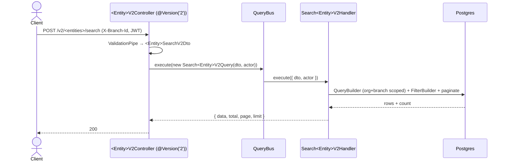

# CQRS Search Endpoint — jack-erp

## Trigger

When the user types: `add search endpoint: [entity]`
(or asks to "scaffold a search/list query", "add a v2 search", "filter + paginate [entity]").

This scaffolds a versioned, filter-driven **read** endpoint following the canonical example already in the repo:

| Layer            | Canonical file                                                              |
| ---------------- | --------------------------------------------------------------------------- |
| Request DTO      | `apps/api/src/modules/pos/dto/invoice-search-v2.dto.ts`                      |
| Query object     | `apps/api/src/modules/pos/queries/search-invoices-v2.query.ts`              |
| Query handler    | `apps/api/src/modules/pos/queries/search-invoices-v2.handler.ts`            |
| Controller       | `apps/api/src/modules/pos/controllers/invoice-v2.controller.ts`             |
| Module wiring    | `apps/api/src/modules/pos/pos.module.ts`                                    |
| Reusable filters | `apps/api/src/common/filters/{filter.builder.ts,filter.dto.ts}`             |
| Actor context    | `apps/api/src/common/decorators/actor-context.decorator.ts`                 |

Read those before scaffolding so the new endpoint matches them exactly.

---

## When to use this (and when NOT to)

Per `CLAUDE.md`: **"Use CQRS for queries with dynamic multi-join filter combinations; use plain service injection for straightforward CRUD."**

**Use this skill when:**
- The endpoint is **read-only** (search/list), with several optional filters that combine dynamically.
- Filters span **joins** (e.g. invoice + customer) or need per-field operators (contains / equals / range / compare).
- You want pagination and a stable `{ data, total, page, limit }` envelope.

**Do NOT use this skill when:**
- It's plain list/create/edit/delete over one entity → register a `CrudEntityConfig` on the **generic CRUD platform** (`modules/crud`); you get `/admin/entities/:entityKey/records` + the backoffice page for free.
- It's a single-filter or by-id read → inject the service directly; CQRS is overhead here.
- It's a **mutation** → CQRS commands are not used in this repo; keep writes in services (they inherit the global `IdempotencyInterceptor`).

If the user's ask is actually CRUD or a mutation, say so and point them at the right pattern instead of scaffolding this.

---

## Architecture



The controller is **thin** — it only validates the body, grabs `ActorContext` via `@Actor()`, and dispatches a Query. All query logic lives in the handler.

---

## Reusable building blocks — DO NOT recreate these

Import them; never reinvent.

- **`FilterBuilder<T>`** (`common/filters/filter.builder.ts`) — fluent helper over a `SelectQueryBuilder`. Methods: `applyString(col, StringFilterDto)`, `applyEnum(col, value)`, `applyDateRange(col, DateRangeFilterDto)`, `applyCompare(col, CompareFilterDto)`. Each is a no-op when its filter is absent, and uses auto-generated unique param keys (safe to call many times).
- **Filter sub-DTOs** (`common/filters/filter.dto.ts`):
  - `StringFilterDto { operator: StringOperator; value: string }` — operators `CONTAINS='*'`, `EQUALS='='`, `STARTS_WITH='+'`, `ENDS_WITH='-'`, `NOT_CONTAINS='!'`.
  - `CompareFilterDto { operator: CompareOperator; value }` — operators `=`, `<`, `<=`, `>`, `>=`.
  - `DateRangeFilterDto { from?: ISO8601; to?: ISO8601 }`.
  - `EnumFilterDto { value: string | null }` — read with `dto.field?.value` in the handler.
- **`@Actor()` / `ActorContext`** (`common/decorators/actor-context.decorator.ts`) — gives `{ userId, organizationId, branchId?, roles }`. `branchId` is resolved from the validated `X-Branch-Id` header (falling back to the JWT). The handler **must** scope on `actor.organizationId`.
- **`QueryBus` / `CqrsModule`** from `@nestjs/cqrs`.

URI versioning is already enabled in `apps/api/src/main.ts` (`VersioningType.URI`, `defaultVersion: VERSION_NEUTRAL`), so `@Version('2')` on a `@Controller('<entities>')` resolves to `POST /v2/<entities>/...`. No bootstrap change needed.

---

## Scaffold order

Create/modify these, in order. Use the entity's existing module — do **not** make a new module unless the entity has none.

1. **DTO** — `modules/<feature>/dto/<entity>-search-v2.dto.ts`
2. **Query** — `modules/<feature>/queries/search-<entities>-v2.query.ts`
3. **Handler** — `modules/<feature>/queries/search-<entities>-v2.handler.ts`
4. **Controller** — `modules/<feature>/controllers/<entity>-v2.controller.ts`
5. **Module wiring** — add `CqrsModule` to `imports`, the handler to `providers`, the controller to `controllers`.
6. **OpenAPI + FE** (only if a client consumes it) — run the API, `pnpm openapi:generate`, commit `openapi.snapshot.json` + generated `schema.ts`, then add a TanStack Query hook over `erpApi`/`requireErpData`.

---

## Templates

> Replace `<Entity>` / `<entity>` / `<entities>` / `<feature>` accordingly. Backend source stays **English** (comments, Swagger, errors) — only FE user-facing strings are Vietnamese. Declare **every** accepted field on the DTO (global `ValidationPipe` runs `whitelist: true, forbidNonWhitelisted: true`).

### 1. Request DTO

```ts
import { IsInt, IsOptional, IsUUID, Max, Min, ValidateNested } from 'class-validator';
import { Type } from 'class-transformer';
import {
  CompareFilterDto,
  DateRangeFilterDto,
  EnumFilterDto,
  StringFilterDto,
} from '../../../common/filters/filter.dto';

export class <Entity>SearchV2Dto {
  @IsOptional() @Type(() => Number) @IsInt() @Min(1)
  page?: number = 1;

  @IsOptional() @Type(() => Number) @IsInt() @Min(1) @Max(100)
  limit?: number = 20;

  // One field per filterable column. Pick the sub-DTO by column type:
  //   text   → StringFilterDto    enum → EnumFilterDto
  //   date   → DateRangeFilterDto  numeric/money → CompareFilterDto
  //   exact id → @IsUUID() string (no sub-DTO)
  @IsOptional() @ValidateNested() @Type(() => StringFilterDto)
  code?: StringFilterDto;

  @IsOptional() @ValidateNested() @Type(() => EnumFilterDto)
  status?: EnumFilterDto;

  @IsOptional() @ValidateNested() @Type(() => DateRangeFilterDto)
  createdAt?: DateRangeFilterDto;

  @IsOptional() @ValidateNested() @Type(() => CompareFilterDto)
  amount?: CompareFilterDto;

  @IsOptional() @IsUUID()
  someRefId?: string;
}
```

### 2. Query object (plain data carrier)

```ts
import { ActorContext } from '../../../common/decorators/actor-context.decorator';
import { <Entity>SearchV2Dto } from '../dto/<entity>-search-v2.dto';

export class Search<Entities>V2Query {
  constructor(
    public readonly dto: <Entity>SearchV2Dto,
    public readonly actor: ActorContext,
  ) {}
}
```

### 3. Handler (all logic lives here)

```ts
import { IQueryHandler, QueryHandler } from '@nestjs/cqrs';
import { InjectRepository } from '@nestjs/typeorm';
import { Repository } from 'typeorm';
import { FilterBuilder } from '../../../common/filters/filter.builder';
import { <Entity>Entity } from '../entities/<entity>.entity';
import { Search<Entities>V2Query } from './search-<entities>-v2.query';

@QueryHandler(Search<Entities>V2Query)
export class Search<Entities>V2Handler implements IQueryHandler<Search<Entities>V2Query> {
  constructor(
    @InjectRepository(<Entity>Entity)
    private readonly repo: Repository<<Entity>Entity>,
  ) {}

  async execute({ dto, actor }: Search<Entities>V2Query) {
    const page  = dto.page  ?? 1;
    const limit = dto.limit ?? 20;

    const qb = this.repo
      .createQueryBuilder('e')
      // join other tables for cross-entity filters; ALWAYS include organizationId in the ON clause:
      // .leftJoin(OtherEntity, 'o', 'o.id = e.otherId AND o.organizationId = e.organizationId')
      .where('e.organizationId = :orgId', { orgId: actor.organizationId });

    // MANDATORY: branch scope when the entity is branch-scoped.
    if (actor.branchId) {
      qb.andWhere('e.branchId = :branchId', { branchId: actor.branchId });
    }

    new FilterBuilder(qb)
      .applyString('e.code',         dto.code)
      .applyEnum('e.status',         dto.status?.value)
      .applyDateRange('e.createdAt', dto.createdAt)
      .applyCompare('e.amount',      dto.amount);

    if (dto.someRefId) {
      qb.andWhere('e.someRefId = :rid', { rid: dto.someRefId });
    }

    qb.orderBy('e.createdAt', 'DESC')
      .skip((page - 1) * limit)
      .take(limit);

    const [data, total] = await qb.getManyAndCount();
    return { data, total, page, limit };
  }
}
```

### 4. Controller (thin dispatcher)

```ts
import { Body, Controller, Post, UseGuards, Version } from '@nestjs/common';
import { QueryBus } from '@nestjs/cqrs';
import { Actor, ActorContext } from '../../../common/decorators/actor-context.decorator';
import { RequirePermission } from '../../auth/decorators';
import { PermissionGuard } from '../../rbac/permission.guard';
import { <Entity>SearchV2Dto } from '../dto/<entity>-search-v2.dto';
import { Search<Entities>V2Query } from '../queries/search-<entities>-v2.query';

@Controller('<entities>')
@UseGuards(PermissionGuard)
export class <Entity>V2Controller {
  constructor(private readonly queryBus: QueryBus) {}

  @Post('search')
  @Version('2')
  @RequirePermission('<feature>.read') // uncomment/set to the real permission key
  search(@Body() dto: <Entity>SearchV2Dto, @Actor() actor: ActorContext) {
    return this.queryBus.execute(new Search<Entities>V2Query(dto, actor));
  }
}
```

### 5. Module wiring

In the feature module (`@Module`):

```ts
imports:     [ /* TypeOrmModule.forFeature([<Entity>Entity, ...joined entities]), */ CqrsModule ],
controllers: [ <Entity>V2Controller ],
providers:   [ Search<Entities>V2Handler ],
```

Ensure every entity referenced in a `.leftJoin(Entity, ...)` is registered in some `TypeOrmModule.forFeature` so its repository/metadata is available.

---

## Conventions & gotchas

- **Multi-tenant scope is load-bearing.** First `where` is always `e.organizationId = :orgId` from the actor. Add the `branchId` filter when the entity is branch-scoped. Joins must carry `organizationId` in the ON clause so a join can never leak across tenants.
- **Return envelope** is exactly `{ data, total, page, limit }` — keep it consistent across search endpoints.
- **`AuthGuard`** — the canonical invoice controller only lists `@UseGuards(PermissionGuard)`; confirm where authentication is applied for the target module (often a global/class-level `AuthGuard`). Match the sibling controllers in that module rather than copying blindly. Set a real `@RequirePermission('<feature>.read')` unless the module intentionally leaves it open.
- **Versioning** — `@Version('2')` requires the route to be reachable at `/v2/...`. It's already enabled globally; you do not touch `main.ts`.
- **Aggregations** — if the result is a netted/aggregate view rather than row pagination, prefer fetching raw rows and computing in JS over `GROUP BY` in SQL (repo convention). For FK display values, inline the joined object into each row, not a root `{[id]: X}` map.
- **No new filter primitives** unless a column type genuinely isn't covered by the four sub-DTOs — if you must add one, extend `filter.dto.ts` + `filter.builder.ts` (shared), don't fork them per feature.

## Definition of Done

- [ ] All queries filter by `actor.organizationId` (and `branchId` where the entity is branch-scoped); joins carry `organizationId`. No cross-tenant leakage.
- [ ] DTO declares every accepted field (passes `whitelist`/`forbidNonWhitelisted`); pagination bounded (`@Min/@Max`).
- [ ] Handler registered in module `providers`; `CqrsModule` in `imports`; controller in `controllers`.
- [ ] `@RequirePermission` set (or a deliberate, noted exception).
- [ ] `pnpm --filter @erp/api test` + `lint` pass; handler `.spec.ts` covers happy path + org/branch scoping + each filter operator.
- [ ] If a client consumes it: `pnpm openapi:generate` run, `openapi.snapshot.json` + generated `schema.ts` committed (not hand-edited); FE hook wraps it in TanStack Query.
- [ ] Backend source is English (comments/Swagger/errors/logs).
