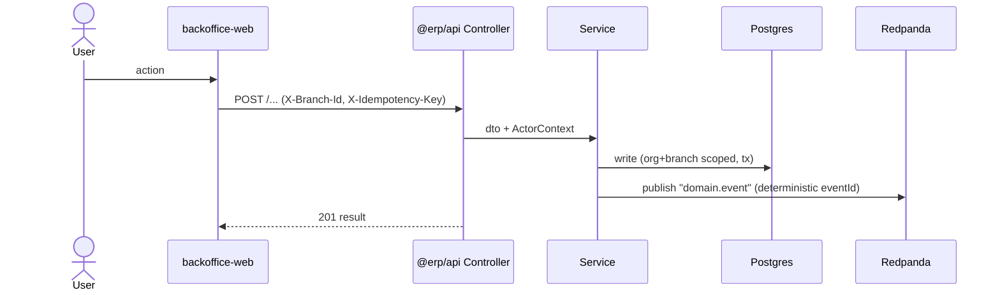
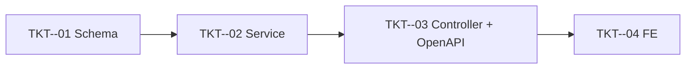

# Feature Planning — jack-erp

## Trigger

When user types: `plan feature: [feature name]`

This produces **planning artifacts only** (an epic + its tickets) in the repo's native `tickets/` format. It does not write production code until Step 4 is explicitly approved.

---

## ⚠️ MANDATORY ORDER — DO NOT SKIP

**Steps must execute in order. Never implement code before Step 3 is confirmed.**

| Step | Action                                                  | Gate                       |
| ---- | ------------------------------------------------------- | -------------------------- |
| 1    | Ask clarifying questions + check for reuse              | Wait for ALL answers       |
| 2    | Write epic + tickets under `tickets/`; update README    | Files must exist on disk   |
| 3    | List files, ask "Any changes needed?"                   | Wait for user confirmation |
| 4    | Implement ticket-by-ticket in dependency order          | Only after user says OK    |

**If you find yourself writing application code before Step 3 is confirmed, stop immediately.**

---

## Step 1 — Clarify

Ask the user the following. **Wait for complete answers before generating any files.**

1. What problem does this feature solve, and what is the measurable outcome (success metric)?
2. Which parts of the monorepo does it touch? — API module(s) under `apps/api/src/modules/`, `backoffice-web`, `pos-web`, `@erp/shared-interfaces`, `@erp/api-client`.
3. **Data model:** new entity(ies) or extend existing? Does it need a TypeORM migration? Scope is `ORGANIZATION` only or `ORGANIZATION + BRANCH`?
4. **Surface:** is it plain CRUD the generic platform can serve (register a `CrudEntityConfig`), or does it need a custom service / endpoints / CQRS query?
5. **Events:** does it emit or consume Kafka/Redpanda events? Any cross-module side effects (stock ledger, journal entries, loyalty, cash) that must be **idempotent** and reversible?
6. **Access:** which routes/pages, which roles/permissions (`@RequirePermission`), org-vs-branch scoping?
7. What edge cases must be handled? (validation failure, empty state, permission denied, idempotency replay/conflict, concurrent writes)
8. What is explicitly **out of scope**?

Before Step 2, **check for reuse** and name what you'll reuse in the plan:

- Existing modules under `apps/api/src/modules/` — extend, don't duplicate (e.g. the supplier epic extended `ProviderEntity` rather than adding a table).
- **Generic CRUD platform** (`modules/crud`): if the feature is list/create/edit/delete over one entity, register a `CrudEntityConfig` via `EntityRegistryService.registerEntity` instead of hand-building admin pages. The backoffice route `/admin/:entityKey` and REST endpoints come for free.
- `DocumentNumberingService` for human-facing codes (e.g. `NCC000001`) — do not invent code generators.
- Existing RBAC permissions before seeding new ones.
- `@erp/shared-interfaces` types/enums — do not redefine shapes that already exist there.
- `@erp/ui` components (`CrudListPage`, `PageToolbar`, form primitives) and the `erpApi` / `requireErpData` wrapper on the FE.

---

## Step 2 — Generate Files

Once all information is gathered, write the epic and its tickets into the repo's existing planning tree:

- Epic → `tickets/epics/EPIC-<id>-<slug>.md`
- Tickets → `tickets/tickets/TKT-<prefix>-NN-<slug>.md`
- Then add the epic (and its ticket table + mermaid dependency graph) to `tickets/README.md`.

**Naming**

- New epics use a date-stamped id: `EPIC-DDMMYYYY-<kebab-slug>` (today's date; e.g. `EPIC-29052026-supplier-management`).
- Tickets use a short epic-specific prefix + zero-padded sequence: `TKT-<PREFIX>-01`, `TKT-<PREFIX>-02`, … (e.g. `TKT-SUP-01`). Pick a 2–4 letter PREFIX from the feature name.
- `<slug>` is kebab-case.

**How to slice tickets** — one ticket per layer/concern, in dependency order. Include only the layers the feature actually needs:

1. Schema migration (hand-written) + entities
2. `@erp/shared-interfaces` types/enums (only if the FE or other packages consume them)
3. DTOs + Service (`BaseCrudService<E, Create, Update>` for CRUD, or a custom service)
4. Controller + guards/permissions; register `CrudEntityConfig` if using the generic platform
5. Events: topics + publishers + **idempotent** consumers (only if event-driven)
6. `pnpm openapi:generate` + commit the api-client snapshot
7. FE data layer (TanStack Query hooks over `erpApi` / `requireErpData`)
8. FE UI: pages + `<Route>` in `App.tsx` + `NavChild` in `navConfig.ts` (backoffice and/or pos)
9. Permissions / COA seed (only if new)
10. E2E + test plan + DoD gate

> **Language:** planning-doc prose may be Vietnamese (matching existing tickets), but all code, identifiers, entity/column names, enum values, Swagger text, error messages, log lines, and comments in backend source stay **English**. FE user-facing strings are Vietnamese.

### Epic template — `tickets/epics/EPIC-<id>-<slug>.md`

````markdown
# EPIC-<id> <Feature Name>

## Goal

[The problem and the measurable outcome.]

## Scope

- [Entities / tables touched — new vs extend. Note multi-tenant scope (org / org+branch).]
- [API surface — generic CRUD registration vs custom endpoints.]
- [Events emitted/consumed, if any.]
- [FE surface — which app, which routes.]

## Success Metrics

- [Verifiable end-to-end outcome 1]
- [Migration leaves existing rows valid / backfilled]

## Flows

[Sequence diagram(s) for each main flow — HTTP request path and, if event-driven, the Kafka publish→consume path. Required for any non-trivial flow.]



## Tickets

- [TKT-<PREFIX>-01 …](../tickets/TKT-<PREFIX>-01-<slug>.md)
- [TKT-<PREFIX>-02 …](../tickets/TKT-<PREFIX>-02-<slug>.md)

## Dependencies

- Depends on: [existing modules/epics already shipped]
- Reuses: [permissions, generic CRUD, DocumentNumberingService, shared types]

### Ticket dependency graph


````

### Ticket template — `tickets/tickets/TKT-<prefix>-NN-<slug>.md`

```markdown
# TKT-<PREFIX>-NN <Ticket title>

## Epic

[EPIC-<id> <Feature Name>](../epics/EPIC-<id>-<slug>.md)

## Summary

[One paragraph: what this ticket builds and how it fits the flow.]

## Deliverables

- `apps/api/src/database/migrations/<timestamp>-<Name>.ts` (new) — hand-written migration.
- `apps/api/src/modules/<feature>/<feature>.entity.ts` — UUID PK, `numeric(18,2)` money, `@CreateDateColumn`/`@UpdateDateColumn` (UTC), soft-delete where applicable, `organizationId` (+ `branchId`) columns.
- `apps/api/src/modules/<feature>/dto/{create,update}-<feature>.dto.ts` — class-validator + `@ApiProperty`; declare **every** accepted field (global `whitelist: true`).
- `apps/api/src/modules/<feature>/<feature>.service.ts` — filters by `actor.organizationId` (and `branchId` when scope demands).
- `apps/api/src/modules/<feature>/<feature>.controller.ts` — `@UseGuards(AuthGuard, PermissionGuard)`, `@Actor()`, `@RequirePermission("x.y")`.
- `packages/shared-interfaces/src/<domain>/...` — types/enums consumed by FE (if any).

## Acceptance Criteria

- [ ] All queries filter by `actor.organizationId` (and `branchId` where scope demands); no cross-tenant leakage.
- [ ] Mutations are idempotent (inherit the global `IdempotencyInterceptor`; consumers dedupe via `processed_events` + deterministic `eventId`).
- [ ] [Behavior-specific criteria…]

## Definition of Done

- [ ] PR passes `pnpm --filter @erp/api test` and `pnpm --filter @erp/api lint`.
- [ ] Service/e2e specs cover happy path + each edge case (validation, 404, permission denied, idempotency replay).
- [ ] No schema change outside the migration; `synchronize` stays false.
- [ ] After endpoint changes: `pnpm openapi:generate` run, `openapi.snapshot.json` + generated `schema.ts` committed (not hand-edited).
- [ ] No Vietnamese in backend source (errors/comments/Swagger/logs).
- [ ] No TODO/FIXME outside the plan.

## Tech Approach

[TypeScript snippets — entity, DTO, service skeleton, controller signatures.
For aggregate/netted views, fetch raw rows and compute in JS rather than GROUP BY in SQL.
Resolve FKs by inlining the joined object into each row, not a root `{[id]: X}` map.]

## Testing Strategy

- Unit (`<feature>.service.spec.ts`): seed + assert each filter/edge case.
- E2E (if cross-module / event-driven): run against `erp_test` (`pnpm --filter @erp/api test:e2e`).

## Dependencies

- Depends on: [TKT-… that must land first]
- Blocks: [TKT-… that depend on this]
```

---

## Step 3 — Confirm

After generating, list the created/updated files:

```
✅ Created epic + N tickets:
- tickets/epics/EPIC-<id>-<slug>.md
- tickets/tickets/TKT-<PREFIX>-01-<slug>.md
- tickets/tickets/TKT-<PREFIX>-02-<slug>.md
- … 
- tickets/README.md (updated: epic entry + ticket table + dependency graph)

Any changes needed?
If OK → ready to implement, ticket-by-ticket in dependency order.
```

---

## Step 4 — Implement

When the user confirms, implement **ticket-by-ticket following the dependency graph** (typically):

**Migration → Entities → shared-interfaces → DTO + Service → Controller (+ CrudEntityConfig / events) → `openapi:generate` → FE data layer → FE UI → E2E**

- For each ticket: implement → run the relevant tests/lint → confirm Definition of Done → next ticket.
- **Do not move to the next ticket until the current one's DoD is met.**
- Migrations are **hand-written**: `migration:generate` produces huge drift here — write a focused migration by hand (extract the needed `CREATE`/`ALTER` and author it yourself).
- After any endpoint change, run the API and `pnpm openapi:generate`, then commit the snapshot before wiring the FE.
