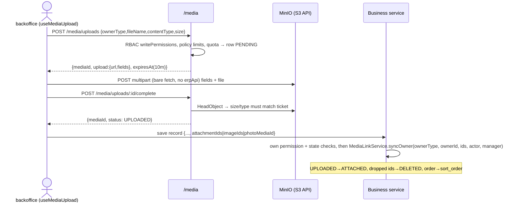

# Media upload & fetch — jack-erp

## Trigger

When the user types: `add media: [entity]`
(or asks to "attach files to [entity]", "add images to [entity]", "upload media", "fetch/download media", "add a media owner type").

Every file is a `media_objects` row; business records never hold bytes or URLs, only media ids. The canonical integrations, read the one closest to your case before writing anything:

| Pattern | Owner types | Canonical files |
| --- | --- | --- |
| **A. Private attachments** (list of files, download on click) | `GOODS_RECEIPT`, `TRANSFER_ORDER`, `STOCK_TRANSFER`, `CASH_RECEIPT`, `CASH_PAYMENT`, `BANK_RECEIPT`, `BANK_PAYMENT` | `modules/accounting/cash-vouchers/cash-receipts/cash-receipts.service.ts`, `modules/inventory/goods-receipt/goods-receipt.service.ts`; FE `pages/treasury/documents/receipt-voucher-dialog/ReceiptVoucherDialog.tsx` |
| **B. Public images** (URL built by string concat, no signing) | `PRODUCT`, `ITEM` | `modules/inventory/location/item-crud.service.ts`, `modules/pos/services/pos-catalog-product.service.ts`, `modules/partner-catalog/queries/search-partner-products.handler.ts`; FE `components/crud/inventory/InventoryItemCreateForm.tsx` |
| **C. Private inline image** (presigned GET, rendered ``) | `EMPLOYEE_PROFILE` | `modules/rbac/users.service.ts` (`loadProfilePhotos`, `signPhotoUrls`); FE `pages/employees/components/EmployeeBasicInfoTab.tsx` |

Media module itself: `apps/api/src/modules/media/` (`@Global()`, exports only `MediaLinkService`, `MediaQueryService`, `MediaOwnerReaderRegistry`). Design + ADRs: `.ai/features/2026091301-media-storage/03-logical-design.md`.

---

## When to use this (and when NOT to)

**Use when:** an entity needs files/images, or an existing owner type needs a new read/write surface (a new list page that must show images, a new endpoint that saves `attachmentIds`).

**Do NOT use when:**
- Changing ticket TTL, cleanup, bucket layout, presign internals → that is the media module itself (`media-upload.service.ts`, `object-storage.service.ts`, `media-cleanup.job.ts`); read the ADRs first, it is load-bearing.
- Storing a URL string on an entity (e.g. an external logo link) → not media; plain column.
- Exporting generated files (Excel/PDF print) → `lib/print/`, not media.

---

## Architecture



Read side never touches storage for public media (URL = `MEDIA_PUBLIC_BASE_URL/bucket/objectKey`), signs locally for private media, and gates `GET /media/:id/download-url` through `policy.readPermissions` + the owner's registered reader.

State machine: `PENDING → UPLOADED → ATTACHED → DELETED` (also `PENDING/UPLOADED → DELETED` on failed complete or by `MediaCleanupJob`, daily 02:00). `DELETED` is terminal; a detached id cannot be re-attached.

---

## Reusable building blocks — DO NOT recreate these

- **`MEDIA_OWNER_POLICIES`** (`media-owner-policies.ts`) — per `ownerType`: `bucket: 'public'|'private'`, `maxBytes`, `contentTypes`, `maxPerOwner`, `writePermissions`, `readPermissions`. Frozen. Visibility is decided by `bucket`, never by an empty `readPermissions`.
- **`MediaLinkService`** (`media-link.service.ts`) — the **only** write path into/out of `ATTACHED`:
  - `syncOwner(ownerType, ownerId, ids | undefined, actor, manager?) → string[]` — full replace: array order becomes `sort_order`; missing ids are detached; returns the sorted ids. `undefined` = "field not sent, return current list, change nothing". Throws 404 `MEDIA_NOT_FOUND` (wrong org / wrong ownerType / UPLOADED by someone else), 409 `MEDIA_STATE_CONFLICT` (attached elsewhere, DELETED, PENDING), 400 `MEDIA_LIMIT_EXCEEDED`.
  - `detachAll(ownerType, ownerId, organizationId, manager?)` — on owner delete.
- **`MediaQueryService`** (`media-query.service.ts`) — read side, always batched (one query per page, `owner_id = ANY(...)`):
  - `listForOwners(ownerType, ownerIds, organizationId) → Map<ownerId, MediaSummary[]>`
  - `resolvePublicUrls(ownerIds, organizationId) → Map<ownerId, {id,url,fileName}[]>` — public owner types only, no storage call, returns empty map when storage is unconfigured (catalog keeps rendering).
  - `publicUrlFor(summary)`, `signReadUrl(summary, organizationId, 'inline'|'attachment')` — inline 1h (image types only; anything else is downgraded to attachment), attachment 15m.
- **`MediaOwnerReaderRegistry`** — `register(ownerType, (ownerId, actor) => Promise<boolean>)` in the owner service's `onModuleInit`; duplicate registration throws at boot. Required for every **private** owner type, else download-url is a 404.
- **`MediaException`** (`media.exception.ts`) — codes `MEDIA_TYPE_NOT_ALLOWED | MEDIA_TOO_LARGE | MEDIA_LIMIT_EXCEEDED | MEDIA_INVALID | MEDIA_NOT_FOUND | MEDIA_STATE_CONFLICT | MEDIA_QUOTA_EXCEEDED | STORAGE_UNAVAILABLE`.
- **FE** (`apps/backoffice-web/src/lib/media/`, `components/media/`):
  - `useMediaUpload(ownerType, initial?) → { files, add, remove, retry, mediaIds, isUploading }` — runs request → bare `fetch` POST → complete per file, client-side limit checks, abort on unmount / ownerType change.
  - `MediaAttachmentList` — the file-list UI for pattern A (`ownerType`, `value`, `onChange(ids, items)`, `readOnly`, `onUploadingChange`).
  - `MEDIA_OWNER_LIMITS` / `validateFileAgainstLimits` (`media-limits.ts`) — client copy of the server policy, early feedback only.
  - `getDownloadUrl(mediaId)` (`media-download.api.ts`) — call on click, `window.location.assign(url)`; never cache in TanStack Query.

---

## Step 0 — new owner type only

Skip if the entity is already in `MediaOwnerType`.

1. `media-object.entity.ts` — add to `MediaOwnerType`. Column is `varchar(40)`: **no migration**.
2. `media-owner-policies.ts` — add a policy. Reuse `attachmentPolicy(write[], read[])` or `GOODS_POLICY`; permission keys must exist in `PERMISSION_SEEDS` (`media-owner-policies.spec.ts` checks this, and asserts the owner-type count — bump it).
3. `apps/backoffice-web/src/lib/media/media-limits.ts` — add to `MediaOwnerType` union and `MEDIA_OWNER_LIMITS` with the same numbers.
4. `object_key` becomes `org/<orgId>/<ownertype lowercased>/<mediaId>` automatically. Public owner types must match `[a-z_]+` after lowercasing (they all do).

---

## Backend wiring (per owner entity)

### 1. DTO — accept ids

```ts
// create-<entity>.dto.ts and update-<entity>.dto.ts
@IsOptional()
@IsArray()
@IsUUID('all', { each: true })
attachmentIds?: string[];   // pattern A. Pattern B: imageIds. Pattern C: photoMediaId?: string | null
```

### 2. Service — sync inside the business transaction

```ts
constructor(
  private readonly mediaLink: MediaLinkService,
  private readonly mediaQuery: MediaQueryService,
  private readonly mediaReaders: MediaOwnerReaderRegistry, // private owner types only
) {}

// create — mint the id first so a media 404/409 fires BEFORE a document number
// is burned or an event is published (cash-receipts.service.ts:237)
const saved = await this.dataSource.transaction(async (manager) => {
  const row = await manager.save(<Entity>Entity, entity);
  if (dto.attachmentIds !== undefined) {
    const ids = await this.mediaLink.syncOwner(
      MediaOwnerType.<OWNER>, row.id, dto.attachmentIds, actor, manager,
    );
    await manager.update(<Entity>Entity, row.id, { attachmentIds: ids }); // ADR-03 write-back
  }
  return row;
});

// update — only when the client sent the field; after assertEditable / state checks
if (dto.attachmentIds !== undefined) {
  entity.attachmentIds = await this.mediaLink.syncOwner(
    MediaOwnerType.<OWNER>, entity.id, dto.attachmentIds, actor, manager,
  );
}

// delete / hard-cancel
await this.mediaLink.detachAll(MediaOwnerType.<OWNER>, id, actor.organizationId, manager);
```

`attachmentIds jsonb default '[]'` on the document entity is the ADR-03 denormalised copy — `syncOwner`'s return value is the only thing that may be written there. Products/items/profiles keep **no** column.

### 3. Reader registration — private owner types

```ts
onModuleInit(): void {
  this.mediaReaders.register(MediaOwnerType.<OWNER>, (id, actor) => this.canReadForMedia(id, actor));
}

private async canReadForMedia(id: string, actor: ActorContext): Promise<boolean> {
  // BranchScopeGuard does not run on /media routes: re-apply the branch check here
  if (!actor.branchId || !actor.branchIds?.includes(actor.branchId)) return false;
  try {
    await this.getById(id, actor); // the SAME function the detail endpoint uses
    return true;
  } catch (err) {
    if (err instanceof NotFoundException || err instanceof ForbiddenException) return false;
    throw err; // real failures must not become a misleading 404
  }
}
```

### 4. Read — batched, never leaking storage fields

```ts
// Pattern A (detail / list): metadata only, no URL
const byOwner = await this.mediaQuery.listForOwners(MediaOwnerType.<OWNER>, [id], actor.organizationId);
const attachments = (byOwner.get(id) ?? []).map((m) => ({
  id: m.id, fileName: m.fileName, contentType: m.contentType, size: m.size,
})); // copy fields — NEVER spread a MediaSummary (it carries bucket/objectKey)

// Pattern B (catalog page): one call for the whole page
const imagesByOwner = await this.mediaQuery.resolvePublicUrls(ownerIds, actor.organizationId);

// Pattern C (inline private image): sign per row, degrade instead of failing the page
const url = await this.mediaQuery.signReadUrl(summary, organizationId, 'inline');
// STORAGE_UNAVAILABLE → whole batch null + one warn; MEDIA_NOT_FOUND → that row null (users.service.ts:285-370)
```

### 5. Module

`MediaModule` is `@Global()`: **do not** add it to `imports`. Only inject the three services.

---

## Frontend wiring

### Pattern A — attachments in a form dialog

```tsx
const [attachmentIds, setAttachmentIds] = useState<string[]>([]);
const [attachmentItems, setAttachmentItems] = useState<MediaAttachment[]>([]);
const [attachmentsReady, setAttachmentsReady] = useState(false); // never send [] before the seed loaded
const [attachmentsUploading, setAttachmentsUploading] = useState(false);

const handleAttachmentsChange = useCallback((ids: string[], items: MediaAttachment[]) => {
  setAttachmentIds(ids); setAttachmentItems(items); setAttachmentsReady(true);
}, []);

// Mount only once the record (and its `attachments`) has loaded — the hook seeds once
{mode === CREATE || initial ? (
  <MediaAttachmentList
    ownerType="<OWNER>"
    value={attachmentItems}
    onChange={handleAttachmentsChange}
    onUploadingChange={setAttachmentsUploading}
    readOnly={readOnly}
  />
) : <span className="text-sm text-muted-foreground">Đang tải danh sách đính kèm…</span>}

// save payload
attachmentIds: attachmentsReady ? attachmentIds : undefined,
// save button: disabled={saving || attachmentsUploading}
```

Seed `attachmentItems` from the detail response's `attachments` when `initial` loads.

### Pattern B / C — image grid with preview

Use `useMediaUpload(ownerType, initialImages)` directly (see `InventoryItemCreateForm.tsx:134-464`): render `files[].previewUrl` in ``, push `media.mediaIds` into form values only after `imagesReady`, block save while `media.isUploading`. `initial` items are `{ id, url, fileName }` from the API's `images` / `photoUrl` response.

`useMediaUpload` accepts a different `ownerType` mid-form (PRODUCT vs ITEM when variants toggle) but aborts and drops local uploads when it changes — tell the user (`InventoryItemCreateForm.tsx:448-456`).

### Download (pattern A)

Built into `MediaAttachmentList`. Elsewhere: `const { url } = await getDownloadUrl(id); window.location.assign(url);` on click; 15-minute link, never in a query cache.

---

## Rules & gotchas (security review T-01-05/06, all enforced by reviewers)

- **`ownerType` and `ownerId` come from the record being saved**, after the service has done its own permission + state checks. Never from the request body. Only `ids` come from the body.
- **Inside a transaction, always pass `manager`.** Without it `syncOwner` opens its own transaction and deletes storage objects immediately, even if the outer transaction rolls back (breaks ADR-05). The caller's transaction must be READ COMMITTED or SERIALIZABLE, not REPEATABLE READ.
- **`undefined` vs `null`/`[]`:** `undefined` = field absent, untouched. `null` (single-image DTOs) → pass `[]`. Never turn a body `null` into "no change".
- Terminal-state documents (REVERSED, CANCELLED) must be rejected by the document service's own guard *before* `syncOwner`; media has no owner-state rules.
- **Never spread `MediaSummary`** into a response; `bucket`/`objectKey`/`ownerType` are server-only. Never log object keys.
- Public URLs are string concat over `MEDIA_PUBLIC_BASE_URL`; private ones are presigned. Do not build URLs by hand, do not call `ObjectStorageService` from a business module (not exported on purpose).
- `POST /media/uploads` checks `writePermissions` via `RbacService.hasAnyPermission` per `ownerType`; there is no `@RequirePermission` on the media controllers. A new owner type with an empty `writePermissions` array is rejected by the policy spec.
- Bytes go to storage with **bare `fetch`** (`uploadToStorage`), not `erpApi` — the axios interceptor's `Authorization`/`X-Branch-Id`/`X-Idempotency-Key` headers break the presigned POST policy.
- Per-user quota: 100 unattached uploads / 24h → 429 `MEDIA_QUOTA_EXCEEDED`. Forms must attach on save, not leave uploads dangling.
- Backend source is English; FE strings Vietnamese (error copy lives in `useMediaUpload.messageForError` and `MediaAttachmentList.downloadErrorMessage`).

---

## Testing

- **Unit (consumer spec):** stub the three services exactly like `cash-receipts.service.spec.ts:115-117`:
  `{ syncOwner: jest.fn().mockResolvedValue([]) }`, `{ listForOwners: jest.fn().mockResolvedValue(new Map()) }`, `{ register: jest.fn() }`. Assert `syncOwner` is called with the saved id + `manager`, not called when the field is absent, and that a rejection rolls back the create.
- **E2E:** `test/e2e/setup/test-app.ts` overrides `ObjectStorageService` with `FakeObjectStorageService` (in-memory, `failWith` to simulate outage). Follow `media-attachments.e2e-spec.ts` / `media-product-images.e2e-spec.ts`: request → fake POST → complete → save record → detail shows it → download-url 200 for allowed actor, 404 for other org / missing permission.
- Run: `pnpm --filter @erp/api test -- media` and `pnpm --filter @erp/api test:e2e -- media`.
- Local infra: MinIO via `docker compose up -d`; env `MEDIA_S3_ENDPOINT`, `MEDIA_PUBLIC_BASE_URL`, `MEDIA_S3_REGION`, `MEDIA_S3_ACCESS_KEY`, `MEDIA_S3_SECRET_KEY`, `MEDIA_BUCKET_PUBLIC`, `MEDIA_BUCKET_PRIVATE` (`apps/api/.env.example:51-60`); buckets via `pnpm --filter @erp/api media:bootstrap`.

## Definition of Done

- [ ] New owner type (if any): enum + policy + FE limits, `media-owner-policies.spec.ts` count updated, permission keys exist in seeds.
- [ ] Create/update DTOs declare the ids field (`whitelist`/`forbidNonWhitelisted`); update only syncs when `!== undefined`.
- [ ] `syncOwner` called with `manager` inside the business transaction, after permission/state checks, with `ownerId` from the saved row; returned ids written back to `attachment_ids` (documents only).
- [ ] Owner delete path calls `detachAll`.
- [ ] Private owner type: reader registered in `onModuleInit`, reusing the detail endpoint's access function + branch check.
- [ ] Reads are batched (`listForOwners`/`resolvePublicUrls` once per page); responses copy fields, never spread `MediaSummary`.
- [ ] FE: uploader mounted only after the record loads; save disabled while uploading; ids omitted (`undefined`) until the seed is ready.
- [ ] Consumer spec + e2e cover happy path, absent field, wrong-org 404, over-limit 400, download-url authz.
- [ ] `pnpm openapi:generate` run if the DTO/response changed; snapshot + generated `schema.ts` committed.
