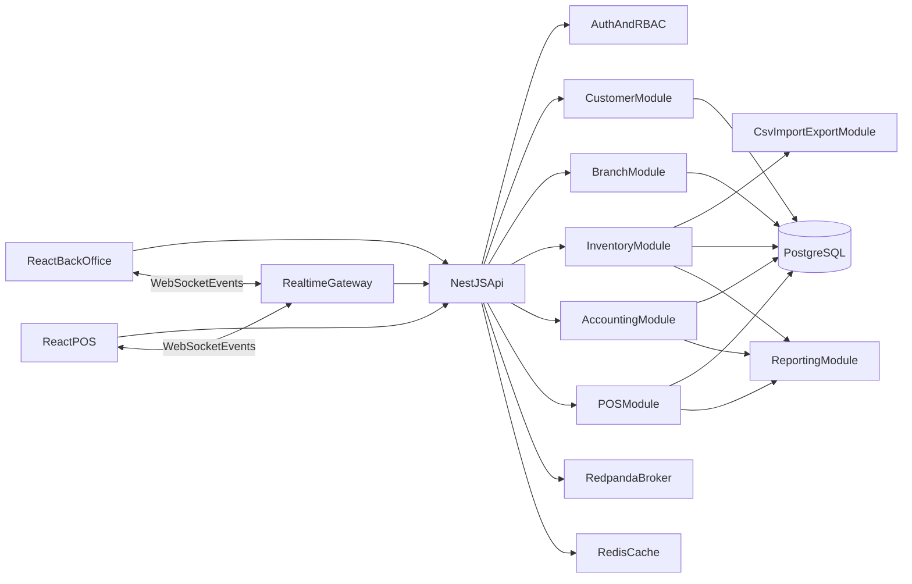

# Architecture

## System Overview

The ERP is a modular monolith in NestJS for V1, with clear module boundaries and domain ownership. React provides two web experiences: back-office and POS. PostgreSQL stores operational, ledger, and reporting-ready transactional data.
The repository is managed as a `pnpm` workspace monorepo to share contracts and reduce duplication across apps.
TypeORM is the standard ORM/data-access layer for the NestJS API.

## Logical Components

- React Back Office
  - Generic CRUD Management Page Framework
- React POS Client
- NestJS API
  - Generic CRUD Core (base service + entity registry)
  - Auth and Access Control
  - Customer Module
  - Branch Module
  - Inventory Module
  - Accounting Module
  - POS Module
  - Reporting Module
  - CSV Import/Export Module
  - Realtime Notification Gateway (WebSocket)
- PostgreSQL Database
- Redpanda Cluster (Kafka-compatible event broker)
- Redis Cache
- Shared Workspace Packages
  - `@erp/shared-interfaces`
  - `@erp/shared-utils` (optional)

## Monorepo and Package Boundaries

- Workspace structure:
  - `apps/api` (NestJS)
  - `apps/backoffice-web` (React)
  - `apps/pos-web` (React)
  - `packages/shared-interfaces` (shared domain contracts)
- `@erp/shared-interfaces` contains DTO-style types, enums, and common API contracts.
- Shared package code must remain framework-agnostic and side-effect free.
- Backend and frontend must not define duplicate versions of the same domain interfaces.

## High-Level Data Flow

## Tenancy and Branch Strategy

- Single database, shared schema.
- `organizationId` is mandatory on all business entities.
- `mainBranchId` is required at organization level and identifies default parent branch.
- `branchId` is mandatory on all branch-owned operational entities.
- Read access is filtered by role scope:
  - Organization-wide roles can read all branches.
  - Branch roles are restricted to assigned branches.
- Main branch dashboards can query consolidated reporting read models when caller has consolidated-report permission.

## Module Boundaries

- Customer module owns customer profile lifecycle and dedupe policy.
- Inventory module owns stock, location hierarchy, and stock ledger.
- Accounting module owns chart of accounts, journal posting, and sub-ledgers.
- POS module owns sales transactions and cashier shift lifecycle.
- Reporting module owns read models and KPI aggregates.

## Integration Rules

- Module interaction is internal service calls (NestJS providers) in V1.
- All write operations pass through domain services (no direct repository writes from controllers).
- Data access is implemented via TypeORM repositories and query builders.
- Generic entity management APIs should reuse a shared base CRUD service and metadata registry.
- Ledger writes happen inside transactional boundaries with source transaction metadata.
- API and UI contract models are imported from `@erp/shared-interfaces` to keep request/response types aligned.
- Domain events are published to Redpanda for asynchronous workflows and integration-safe processing.
- Consumers use idempotent handlers and retry policies to avoid duplicate side effects.

## Messaging and Caching Strategy

- Redpanda is the distributed message broker layer (Kafka protocol compatible).
- Kafka integration is implemented through shared `kafkajs` package (`@erp/shared-kafka-client`).
- Initial event topics include:
  - `erp.sale.posted`
  - `erp.stock.movement.posted`
  - `erp.journal.posted`
  - `erp.customer.merged`
- Producer and consumer use different config profiles:
  - Producer profile: optimized for publish reliability and batching.
  - Consumer profile: optimized for group coordination, throughput, and retry behavior.
- Redis is used for:
  - Short-lived query/result cache
  - Permission and branch-scope cache
  - Idempotency and rate-limit helper keys
  - JWT session validation and token revocation checks
- Cache invalidation is triggered on write-side commits or relevant domain events.

## Realtime Notification Strategy

- WebSocket gateway publishes acknowledgement and notification events to subscribed clients.
- Realtime transport stack uses `socket.io` with Redis adapter for horizontal scaling.
- Typical push events:
  - `inventory.import.status.changed`
  - `pos.checkout.acknowledged`
  - `report.job.completed`
  - `reconciliation.completed`
- WebSocket events include correlation IDs so clients can map responses to submitted actions.
- REST endpoints remain the source of truth; WebSocket is used for status acceleration and UX responsiveness.
- Sticky-session is enforced at ingress/load balancer when polling fallback is enabled.

## Reliability and Consistency

- PostgreSQL transactions for multi-table write consistency.
- TypeORM transaction boundaries are used for multi-aggregate write operations.
- Idempotency keys are enforced as global API standard across all request/response flows.
- Optimistic locking where concurrent edits are expected (example: draft documents).
- Generic CRUD paths enforce the same audit, scope, and validation guarantees as specialized modules.

## Observability

- Structured logs with request ID, actor ID, branch ID, module, and action.
- Audit log stream for critical mutations.
- Metrics:
  - API latency and error rates
  - Broker publish/consume lag and retry counts
  - Redis hit ratio and eviction rates
  - Checkout duration
  - Import success/failure rates
  - Reconciliation mismatches
