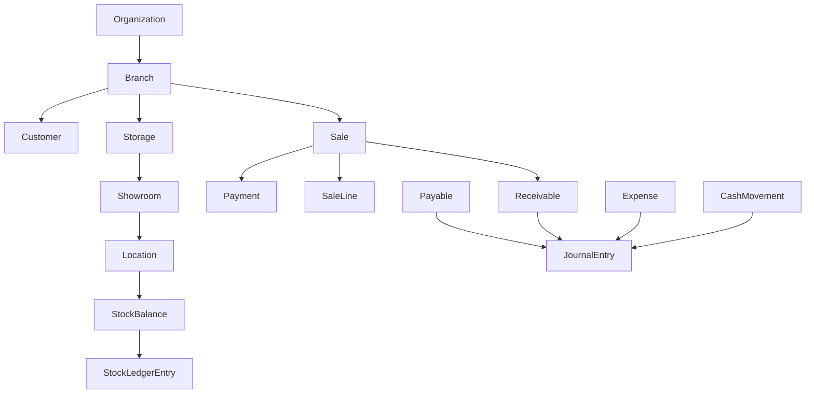

# Domain Model

## Core Entities

## Organization and Access

- Organization
- Branch
- User
- SalesmanAssignment
- SalesManagerAssignment
- Role
- Permission
- UserBranchAssignment
- AuthSession (Redis-backed)
- AuditLog
- DocumentNumberRule
- CrudEntityConfig

## Customer

- Customer
- CustomerContactPoint (optional extension for multiple phones/emails)

## Inventory

- Item
- Provider
- StorageManagerAssignment
- ItemVariant (optional if variant support enabled)
- Storage
- Showroom
- Location
- StockBalance
- StockLedgerEntry
- StockTransfer
- StockAdjustment

## Accounting

- Account
- Invoice
- JournalEntry
- JournalLine
- Payable
- Receivable
- Expense
- CashAccount
- CashMovement

## POS

- PosTerminal
- PosSession (shift)
- Order
- Sale
- SaleLine
- Payment
- Return

## Shared Relationships

## Entity Rules

- Every transactional record must include:
  - `organizationId`
  - `branchId` (except explicitly organization-level records like global role templates)
  - `createdBy`
  - `createdAt`
- Ledger entities are append-only:
  - `stock_ledger_entries`
  - `journal_entries` and `journal_lines`
- Soft delete is allowed for master data (example: customer, item), but not for posted transactions.

## Lifecycle States (Summary)

- Customer: `active`, `inactive`, `merged`
- Stock Transfer: `draft`, `approved`, `posted`, `cancelled`
- Payable/Receivable: `draft`, `posted`, `partially_settled`, `settled`, `voided`
- POS Session: `open`, `closing`, `closed`

## Data Ownership Notes

- Customer and Item master data can be global or branch-preferred by policy.
- Stock balances are branch and location specific.
- Accounting entries are branch-tagged while allowing organization-level consolidated reports.
