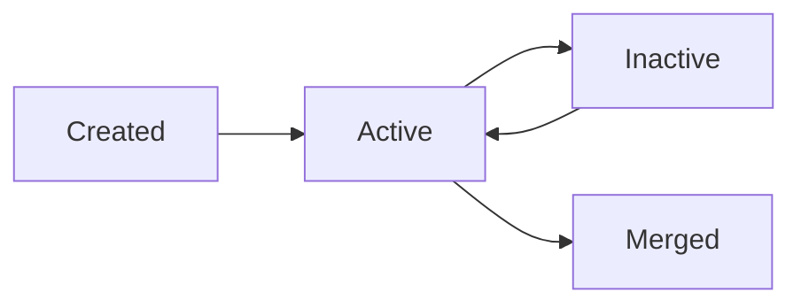

# Customer Management

## Purpose

Maintain consistent and searchable customer profiles across branches, while preserving branch-level operational context.

Implementation note:

- Customer back-office screens and APIs should reuse the generic CRUD platform with customer-specific validation/deduplication hooks.

## Required Fields

- Name (required)
- Email (required, unique policy configurable by organization)
- Address (required)
- Phone number (required)

## Additional Recommended Fields

- Customer code
- Tax ID
- Notes
- Status (`active`, `inactive`)

## Business Rules

- Email and phone are validated for format.
- Duplicate detection uses configurable matching keys:
  - exact email
  - normalized phone number
  - fuzzy name + phone
- Merging customers is allowed only with `customer.merge` permission and creates an audit entry.
- Soft delete is not allowed; use inactive status to preserve transaction history integrity.

## Lifecycle

## Workflows

## Create Customer

1. Validate required fields.
2. Run duplicate check.
3. Save customer profile with branch visibility policy.
4. Emit audit event.

## Update Customer

1. Validate changed fields.
2. Re-run duplicate check if email/phone/name changed.
3. Save update.
4. Emit audit event with before/after diff.

## Merge Duplicate Customers

1. Select source and target customer.
2. Validate no unresolved conflicts.
3. Re-link references (sales, receivables, notes) to target.
4. Mark source as `merged`.
5. Emit high-priority audit event.

## Search and Filter

- Search keys: name, email, phone, customer code.
- Filters: branch, status, created date range, last transaction date.
- Result ordering: most recently updated first by default.

## Edge Cases

- Shared customer transacting in multiple branches.
- Duplicate phone with different country formatting.
- Merging customers with outstanding receivables.

## Acceptance Criteria

- Required fields enforced at API and UI.
- Duplicate detection runs on create and update.
- Merge operations preserve referential integrity and auditability.
