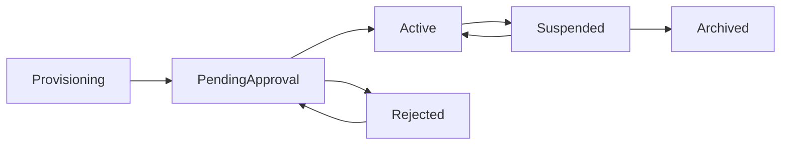

# Branch and Organization Model

## Purpose

Define organization hierarchy, branch boundaries, and visibility rules for operational and reporting consistency.

## Hierarchy

- Organization (top-level legal/business owner)
  - Main Branch (default parent branch, required)
    - Sub Branch (operational unit)
    - Storage / Showroom / POS terminals

Main branch rules:

- Every organization must have exactly one active main branch.
- Main branch is created by default during organization setup.
- Additional branches are created as sub branches under the main branch.
- Main branch cannot be deleted while sub branches exist.
- Main branch owns one default main storage and one default main showroom.

## Registration and Approval Workflow

- New organization registration is created in `pending_approval` status.
- New branch registration is created in `pending_approval` status under requested organization/main-branch hierarchy.
- Superadmin must approve before status becomes `active`.
- Superadmin can reject with mandatory reason code and notes.
- Rejected requests can be edited and resubmitted based on policy.

UI requirements:

- Public/internal onboarding page for organization registration requests.
- Branch registration page for authorized users.
- Superadmin approval queue page with filters by status/date/request type.
- Detail review page including submitted org/branch profile and audit trail.

## Branch Data Ownership

- Branch-owned entities:
  - Salesman and sales manager assignments
  - Storage manager assignments
  - Sales, returns, POS sessions
  - Stock balances and movements
  - Payables, receivables, cash movements
- Organization-scoped entities:
  - Global roles and permission templates
  - Optional shared customer or item catalog

## Branch Assignment Rules

- Users can be assigned to one or more branches.
- Every write transaction must include exactly one `branchId`.
- Cross-branch operations require elevated permissions.
- Branch admin access is scoped by explicit permission grants (not automatic org-wide access).
- Salesman/sales manager roles are branch-scoped assignments.
- Storage manager role is branch-scoped assignment.

## Cross-Branch Visibility

- Branch user:
  - Full read/write within assigned branch.
  - No read access to unassigned branch transactions.
- Branch admin:
  - Can view only branches explicitly granted in role assignments.
  - Can access branch dashboards only for granted scopes.
- Sales manager/salesman:
  - Can access POS and sales functions only for assigned branch scope.
- Storage admin/manager:
  - Can access storage and inventory functions only for assigned branch scope.
- Regional/organization manager:
  - Read across all branches.
  - Controlled write actions based on role.
- Organization owner:
  - Full access across all organization branches.
  - Can view consolidated dashboards and aggregated reporting across the organization.

## Main Branch Dashboard Scope

- Main branch dashboard supports organization-wide aggregation across all branches.
- Aggregated charts/tables can be filtered by branch, date range, and module.
- Branch-level users/admins only see dashboard/report data within granted branch scopes.

## Cross-Branch Operations

- Allowed examples:
  - Stock transfer from Branch A to Branch B.
  - Organization-level consolidated report generation.
- Restricted examples:
  - Editing posted transactions in another branch.
  - Settling branch cash movements without authorization.

## Branch Lifecycle

## Governance

- Branch creation requires admin approval.
- Organization/branch activation requires superadmin approval.
- Main branch provisioning must include default main storage and main showroom creation.
- Archived branch data is read-only.
- Branch closing checklist:
  - Close open POS sessions
  - Reconcile cash
  - Finalize pending stock movements
  - Close open accounting periods as defined by policy

## Acceptance Criteria

- Branch scoping is enforced in all module APIs.
- Cross-branch actions are permission-gated and auditable.
- Archived branch transactions remain queryable for reports.
- Every organization has one default main branch with sub-branch hierarchy support.
- Every main branch has default main storage and main showroom.
- Main branch dashboard can render aggregate organization reports while branch admins remain permission-scoped.
- Organization and branch registration requests remain non-operational until superadmin approval.
