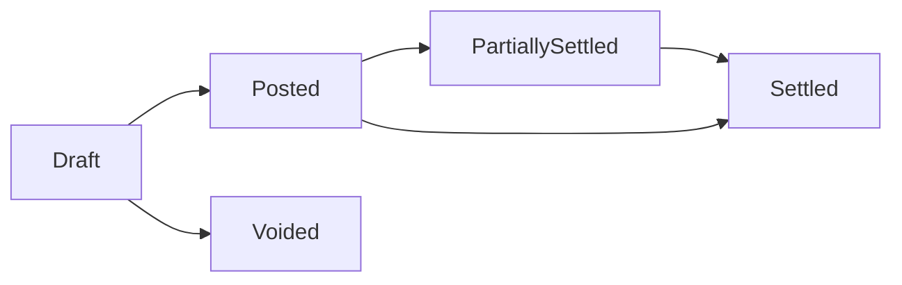

# Accounting Module

## Purpose

Maintain accurate and auditable financial records for branch operations and organization-level consolidation.

## Scope

- Chart of accounts
- Journal posting engine
- Payables
- Receivables
- Expenses
- Cash transactions and reconciliation support

Implementation note:

- Accounts, payables, receivables, and expenses should use the generic CRUD platform for base operations, with lifecycle/state guard extensions for posted/settled controls.

## Chart of Accounts

Account categories:

- Assets
- Liabilities
- Equity
- Revenue
- Expenses

Rules:

- Account codes are unique per organization.
- Accounts can be branch-specific or shared depending on policy.
- Posting to header/control accounts is blocked unless explicitly allowed.

## Posting Engine

- Double-entry accounting is mandatory (`total debits = total credits`).
- Journal entries are immutable after posting.
- Corrections require reversal + replacement entries.
- Every journal links to source transaction:
  - sale
  - return
  - exchange
  - payable invoice
  - receivable invoice
  - expense
  - cash movement

## Payables Lifecycle

Required fields:

- Vendor reference
- Branch
- Due date
- Amount and currency
- Expense/account mapping

## Receivables Lifecycle

Required fields:

- Customer reference
- Branch
- Due date
- Amount and currency
- Revenue/account mapping

## Expense Management

- Expense claims or direct expense entries per branch.
- Categories map to expense accounts.
- Approval workflow required above configured amount thresholds.
- Posting creates journal entries with optional payable linkage.

## Cash Management

- Cash accounts represent physical tills and bank-like cash holdings.
- Cash movements:
  - deposit
  - withdrawal
  - transfer
  - adjustment
- End-of-shift cash reconciliation integrates with POS session close.

## Controls

- Period close prevents new postings to closed periods.
- Backdated postings require privileged role and reason code.
- Suspicious variances require approval and are audited.
- Financial documents must use configured document numbering rules (prefix/suffix/timestamp/sequence).
- Document numbers are immutable once transaction is posted.
- Exchange transactions must post financial difference entries (top-up/refund/credit) with source sale reference.

## Acceptance Criteria

- All accounting transactions produce balanced journal entries.
- Payables and receivables support partial and full settlement.
- Cash balances are reconcilable with POS and movement records.
