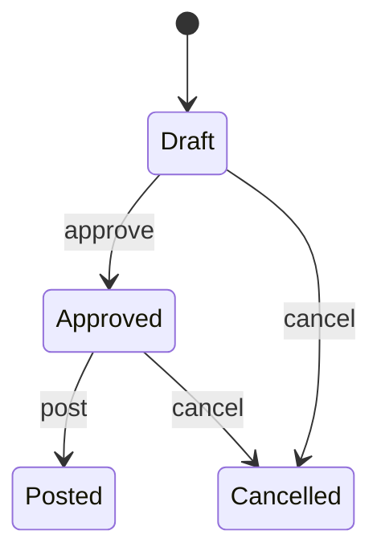
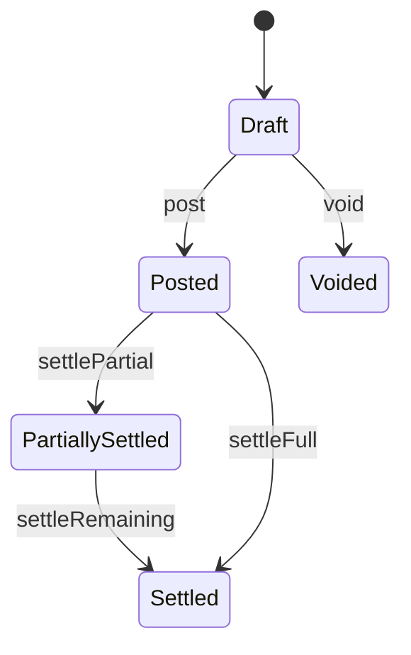
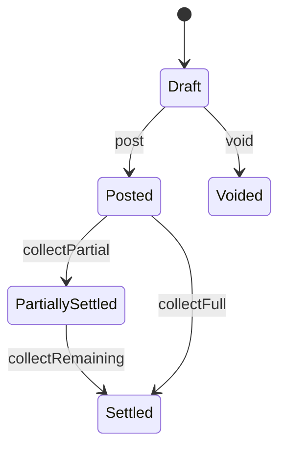
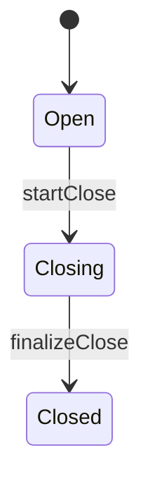

# Workflows and State Machines

## Purpose

Define controlled state transitions for high-risk and high-value transactions.

## Stock Transfer State Machine

Transition rules:

- `post` allowed only from `Approved`.
- `cancel` forbidden after `Posted`.
- Posting writes paired ledger entries (`transfer_out`, `transfer_in`).

## Payable State Machine

Transition rules:

- Settlements require available cash account or approved payment source.
- Voiding is blocked once any settlement exists.

## Receivable State Machine

Transition rules:

- Collection cannot exceed open balance.
- Write-off requires elevated permission and reason code.

## POS Session State Machine

Transition rules:

- No new checkout allowed once `Closing` starts.
- `finalizeClose` requires reconciliation result and variance handling.

## Reversal and Correction Policy

- Posted transactions are immutable.
- Corrections are performed by:
  - reversal transaction
  - replacement transaction (if needed)
- Reversal must reference source transaction ID and reason code.

## Aftersales Exchange Workflow Rules

- Exchange requires source sale reference or elevated approval override.
- Exchange posting must produce paired inventory effects (`exchange_in`, `exchange_out`).
- Exchange financial difference must be posted as receivable/cash collection or refund/credit.
- Exchange transaction becomes immutable after posting; corrections follow reversal policy.

## Workflow Audit Requirements

- Every transition writes audit event with:
  - actor
  - previous state
  - next state
  - reason
  - timestamp

## Acceptance Criteria

- Illegal transitions are blocked at service layer.
- State transitions and side effects are deterministic.
- Audit trail is complete for all transition actions.
