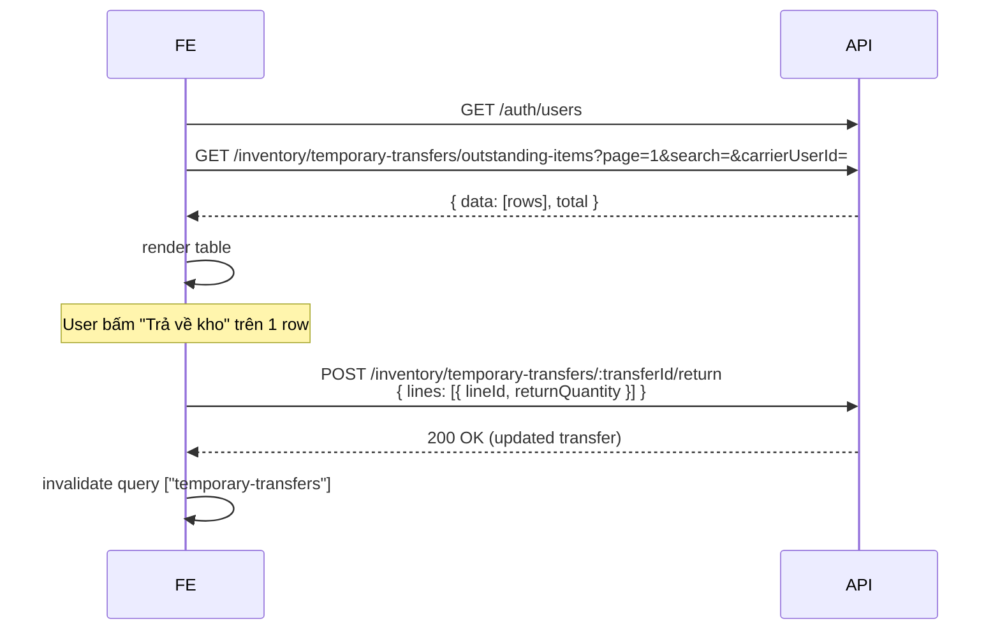
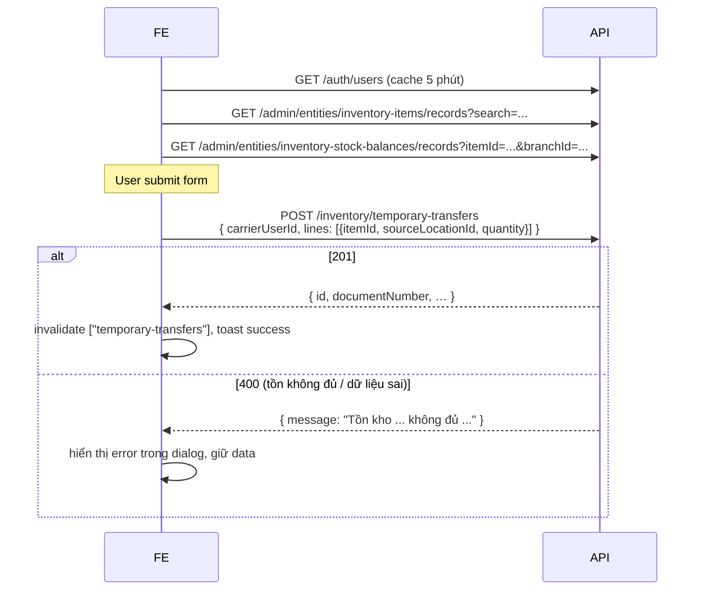

# Temporary Transfer — Hướng dẫn tích hợp API (Frontend)

> **Tài liệu cho FE Developer** tích hợp chức năng **Chuyển kho tạm** (sản phẩm tạm rời kho chính ra "kho tạm" để khách thử, sau đó trả lại).
> Backend đã release tại branch `main`. API base: tùy env (`VITE_API_BASE_URL`).

---

## 1. Mô hình nghiệp vụ (FE cần hiểu trước khi code)

- "Kho tạm" là **một `Location` đặc biệt** (`type = TEMPORARY`) gắn với mỗi branch. Mỗi branch có **đúng 1** kho tạm, do BE tự khởi tạo lần đầu khi gọi API tạo phiếu — FE **không** cần tạo trước.
- 1 phiếu (`TemporaryTransfer`) gồm header + nhiều `lines`. Mỗi line ghi nhận: item nào, lấy từ vị trí nguồn nào (E15.01…), số lượng, đã trả về bao nhiêu.
- Phiếu **được post ngay khi tạo** — không có DRAFT/APPROVED. Tồn kho được ghi nhận tức thì qua `stock_ledger` + `stock_balances`.
- Trạng thái phiếu:
  - `OPEN` — vừa tạo, chưa có line nào được trả.
  - `PARTIALLY_RETURNED` — đã có ít nhất 1 line trả 1 phần.
  - `FULLY_RETURNED` — mọi line `returned_quantity = quantity`.
  - `CANCELLED` — hủy phiếu (chỉ được khi chưa trả gì).
- Phân biệt với 2 khái niệm gần:
  - **Showroom**: sản phẩm trưng bày để xem — KHÔNG dùng kho tạm.
  - **Stock Transfer** (chuyển kho thường): chuyển **permanent** giữa 2 vị trí, có workflow DRAFT/APPROVED/POSTED, **không** có khái niệm "trả về".

---

## 2. Xác thực & headers chung

Mọi request đều cần:

| Header | Bắt buộc | Ghi chú |
|---|---|---|
| `Authorization: Bearer <accessToken>` | ✅ | Lấy từ login flow, refresh tự động bởi axios interceptor. |
| `X-Branch-Id: <branchId>` | ✅ | Branch hiện tại; BE dùng để scope dữ liệu. |
| `X-Request-Id` | optional | UUID giúp trace log. |
| `X-Idempotency-Key` | optional | Khuyến nghị cho `POST` (tránh trùng phiếu khi user double-click). |
| `Content-Type: application/json` | ✅ với POST | |

Trong codebase đã có `erpApi` (file `apps/backoffice-web/src/lib/erp-api.ts`) tự inject 4 header trên — **dùng nó thay vì gọi axios trực tiếp**:

```ts
import { erpApi, requireErpData } from "@/lib/erp-api";

const data = requireErpData(
  await erpApi.GET<MyResponse>("/inventory/temporary-transfers", {
    params: { query: { page: 1, pageSize: 50 } },
  }),
);
```

`requireErpData` ném `HttpError` khi BE trả error body, tự rút message Tiếng Việt từ field `message`.

---

## 3. Endpoints

Tất cả prefix: **`/inventory/temporary-transfers`**

| Method | Path | Permission key | Mục đích |
|---|---|---|---|
| `POST` | `/` | `inventory.temporary-transfer.create` | Tạo phiếu mới (posted ngay) |
| `GET` | `/` | `inventory.temporary-transfer.read` | List phiếu (header) |
| `GET` | `/outstanding-items` | `inventory.temporary-transfer.read` | List **dòng** đang ở kho tạm (cho UI giống screenshot) |
| `GET` | `/:id` | `inventory.temporary-transfer.read` | Chi tiết 1 phiếu |
| `POST` | `/:id/return` | `inventory.temporary-transfer.return` | Trả 1 phần / toàn bộ |
| `POST` | `/:id/cancel` | `inventory.temporary-transfer.cancel` | Hủy phiếu (chỉ khi `returned_quantity = 0` mọi line) |

### 3.1 `POST /inventory/temporary-transfers` — Tạo phiếu

**Request body**
```json
{
  "carrierUserId": "8f1a…uuid",      // FK users.id (người vận chuyển)
  "sourceBranchId": "branch-uuid",   // optional, default = X-Branch-Id
  "notes": "Khách thử size 37 và 38",
  "lines": [
    {
      "itemId": "item-uuid",
      "sourceLocationId": "loc-uuid",  // ví dụ vị trí E15.01
      "quantity": 1,
      "notes": "Sandal nữ"
    },
    { "itemId": "item-uuid-2", "sourceLocationId": "loc-uuid", "quantity": 1 }
  ]
}
```

**Validation BE**
- `lines` phải có ≥ 1 phần tử, mỗi `quantity > 0`.
- `sourceLocationId` của line **khác** vị trí kho tạm đích (BE tự resolve).
- Tồn kho thực tế (`stock_balances.quantity`) tại `sourceLocationId` ≥ `quantity` của line.
- `carrierUserId` không bị validate FK ở runtime (BE trust UUID) — FE nên chỉ cho user chọn từ `/auth/users`.

**Response 201**
```json
{
  "id": "xfer-uuid",
  "documentNumber": "TMP-202605-00001",
  "organizationId": "...",
  "branchId": "branch-001",
  "sourceBranchId": "branch-001",
  "destinationTempLocationId": "loc-temp",
  "carrierUserId": "...",
  "status": "OPEN",
  "postedAt": "2026-05-14T03:21:00.000Z",
  "postedBy": "...",
  "returnedAt": null,
  "notes": "...",
  "lines": [
    {
      "id": "line-uuid",
      "transferId": "xfer-uuid",
      "itemId": "...",
      "sourceLocationId": "...",
      "quantity": "1.00",        // numeric → string (TypeORM behavior)
      "returnedQuantity": "0.00",
      "notes": "..."
    }
  ],
  "createdAt": "...",
  "updatedAt": "...",
  "createdBy": "..."
}
```

> ⚠️ Các trường `quantity` / `returnedQuantity` trả về là **string** do `numeric` của Postgres. Khi tính toán FE phải `Number(line.quantity)`.

**Error phổ biến**
| HTTP | message ví dụ | Khi nào |
|---|---|---|
| 400 | `Phiếu chuyển kho tạm phải có ít nhất 1 dòng` | `lines` rỗng |
| 400 | `Số lượng từng dòng phải lớn hơn 0` | `quantity ≤ 0` |
| 400 | `Tồn kho tại vị trí nguồn không đủ cho mặt hàng <itemId> (còn 5, cần 10)` | Đặt quantity > balance |
| 400 | `Vị trí nguồn không được trùng với kho tạm đích` | Truyền sai sourceLocationId |
| 403 | Forbidden | Thiếu permission `inventory.temporary-transfer.create` |

### 3.2 `GET /inventory/temporary-transfers` — List phiếu

**Query params**
| Tên | Type | Bắt buộc | Default | Ghi chú |
|---|---|---|---|---|
| `page` | int ≥ 1 | optional | 1 | |
| `pageSize` | int 1..200 | optional | 20 | |
| `status` | enum `OPEN \| PARTIALLY_RETURNED \| FULLY_RETURNED \| CANCELLED` | optional | — | |
| `branchId` | uuid | optional | scope của actor | |
| `carrierUserId` | uuid | optional | — | |

**Response**
```json
{
  "data": [ { /* TemporaryTransfer + lines */ } ],
  "total": 42,
  "page": 1,
  "pageSize": 20
}
```

Sort cố định: `postedAt DESC`.

### 3.3 `GET /inventory/temporary-transfers/outstanding-items` — Items đang ở kho tạm

**Quan trọng**: endpoint này dành riêng cho **UI dạng bảng từng dòng** (giống screenshot user gửi). Mỗi row = 1 line đang còn sản phẩm ở kho tạm (`quantity > returned_quantity`), kèm thông tin item + vị trí gốc + người vận chuyển → FE không cần join thêm.

**Query params**

| Tên | Type | Mặc định | Ghi chú |
|---|---|---|---|
| `page` | int | 1 | |
| `pageSize` | int | 20 | |
| `branchId` | uuid | scope actor | |
| `carrierUserId` | uuid | — | |
| `search` | string | — | Lọc theo SKU / tên item / mã vị trí (ILIKE) |

**Response**
```json
{
  "data": [
    {
      "lineId": "line-uuid",
      "transferId": "xfer-uuid",
      "postedAt": "2026-05-14T10:11:00.000Z",
      "documentNumber": "TMP-202605-00001",
      "carrierUserId": "user-uuid",
      "itemId": "...",
      "itemCode": "AKDP1126-BA-37",
      "itemName": "Sandal nữ AKDP1126-BA-37",
      "unit": "Đôi",
      "sourceLocationId": "...",
      "sourceLocationCode": "E15.01",
      "quantity": "1.00",
      "returnedQuantity": "0.00",
      "outstandingQuantity": "1.00"
    }
  ],
  "total": 2, "page": 1, "pageSize": 20
}
```

Chỉ trả về line thuộc phiếu có `status IN (OPEN, PARTIALLY_RETURNED)`.

### 3.4 `GET /inventory/temporary-transfers/:id` — Chi tiết

Trả về 1 `TemporaryTransfer` (giống response của POST). 404 nếu không thuộc `organizationId` của actor.

### 3.5 `POST /inventory/temporary-transfers/:id/return` — Trả về kho

Hỗ trợ **partial** (trả nhiều lần, mỗi lần nhiều line).

**Request body**
```json
{
  "lines": [
    { "lineId": "line-uuid-1", "returnQuantity": 1 },
    { "lineId": "line-uuid-2", "returnQuantity": 0.5 }
  ]
}
```

**Validation BE**
- `lineId` phải thuộc phiếu này (404 nếu không).
- `returnQuantity > 0`.
- `returnQuantity ≤ line.quantity - line.returnedQuantity` (số còn lại chưa trả).
- Phiếu phải đang `OPEN` hoặc `PARTIALLY_RETURNED`.

**Response**: phiếu sau khi cập nhật (status có thể chuyển sang `PARTIALLY_RETURNED` hoặc `FULLY_RETURNED`).

**Error**
| HTTP | message | Khi nào |
|---|---|---|
| 400 | `Số lượng trả của dòng <lineId> phải nằm trong khoảng (0, <remaining>]` | Trả quá tồn |
| 400 | `Phiếu <docNumber> đã trả đủ, không thể trả thêm` | Status đã `FULLY_RETURNED` |
| 400 | `Phiếu <docNumber> đã bị hủy, không thể trả thêm` | Status `CANCELLED` |
| 404 | `Dòng <lineId> không thuộc phiếu này` | Truyền sai lineId |

### 3.6 `POST /inventory/temporary-transfers/:id/cancel` — Hủy phiếu

Chỉ thành công khi:
- `status = OPEN`
- **Mọi** line có `returned_quantity = 0`

BE sẽ ghi ledger đảo (TRANSFER_OUT từ kho tạm + TRANSFER_IN về vị trí nguồn) để hoàn trả tồn, rồi set `status = CANCELLED`.

---

## 4. Endpoint phụ trợ FE cần dùng

| Endpoint | Mục đích |
|---|---|
| `GET /auth/users` | Lấy danh sách user active của org → dropdown chọn `carrierUserId`. Trả `[{ id, firstName, lastName, email }]`. |
| `GET /admin/entities/inventory-items/records?search=...` | Search item theo SKU/tên cho line autocomplete. |
| `GET /admin/entities/inventory-stock-balances/records?itemId=...&branchId=...` | Lấy danh sách `(item, location, quantity)` để user chọn `sourceLocationId` (chỉ những vị trí còn tồn). |

---

## 5. Flow tích hợp khuyến nghị

### 5.1 Trang chính "Đang ở kho tạm" (UI giống screenshot)

```
┌─────────────────────────────────────────────────────────────┐
│ [Tạo phiếu chuyển kho tạm] [Làm mới]                         │
│                                                              │
│ Tìm SKU/tên/vị trí: [____]   Người vận chuyển: [Tất cả ▼]    │
│                                                              │
│ Thời gian | Người vận chuyển | SKU | Tên hàng | Vị trí | ĐVT │
│  | Số lượng | [Trả về kho]                                   │
└─────────────────────────────────────────────────────────────┘
```

**Sequence**



**Code mẫu (đã có sẵn trong `apps/backoffice-web/src/hooks/useTemporaryTransfers.ts`)**:

```ts
import {
  useOutstandingTemporaryItems,
  useReturnTemporaryTransfer,
  useCarrierUsers,
} from "@/hooks/useTemporaryTransfers";

const { data: page } = useOutstandingTemporaryItems({ page: 1, pageSize: 50 });
const { data: carriers } = useCarrierUsers();
const returnMutation = useReturnTemporaryTransfer(row.transferId);

await returnMutation.mutateAsync({
  lines: [{ lineId: row.lineId, returnQuantity: 1 }],
});
```

### 5.2 Form tạo phiếu



**Validation FE nên làm trước khi POST** để giảm round-trip:
- Bắt buộc `carrierUserId`.
- Mỗi line: `itemId`, `sourceLocationId`, `quantity > 0`.
- `quantity` không vượt quá balance hiển thị (info-only — final check vẫn ở BE).

### 5.3 Trang chi tiết phiếu + partial return

Cùng pattern, dùng `useTemporaryTransferDetail(id)` để fetch, hiển thị lines với 2 cột `quantity` / `returnedQuantity` / `remaining`. Cho phép user nhập `returnQuantity` từng line rồi gọi `useReturnTemporaryTransfer`.

---

## 6. Error handling

`erpApi` wrapper trả `{ data, error }`. `requireErpData()` ném `HttpError` khi có error.

```ts
import { HttpError } from "@/lib/http";
import { toast } from "sonner";

try {
  await createMutation.mutateAsync(payload);
  toast.success("Đã tạo phiếu");
} catch (err) {
  if (err instanceof HttpError) {
    // err.status, err.code, err.message (đã là Tiếng Việt từ BE)
    toast.error(err.message);
  } else {
    toast.error("Lỗi không xác định");
  }
}
```

**Mapping HTTP status FE nên xử lý riêng**

| Status | UX gợi ý |
|---|---|
| 400 | Show `err.message` trong dialog/form, không đóng dialog |
| 401 | axios interceptor đã tự refresh → user thường không thấy |
| 403 | Toast "Bạn không có quyền …" + ẩn nút action |
| 404 | Toast "Phiếu không tồn tại hoặc đã bị xóa" + refresh list |
| 409 | Hiếm — show message từ BE |
| 5xx | Toast generic + nút "Thử lại" |

---

## 7. Quy ước queryKey (TanStack Query)

Để invalidate hiệu quả, thống nhất prefix:

```ts
["temporary-transfers"]                                   // bust tất cả
["temporary-transfers", "list", { page, status }]
["temporary-transfers", "outstanding", { page, search }]
["temporary-transfers", "detail", id]
```

Sau mỗi mutation thành công:
```ts
queryClient.invalidateQueries({ queryKey: ["temporary-transfers"] });
```

(Hook `useCreateTemporaryTransfer` / `useReturnTemporaryTransfer` đã làm sẵn.)

---

## 8. Permissions cần seed trong RBAC

Trước khi user thao tác được, admin cần gán các permission key sau cho role tương ứng:

```
inventory.temporary-transfer.create
inventory.temporary-transfer.read
inventory.temporary-transfer.return
inventory.temporary-transfer.cancel
```

Gán qua trang **Cấu hình → Quyền & Vai trò** (hoặc seed trong `permissions.seed.ts`).

---

## 9. Idempotency & tối ưu UX

- **Idempotency-Key** cho `POST /` và `POST /:id/return`: gen UUID v4 cho mỗi lần user nhấn nút "Lưu/Trả về kho". Tránh:
  - User double-click → tạo 2 phiếu.
  - Mất mạng, retry → BE tạo lại bằng cùng `X-Idempotency-Key` (BE dùng Redis lưu key + response trong 10 phút).

```ts
const idempotencyKey = useMemo(() => crypto.randomUUID(), [dialogOpenedAt]);
await erpApi.POST("/inventory/temporary-transfers", {
  headers: { "X-Idempotency-Key": idempotencyKey },
  body,
});
```

- **Optimistic update**: với `return`, có thể trừ ngay `outstandingQuantity` trong cache trước khi nhận response để UI mượt hơn. Rollback khi mutation lỗi.

---

## 10. Checklist nghiệm thu FE

- [ ] Hiển thị bảng "Đang ở kho tạm" với cột Thời gian, Người vận chuyển, SKU, Tên, Vị trí, ĐVT, Số lượng (giống screenshot).
- [ ] Search + filter carrier hoạt động.
- [ ] Tạo phiếu: form validate FE + hiển thị error 400 từ BE.
- [ ] Tạo phiếu thành công → row mới xuất hiện trong bảng ngay (invalidate query).
- [ ] Trả về kho: trả 1 phần → status UI cập nhật `PARTIALLY_RETURNED`, số còn lại đúng.
- [ ] Trả nốt → row biến mất khỏi bảng outstanding.
- [ ] Hủy phiếu (nếu có UI): chỉ enable khi `OPEN` và mọi line chưa trả.
- [ ] UI text tiếng Việt, số / ngày format `vi-VN`.
- [ ] Permission denied (403) → toast Tiếng Việt + ẩn nút.
- [ ] Idempotency-Key gắn vào POST.

---

## Liên hệ BE

Bug / câu hỏi schema: ping team BE kèm `documentNumber` hoặc `transferId`. Log tra ở:
- App log: `nest`logger format, search `Temporary transfer ...`.
- Audit trail: query `stock_ledger_entries WHERE reference_type='TEMP_TRANSFER' AND reference_id=<transferId>`.
