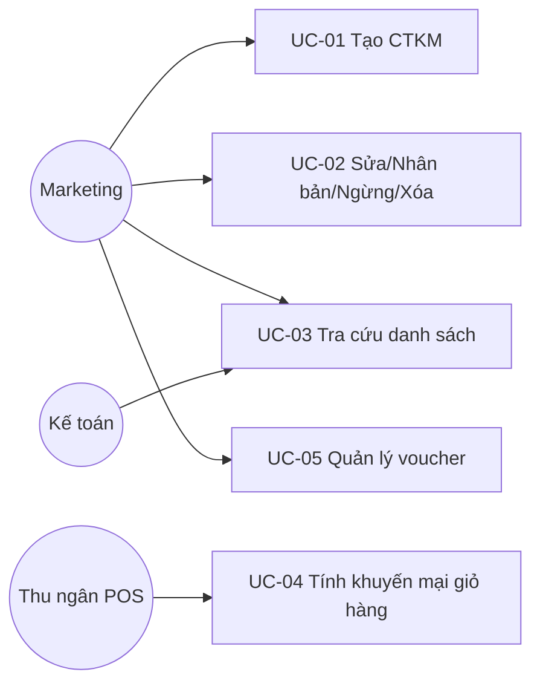
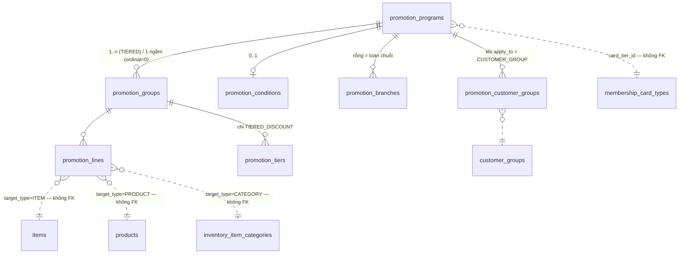
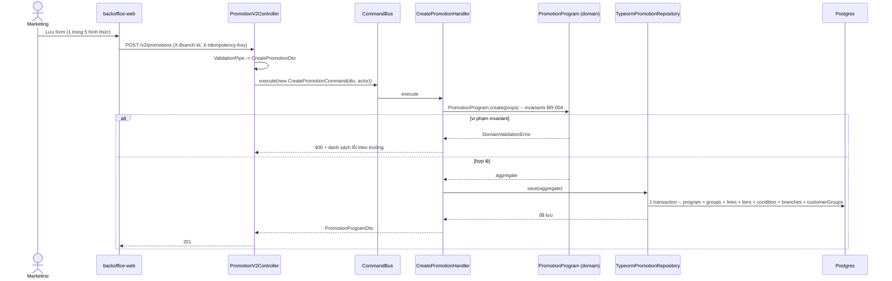
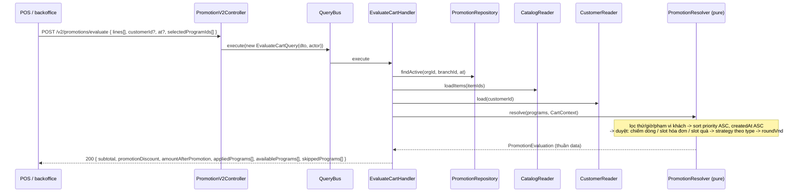
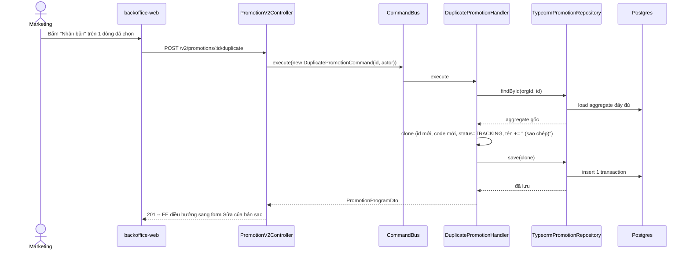

# Thiết kế — Module Khuyến mại (schema chuẩn hóa, domain engine, evaluate API)

**Mã tài liệu:** DESIGN-KM-001
**Phiên bản:** 0.1
**Ngày:** 23/07/2026
**Tài liệu nguồn:** [`docs/promotions/25-promotion-req.md`](./promotions/25-promotion-req.md) (REQ-KM-001), [`docs/promotions/promotion-misa-eshop-survey.md`](./promotions/promotion-misa-eshop-survey.md)
**Epic:** [`tickets/epics/EPIC-22072026-promotion-programs-engine.md`](../tickets/epics/EPIC-22072026-promotion-programs-engine.md)
**Module:** `apps/api/src/modules/promotion/`

> Đây là tài liệu **thiết kế** (design), không phải tài liệu yêu cầu — REQ-KM-001 mô tả *cái gì*, tài liệu này chốt *làm thế nào*. Mọi mục `[Q]` của REQ có một quyết định tương ứng ở mục 7. Định danh kỹ thuật (tên bảng/cột/enum/class) giữ tiếng Anh; văn xuôi tiếng Việt.

---

## 1. Bối cảnh & phạm vi

### 1.1. Hiện trạng

| Tầng | Hiện trạng | Bằng chứng |
| ---- | ---------- | ---------- |
| FE backoffice | Khung đã dựng xong trên mock, 5 variant theo hình thức, chỉ `PromotionInvoiceDiscount` được wire | `apps/backoffice-web/src/pages/promotions/programs/ProgramFormPage/ProgramFormPage.tsx`, `_mock/mock-programs.ts`, `_mock/mock-vouchers.ts` |
| BE | Stub — `promotions` bảng `jsonb` không kiểu, không hiểu `gift_product`/`buy_x_get_y` | `promotion.entity.ts:20-24`, `promotion-apply.service.ts:233-245` (`computePromotionAmount` trả `0` cho mọi promotion không phải percentage/discount_amount phẳng) |

Epic đóng khoảng cách này bằng schema chuẩn hóa mới (7 bảng), domain engine thuần TS, và `POST /v2/promotions/evaluate`. Bảng `promotions` cũ, `PromotionApplyService`, `discount_codes`, `invoice_promotions` **giữ nguyên** — không đụng, không migrate dữ liệu cũ. Tích hợp vào POS checkout là epic sau.

### 1.2. Phạm vi tài liệu này

Chốt: ERD đầy đủ cột (mục 3), use case (mục 2), sequence (mục 4), kiến trúc phân lớp (mục 5), thuật toán engine (mục 6), truy vết FR/BR (mục 7), ma trận tính năng (mục 8), ngoài phạm vi (mục 9), và các lệch pha đã phát hiện giữa FE đã build và thiết kế BE (mục 10) — mục 10 là phần **mới**, không có trong khảo sát ban đầu, phát hiện khi đối chiếu từng trường `ProgramFormState` với schema TKT-KM-02 trong quá trình viết tài liệu này.

### 1.3. Ánh xạ thuật ngữ REQ ↔ entity có sẵn

| REQ | Entity | Ghi chú |
| --- | ------ | ------- |
| Hàng hóa | `ProductEntity` (`products`) | không có giá, không có nhóm |
| Mẫu mã / Mã SKU | `ItemEntity` (`items`) | `ItemEntity.code` chính là SKU |
| Nhóm hàng hóa | `ItemCategoryEntity` (`inventory_item_categories`) | cây qua `parentGroupId`, độ sâu không giới hạn (guard 50, xem mục 5) |
| Nhóm khách hàng | `CustomerGroupEntity` (`customer_groups`) | phẳng |
| Hạng thẻ | `MembershipCardTypeEntity` (`membership_card_types`) | qua `MembershipCardEntity` của khách |
| Khách hàng có sinh nhật | `CustomerEntity.birthDate` | |

---

## 2. Use case



### UC-01 — Marketing tạo CTKM

- **Actor:** Quản lý cửa hàng / Marketing.
- **Tiền điều kiện:** đăng nhập backoffice, quyền `promotion.write`.
- **Luồng chính:** mở `/promotions/programs` → `Thêm mới` → chọn 1/5 hình thức (`?type=`) → điền form → `Lưu` → mapper (`toCreateDto`) build DTO theo hình thức → `POST /v2/promotions` → `PromotionProgram.create()` validate → lưu 1 transaction (7 bảng) → 201 → FE toast + điều hướng danh sách.
- **5 nhánh — bảng con được ghi mỗi nhánh:**

  | Hình thức | Cột riêng trên `promotion_programs` | Bảng con |
  | --- | --- | --- |
  | `INVOICE_DISCOUNT` | `invoice_scope`, `discount_mode`, `discount_value` | `promotion_conditions` (nếu có điều kiện) + `promotion_lines(role=CONDITION)` khi `calc_basis=ITEM_CATEGORIES`/`SPECIFIC_QUANTITY` |
  | `ITEM_DISCOUNT` | — | `promotion_lines(role=REWARD, target=PRODUCT\|ITEM\|CATEGORY)` + điều kiện như trên |
  | `TIERED_DISCOUNT` | `tier_basis`, `tier_scope`, `target_type`, `max_discount_amount` | `promotion_groups` (n nhóm) + `promotion_lines(role=REWARD)` mỗi nhóm (bỏ qua khi `tier_basis=INVOICE_VALUE`) + `promotion_tiers` mỗi nhóm |
  | `GIFT_ITEM` | `gift_mode` | `promotion_lines(role=REWARD, target=ITEM, max_unit_price)` + `promotion_conditions(multiply_gift)` |
  | `BUY_M_GET_N` | `buy_get_policy`, `buy_quantity`, `gift_quantity` | `promotion_lines(role=CONDITION)` (điều kiện mua) + `promotion_lines(role=REWARD)` (chỉ khi `policy=SPECIFIC`) |

  Mọi hình thức đều có thể ghi thêm `promotion_branches` (khi `storeScope=SELECTED`) và `promotion_customer_groups` (khi `applyTo=CUSTOMER_GROUP`).
- **Luồng thay thế:** vi phạm invariant BR-004 → `DomainValidationError` → 400 `{ message, issues[] }` (toàn bộ lỗi một lần) → FE gắn lỗi từng trường, không điều hướng.
- **Hậu điều kiện:** 1 bản ghi `promotion_programs` mới, `status=TRACKING`, `code` tự sinh (`DocumentType.PROMOTION`, prefix `KM`).
- **Quyền:** `promotion.write`.

### UC-02 — Marketing sửa / nhân bản / ngừng theo dõi / xóa CTKM

- **Actor:** Marketing. **Tiền điều kiện:** CTKM tồn tại, cùng `organizationId`.
- **Luồng chính:**
  - *Sửa*: `GET /v2/promotions/:id` nạp trọn aggregate → form → `PUT /v2/promotions/:id`. Đổi `type` → 400 `PROMOTION_TYPE_IMMUTABLE` (FR-006).
  - *Nhân bản*: `POST /v2/promotions/:id/duplicate` → clone toàn bộ con, `code` mới, `status=TRACKING`, tên `<gốc> (sao chép)`, **không** ghi cho tới khi người dùng bấm Lưu ở form mới (FR-008).
  - *Ngừng theo dõi*: `PATCH /v2/promotions/:id/status` → `{ status: STOPPED }` (2 giá trị duy nhất, xem mục 10.1).
  - *Xóa*: `DELETE /v2/promotions/:id` → soft delete (`deleted_at`); chặn nếu còn bị `invoice_promotions.ref_id` tham chiếu (hook `assertNotReferenced()`, hiện luôn qua vì POS chưa nối — chốt sẵn cho epic POS, FR-009).
- **Luồng thay thế:** sửa/xóa CTKM của org khác → 404 (không lộ tồn tại, không phải 403).
- **Hậu điều kiện:** tùy thao tác. **Quyền:** `promotion.write` (xóa: `promotion.delete`).

### UC-03 — Marketing / Kế toán tra cứu danh sách CTKM

- **Actor:** Marketing, Kế toán. **Tiền điều kiện:** quyền `promotion.read`.
- **Luồng chính:** `POST /v2/promotions/search` với bộ lọc kỳ + cột (`StringFilterDto`/`DateRangeFilterDto`/`EnumFilterDto`) + phân trang (mặc định `limit=50`) → sắp `priority ASC, createdAt ASC` (không phải `createdAt DESC` như các search khác — `priority` là thứ tự áp dụng thật, BR-001) → trả `{ data, total, page, limit }`.
- **Lưu ý:** API **không** tự lọc `status` — mặc định lọc `TRACKING` là hành vi của **FE** (chip xóa được, FR-004), không phải BE ẩn dữ liệu.
- **Quyền:** `promotion.read`.

### UC-04 — Client tính khuyến mại cho giỏ hàng (evaluate)

- **Actor:** client nội bộ (POS ở epic sau; backoffice có thể gọi để xem trước). **Tiền điều kiện:** `X-Branch-Id` hợp lệ.
- **Luồng chính:** `POST /v2/promotions/evaluate` với `lines[]` + `customerId?` + `at?` + `selectedProgramIds[]` → nạp CTKM hiệu lực + catalog + khách hàng (tối đa 5 truy vấn, không N+1) → `PromotionResolver.resolve()` (thuần, không I/O) → trả `{ subtotal, promotionDiscount, amountAfterPromotion, appliedPrograms[], availablePrograms[], skippedPrograms[] }`.
- **Luồng thay thế:** `itemId`/`customerId` không tồn tại → 400 (`UNKNOWN_ITEM`/`UNKNOWN_CUSTOMER`) — sai dữ liệu giỏ hàng là lỗi client, không được âm thầm bỏ qua vì sẽ ra số tiền sai.
- **Hậu điều kiện:** **không ghi bảng nào.**
- **Quyền:** `promotion.read`.

### UC-05 — Marketing phát hành / quản lý thẻ voucher

- **Actor:** Marketing. CRUD phẳng một bảng (không cần clean architecture — xem TKT-KM-10).
- **Luồng chính:** `POST /v2/vouchers/search` (10 cột FR-050, 3 cột tổng hợp tính RAM + `summary` toàn tập) · `POST /v2/vouchers` · `PUT /v2/vouchers/:id` · `POST /v2/vouchers/:id/duplicate` · `DELETE /v2/vouchers/:id`.
- **Quyền:** `promotion.read` / `promotion.write` / `promotion.delete`.

---

## 3. ERD



`promotion_lines.target_id` polymorphic trên 3 bảng → không FK; index `(organization_id, target_type, target_id)` trả lời "SKU nào đang được khuyến mại". Mọi FK con → `promotion_programs` là `ON DELETE CASCADE`.

### 3.1. `promotion_programs`

Kế thừa cột chuẩn `BaseEntity`: `id uuid PK`, `organization_id varchar NOT NULL`, `branch_id varchar NULL` (chi nhánh **người tạo**, không phải phạm vi áp dụng — xem 3.5), `created_at`/`updated_at`, `created_by`. Thêm `deleted_at timestamptz NULL` (soft delete).

| Cột | Kiểu | Null | Ý nghĩa |
| --- | ---- | ---- | ------- |
| `code` | varchar(20) | ✗ | `KM` + số thứ tự tự sinh qua `DocumentNumberingService`, unique theo org |
| `name` | varchar | ✗ | FR-020 |
| `description` | text | ✓ | |
| `type` | `promotion_program_type_enum` | ✗ | immutable sau create (FR-006) |
| `status` | `promotion_status_enum` | ✗ | DEFAULT `'TRACKING'` — **2 giá trị**, xem 10.1 |
| `priority` | int | ✗ | DEFAULT `100`, nhỏ hơn = ưu tiên cao hơn (BR-001) |
| `apply_to` | `promotion_apply_to_enum` | ✗ | DEFAULT `'ALL_CUSTOMERS'` |
| `birthday_match` | `promotion_birthday_match_enum` | ✓ | chỉ khi `apply_to = BIRTHDAY`; **4 giá trị** kể cả `RANGE` — xem 10.2 |
| `birthday_before_days` | smallint | ✓ | **mới (10.2)** — chỉ khi `birthday_match = RANGE` |
| `birthday_after_days` | smallint | ✓ | **mới (10.2)** — chỉ khi `birthday_match = RANGE` |
| `card_tier_id` | uuid | ✓ | `membership_card_types.id`, không FK (khác module) |
| `start_date` / `end_date` | date | ✓ | null = vô thời hạn (BR-003) |
| `days_of_week` | smallint[] | ✗ | DEFAULT `'{}'`, ISO 1..7, rỗng = mọi ngày |
| `start_time` / `end_time` | time | ✓ | `end < start` = ca qua đêm (FR-022) |
| `auto_apply` | boolean | ✗ | DEFAULT `true` (FR-023) |
| `invoice_scope` | `promotion_invoice_scope_enum` | ✓ | chỉ `INVOICE_DISCOUNT` |
| `discount_mode` | `promotion_discount_mode_enum` | ✓ | |
| `discount_value` | numeric(18,2) | ✓ | mức giảm đơn của `INVOICE_DISCOUNT` |
| `max_discount_amount` | numeric(18,2) | ✓ | trần giảm — `TIERED_DISCOUNT` + `tier_basis=INVOICE_VALUE` |
| `tier_basis` | `promotion_tier_basis_enum` | ✓ | căn cứ tính bậc |
| `tier_scope` | `promotion_tier_scope_enum` | ✓ | "tính trên" |
| `target_type` | `promotion_target_type_enum` | ✓ | đối tượng mặc định của lưới (`TIERED_DISCOUNT`/`BUY_M_GET_N`) |
| `gift_mode` | `promotion_gift_mode_enum` | ✓ | chỉ `GIFT_ITEM` |
| `buy_get_policy` | `promotion_buy_get_policy_enum` | ✓ | chỉ `BUY_M_GET_N` |
| `buy_quantity` / `gift_quantity` | int | ✓ | m / n |

Index: `UNIQUE (organization_id, code)`; `(organization_id, status, start_date, end_date)`; `(organization_id, priority)`.

### 3.2. `promotion_groups`

`program_id` FK CASCADE, `ordinal int NOT NULL`, `name varchar NULL`. `UNIQUE (program_id, ordinal)`. Hình thức không phải `TIERED_DISCOUNT` có đúng 1 group ngầm `ordinal=0` — mọi `promotion_lines` (kể cả điều kiện) neo vào group này.

### 3.3. `promotion_lines`

`program_id` FK CASCADE, `group_id` FK CASCADE, `role promotion_line_role_enum NOT NULL`, `target_type promotion_target_type_enum NOT NULL`, `target_id uuid NOT NULL` (**không FK**), `quantity numeric(18,2) NULL`, `discount_mode` NULL, `discount_value numeric(18,2) NULL`, `max_unit_price numeric(18,2) NULL` (cột "Giá bán ≤" của lưới quà tặng), `sort_order int NOT NULL DEFAULT 0`. Index `(program_id)` và `(organization_id, target_type, target_id)`.

### 3.4. `promotion_tiers`

`program_id` FK CASCADE, `group_id` FK CASCADE, `from_value numeric(18,2) NOT NULL`, `to_value numeric(18,2) NULL` (null = ∞), `discount_mode NOT NULL`, `discount_value numeric(18,2) NOT NULL`, `sort_order int NOT NULL DEFAULT 0`. Index `(group_id, from_value)`.

### 3.5. `promotion_conditions`

`program_id uuid NOT NULL UNIQUE` FK CASCADE, `type promotion_condition_type_enum NOT NULL DEFAULT 'NONE'`, `min_amount numeric(18,2) NULL`, `calc_basis promotion_calc_basis_enum NULL`, `group_match_mode promotion_group_match_mode_enum NULL`, `multiply_gift boolean NOT NULL DEFAULT false`. Danh sách nhóm hàng hóa của `calc_basis=ITEM_CATEGORIES` và lưới SKU-số-lượng của `type=SPECIFIC_QUANTITY` nằm ở `promotion_lines` với `role=CONDITION`.

### 3.6. `promotion_branches`

`program_id` FK CASCADE, `branch_id uuid`, `organization_id varchar NOT NULL`. `PRIMARY KEY (program_id, branch_id)`. Rỗng = toàn chuỗi (BR-005). **Đây là phạm vi áp dụng** — khác hoàn toàn `promotion_programs.branch_id` (chi nhánh của người tạo bản ghi, kế thừa từ `BaseEntity`). Khớp `StoreScopePromotionSection` FE: `storeScope=ALL_CHAIN` → không ghi dòng nào; `storeScope=SELECTED` → ghi 1 dòng mỗi `storeIds[]` (giá trị là `branches.id`, xem `useMyBranches()`).

### 3.7. `promotion_customer_groups`

`program_id` FK CASCADE, `customer_group_id uuid`, `organization_id varchar NOT NULL`. `PRIMARY KEY (program_id, customer_group_id)`.

### 3.8. Enum (pg) — đầy đủ

| Enum | Giá trị |
| ---- | ------- |
| `promotion_program_type_enum` | `INVOICE_DISCOUNT` `ITEM_DISCOUNT` `TIERED_DISCOUNT` `GIFT_ITEM` `BUY_M_GET_N` |
| `promotion_status_enum` | `TRACKING` `STOPPED` |
| `promotion_apply_to_enum` | `ALL_CUSTOMERS` `CUSTOMER_GROUP` `BIRTHDAY` `CARD_TIER` |
| `promotion_birthday_match_enum` | `EXACT_DAY` `SAME_WEEK` `SAME_MONTH` `RANGE` *(mới — 10.2)* |
| `promotion_discount_mode_enum` | `PERCENT` `AMOUNT` `FIXED_PRICE` |
| `promotion_invoice_scope_enum` | `NON_PROMO_ONLY` `ALL_ITEMS` |
| `promotion_tier_basis_enum` | `QUANTITY` `ITEM_VALUE` `INVOICE_VALUE` |
| `promotion_tier_scope_enum` | `PER_ITEM` `ALL_ITEMS_IN_GROUP` |
| `promotion_target_type_enum` | `PRODUCT` `ITEM` `CATEGORY` |
| `promotion_gift_mode_enum` | `ONE_OF` `ALL_OF` |
| `promotion_buy_get_policy_enum` | `SPECIFIC` `CHEAPEST` |
| `promotion_line_role_enum` | `CONDITION` `REWARD` |
| `promotion_condition_type_enum` | `NONE` `MIN_INVOICE_AMOUNT` `SPECIFIC_QUANTITY` |
| `promotion_calc_basis_enum` | `ALL_ITEMS` `NON_PROMO_ITEMS` `ITEM_CATEGORIES` |
| `promotion_group_match_mode_enum` | `ANY` `ALL` |

---

## 4. Sequence diagram

### 4.1. Tạo CTKM (write — CommandBus)



### 4.2. Tính khuyến mại (read — QueryBus, không ghi DB)



### 4.3. Nhân bản CTKM



---

## 5. Kiến trúc phân lớp

Module đầu tiên trong repo phân lớp clean architecture (sai lệch chủ ý #2 của epic). Các file legacy (`promotion.entity.ts`, `promotion.service.ts`, `promotion.controller.ts`, `promotion-apply.service.ts`, `voucher.entity.ts`, `voucher.service.ts`, `discount-code.*`, `invoice-promotion.entity.ts`) **giữ nguyên** tại gốc module — cây mới thêm song song, không thay thế.

```
apps/api/src/modules/promotion/
├── domain/                              # thuần TS — cấm import @nestjs/* và typeorm
│   ├── model/
│   │   ├── promotion-program.ts         # aggregate root, invariant BR-004
│   │   ├── promotion-group.ts
│   │   ├── promotion-line.ts
│   │   ├── promotion-tier.ts
│   │   ├── promotion-condition.ts
│   │   ├── cart.ts                      # CartContext, CartLine
│   │   ├── evaluation.ts                # PromotionEvaluation, AppliedProgram, GiftOffer, SkippedProgram
│   │   ├── domain-error.ts              # DomainValidationError
│   │   └── value-objects/
│   │       ├── money.ts                 # roundVnd()
│   │       ├── time-window.ts           # hỗ trợ ca qua đêm
│   │       ├── date-window.ts           # null = vô hạn 2 đầu
│   │       └── customer-scope.ts        # 4 apply_to, kể cả birthday RANGE
│   ├── ports/
│   │   ├── promotion-repository.port.ts # Symbol PROMOTION_REPOSITORY
│   │   ├── catalog-reader.port.ts       # Symbol CATALOG_READER
│   │   └── customer-reader.port.ts      # Symbol CUSTOMER_READER
│   └── engine/
│       ├── promotion-resolver.ts
│       ├── cart-state.ts                # tài nguyên đã bị chiếm (BR-001)
│       └── strategies/                  # 1 file / hình thức, xem mục 6
├── application/                         # CQRS — phụ thuộc domain (port) + @nestjs/cqrs
│   ├── commands/                        # create/update/duplicate/change-status/delete
│   ├── queries/                         # search/get/evaluate-cart
│   ├── dto/
│   └── mappers/
│       └── promotion.mapper.ts          # entity <-> domain
├── infrastructure/                      # duy nhất được phép biết TypeORM
│   ├── entities/                        # 7 @Entity, ánh xạ 1-1 mục 3
│   └── repositories/                    # implement 3 port
├── interface/                           # controller — phụ thuộc application (Command/QueryBus)
│   ├── promotion-v2.controller.ts
│   └── voucher-v2.controller.ts
└── promotion.module.ts                  # đăng ký entity, CqrsModule, bind port -> adapter
```

**Quy tắc phụ thuộc** (hướng vào trong, chuẩn clean architecture): `interface` → `application` → `domain`. `infrastructure` → `domain` (implement port) nhưng không ai phụ thuộc ngược vào `infrastructure`. Kiểm chứng bằng `grep -rE "from '(@nestjs|typeorm)'" domain/` → phải 0 kết quả (AC cứng của TKT-KM-04/05/06).

**Port:**

| Symbol | Interface | Method |
| ------ | --------- | ------ |
| `PROMOTION_REPOSITORY` | `PromotionRepositoryPort` | `findActive(orgId, branchId, at)`, `findById`, `save`, `softDelete` |
| `CATALOG_READER` | `CatalogReaderPort` | `loadItems(orgId, itemIds) -> Map<string, CatalogItemView>` (kèm `categoryPathIds`) |
| `CUSTOMER_READER` | `CustomerReaderPort` | `load(orgId, customerId) -> { groupId, birthDate, cardTierId }` |

---

## 6. Thuật toán engine

`PromotionResolver.resolve(programs, cart)` — hàm thuần, không I/O, không `Date.now()` (thời điểm luôn lấy từ `cart.at`):

```
1. eligible, skipped = partition(programs) theo isEligible()
     — status, DateWindow, days_of_week, TimeWindow, branch, CustomerScope
     — mỗi loại trượt ghi reason khác nhau: STOPPED / DATE_WINDOW / DAY_OF_WEEK /
       TIME_OF_DAY / BRANCH_SCOPE / CUSTOMER_SCOPE
2. runnable = eligible.filter(p => p.autoApply || cart.selectedProgramIds.includes(p.id))
   available = eligible.filter(p => !p.autoApply)  -> kèm estimatedDiscount (tính thử trên state rỗng)
3. sort runnable theo (priority ASC, createdAt ASC)
4. Pha 1 — cấp dòng: duyệt ITEM_DISCOUNT, TIERED_DISCOUNT theo thứ tự
     outcome = strategy.compute(p, cart, state)
     null                              -> skipped(CONDITION_NOT_MET)
     mọi dòng nó nhắm đã bị chiếm      -> skipped(RESOURCE_TAKEN, takenBy)
     ngược lại                         -> state.claimLines(...), applied.push(outcome)
5. Pha 2 — quà tặng: GIFT_ITEM, BUY_M_GET_N (giành giftSlot, chỉ 1 thắng)
6. Pha 3 — cấp hóa đơn: INVOICE_DISCOUNT
     base = invoice_scope === NON_PROMO_ONLY ? state.unclaimedLines(cart) : cart.lines
     chỉ 1 CTKM thắng (invoiceDiscountTaken)
7. roundVnd mọi số tiền, clamp theo dòng, tổng hợp totals
```

Pha 1→3 là hiện thực trực tiếp BR-002 (giảm dòng trước, giảm hóa đơn ăn phần còn lại). `CartState` giữ 3 nhóm tài nguyên tranh chấp: `claimedLineIds`, `invoiceDiscountTaken`, `giftSlotTaken` (BR-001: mỗi tài nguyên chỉ 1 CTKM thắng).

**Từng strategy:**

- **`ItemDiscountStrategy`** — target `CATEGORY` khớp khi `line.categoryPathIds.includes(target_id)` (CTKM đặt ở nhóm cha ăn cả nhóm con). `FIXED_PRICE`: giảm = `(unitPrice − fixedPrice) × quantity`, clamp ≥ 0.
- **`TieredDiscountStrategy`** — mỗi group: gom dòng khớp `lines[role=REWARD]`, tính `basisValue` theo `tier_basis` (`QUANTITY` = tổng SL, `ITEM_VALUE` = tổng tiền nhóm, `INVOICE_VALUE` = tổng tiền hóa đơn — bỏ qua group/lines, chỉ dùng bảng bậc + `max_discount_amount`), chọn bậc `from <= basis <= to` (`to` null = ∞). `tier_scope=PER_ITEM` áp lên từng dòng; `ALL_ITEMS_IN_GROUP` áp lên tổng rồi phân bổ theo tỉ trọng.
- **`GiftItemStrategy`** — chỉ chạy khi `condition` thỏa. `ONE_OF` trả mọi ứng viên (client cho khách chọn 1); `ALL_OF` trả toàn bộ. `multiply_gift` nhân `quantity` lên `floor(conditionBasis / condition.min_amount)`, tối thiểu 1 (FR-041).
- **`BuyMGetNStrategy`** — `SPECIFIC`: `floor(count(role=CONDITION) / buy_quantity)` lần, nhân SL quà `role=REWARD`. `CHEAPEST`: bung dòng khớp theo đơn vị, sắp tăng dần `unitPrice`, miễn phí `floor(total / buy_quantity) × gift_quantity` đơn vị rẻ nhất — **"rẻ nhất" tính theo `unitPrice` trong giỏ** (đã trừ giảm tay), không phải giá niêm yết (chốt `[Q]` FR-034 mode B).
- **`InvoiceDiscountStrategy`** — `PERCENT` trên tổng base; `AMOUNT` trừ thẳng, clamp ≤ base. Phân bổ ngược về từng dòng theo tỉ trọng (`lineDiscounts[]`); phần lẻ làm tròn dồn vào dòng cuối để `Σ lineDiscounts === discountAmount`.

`evaluateCondition(condition, lines, state)` dùng chung cho 3 hình thức có tab điều kiện: `calc_basis=NON_PROMO_ITEMS` dùng `state.unclaimedLines()`; `ITEM_CATEGORIES` + `group_match_mode` (`ANY`/`ALL`) so trên `categoryPathIds`.

---

## 7. Bảng truy vết FR/BR → thiết kế → ticket

| FR/BR | Yêu cầu (rút gọn) | Quyết định thiết kế | Bảng/cột | Ticket |
| ----- | ------------------ | -------------------- | -------- | ------ |
| FR-001 | Danh sách 7 cột | `SearchPromotionsV2Query` trả đủ cột + `code`/`priority` | `promotion_programs` | KM-08 |
| FR-002 | Lọc kỳ | `DateRangeFilterDto` trên `start_date`/`end_date` | — | KM-08 |
| FR-003 | Lọc từng cột, 5 toán tử text | `StringFilterDto` (`StringOperator`: `*`/`=`/`+`/`-`/`!`), `EnumFilterDto` cho cột enum | — | KM-08 |
| FR-004 | Mặc định `Tất cả` (không lọc trạng thái), chip chỉ hiện khi tự lọc — đảo ngược 2026-08-10 từ bản gốc "mặc định `Đang theo dõi`" (QA/product, xem A-35 + AC-10) | **BE không tự lọc status** — chip là hành vi FE (khác MISA có chủ đích) | — | KM-13 |
| FR-005 | Phân trang, mặc định 50 | `page`/`limit` DTO, `@Max(200)` | — | KM-08 |
| FR-006 | Hình thức chọn lúc tạo, khóa sau | `type` immutable; `update` đổi `type` → 400 `PROMOTION_TYPE_IMMUTABLE` | `promotion_programs.type` | KM-04, KM-07 |
| FR-007 | Sửa CTKM đã phát sinh giao dịch? | **Quyết định:** không khóa sửa trong epic này — `invoice_promotions` chưa liên kết tới `promotion_programs` (POS chưa nối), nên khái niệm "đã phát sinh" chưa tồn tại. Khóa thật sẽ chốt ở epic POS. | — | KM-07 (ghi chú) |
| FR-008 | Nhân bản | `DuplicatePromotionCommand` copy trọn aggregate, không ghi tới khi Lưu | toàn bộ 7 bảng | KM-07, KM-13 |
| FR-009 | Xóa mềm/cứng, chặn khi đã áp dụng? | Soft delete (`deleted_at`); `assertNotReferenced()` chặn khi `invoice_promotions.ref_id` còn trỏ tới (luôn qua trong epic này) | `promotion_programs.deleted_at` | KM-07 |
| FR-010 | Radio 2 trạng thái, chỉ hiện khi Sửa | `status`: `TRACKING`/`STOPPED` — xem 10.1 | `promotion_programs.status` | KM-02, KM-13 |
| FR-011 | Nút Nạp | client-side refetch, không cần API riêng | — | KM-13 |
| FR-020 | Tên/Mô tả/Áp dụng cho | cột chung | `name`, `description`, `apply_to` | KM-02 |
| FR-021 | 4 loại phạm vi khách hàng; sinh nhật ngày/tháng? | 4 giá trị `apply_to`; sinh nhật có **4** chế độ: `EXACT_DAY`/`SAME_WEEK`/`SAME_MONTH`/`RANGE` (before/after ngày) — xem 10.2 | `apply_to`, `birthday_match`, `birthday_before_days`, `birthday_after_days` | KM-02, KM-04 |
| FR-022 | Ca qua đêm | `TimeWindow.contains()` xử lý `start > end` bằng OR thay vì AND | `start_time`, `end_time` | KM-04 |
| FR-023 | Auto-apply không tự tắt | **Khác biệt chủ ý so với MISA** (MISA tự bỏ tick khi chọn điều kiện — hành vi ngầm, không cảnh báo). Không có side-effect nào set lại `autoApply`; kiểm chứng bằng đọc code ở KM-13 | `auto_apply` | KM-04, KM-13 |
| FR-024 | Dialog chọn hàng hóa dùng chung | Tái dùng `ProductSelectDialog` có sẵn qua wrapper `PromotionTargetPicker`, không dựng dialog mới | — | KM-15 |
| FR-025/026 | Excel import/export danh sách hàng | **Ngoài phạm vi** — epic sau, copy `CategoryImportService` | — | — |
| FR-030 | Giảm giá hóa đơn | `INVOICE_DISCOUNT` | `invoice_scope`, `discount_mode`, `discount_value` | KM-02, KM-05 |
| FR-031 | Giảm giá hàng hóa, làm tròn? | `ITEM_DISCOUNT`; làm tròn **đồng** (`roundVnd`/`Math.round`) | `promotion_lines(role=REWARD)` | KM-02, KM-05, KM-15 |
| FR-032 | Bậc thang, chồng lấn chặn hay cảnh báo? | **Chặn khi lưu (400)** — invariant BR-004 trong domain | `promotion_tiers` | KM-04 |
| FR-033 | Tặng hàng hóa, trừ tồn kho? | **Ngoài phạm vi** (BR-006) — engine chỉ trả `gifts[]` đề xuất | `promotion_lines(role=REWARD, max_unit_price)` | KM-02, KM-05 |
| FR-034 | Mua m tặng n, "rẻ nhất" theo giá nào? | Theo `unitPrice` trong giỏ (đã trừ giảm tay), không phải giá niêm yết | — | KM-05 |
| FR-040 | 3 loại điều kiện | `promotion_condition_type_enum` | `promotion_conditions` | KM-02 |
| FR-041 | Cấp số nhân quà, có trần? | `floor(tổng tiền / min_amount)`, không thêm cột trần | `promotion_conditions.multiply_gift` | KM-02, KM-05 |
| FR-050/051 | Voucher, dùng 1 lần hay nhiều? | 1 dòng = 1 voucher = 1 lần dùng (`isUsed` boolean); mã nhập tay, không sinh hàng loạt | `vouchers` | KM-10 |
| `[?]` REQ:272 | 3 cột tổng hợp voucher không có ô nhập tương ứng trong form tạo | Xác nhận: đây là **dữ liệu tính toán**, không phải field nhập — `totalQuantity`/`totalVoucherValue`/`totalAppliedValue` suy ra từ `faceValue` + `isUsed` trong RAM lúc search, không lưu cột riêng | `vouchers` (tính tại query time) | KM-10 |
| BR-001 | Thứ tự ưu tiên khi chồng lấn | `priority ASC, createdAt ASC`, first-match-wins **theo từng tài nguyên** (dòng/hóa đơn/quà) | `promotion_programs.priority` | KM-05 |
| BR-002 | Thứ tự dòng vs hóa đơn | Dòng trước, hóa đơn sau trên phần còn lại (`NON_PROMO_ONLY`) | — | KM-05 |
| BR-003 | `end_date` để trống | Cho phép; FE cảnh báo, không chặn | `end_date` nullable | KM-02, KM-13 |
| BR-004 | Validate tối thiểu | Danh sách đầy đủ ở `PromotionProgram.create()`, trả **toàn bộ** issue một lần | — | KM-04 |
| BR-005 | Phạm vi chi nhánh | `promotion_branches`, rỗng = toàn chuỗi | `promotion_branches` | KM-02, KM-06 |
| BR-006 | Tồn kho quà tặng | Ngoài phạm vi, chốt ở epic POS | — | — |

---

## 8. Ma trận tính năng theo hình thức

| | Giảm giá hóa đơn (`INVOICE_DISCOUNT`) | Giảm giá hàng hóa (`ITEM_DISCOUNT`) | Giảm giá theo mức (`TIERED_DISCOUNT`) | Tặng hàng hóa (`GIFT_ITEM`) | Mua m tặng n (`BUY_M_GET_N`) |
|---|:---:|:---:|:---:|:---:|:---:|
| Tab Điều kiện áp dụng | ✅ | ✅ | ❌ | ✅ | ❌ |
| Giảm theo % / số tiền | ✅ | ✅ | ✅ | — | — |
| Đồng giá (`FIXED_PRICE`) | ❌ | ✅ | ✅ | — | — |
| Chọn theo Nhóm hàng hóa (`CATEGORY`) | chỉ ở điều kiện | ✅ | ✅ | ❌ | ✅ |
| Chọn theo Mẫu mã (`ITEM`) | ❌ | ❌ | ✅ | ❌ | ✅ |
| Nhiều `promotion_groups` | ❌ | ❌ | ✅ | ❌ | ❌ |
| Nhập/Xuất Excel | ❌ (ngoài phạm vi) | ❌ (ngoài phạm vi) | ❌ (ngoài phạm vi) | ❌ (ngoài phạm vi) | ❌ (ngoài phạm vi) |
| `promotion_tiers` (Từ–Đến) | ❌ | ❌ | ✅ | ❌ | ❌ |
| `max_discount_amount` | ❌ | ❌ | ✅¹ | ❌ | ❌ |
| `multiply_gift` | ❌ | ❌ | ❌ | ✅ | ❌ |
| `buy_get_policy` (`SPECIFIC`/`CHEAPEST`) | ❌ | ❌ | ❌ | ❌ | ✅ |

¹ chỉ khi `tier_basis = INVOICE_VALUE`. Dùng chung cả 5 hình thức: `name`/`description`, `apply_to` (4 kiểu), `start_date`–`end_date`, `days_of_week`, `start_time`–`end_time`, `auto_apply`, `priority`, nhân bản, `status`, `promotion_branches`.

---

## 9. Ngoài phạm vi

- **Tích hợp POS checkout** — epic sau. Đã xác minh: `invoice_items` không có cột `isGift`/`promotionId`; `invoices.discountAmount` chỉ ghi bởi `PromotionApplyService` (`:134`, `:171`); `checkout-invoice.service.ts:141` chỉ cộng `lineTotal` đã lưu, không định giá lại; `InvoicePromotionEntity` là cấp hóa đơn, không liên kết dòng.
- **Nhập/xuất Excel danh sách hàng khuyến mại** (FR-025/026) — epic sau, copy `CategoryImportService`, tái dùng `InventoryImportJobEntity`/`InventoryImportJobRowEntity`/`ImportDuplicateMode`, thêm 1 giá trị `ImportJobType`.
- Báo cáo hiệu quả khuyến mại; khuyến mại kênh online; quản lý hạng thẻ (chỉ tham chiếu `membership_card_types`).
- **Tồn kho quà tặng** (BR-006) — engine chỉ trả `gifts[]` đề xuất.
- **Khóa sửa CTKM đã phát sinh giao dịch** (FR-007) — chưa có khái niệm "đã phát sinh" vì POS chưa nối; chốt ở epic POS.

---

## 10. Lệch pha phát hiện giữa FE đã build và thiết kế BE

Phần này **mới**, phát hiện khi đối chiếu từng trường `ProgramFormState`/`program-form.constants.ts` (đã build, chạy trên mock) với schema TKT-KM-02 (đã viết, chưa chạy) trong lúc soạn tài liệu này. Vá trực tiếp vào TKT-KM-02/03/04/12 (xem ghi chú "amdt KM-01" trong từng ticket) thay vì để lại làm nợ kỹ thuật, vì chưa có dòng code nào chạy — sửa bây giờ không tốn gì thêm.

### 10.1. `PromotionStatus` — FE có 3 giá trị, thiết kế BE có 2

`apps/backoffice-web/src/pages/promotions/programs/programs.constants.ts` khai báo `PromotionStatus { TRACKING, PAUSED, ENDED }` (3 giá trị, dùng để tô màu badge trên `ProgramsTable`). REQ FR-010 chỉ có radio 2 trạng thái (`Đang theo dõi`/`Ngừng theo dõi`), và TKT-KM-02 đã chốt `promotion_status_enum: TRACKING | STOPPED`.

**Quyết định:** giữ nguyên `promotion_status_enum` 2 giá trị ở BE (khớp radio FR-010, khớp voucher KM-10). `ENDED` không phải trạng thái lưu — TKT-KM-13 thay `PromotionStatus` cục bộ bằng enum 2 giá trị từ `@erp/shared-interfaces` (đã ghi trong KM-13 deliverables: "thay union type cục bộ bằng enum từ `@erp/shared-interfaces`"), FE có thể tự tính badge "Đã kết thúc" ở client khi `status=TRACKING` và `end_date < hôm nay`, không cần cột riêng.

### 10.2. Sinh nhật — FE đã build chế độ `RANGE` (trước/sau N ngày), thiết kế ban đầu không có chỗ chứa

`GeneralInfoPromotionSection.tsx:77-120` đã dựng đủ UI cho `BirthdayDateMode.RANGE` với 2 ô nhập `birthdayBeforeDays`/`birthdayAfterDays` (số ngày trước/sau sinh nhật) — không phải mock, đây là code thật, chạy được ngay khi nối API. TKT-KM-02 (bản gốc) chỉ có cột `birthday_match: EXACT_DAY | SAME_WEEK | SAME_MONTH`, không có `RANGE`, không có cột lưu số ngày.

**Quyết định:** mở rộng `promotion_birthday_match_enum` thêm `RANGE`, thêm 2 cột `birthday_before_days smallint NULL` / `birthday_after_days smallint NULL` trên `promotion_programs` (chỉ dùng khi `birthday_match=RANGE`). `CustomerScope.matches()` (TKT-KM-04) xử lý `RANGE` bằng so sánh ngày-trong-năm của `birthDate` với `at`, dùng đúng kỹ thuật "quấn vòng" đã áp cho `TimeWindow` ca qua đêm (sinh nhật 30/12 với `afterDays=5` phải quấn sang tháng 1). Đã cập nhật trực tiếp vào TKT-KM-02, TKT-KM-03, TKT-KM-04.

### 10.3. Tên enum lệch giữa view-model FE và API — chỉ cần map ở mapper, không đổi FE

Hai cặp lệch tên **chưa được liệt kê** trong "3 lệch tên đã biết" của TKT-KM-12 gốc (đã bổ sung thành 5):

| FE (`program-form.types.ts`) | API (`@erp/shared-interfaces`) | Ghi chú |
| --- | --- | --- |
| `TierTarget.VARIANT` | `PromotionTargetType.ITEM` | cùng khái niệm — FE dùng từ vựng "mẫu mã" theo REQ, API dùng từ vựng `ItemEntity` |
| `GiftMode.ONE` / `GiftMode.ALL` | `PromotionGiftMode.ONE_OF` / `ALL_OF` | cùng khái niệm, khác hậu tố |

Không cần đổi FE — `promotion.mapper.ts` (TKT-KM-12) là nơi duy nhất map hai chiều. Giữ nguyên tên FE vì đây là view-model của form, không phải DTO truyền dây (đúng quy ước đã chốt trong KM-03: "Type cục bộ của FE giữ nguyên").

### 10.4. `tier_basis` — FE hiện chỉ wire được `QUANTITY`, chưa wire `ITEM_VALUE`/`INVOICE_VALUE`

`program-form.constants.ts`: `TIER_DISCOUNT_TYPE_OPTIONS` chỉ có 1 phần tử (`QUANTITY` — "Số lượng hàng mua"); UI cho "Giá trị hàng mua" và "Giá trị hóa đơn" (kể cả trường `max_discount_amount`/"Giới hạn giá trị giảm" của chế độ `INVOICE_VALUE`) **chưa được dựng** trên `TieredDiscountPromotionSection`.

**Quyết định:** domain model + engine (KM-04/05) vẫn hiện thực đủ **cả 3** giá trị `tier_basis` theo đúng REQ (AC-06 chỉ kiểm `QUANTITY` qua API/e2e, nhưng schema/engine không được thu hẹp theo FE). Đây là **giới hạn phạm vi được chấp nhận** của KM-13 (không mở rộng UI ngoài những gì đã liệt kê) — việc dựng UI cho `ITEM_VALUE`/`INVOICE_VALUE` để lại cho một ticket FE sau, không chặn epic này vì API vẫn nhận được nếu client tự gửi đúng payload qua Swagger/POS.

### 10.5. `GoodsDiscountRow` chưa phân biệt `PRODUCT` vs `ITEM`

`GoodsDiscountRow { id, code, name, value }` không có trường đánh dấu hàng đang chọn là cấp hàng hóa (`PRODUCT`) hay cấp mẫu mã (`ITEM`) khi `goodsDiscountScope=PRODUCT`. TKT-KM-15 đã tự nêu đúng việc này ở bảng lưới ("PRODUCT hoặc ITEM") — xác nhận lại ở đây để không ai tưởng đã xong: `PromotionTargetPicker` (KM-15) phải mở rộng `GoodsDiscountRow` với trường ẩn `targetType`/`itemId`/`productId` khi wire dialog thật, không phải việc của KM-01/KM-02.

*(amdt KM-12)* Thực hiện luôn phần "trường ẩn `itemId`/`targetId`" ở TKT-KM-12 thay vì để dành cho KM-15 — lý do: mapper `toCreateDto`/`toFormState` (KM-12) cần một chỗ chứa id thật để build `targetId` (UUID, bắt buộc) cho `TierProduct`, `GiftProduct`, `BuyGetRow` **và** `GoodsDiscountRow`, nếu không thì round-trip 5 hình thức không thể đúng. Đã thêm `targetId`/`itemId` (rỗng mặc định) vào cả 4 type trong `program-form.types.ts`. KM-15 vẫn là ticket wire `ProductSelectDialog`/`PromotionTargetPicker` thật (`onSelect` set field đã có sẵn) — phần còn lại của quyết định này không đổi.

Tương tự, `BUY_M_GET_N` không có chỗ chứa "m"/"n" toàn cục (`buy_quantity`/`gift_quantity`) — UI hiện hard-code "Mua **1** trong những hàng hóa sau" (`BuyGetPromotionSection.tsx`), không đọc từ state nào. Đã thêm `buyQuantity`/`giftQuantity` (`number | ""`, mặc định `1`) vào `ProgramFormState` ở KM-12 cho cùng lý do — không có 2 field này thì `toCreateDto`/`toFormState` không thể round-trip `BUY_M_GET_N`. Việc dựng 2 ô nhập số hiển thị cho người dùng (thay vì text tĩnh "1") để lại cho KM-13/KM-15.

### 10.6. `tierDiscountUnit`/`goodsDiscountMethod` — một giá trị form-wide, API cho phép khác nhau theo từng dòng/tier

`ProgramFormState.tierDiscountUnit` là **một** field áp cho toàn bộ `tierGroups[]`, nhưng `PromotionTierInputDto.discountMode` là **per-tier** và domain (`promotion-program.ts`) không có invariant nào bắt buộc đồng nhất giữa các tier/group. Một CTKM tạo qua Swagger/POS với tier vừa `PERCENT` vừa `AMOUNT` sẽ bị `tieredDiscountFromDetail` (KM-12) gộp về **một** giá trị (lấy từ tier đầu tiên) khi mở lại form Sửa — lưu lại sẽ ghi đè mọi tier khác về cùng `discountMode`. Cùng loại giới hạn với `tierBasis` ở mục 10.4 (chấp nhận được vì UI chưa hỗ trợ, không phải bug của mapper), nhưng chưa được ghi nhận ở đó — ghi nhận ở đây để KM-13 biết không tự ý coi đây là round-trip hoàn hảo.

---

## 11. Kịch bản kiểm thử

### 11.1 Tự động

| Tầng | File | Phủ |
| --- | --- | --- |
| Domain | `modules/promotion/domain/**/*.spec.ts` | 5 strategy, condition evaluator, resolver 3 pha, `CartState` |
| Application | `modules/promotion/application/**/*.spec.ts` | 5 command handler, `SearchPromotionsV2`, `SearchVouchersV2`, `EvaluateCart` |
| FE mapper | `pages/promotions/api/promotion.mapper.spec.ts` | round-trip form ↔ payload cho cả 5 hình thức |
| FE target | `pages/promotions/components/PromotionTargetPicker/promotion-target.spec.ts` | `toPromotionTargets`, `mergeTargetsIntoGrid`, `promoPrice` |
| E2E CRUD | `test/e2e/promotion-crud.e2e-spec.ts` | AC-15…AC-21, AC-23 |
| E2E engine | `test/e2e/promotion-evaluate.e2e-spec.ts` | AC-01, AC-03…AC-09, AC-12…AC-14, AC-22, AC-25, AC-26, AC-29 |
| E2E voucher | `test/e2e/voucher-crud.e2e-spec.ts` | AC-24, phần voucher của AC-17/AC-19 |

Chạy e2e **bắt buộc** truyền DB đích tường minh:

```bash
DB_NAME=erp_test REDIS_HOST=localhost REDIS_PORT=6380 REDIS_PASSWORD=erp_redis_secret \
OUTBOX_RELAY_DISABLED=1 \
pnpm --filter @erp/api exec jest --config ./test/e2e/jest-e2e.config.ts \
  --testPathPattern "promotion-crud|promotion-evaluate|voucher-crud"
```

Ba biến không được bỏ:

- **`DB_NAME=erp_test`** — `global-setup.ts` nạp `apps/api/.env` (`DB_NAME=erp_dev`) và `resetDatabase()` gọi `synchronize(true)`. Chạy trần sẽ **xóa sạch DB dev**. dotenv không ghi đè biến môi trường đã đặt, nên override này thắng.
- **`OUTBOX_RELAY_DISABLED=1`** — relay poll mỗi 2s; trúng lúc `synchronize(true)` đang drop bảng thì ném `relation "outbox_messages" does not exist` và Jest báo *"Test suite failed to run"* dù mọi test đã xanh.
- **`REDIS_*`** — `RbacService` cache tập quyền 300s ở `perms:<userId>:<orgId>`. Seed đã gọi `invalidateUserPermissions` sau khi cấp quyền, nhưng vẫn cần trỏ đúng Redis của docker stack.

`beforeAll` để 300s: boot `AppModule` bắt tay toàn bộ consumer Kafka, đo được ~130s trên stack docker local (sync schema chỉ ~2s). `afterAll` để 120s vì `app.close()` ngắt từng consumer.

> **`resetDatabase()` chỉ xóa Postgres — Redis sống sót qua mọi lần chạy.** Đã cắn hai lần:
> 1. Tập quyền cache ở `perms:<userId>:<orgId>` → mọi request 403 dù `role_permissions` đã có
>    đủ dòng. Seed phải `invalidateUserPermissions` sau khi cấp quyền.
> 2. `X-Idempotency-Key` **cố định** → lần chạy sau replay đúng response 201 của lần trước và
>    **không ghi gì**; test vẫn xanh ở mọi assertion về replay trong khi bảng rỗng. Key phải
>    duy nhất mỗi lần chạy (`` `e2e-…-${Date.now()}` ``).
>
> Quy tắc chung: state nào nằm ngoài Postgres thì `resetDatabase` không dọn — phải tự lo.

**Đổi chi nhánh phải qua `POST /auth/switch-branch`, không phải header.** `AuthService` luôn
nhét `branchId = branchIds[0]` vào JWT và `actor-context.decorator.ts` giải theo
`jwt > header > branchIds[0]`, nên nhánh header là code chết với mọi token từ `/auth/login`.
Muốn "nhìn từ chi nhánh khác": gán `user_branch_assignments` → đăng nhập lại → `switch-branch`
→ dùng token trả về (A-34).

### 11.2 Thủ công (backoffice)

Điều kiện: đăng nhập bằng tài khoản có `promotion.read/write/delete`; **Quản lý chi nhánh** cũng phải làm được toàn bộ mục dưới.

**A. Danh sách CTKM** — `/promotions/programs`

1. Mở màn hình → danh sách server-side, thứ tự **cố định `priority` tăng dần** (BR-001). Không có mũi tên sắp xếp trên đầu cột — đây là chủ ý, không phải thiếu.
2. Gõ vào ô tìm kiếm → chỉ **một** request sau ~300ms (debounce), không phải mỗi ký tự một request.
3. Lọc theo từng cột → mỗi bộ lọc hiện một chip; xóa chip → kết quả trở lại.
4. **CTKM để trống ngày bắt đầu/kết thúc vẫn phải hiện** khi lọc theo khoảng ngày (A-29 — điều kiện ngày là NULL-tolerant).
5. Trạng thái chỉ có hai giá trị API hiểu: *Đang theo dõi* / *Ngừng theo dõi*.

**B. Form CTKM** — đủ 5 hình thức

6. Thêm mới → đổi hình thức trên dropdown → phần điều kiện/khuyến mại đổi theo, dữ liệu đã nhập của hình thức cũ không rò sang.
7. Lưu thiếu trường bắt buộc → lỗi hiện **tại từng ô**, không phải một toast chung.
8. Lưu xong → mở lại bản ghi → mọi trường đúng như lúc lưu (round-trip).
9. **Mua m tặng n**: ô *m* ở cột điều kiện, ô *n* chỉ hiện khi chọn *Tặng hàng rẻ nhất*, nhãn “Tặng [n] hàng hóa rẻ nhất trong số đó”. Ở chế độ này lưới hàng tặng thay bằng ghi chú giải thích — engine chỉ đọc dòng `CONDITION`.
10. **Giảm giá theo mức**: trộn `PERCENT` và `AMOUNT` giữa các mức → hiện cảnh báo (BR-003, mục 10.5).
11. **Nhân bản**: mở form mới đã điền sẵn, **chưa ghi gì** cho tới khi bấm Lưu (FR-008).
12. Sửa bản ghi đã lưu → **không đổi được Hình thức** (`type` bất biến).

**C. Chọn hàng hóa** — cả 6 lưới

13. Mỗi lưới đều mở được dialog chọn; chọn hỗn hợp hàng hóa / mẫu mã / nhóm hàng.
14. Chọn nhóm hàng → CTKM chạm tới hàng ở **nhóm con** (AC-25).
15. Chọn lại lần hai → giữ nguyên lựa chọn cũ, không nhân đôi dòng.

**D. Voucher** — `/promotions/vouchers`

16. Tạo voucher → thấy trong danh sách, **dòng tổng cộng** cộng trên toàn bộ tập đã lọc chứ không riêng trang hiện tại.
17. Trùng mã → lỗi 409 hiện **tại ô `Voucher`**, không phải toast lỗi máy chủ.
18. Nhân bản → dialog điền sẵn nhưng **để trống mã** (A-16: mã nhập tay).
19. Ngừng theo dõi → badge đổi sang *Ngừng theo dõi* **và** voucher hết dùng được ở POS (A-31 — hai cờ `status` + `isActive` phải đổi cùng nhau).

**E. Đối chiếu số học** — POS

20. Giỏ một mặt hàng 685.000, CTKM giảm 30% → giảm **205.500**, còn **479.500** (AC-01).
21. Hai CTKM cùng chạm một dòng → chỉ CTKM `priority` nhỏ hơn được áp, cái còn lại báo `RESOURCE_TAKEN` (BR-001).
22. CTKM hóa đơn phạm vi *Chỉ hàng chưa khuyến mại* → chỉ tính trên phần dòng chưa bị CTKM hàng hóa chiếm (BR-002).
