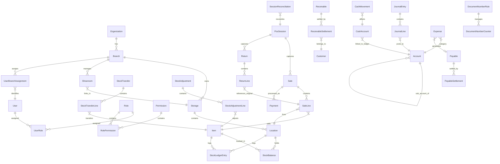

# Entity Schema Reference

> Auto-generated–friendly reference for every TypeORM entity in the ERP system.
> Designed for **code-generation agents** and **developers** to understand the full
> data model without reading source files.

## How to Read This Documentation

Each module doc uses a consistent format:

- **Entity heading** — class name, DB table, description, and inheritance
- **Columns table** — every persisted field with DB column name, TypeScript type,
  constraints, and a human-readable description
- **Indexes & Uniques** — composite indexes declared on the entity
- **Relations** — `@ManyToOne`, `@OneToMany`, etc.
- **Enums** — possible values for enum columns

### Conventions

| Symbol       | Meaning                                |
| ------------ | -------------------------------------- |
| `PK`         | Primary key                            |
| `FK`         | Foreign key (references another table) |
| `UQ`         | Part of a unique constraint            |
| `NN`         | Not-null (required)                    |
| `?`          | Nullable / optional                    |
| `default: X` | Column has a default value             |

### BaseEntity Fields

Many entities extend `BaseEntity` which provides these common fields (not
repeated in every table below):

| Column           | DB Column         | Type          | Description                                              |
| ---------------- | ----------------- | ------------- | -------------------------------------------------------- |
| `id`             | `id`              | `uuid` PK     | Auto-generated UUID primary key                          |
| `organizationId` | `organization_id` | `uuid` NN     | Tenant isolation — every row belongs to one organization |
| `branchId`       | `branch_id`       | `uuid` ?      | Optional branch scope; null for org-wide records         |
| `createdAt`      | `created_at`      | `timestamptz` | Row creation timestamp (auto-set)                        |
| `updatedAt`      | `updated_at`      | `timestamptz` | Last modification timestamp (auto-set)                   |
| `createdBy`      | `created_by`      | `uuid` NN     | User who created this record                             |

---

## Module Index

| #   | Module                                               | Doc File                    | Entities                                                                                                                                                                                                       |
| --- | ---------------------------------------------------- | --------------------------- | -------------------------------------------------------------------------------------------------------------------------------------------------------------------------------------------------------------- |
| 1   | [Auth](./01-auth.md)                                 | `01-auth.md`                | User, Role, Permission, UserRole, RolePermission                                                                                                                                                               |
| 2   | [Organization & Branch](./02-organization-branch.md) | `02-organization-branch.md` | Organization, Branch, UserBranchAssignment, RegistrationRequest                                                                                                                                                |
| 3   | [Customer](./03-customer.md)                         | `03-customer.md`            | Customer                                                                                                                                                                                                       |
| 4   | [Sales Hierarchy](./04-sales-hierarchy.md)           | `04-sales-hierarchy.md`     | SalesmanAssignment, SalesManagerAssignment                                                                                                                                                                     |
| 5   | [Document Numbering](./05-document-numbering.md)     | `05-document-numbering.md`  | DocumentNumberRule, DocumentNumberCounter                                                                                                                                                                      |
| 6   | [Inventory](./06-inventory.md)                       | `06-inventory.md`           | Item, Storage, Showroom, Location, StorageManagerAssignment, StockBalance, StockLedgerEntry, StockTransfer, StockTransferLine, StockAdjustment, StockAdjustmentLine, InventoryImportJob, InventoryImportJobRow |
| 7   | [Accounting](./07-accounting.md)                     | `07-accounting.md`          | Account, JournalEntry, JournalLine, CashAccount, CashMovement, Payable, PayableSettlement, Receivable, ReceivableSettlement, Expense                                                                           |
| 8   | [POS](./08-pos.md)                                   | `08-pos.md`                 | PosSession, Sale, SaleLine, Payment, Return, ReturnLine, SessionReconciliation                                                                                                                                 |

**Total: 44 entities + 1 abstract base = 45 entity classes**

## Auto-Generation

- Run `pnpm docs:entities` to regenerate:
  - `docs/entities/entity-manifest.json` (structured schema metadata)
  - `docs/entities/generated/*.md` (module-based markdown generated from manifest)
- The curated hand-written docs in this folder remain as high-context guides.

## TypeORM Visual CLI (Optional)

- Installed as a dev dependency for interactive scaffolding.
- Start visual creator: `pnpm entity:visual`
- Generate from JSON schema: `pnpm entity:visual:generate -- --file ./schema.json`
- Output from `typeorm-visual` defaults to `output/entities`.

Note: this tool is useful for scaffolding new entities; the canonical schema docs
for this repo remain `docs/entities/*` and the generated manifest/markdown flow.

---

## Entity–Relationship Overview

