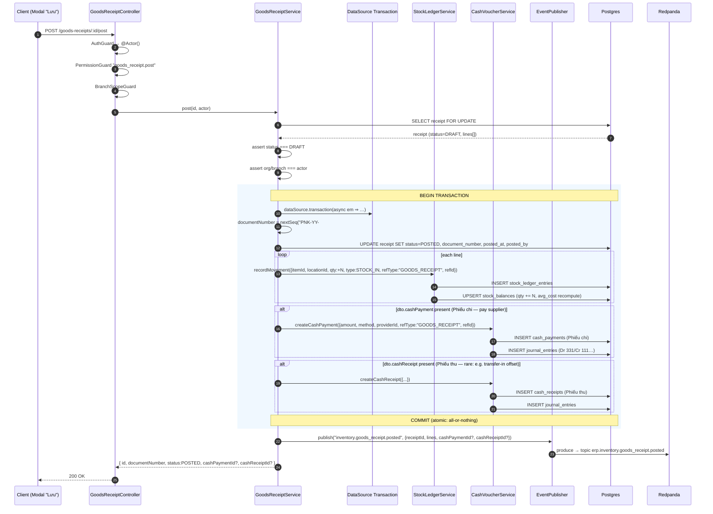

# Goods Receipt API — Flow & Contract (for Frontend)

> **Audience:** Frontend developers integrating the "Phiếu nhập kho" modal with the API.
> **Status:** Design draft — endpoints to be implemented under `apps/api/src/modules/inventory/goods-receipt/`.
> **Last updated:** 2026-05-13

---

## 1. Overview

The Goods Receipt API persists the **Phiếu nhập kho** form and — when posted — atomically:

1. Writes a stock-in movement to the **Stock Ledger** (updates current stock).
2. Optionally creates a **Phiếu chi** (Cash Payment) if the user paid the supplier on receipt.
3. Optionally creates a **Phiếu thu** (Cash Receipt) for transfer-in offsets.
4. Publishes `inventory.goods_receipt.posted` to Kafka for downstream consumers.

There are **two flows** the modal needs to call:

| User action in modal | API call |
|---|---|
| "Lưu nháp" / autosave / partial form | `POST /goods-receipts` |
| "Lưu" (final commit, blue button) | `POST /goods-receipts/:id/post` |

Stock is **only updated by Flow 2**. Drafts have zero side effects.

---

## 2. State Machine

```
        ┌──────────┐  POST /goods-receipts             ┌──────────┐
        │  (none)  │ ─────────────────────────────────►│  DRAFT   │
        └──────────┘                                   └────┬─────┘
                                                            │
                                ┌───────────────────────────┤
                                │                           │
                  DELETE /:id   ▼          POST /:id/post   ▼
                          ┌──────────┐                ┌──────────┐
                          │ CANCELLED│                │  POSTED  │
                          └──────────┘                └────┬─────┘
                                                           │
                                          POST /:id/reverse│
                                                           ▼
                                                     ┌──────────┐
                                                     │ REVERSED │
                                                     └──────────┘
```

- **DRAFT** — editable, no stock effect. `PATCH` allowed.
- **POSTED** — immutable. Edits require a reversal (`POST /:id/reverse`).
- **CANCELLED** — terminal; only reachable from DRAFT via `DELETE /:id`.
- **REVERSED** — terminal; an inverse receipt was posted against it.

---

## 3. DTOs

### 3.1 Enums

```ts
export enum GoodsReceiptPurpose {
  OTHER = 'OTHER',                    // "Khác"
  TRANSFER_IN = 'TRANSFER_IN',        // "Điều chuyển từ cửa hàng khác"
}

export enum GoodsReceiptStatus {
  DRAFT = 'DRAFT',
  POSTED = 'POSTED',
  CANCELLED = 'CANCELLED',
  REVERSED = 'REVERSED',
}

export type CashMethod = 'CASH' | 'BANK' | 'EWALLET';
```

### 3.2 `CreateGoodsReceiptDto` — request body for `POST /goods-receipts`

```ts
export class GoodsReceiptLineDto {
  /** ItemEntity.id (resolved from "Mã SKU" autocomplete) */
  itemId: string;                     // UUID, required

  /** Destination storage location ("Kho") */
  locationId: string;                 // UUID, required

  /** Storage bin ("Vị trí"), optional */
  binId?: string;                     // UUID

  /** Unit of measure ("Đơn vị tính"), e.g. "Đôi", "Cái" */
  uomCode: string;                    // string, 1–50 chars

  /** "Số lượng" — positive decimal, up to 3 dp */
  quantity: number;                   // > 0

  /** "Đơn giá" — non-negative decimal, up to 2 dp.
   *  Line total ("Thành tiền") is server-computed: quantity * unitPrice */
  unitPrice: number;                  // >= 0

  /** "Ghi chú" */
  note?: string;                      // <= 500 chars
}

export class CashSettlementDto {
  method: CashMethod;
  amount: number;                     // > 0, up to 2 dp
  cashAccountId?: string;             // UUID — ledger account; defaults per method
  description?: string;               // <= 500 chars
}

export class CreateGoodsReceiptDto {
  /** "Mục đích nhập kho" radio */
  purpose: GoodsReceiptPurpose;

  /** "Đối tượng" — required when purpose=OTHER (supplier UUID) */
  providerId?: string;

  /** "Người giao" */
  deliveredBy?: string;               // <= 200 chars

  /** "Lý do" */
  reason?: string;                    // <= 500 chars

  /** "Diễn giải" */
  description?: string;               // <= 2000 chars

  /** "Tham chiếu" — required when purpose=TRANSFER_IN */
  referenceId?: string;               // UUID
  referenceType?: 'PURCHASE_ORDER' | 'STOCK_TRANSFER';

  /** "Ngày nhập" + "Giờ nhập" combined as ISO 8601 timestamp.
   *  Example: "2026-05-12T22:17:00+07:00" */
  receivedAt: string;                 // ISO 8601, required

  /** "Kho" — destination warehouse for the whole receipt */
  locationId: string;                 // UUID, required

  /** "Tài liệu đính kèm" — file UUIDs uploaded separately */
  attachmentIds?: string[];           // UUID[]

  /** "CHI TIẾT" rows — at least 1 */
  lines: GoodsReceiptLineDto[];       // min length 1

  /** Optional Phiếu chi — pay supplier on receipt */
  cashPayment?: CashSettlementDto;

  /** Optional Phiếu thu — rare; e.g. transfer-in cash offset */
  cashReceipt?: CashSettlementDto;
}
```

#### Validation rules enforced by the API

- `whitelist: true, forbidNonWhitelisted: true` — any unknown property → **400**.
- `purpose === OTHER` → `providerId` required.
- `purpose === TRANSFER_IN` → `referenceId` + `referenceType` required.
- `lines.length >= 1`.
- `quantity > 0`, `unitPrice >= 0` for every line.
- `receivedAt` must parse as ISO 8601.

### 3.3 `UpdateGoodsReceiptDto` — request body for `PATCH /goods-receipts/:id`

Same shape as `CreateGoodsReceiptDto` but **all fields optional**. Only callable while `status === DRAFT`; otherwise → **409 Conflict**.

### 3.4 `PostGoodsReceiptDto` — request body for `POST /goods-receipts/:id/post`

Empty body — the draft already has everything. The endpoint just transitions DRAFT → POSTED and triggers side effects.

### 3.5 `ReverseGoodsReceiptDto` — `POST /goods-receipts/:id/reverse`

```ts
export class ReverseGoodsReceiptDto {
  reason: string;                     // required, 1–500 chars
}
```

### 3.6 Response shape

```ts
export interface GoodsReceiptResponse {
  id: string;
  documentNumber: string | null;      // null while DRAFT, assigned on post
  status: GoodsReceiptStatus;
  purpose: GoodsReceiptPurpose;
  providerId: string | null;
  deliveredBy: string | null;
  reason: string | null;
  description: string | null;
  referenceId: string | null;
  referenceType: 'PURCHASE_ORDER' | 'STOCK_TRANSFER' | null;
  receivedAt: string;                 // ISO 8601
  locationId: string;
  attachmentIds: string[];
  lines: Array<{
    id: string;
    itemId: string;
    locationId: string;
    binId: string | null;
    uomCode: string;
    quantity: number;
    unitPrice: number;
    lineTotal: number;                // computed server-side
    note: string | null;
  }>;
  totals: {
    lineCount: number;
    totalQuantity: number;
    totalAmount: number;              // sum(lineTotal)
  };
  cashPaymentId: string | null;       // populated after post if cashPayment was provided
  cashReceiptId: string | null;
  postedAt: string | null;
  postedBy: string | null;
  createdAt: string;
  updatedAt: string;
}
```

---

## 4. Endpoints

All endpoints require:
- `Authorization: Bearer <token>` (auto-injected by `erpApi`)
- `X-Branch-Id: <uuid>`
- `X-Idempotency-Key: <uuid>` for `POST` / `PATCH` (auto-injected by `erpApi`)

| Method | Path | Permission | Body | Returns |
|---|---|---|---|---|
| `GET` | `/goods-receipts` | `goods_receipt.read` | — | `Paginated<GoodsReceiptResponse>` |
| `GET` | `/goods-receipts/:id` | `goods_receipt.read` | — | `GoodsReceiptResponse` |
| `POST` | `/goods-receipts` | `goods_receipt.write` | `CreateGoodsReceiptDto` | `GoodsReceiptResponse` (status=DRAFT) |
| `PATCH` | `/goods-receipts/:id` | `goods_receipt.write` | `UpdateGoodsReceiptDto` | `GoodsReceiptResponse` (status=DRAFT) |
| `POST` | `/goods-receipts/:id/post` | `goods_receipt.post` | `{}` | `GoodsReceiptResponse` (status=POSTED) |
| `DELETE` | `/goods-receipts/:id` | `goods_receipt.write` | — | `204` (only if DRAFT) |
| `POST` | `/goods-receipts/:id/reverse` | `goods_receipt.post` | `ReverseGoodsReceiptDto` | `GoodsReceiptResponse` of the **new** reversal receipt |

### 4.1 Error responses

| HTTP | Code | When |
|---|---|---|
| 400 | `validation_error` | DTO validation failed (details in `errors[]`) |
| 403 | `forbidden` | Missing permission or branch scope mismatch |
| 404 | `not_found` | Receipt id not in actor's org |
| 409 | `invalid_state` | Edit/post/delete on wrong status |
| 409 | `insufficient_stock` | Only on reversal — current stock < reversal qty |
| 422 | `business_rule` | e.g. `providerId` missing when `purpose=OTHER` |
| 429 | `rate_limited` | Too many posts on same id (debounce double-click) |

---

## 5. Flow 1 — Save as draft (`POST /goods-receipts`)

```
Client (Modal)         GoodsReceiptController        GoodsReceiptService          DB
     │                          │                              │                   │
     │  POST /goods-receipts    │                              │                   │
     │  + CreateGoodsReceiptDto │                              │                   │
     │ ───────────────────────► │                              │                   │
     │                          │ ValidationPipe (whitelist)   │                   │
     │                          │ AuthGuard → @Actor()         │                   │
     │                          │ PermissionGuard .write       │                   │
     │                          │ BranchScopeGuard             │                   │
     │                          │ ──────────────────────────►  │                   │
     │                          │                              │ validateProvider()│
     │                          │                              │ validateLocation()│
     │                          │                              │ validateItems()   │
     │                          │                              │ status = DRAFT    │
     │                          │                              │ INSERT receipt    │
     │                          │                              │ INSERT lines[]    │
     │                          │                              │ ─────────────────►│
     │                          │                              │ ◄─────────────────│
     │  201 { id, status:DRAFT} │ ◄─────────────────────────── │                   │
     │ ◄─────────────────────── │                              │                   │
```

**Side effects:** none beyond the two table inserts. No stock change, no Kafka event, no cash voucher.

**Frontend invalidation:** invalidate `["goods-receipts"]` (the list query). Do **not** invalidate stock queries.

---

## 6. Flow 2 — Post the receipt (`POST /goods-receipts/:id/post`) ⭐



**Side effects on success:**

1. Receipt row → `status=POSTED`, `documentNumber` assigned (e.g. `PNK-26-0001`).
2. **One `stock_ledger_entries` row per line** (immutable audit log).
3. **`stock_balances` updated** — `quantity += line.quantity` per `(itemId, locationId)`. **This is "current product stock".**
4. Optional `cash_payments` row + journal entries (Phiếu chi).
5. Optional `cash_receipts` row + journal entries (Phiếu thu).
6. Kafka event `inventory.goods_receipt.posted` published **after** TX commit.

**On any failure inside the TX** (item not found, balance lock timeout, cash voucher error):
- TX rolls back → status stays `DRAFT`.
- No stock change, no cash voucher, no Kafka event.
- Client receives `4xx` with which step failed; user can retry the same `/post` call.

### 6.1 Frontend invalidation after a successful post

```ts
queryClient.invalidateQueries({ queryKey: ['goods-receipts'] });
queryClient.invalidateQueries({ queryKey: ['stock-balances'] });
queryClient.invalidateQueries({ queryKey: ['inventory-items'] });
// If Phiếu chi was created:
queryClient.invalidateQueries({ queryKey: ['cash-payments'] });
// If Phiếu thu was created:
queryClient.invalidateQueries({ queryKey: ['cash-receipts'] });
```

---

## 7. Recommended modal UX

| Modal button | API call |
|---|---|
| **+ Thêm mới** | local state reset; no API call until user fills required fields |
| Auto-save / "Lưu nháp" | `POST /goods-receipts` (first time) → store returned `id`. Subsequent saves: `PATCH /goods-receipts/:id` |
| **Sửa** | enabled only if `status === DRAFT` |
| **Lưu** (commit) | `POST /goods-receipts/:id/post` |
| **Xóa** | `DELETE /goods-receipts/:id` — only if DRAFT. Show confirmation. |
| **Hoãn** | Same as Xóa (cancel the draft) — confirm copy: "Huỷ phiếu nháp này?" |
| **In** | Frontend renders from `GoodsReceiptResponse` — no extra API call |

### Field-level UI rules

- Disable the `providerId` field when `purpose === TRANSFER_IN`.
- Disable `referenceId` / `referenceType` when `purpose === OTHER`.
- Disable the entire form except read-only display when `status !== DRAFT`.
- Show `documentNumber` only after first POST has succeeded.
- "Thành tiền" per line is **computed client-side for display**, but server is authoritative — re-render from response after save.
- "Tổng tiền" footer = sum of line totals; refresh from `response.totals.totalAmount` after save.

---

## 8. Example request/response

### 8.1 Create draft

```http
POST /goods-receipts
Authorization: Bearer …
X-Branch-Id: 1f7c5a90-…
X-Idempotency-Key: 9e1d4b2f-…
Content-Type: application/json
```

```json
{
  "purpose": "OTHER",
  "providerId": "8b3e2c10-7a14-4f31-9d6e-2a1b9c5d7e80",
  "deliveredBy": "Nguyễn Văn A",
  "reason": "Nhập hàng đầu tháng",
  "description": "Đơn hàng PO-2026-05",
  "receivedAt": "2026-05-12T22:17:00+07:00",
  "locationId": "a0b1c2d3-e4f5-6789-abcd-ef0123456789",
  "lines": [
    {
      "itemId": "f1e2d3c4-b5a6-7890-1234-567890abcdef",
      "locationId": "a0b1c2d3-e4f5-6789-abcd-ef0123456789",
      "uomCode": "Đôi",
      "quantity": 10,
      "unitPrice": 250000,
      "note": ""
    }
  ],
  "cashPayment": {
    "method": "CASH",
    "amount": 2500000,
    "description": "Trả tiền mặt cho NCC khi nhận hàng"
  }
}
```

### 8.2 Response

```json
{
  "id": "c7d8e9f0-1a2b-3c4d-5e6f-7a8b9c0d1e2f",
  "documentNumber": null,
  "status": "DRAFT",
  "purpose": "OTHER",
  "providerId": "8b3e2c10-7a14-4f31-9d6e-2a1b9c5d7e80",
  "deliveredBy": "Nguyễn Văn A",
  "reason": "Nhập hàng đầu tháng",
  "description": "Đơn hàng PO-2026-05",
  "referenceId": null,
  "referenceType": null,
  "receivedAt": "2026-05-12T15:17:00.000Z",
  "locationId": "a0b1c2d3-e4f5-6789-abcd-ef0123456789",
  "attachmentIds": [],
  "lines": [
    {
      "id": "11111111-2222-3333-4444-555555555555",
      "itemId": "f1e2d3c4-b5a6-7890-1234-567890abcdef",
      "locationId": "a0b1c2d3-e4f5-6789-abcd-ef0123456789",
      "binId": null,
      "uomCode": "Đôi",
      "quantity": 10,
      "unitPrice": 250000,
      "lineTotal": 2500000,
      "note": null
    }
  ],
  "totals": { "lineCount": 1, "totalQuantity": 10, "totalAmount": 2500000 },
  "cashPaymentId": null,
  "cashReceiptId": null,
  "postedAt": null,
  "postedBy": null,
  "createdAt": "2026-05-12T15:17:01.234Z",
  "updatedAt": "2026-05-12T15:17:01.234Z"
}
```

### 8.3 Post the draft

```http
POST /goods-receipts/c7d8e9f0-1a2b-3c4d-5e6f-7a8b9c0d1e2f/post
Authorization: Bearer …
X-Branch-Id: 1f7c5a90-…
X-Idempotency-Key: 9e1d4b2f-…
```

Response (excerpt):

```json
{
  "id": "c7d8e9f0-…",
  "documentNumber": "PNK-26-0001",
  "status": "POSTED",
  "cashPaymentId": "33333333-…",
  "cashReceiptId": null,
  "postedAt": "2026-05-12T15:17:08.123Z",
  "postedBy": "user-uuid-here"
}
```

At this point `stock_balances` for the item is updated — the inventory list will show the new quantity after invalidation.

---

## 9. Open questions for BE/FE alignment

1. **Attachments upload endpoint** — assumed `POST /attachments` returning `{ id }`. Confirm path.
2. **`uomCode` source** — is the dropdown driven by a `/uoms` endpoint or hardcoded per item?
3. **Document number format** — confirmed prefix `PNK` (Phiếu Nhập Kho) + 2-digit year + 4-digit sequence?
4. **Cash account defaults** — when user doesn't pick `cashAccountId`, does the API default to `111` (cash on hand) for method=CASH? Confirm.
5. **Permissions seed** — need `goods_receipt.read`, `goods_receipt.write`, `goods_receipt.post` added to `permissions.seed.ts`.
