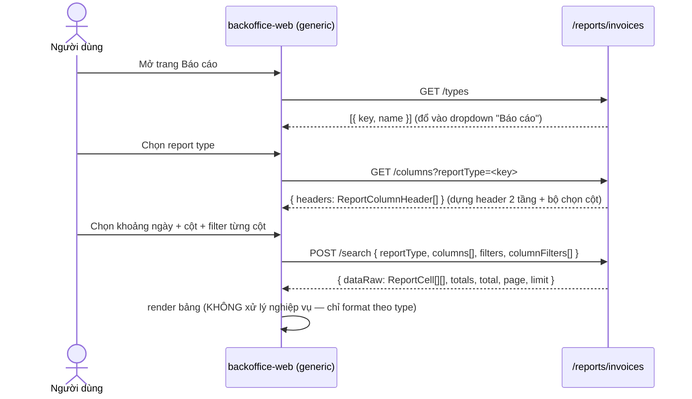

# Báo cáo bán hàng — FE ⇄ API Integration

> Tài liệu tích hợp cho **backoffice-web**. Backend (EPIC-11062026) cung cấp một **report engine generic**: nhiều **loại báo cáo** (report type) được định nghĩa **hoàn toàn ở backend**, mỗi loại tự khai báo cột + cách tính dữ liệu. **FE chỉ là renderer generic** — không hard-code cột, không tính toán số liệu, không biết ngữ nghĩa từng báo cáo. FE chỉ: chọn report type → lấy `headers` → lấy `dataRaw` → render bảng.
>
> Hệ quả: khi backend thêm report type mới (vd "Bảng kê hóa đơn và đơn hàng", "Doanh thu theo nhân viên"…), **FE không cần đổi code** — nó tự xuất hiện trong dropdown và render được nhờ cùng contract `headers + dataRaw`.

Base path: `/reports/invoices` · Auth: Bearer JWT (global `AuthGuard`) · Header chi nhánh: `X-Branch-Id` (axios interceptor tự gắn từ `localStorage.active_branch_id`).

---

## 1. Tổng quan luồng

```
(1) GET  /reports/invoices/types                 → danh sách báo cáo cho dropdown "Báo cáo"
(2) GET  /reports/invoices/columns?reportType=…  → headers (catalog cột của report đó)
(3) POST /reports/invoices/search                → dataRaw + totals (số liệu)
(4) GET/POST/PATCH/DELETE /reports/invoices/templates[...]  → lưu/tải bộ cột + filter
```



**Nguyên tắc:** mọi tri thức về báo cáo (cột nào, công thức gì, format ra sao) nằm ở `headers` + `type` của mỗi cell. FE chỉ map `headers → cột bảng` và format `cell.value` theo `cell.type`.

---

## 2. Kiểu dữ liệu (import từ `@erp/shared-interfaces`)

Không tự định nghĩa lại — import trực tiếp:

```ts
import type {
  InvoiceReportTypeOption, InvoiceReportTypesResult,
  ReportColumnHeader, ReportColumnGroup, InvoiceReportColumnsResult,
  ReportCell, ReportCellValue, ReportDataRow, InvoiceReportResult,
  InvoiceReportSearchPayload, InvoiceReportFilterPayload, ColumnFilter,
  InvoiceReportTemplateView, InvoiceReportTemplatePayload,
} from "@erp/shared-interfaces";
import { ReportColumnDataType } from "@erp/shared-interfaces";
```

```ts
enum ReportColumnDataType {
  STRING = "string", NUMBER = "number", CURRENCY = "currency", PERCENT = "percent",
  DATE = "date", DATETIME = "datetime", ENUM = "enum", BOOLEAN = "boolean",
}

interface ReportColumnGroup { id: string; name: string }              // band header (colspan)

interface ReportColumnHeader {
  col: string;                  // khóa cột ổn định: "date" | "revenue.total" | "payment.method.<coaAccountId>"
  name: string | null;          // nhãn hiển thị (đã VI hoá / hoặc label tài khoản thanh toán)
  desc: string | null;          // công thức/sub-label dưới tên cột, vd "(1)=(3)-(5)-(14)"
  type: ReportColumnDataType;   // quyết định format + canh lề + widget filter
  group: ReportColumnGroup | null;  // band; null = cột đứng riêng (vd Ngày, Thực thu)
}

type ReportCellValue = string | number | null;
interface ReportCell { col: string; type: ReportColumnDataType; value: ReportCellValue }  // cell tự mô tả
type ReportDataRow = ReportCell[];   // 1 dòng = 1 đơn vị nhóm (vd 1 ngày)

interface InvoiceReportResult {       // response của /search — CHỈ dữ liệu, KHÔNG headers
  dataRaw: ReportDataRow[];
  totals: ReportCell[] | null;        // dòng tổng (footer)
  total: number; page: number; limit: number;
}

interface InvoiceReportFilterPayload {     // filter SCOPE (lọc trước khi tổng hợp)
  issuedAt: { from?: string; to?: string };  // khoảng ngày báo cáo — BẮT BUỘC có `from`
  status?: { value: string | null };
  type?: { value: string | null };
  branchId?: string;
}

interface ColumnFilter {              // filter TỪNG CỘT (lọc sau khi tổng hợp)
  col: string;
  eq?: number | string; lt?: number; lte?: number; gt?: number; gte?: number;
  from?: string; to?: string;         // cho cột kiểu date
}

interface InvoiceReportSearchPayload {
  reportType: string;                 // BẮT BUỘC
  columns: string[];                  // các cột muốn hiển thị (lấy từ headers[].col)
  filters: InvoiceReportFilterPayload;
  columnFilters?: ColumnFilter[];
  branchId?: string;                  // optional; nếu không gửi → theo X-Branch-Id / consolidated
  page?: number; limit?: number;      // mặc định page=1, limit=31 (max 366)
}
```

> **Quan trọng:** response của `/search` **không** trả `headers`. FE lấy `headers` từ `/columns` (gọi 1 lần khi đổi report type), lọc theo `columns` đã chọn để dựng cột; `dataRaw` chỉ chứa cell. Vì cell **tự mô tả** (`{col,type,value}`) nên FE render được mà không cần ghép lại với header.

---

## 3. Endpoints

Tất cả route nằm sau `@UseGuards(PermissionGuard)`.

| # | Method & path | Permission | Body / Query | Response |
| - | ------------- | ---------- | ------------ | -------- |
| 1 | `GET /reports/invoices/types` | `reporting.invoice.branch.read` | — | `{ types: { key, name }[] }` |
| 2 | `GET /reports/invoices/columns` | `reporting.invoice.branch.read` | query `reportType` | `{ headers: ReportColumnHeader[] }` |
| 3 | `POST /reports/invoices/search` | `reporting.invoice.branch.read` | `InvoiceReportSearchPayload` | `InvoiceReportResult` |
| 4 | `GET /reports/invoices/templates` | `reporting.invoice.branch.read` | query `reportType?` | `InvoiceReportTemplateView[]` |
| 5 | `GET /reports/invoices/templates/{id}` | `reporting.invoice.branch.read` | — | `InvoiceReportTemplateView` |
| 6 | `POST /reports/invoices/templates` | `reporting.invoice-template.manage` | `InvoiceReportTemplatePayload` | `InvoiceReportTemplateView` |
| 7 | `PATCH /reports/invoices/templates/{id}` | `reporting.invoice-template.manage` | `Partial<InvoiceReportTemplatePayload>` | `InvoiceReportTemplateView` |
| 8 | `DELETE /reports/invoices/templates/{id}` | `reporting.invoice-template.manage` | — | `200` (soft-delete) |

**Permissions**
- `reporting.invoice.branch.read` — quyền nền để xem báo cáo (đọc types/columns/search/templates).
- `reporting.invoice.consolidated.read` — quyền **nâng cao**: bỏ trống `branchId` → tổng hợp **toàn chuỗi**. Không có → khoá về chi nhánh hiện tại; gửi `branchId` khác chi nhánh của mình → **403**.
- `reporting.invoice-template.manage` — tạo/sửa/xoá template.

**Lỗi thường gặp:** `400` khi `reportType` lạ, `columns`/`columnFilters[].col` không thuộc catalog, hoặc thiếu `filters.issuedAt.from`. `403` khi xin chi nhánh không có quyền. `409` khi trùng tên template (trong cùng `reportType`). `404` khi template không tồn tại / khác tenant.

---

## 4. Gọi API (mẫu, dùng wrapper `erpApi`)

`erpApi` (`lib/erp-api.ts`) tự gắn `Authorization`, `X-Branch-Id`, `X-Request-Id`, `X-Idempotency-Key`. Client lỏng kiểu (`path: string`, `body?: unknown`, generic `T`), nên truyền type qua generic:

```ts
// types
requireErpData(await erpApi.GET<InvoiceReportTypesResult>("/reports/invoices/types"));
// columns
requireErpData(await erpApi.GET<InvoiceReportColumnsResult>(
  "/reports/invoices/columns", { params: { query: { reportType } } }));
// search
requireErpData(await erpApi.POST<InvoiceReportResult>(
  "/reports/invoices/search", { body: payload }));
// templates
requireErpData(await erpApi.GET<InvoiceReportTemplateView[]>(
  "/reports/invoices/templates", { params: { query: { reportType } } }));
requireErpData(await erpApi.POST<InvoiceReportTemplateView>(
  "/reports/invoices/templates", { body }));
requireErpData(await erpApi.PATCH<InvoiceReportTemplateView>(
  "/reports/invoices/templates/{id}", { params: { path: { id } }, body }));
requireErpSuccess(await erpApi.DELETE(
  "/reports/invoices/templates/{id}", { params: { path: { id } } }));
```

**TanStack Query — gợi ý queryKey** (luôn bắt đầu bằng tên resource + đủ tham số):
- `["invoice-report-types"]`
- `["invoice-report-columns", reportType]`
- `["invoice-report-search", payload]` — `enabled` khi `columns.length > 0 && filters.issuedAt.from`
- `["invoice-report-templates", reportType]` · invalidate prefix `["invoice-report-templates"]` sau mutation.

---

## 5. Quy tắc render generic (cốt lõi)

FE **không** chứa logic riêng cho từng báo cáo. Chỉ 3 ánh xạ generic dựa trên `header.type`:

### 5.1 Header 2 tầng (band)
Gom các cột **liên tiếp** cùng `group.id` thành 1 ô header cha (colspan); cột `group === null` đứng riêng (rowSpan 2 tầng). `header.desc` hiển thị dòng phụ dưới `header.name`.

### 5.2 Format & canh lề theo `type`
| type | format (vi-VN) | canh lề |
| ---- | -------------- | ------- |
| `currency` | `Intl.NumberFormat("vi-VN")` (không ký hiệu ₫) | phải |
| `number` | `Intl.NumberFormat("vi-VN")` | phải |
| `percent` | số + `"%"` | phải |
| `date` | `dd/mm/yyyy` (value là `yyyy-mm-dd`) | trái |
| `datetime` | `Intl.DateTimeFormat("vi-VN")` | trái |
| `string`/`enum`/`boolean` | as-is | trái |
| `value === null` | `""` | — |

> Có sẵn `formatMoneyInteger` / `formatVnd` trong `@erp/ui` cho currency.

### 5.3 Widget filter theo `type` → `columnFilters`
| type cột | filter widget gợi ý | sinh `ColumnFilter` |
| -------- | ------------------- | ------------------- |
| `currency` / `number` / `percent` | ô số có operator `≤` (KiotViet-style) | `{ col, lte: n }` (hoặc `gte/eq` tuỳ operator) |
| `date` | date picker `=` / khoảng | `{ col, eq }` hoặc `{ col, from, to }` |
| `string`/`enum` | text/select | (báo cáo daily chưa dùng; bỏ qua) |

`columnFilters` áp **sau khi tổng hợp** (lọc trên giá trị đã gộp theo ngày, kể cả cột computed/động). `totals` được tính lại trên tập dòng **sau filter**.

### 5.4 Footer tổng
`totals` (nếu khác `null`) là một mảng `ReportCell[]` đúng theo `columns` đã chọn → render thành dòng footer, format y như cell thường. Cột `date` trong totals có `value === null` (để trống).

> **Mapping với `BaseDataTable` sẵn có** (`components/table/BaseDataTable.tsx`): nó đã hỗ trợ đủ — `TableColumn.group` (band colspan 2 tầng), `filterKind: "number-range"` (ô `≤`) / `"date"` / `"date-range"`, `columnFilterControl` (state filter từng cột), và `TableColumn.footer` (sticky `<tfoot>` per-cột). FE chỉ cần map `headers → TableColumn[]` (key=`col`, label=`name`, group=`group?.name`, filterKind theo `type`) và dựng `rows`/`footer` từ `dataRaw`/`totals`. **Không cần custom `<table>`.**

---

## 6. Filter: 2 tầng

1. **Scope (pre-aggregate, gửi trong `filters`)** — lọc hoá đơn trước khi tổng hợp:
   - `issuedAt: { from, to }` — **bắt buộc** (khoảng ngày báo cáo, "Từ ngày / Đến ngày"). `to` day-inclusive.
   - `status?: { value }`, `type?: { value }` — optional.
   - `branchId?` — xem mục phạm vi chi nhánh dưới.
2. **Per-column (post-aggregate, gửi trong `columnFilters`)** — hàng widget dưới mỗi header trong ảnh (`=`, `≤`…). Mỗi phần tử `{ col, <operator> }`, `col` phải ∈ catalog.

**Phạm vi chi nhánh:**
- Không gửi `branchId` + có `reporting.invoice.consolidated.read` → toàn chuỗi.
- Không gửi `branchId` + không có consolidated → chỉ chi nhánh `X-Branch-Id` hiện tại.
- Gửi `branchId` ≠ chi nhánh hiện tại + không consolidated → **403**.

---

## 7. Templates (lưu/tải bộ cột + filter)

Template gắn với **một** `reportType`, mang `columns` + `filters` (scope) + `columnFilters`. Org-shared (mọi user có quyền report của tổ chức đều thấy), soft-delete.

```ts
// payload tạo/sửa
interface InvoiceReportTemplatePayload {
  reportType: string;                  // bắt buộc — phải khớp report đang xem
  name: string;
  description?: string;
  columns: string[];
  filters?: InvoiceReportFilterPayload;
  columnFilters?: ColumnFilter[];
  sortOrder?: number;
}
```

Luồng: chọn template → set `columns` + `filters` + `columnFilters` vào state của trang → gọi `/search` lại (có thể override khoảng ngày trước khi chạy). Lưu template = gom state hiện tại + `reportType` → POST.

---

## 8. Ví dụ cụ thể (report `daily-sales-summary` — "Tổng hợp bán hàng theo ngày")

### 8.1 `GET /reports/invoices/types`
```json
{ "types": [ { "key": "daily-sales-summary", "name": "Tổng hợp bán hàng theo ngày" } ] }
```
(hiện chỉ 1 loại; các loại khác trong ảnh sẽ được thêm ở backend sau, FE tự nhận.)

### 8.2 `GET /reports/invoices/columns?reportType=daily-sales-summary`
```json
{
  "headers": [
    { "col": "date",                "name": "Ngày",        "desc": null,              "type": "date",     "group": null },
    { "col": "actualRevenue",       "name": "Thực thu",    "desc": "(13)",            "type": "currency", "group": null },
    { "col": "revenue.goods",       "name": "Tiền hàng",   "desc": "(3)",             "type": "currency", "group": { "id": "revenue", "name": "Doanh thu" } },
    { "col": "revenue.discount",    "name": "Khuyến mại",  "desc": "(5)",             "type": "currency", "group": { "id": "revenue", "name": "Doanh thu" } },
    { "col": "revenue.promoPoints", "name": "Điểm KM",     "desc": "(14)",            "type": "currency", "group": { "id": "revenue", "name": "Doanh thu" } },
    { "col": "revenue.total",       "name": "Tổng",        "desc": "(1)=(3)-(5)-(14)","type": "currency", "group": { "id": "revenue", "name": "Doanh thu" } },
    { "col": "revenue.promoRate",   "name": "Tỷ lệ KM (%)","desc": "(6)",             "type": "percent",  "group": { "id": "revenue", "name": "Doanh thu" } },
    { "col": "revenue.cash",        "name": "Tiền mặt",    "desc": "(7)",             "type": "currency", "group": { "id": "revenue", "name": "Doanh thu" } },
    { "col": "payment.voucher",     "name": "Voucher",     "desc": "(9)",             "type": "currency", "group": { "id": "customerPayment", "name": "Khách hàng thanh toán" } },
    { "col": "payment.points",      "name": "Điểm",        "desc": "(10)",            "type": "currency", "group": { "id": "customerPayment", "name": "Khách hàng thanh toán" } },
    { "col": "payment.method.7b1f…", "name": "Techcombank VietQR", "desc": null,      "type": "currency", "group": { "id": "customerPayment", "name": "Khách hàng thanh toán" } }
  ]
}
```
- Cột **động** `payment.method.<coaAccountId>`: sinh runtime từ các tài khoản thanh toán (`PaymentAccountEntity`) đang active của tổ chức — mỗi tài khoản 1 cột, `name` = label tài khoản. Số lượng/tên thay đổi theo cấu hình từng org. FE **không** giả định trước danh sách này.

### 8.3 `POST /reports/invoices/search`
```json
{
  "reportType": "daily-sales-summary",
  "columns": ["date", "revenue.goods", "revenue.total", "revenue.cash", "actualRevenue", "payment.method.7b1f…"],
  "filters": { "issuedAt": { "from": "2026-06-01", "to": "2026-06-30" } },
  "columnFilters": [ { "col": "revenue.goods", "lte": 20000000 } ],
  "limit": 366
}
```
```json
{
  "dataRaw": [
    [
      { "col": "date",                 "type": "date",     "value": "2026-06-03" },
      { "col": "revenue.goods",        "type": "currency", "value": 17000000 },
      { "col": "revenue.total",        "type": "currency", "value": 17000000 },
      { "col": "revenue.cash",         "type": "currency", "value": 13600000 },
      { "col": "actualRevenue",        "type": "currency", "value": 13600000 },
      { "col": "payment.method.7b1f…", "type": "currency", "value": 0 }
    ]
  ],
  "totals": [
    { "col": "date",                 "type": "date",     "value": null },
    { "col": "revenue.goods",        "type": "currency", "value": 17000000 },
    { "col": "revenue.total",        "type": "currency", "value": 17000000 },
    { "col": "revenue.cash",         "type": "currency", "value": 13600000 },
    { "col": "actualRevenue",        "type": "currency", "value": 13600000 },
    { "col": "payment.method.7b1f…", "type": "currency", "value": 0 }
  ],
  "total": 1, "page": 1, "limit": 366
}
```

---

## 9. Lưu ý / ràng buộc

- **Generic là bắt buộc:** FE không hard-code cột/công thức/loại báo cáo. Mọi thứ suy ra từ `headers` + `cell.type`. Thêm báo cáo mới = việc của backend, FE không đổi.
- **`columns` rỗng** → không gọi `/search`. **Thiếu `issuedAt.from`** → 400 (đặt mặc định, vd tháng hiện tại).
- **`limit`** mặc định 31, tối đa 366. Báo cáo theo ngày trong 1 tháng/quý/năm gọn trong 1 trang → có thể đặt `limit: 366` và bỏ phân trang; nếu cần thì phân trang theo `total` (số ngày).
- **Cột "Tiền phí"** trong ảnh tham chiếu **không** có trong catalog (schema hiện không có trường phí) — đây là chủ ý, không phải thiếu sót. Khi có nguồn dữ liệu, backend thêm cột, FE tự nhận.
- **Cột computed** (`revenue.total`, `actualRevenue`, `revenue.promoRate`) đã tính sẵn ở backend — FE chỉ format, không tự tính.
- **Số tiền (`numeric`)**: backend trả number; nếu nhận string (rare) thì `Number()` trước khi format.

---

## 10. Checklist tích hợp FE

- [ ] Dropdown "Báo cáo" đổ từ `GET /types`; chọn → set `reportType`.
- [ ] `GET /columns?reportType` → dựng header 2 tầng (`group`) + bộ chọn cột (gom theo `group`).
- [ ] Bộ lọc: khoảng ngày (bắt buộc), (tuỳ chọn) status/type/cửa hàng; hàng filter từng cột → `columnFilters`.
- [ ] "Lấy dữ liệu" → `POST /search` với `reportType + columns + filters + columnFilters`.
- [ ] Render `dataRaw` (cell theo `type`) + footer `totals`; canh phải cho số/tiền/%.
- [ ] Phạm vi cửa hàng: ẩn chọn cửa hàng nếu không có `consolidated`; có thì cho chọn / "Tất cả".
- [ ] Template: list (theo `reportType`) / load (đổ state) / save (gom state) / delete; nút save/delete chỉ hiện khi có `reporting.invoice-template.manage`.
- [ ] `<Route>` + `NavChild` (permission `reporting.invoice.branch.read`) theo convention navConfig.
