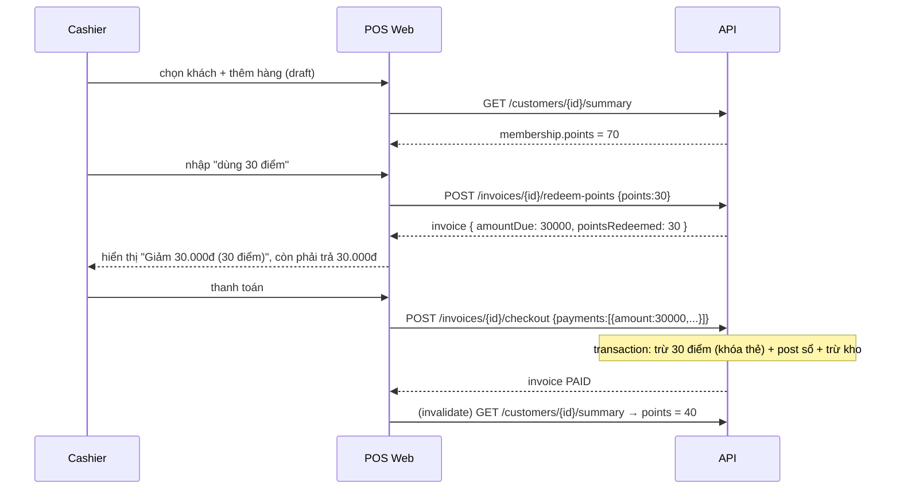

# Loyalty Points — FE/POS API Integration

Tài liệu cho FE ghép 2 nhóm tính năng vừa thêm ở backend:

- **EPIC A — Customer Summary**: 1 endpoint gộp số liệu tổng quan khách hàng (chi tiêu, công nợ, điểm).
- **EPIC B — Đổi điểm khi thanh toán (redeem)**: dùng điểm để giảm tiền hóa đơn tại POS.

> Backend đã xong, migration đã chạy, `@erp/api-client` đã regenerate (snapshot có sẵn 2 path mới). FE chỉ cần ghép UI + gọi API.

---

## 0. Quy ước chung (đọc trước)

- **Auth headers**: mọi request cần `Authorization: Bearer <accessToken>` và `X-Branch-Id: <branchId>`.
  Nếu dùng wrapper `erpApi` (lib `erp-api`) thì 2 header này (+ `X-Request-Id`, `X-Idempotency-Key`) **tự inject**, không cần set tay.
- **Permissions**: summary cần `customer.read`; redeem cần `pos.invoice.write` (cùng quyền với checkout).
- **⚠️ Kiểu số (numeric)**: các field tiền (`subtotal`, `discountAmount`, `pointsDiscountAmount`, `amountDue`, `depositAmount`, `totalPaid`) trong response **hóa đơn** có thể là **string** (Postgres `numeric`) HOẶC number tùy đường đi. **Luôn `Number(...)` trước khi tính/hiển thị.** Riêng response của **summary** đã được backend ép sẵn về number sạch.
- `pointsRedeemed`, `points`, `invoiceCount`, `documentCount` là **integer (number)**.
- Tiền tệ hiển thị: format `Intl` locale `vi-VN`. Mọi chuỗi UI bằng tiếng Việt.
- Lỗi theo chuẩn NestJS: `{ statusCode, message, error }`. `message` có thể là string (lỗi nghiệp vụ) hoặc string[] (lỗi validate DTO).

---

## EPIC A — Customer Summary

### `GET /customers/:id/summary`

Trả về toàn bộ block "Tổng quan" trong 1 lần gọi (thay vì FE gọi 4–5 endpoint rồi tự cộng).

**Request**: không có body. `:id` = customerId (UUID).

**Response 200** (`CustomerSummaryResponseDto`):

```jsonc
{
  "customerId": "0b1f...",
  "purchases": {
    "totalSpending": 1250000,   // tổng amountDue các HĐ bán đã chốt (PAID/DEBT/PARTIAL_DEBT)
    "invoiceCount": 3
  },
  "debt": {
    "totalOutstanding": 200000, // tổng remainingAmount các công nợ OPEN/OVERDUE
    "documentCount": 1
  },
  "membership": {              // null nếu khách CHƯA có thẻ thành viên
    "cardNumber": "MCAB123456",
    "tier": "gold",            // none | silver | gold | diamond
    "points": 70,              // số dư điểm hiện tại
    "pointsUsed": 30           // tổng điểm đã từng dùng (Σ|delta| các bản ghi REDEEM)
  }
}
```

- Tất cả field số ở summary là **number sạch** (đã round 2 chữ số).
- `membership = null` → khách chưa phát thẻ → UI nên hiện "—" cho mã thẻ và 0 điểm.
- 404 nếu customerId không thuộc org hiện tại.

**Type FE** (từ `@erp/api-client`):
```ts
import type { components } from "@erp/api-client";
type CustomerSummary = components["schemas"]["CustomerSummaryResponseDto"];
```

**Snippet (TanStack Query)** — wrapper `erpApi` ở repo này là dạng **string-path** và **nhận type qua generic `<T>`** (KHÔNG tự suy type theo path như openapi-fetch), path param điền qua `params.path`:
```ts
import { erpApi, requireErpData } from "../lib/common/erp-api"; // pos-web

export function useCustomerSummary(customerId: string | undefined) {
  return useQuery({
    queryKey: ["customer-summary", customerId],
    enabled: !!customerId,
    queryFn: async () =>
      requireErpData(
        await erpApi.GET<CustomerSummary>("/customers/{id}/summary", {
          params: { path: { id: customerId! } },
        }),
      ),
  });
}
```

> Sau khi checkout/đổi điểm xong, invalidate `["customer-summary", customerId]` để số liệu cập nhật.

---

## EPIC B — Đổi điểm khi thanh toán (POS)

### Mô hình
- Đổi điểm = **giảm giá** trên hóa đơn **DRAFT**: `1 điểm = 1.000đ` giảm thẳng vào `amountDue`.
- FE thao tác đổi điểm **trên draft trước khi checkout**. Việc **trừ điểm thật** xảy ra **tự động & đồng bộ** trong giao dịch checkout — FE **không** phải gọi gì thêm để trừ điểm.
- Điều kiện: hóa đơn phải đang DRAFT, đã gắn `customerId`, khách có **thẻ thành viên active** và đủ điểm.

### Luồng tổng quát
```
1) Tạo/đang có draft invoice + đã gắn customerId
2) (hiển thị) Lấy số điểm khả dụng của khách
3) Cashier nhập số điểm muốn dùng → POST /invoices/:id/redeem-points { points }
   → response trả invoice với amountDue đã giảm
4) (tuỳ chọn) Bỏ đổi điểm → DELETE /invoices/:id/redeem-points
5) Checkout như bình thường → POST /invoices/:id/checkout { payments }
   → backend tự trừ điểm trong transaction
```

---

### B1. Lấy số điểm khả dụng (để hiển thị + giới hạn input)

Dùng 1 trong 2:
- **Khuyến nghị**: `GET /customers/:id/summary` → `membership.points` (an toàn khi khách chưa có thẻ → `membership = null`).
- Hoặc `GET /customers/:id/membership-card` → `{ ..., points, cardNumber, tier, isActive }`. **Lưu ý**: endpoint này **404** nếu khách chưa có thẻ (phải bắt lỗi).

### B2. Áp dụng đổi điểm — `POST /invoices/:id/redeem-points`

**Request body** (`RedeemPointsDto`):
```jsonc
{ "points": 30 }   // integer >= 1
```

**Response 201**: trả về **invoice** (entity) đã cập nhật. Các field quan trọng:
```jsonc
{
  "id": "inv-...",
  "subtotal": "60000.00",          // ⚠ string → Number()
  "discountAmount": "0.00",
  "pointsRedeemed": 30,            // number
  "pointsDiscountAmount": 30000,   // points * 1000 (coi như có thể string → Number())
  "amountDue": 30000,              // = subtotal - discount - pointsDiscount - deposit
  "status": "draft",
  "isDraft": true,
  "customerId": "0b1f..."
  // ... các field invoice khác (KHÔNG kèm danh sách items)
}
```
> Response **không** chứa `items`. Nếu UI cần render lại giỏ hàng, gọi lại `GET /invoices/:id` (trả kèm items). Còn để cập nhật số tiền thì dùng thẳng `amountDue`/`pointsDiscountAmount`/`pointsRedeemed` trong response này.

**Quy tắc & lỗi 400/404** (hiển thị message tiếng Việt tương ứng cho cashier):

| Tình huống                          | HTTP | message (BE, tiếng Anh)                                  | Gợi ý UI                              |
| ----------------------------------- | ---- | -------------------------------------------------------- | ------------------------------------- |
| Invoice không tồn tại trong org     | 404  | `Invoice "..." not found`                                | "Không tìm thấy hóa đơn"              |
| Hóa đơn không còn là draft          | 400  | `Cannot change point redemption on a non-draft invoice`  | "Hóa đơn đã chốt, không thể đổi điểm" |
| Hóa đơn chưa gắn khách              | 400  | `Invoice must have a customer before redeeming points`   | "Chọn khách hàng trước khi dùng điểm" |
| `points` không phải số nguyên dương | 400  | (validate) `points must be ...`                          | Chặn ở input                          |
| Khách không có thẻ active           | 400  | `Customer has no active membership card`                 | "Khách chưa có thẻ thành viên"        |
| Điểm dùng > số dư                   | 400  | `Insufficient points: balance=.., requested=..`          | "Không đủ điểm (còn X)"               |
| Tiền giảm > tiền hàng còn lại       | 400  | `Point discount (..) exceeds the redeemable amount (..)` | "Số điểm vượt giá trị đơn"            |

> Giới hạn nhập an toàn ở FE: `maxPoints = min(card.points, floor((subtotal - discountAmount - depositAmount) / 1000))`. Vẫn phải xử lý lỗi 400 vì điểm có thể đổi ở thiết bị khác giữa chừng.

### B3. Bỏ đổi điểm — `DELETE /invoices/:id/redeem-points`

Không có body. **Response 200**: invoice với `pointsRedeemed = 0`, `pointsDiscountAmount = 0`, `amountDue` khôi phục. Dùng khi cashier bấm "Bỏ dùng điểm". Idempotent (gọi nhiều lần vẫn ok).

### B4. Checkout (không đổi)

`POST /invoices/:id/checkout` giữ nguyên payload cũ:
```jsonc
{ "payments": [ { "paymentMethod": "cash", "amount": 30000, "paymentAccountId": "..." } ] }
```
- `amount` thanh toán nên khớp `amountDue` **đã giảm điểm** (đọc từ draft hiện tại).
- Backend **tự trừ điểm** trong transaction checkout (khóa thẻ + kiểm tra số dư). Nếu giữa lúc đó số dư không đủ → checkout trả **400** và **rollback** (không trừ tiền, không trừ điểm). FE bắt lỗi và refetch điểm/draft.
- Đổi điểm **không** đổi cách nhập payments; chỉ làm `amountDue` nhỏ đi.

> Sau checkout thành công: invalidate `["customer-summary", customerId]` và query điểm/thẻ để UI cập nhật số dư mới.

---

### Snippet FE (mutations)

```ts
import { erpApi, requireErpData } from "../lib/common/erp-api"; // pos-web

// 2 path này BE trả invoice entity, KHÔNG có response DTO trong schema →
// tự khai type tối thiểu ở FE (nhớ money có thể là string):
type RedeemInvoiceResult = {
  id: string;
  pointsRedeemed: number;
  pointsDiscountAmount: number | string;
  amountDue: number | string;
  subtotal: number | string;
};

// Áp dụng đổi điểm
export function useRedeemPoints(invoiceId: string) {
  const qc = useQueryClient();
  return useMutation({
    mutationFn: async (points: number) =>
      requireErpData(
        await erpApi.POST<RedeemInvoiceResult>("/invoices/{id}/redeem-points", {
          params: { path: { id: invoiceId } },
          body: { points },
        }),
      ),
    onSuccess: () => qc.invalidateQueries({ queryKey: ["invoice", invoiceId] }),
  });
}

// Bỏ đổi điểm
export function useRemoveRedeemPoints(invoiceId: string) {
  const qc = useQueryClient();
  return useMutation({
    mutationFn: async () =>
      requireErpData(
        await erpApi.DELETE<RedeemInvoiceResult>("/invoices/{id}/redeem-points", {
          params: { path: { id: invoiceId } },
        }),
      ),
    onSuccess: () => qc.invalidateQueries({ queryKey: ["invoice", invoiceId] }),
  });
}
```
> Wrapper trả `{ data, error }`; `requireErpData` ném lỗi khi `error` có giá trị (đã format message qua `formatClientError`) và trả `data`. Luôn `Number(res.amountDue)` trước khi hiển thị.

---

## Sequence (POS checkout có đổi điểm)



---

## Tóm tắt endpoint

| Method | Path                             | Mục đích                               | Permission          |
| ------ | -------------------------------- | -------------------------------------- | ------------------- |
| GET    | `/customers/:id/summary`         | Số liệu tổng quan khách (gồm điểm)     | `customer.read`     |
| GET    | `/customers/:id/membership-card` | Thẻ + số dư điểm (404 nếu chưa có thẻ) | `customer.read`     |
| POST   | `/invoices/:id/redeem-points`    | Áp dụng đổi điểm lên draft             | `pos.invoice.write` |
| DELETE | `/invoices/:id/redeem-points`    | Bỏ đổi điểm                            | `pos.invoice.write` |
| POST   | `/invoices/:id/checkout`         | Chốt HĐ (tự trừ điểm nếu có)           | `pos.invoice.write` |

## Checklist cho FE
- [ ] Hiển thị "Điểm tích lũy" của khách trên màn POS (từ summary).
- [ ] Ô nhập "Dùng điểm" + nút áp dụng/bỏ; clamp max theo `min(points, floor(tiềnHàng/1000))`.
- [ ] Sau redeem: cập nhật dòng "Giảm giá (điểm)" và "Còn phải trả" theo `amountDue` (nhớ `Number()`).
- [ ] Thanh toán dùng `amountDue` đã giảm.
- [ ] Bắt mọi lỗi 400 (đặc biệt checkout 400 do điểm đổi nơi khác) → refetch điểm + draft.
- [ ] Invalidate summary/điểm sau checkout & sau khi trả hàng (BE tự hoàn điểm khi trả hàng).
- [ ] Tất cả chuỗi tiếng Việt, số tiền format `vi-VN`.
```
