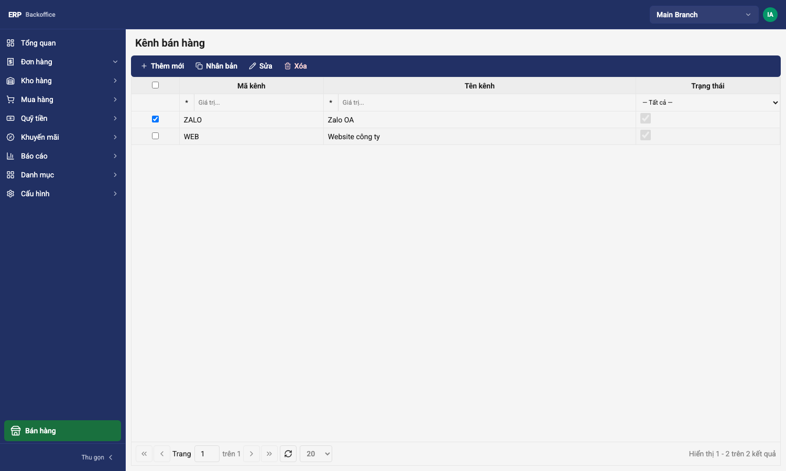
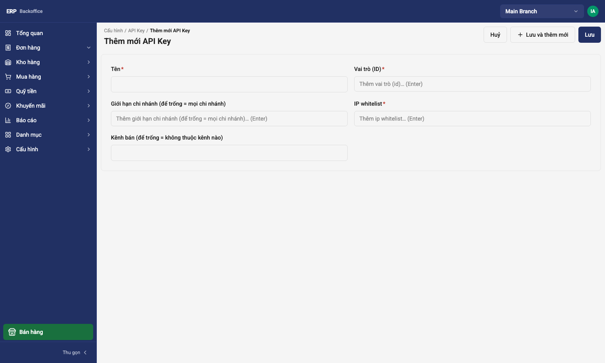
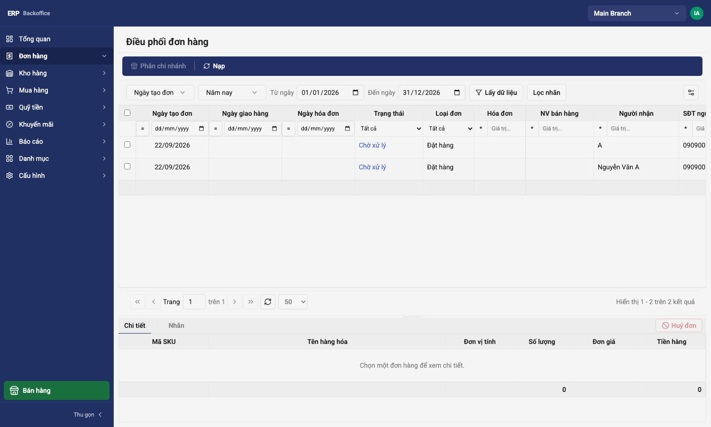
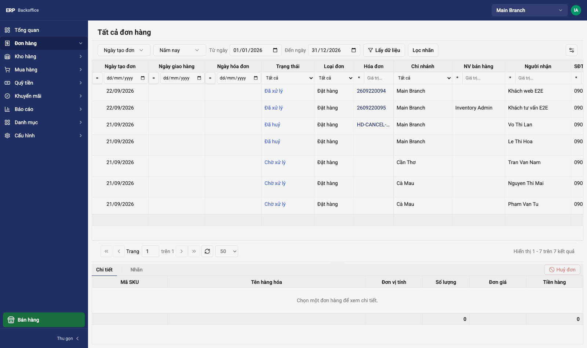
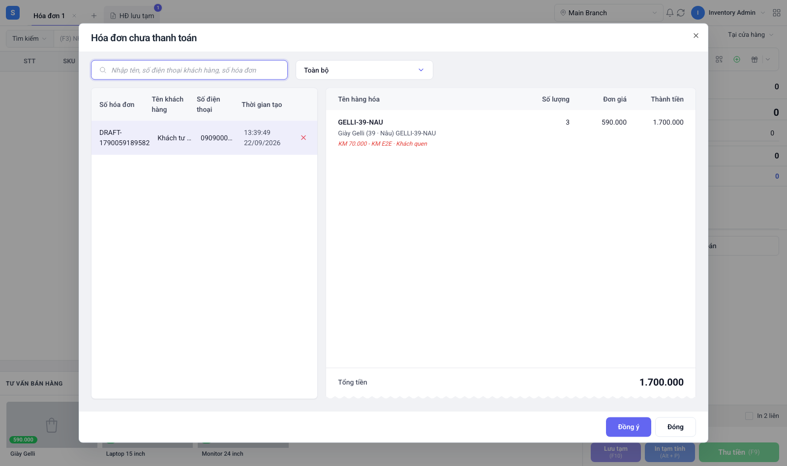
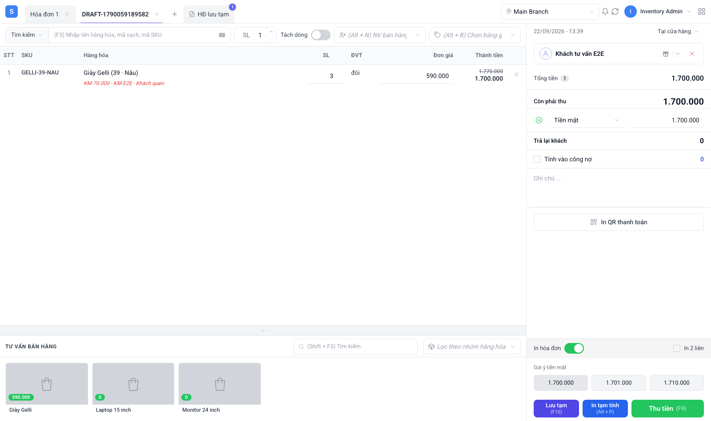

# Partner Order API (Third-Party Storefront → Order Intake)

> **Audience:** Third-party developers integrating a storefront (website, marketplace
> connector) that must place orders into jack-erp, and the operations staff who
> configure the key and process the orders.
> **Backend module:** `apps/api/src/modules/sales-order/` (`PartnerOrderV2Controller`)
> **Companion docs:** [Partner Catalog API](./partner-catalog-api.md) (products, SKU codes),
> [Geo API](./geo-api.md) (province / ward codes).
> **Feature plan & evidence:** `.ai/features/2026092001-online-order-intake-dispatch/`
> **Last updated:** 2026-09-22 (lines keyed by `itemCode`, T-01-08) — every request/response
> body below was captured from a running API, not written by hand.

---

## 1. What this surface does

One write endpoint. A storefront posts an order; jack-erp creates a **sales order in the
"unassigned" pool** of the partner's organization. Nothing is reserved, invoiced or
charged at that moment. From there the order is handled by people:

```
storefront ──POST /v2/partner/orders──► pool (branch = none, status SENT)
                                            │  admin: Đơn hàng › Điều phối đơn hàng
                                            ▼
                                       branch (status SENT, branch set)
                                            │  cashier: Nhận xử lý (approve)
                                            ▼
                                       PROCESSED + draft invoice (goods, fee, channel)
                                            │  cashier: collect payment (POS / mobile)
                                            ▼
                                       invoice paid / COD debt; stock, points, cash receipt
```

| Endpoint | Purpose | Status |
| -------- | ------- | ------ |
| `POST /v2/partner/orders` | Create an order (idempotent on `externalOrderId`) | **Live** |

There is deliberately **no read endpoint** for partners yet (no status polling, no order
list). See §8.

### Rules the endpoint enforces — read these before writing code

1. **The server sets the price.** Each line is `itemCode` + `quantity` only. Unit price is
   read from the catalogue (`items.selling_price`) at the moment the order is received and
   returned to you in the response. A payload that contains `unitPrice` (or any other
   unknown field) is rejected with `400`.
2. **The sales channel comes from the key, not the payload.** Every API key is bound to
   one sales channel (e.g. `WEB`). The channel name is snapshotted onto the order and,
   later, onto the invoice. A key with no active channel cannot order (`403`).
3. **`externalOrderId` is the idempotency key.** Sending the same `externalOrderId` on the
   same channel again returns the *original* order with `200` instead of creating a second
   one — also under concurrent retries.
4. **Address codes must exist.** `provinceCode` / `wardCode` are validated against the geo
   tables; the names are looked up server-side and frozen onto the order. Send codes, never
   names.
5. **The customer is matched by phone.** `customer.phone` is normalised
   (`+84 909 000 001`, `84909000001`, `0909000001` → `0909000001`) and matched within the
   organization; a new customer record is created if none matches.
6. **The order is not confirmed.** `201` means "received into the pool". Availability,
   fulfilment and payment are decided by staff afterwards.

---

## 2. Authentication

Send the key in the **`X-Api-Key`** header. No bearer token, no `X-Branch-Id`.

```http
POST /v2/partner/orders HTTP/1.1
Host: <api host>
X-Api-Key: <raw key issued to the partner>
Content-Type: application/json
```

- Keys are created by an organization admin in the backoffice (§7.2). The raw key is shown
  **once**; only its SHA-256 hash is stored.
- Each key has an **IP whitelist** (IPv4). A request from another address gets `403`
  even with a valid key. An empty whitelist rejects everything.
- The key must carry the permission **`partner.order.create`**. The seeded role
  **"Đối tác đặt hàng"** carries exactly that one permission.
- A storefront that also renders the catalogue needs **`partner.catalog.read`** too
  (role **"Đối tác"**). Assign both roles to one key, or issue two keys. A key with only
  the order role gets `403 Missing required permission: partner.catalog.read` on the
  catalogue endpoints.
- The key must be bound to a **sales channel** (§7.1). Without it every order call is
  `403 CHANNEL_INACTIVE`.

> Never grant `inventory.*` or `pos.*` permissions to a partner key. The partner surface
> exists so that a key cannot reach cost prices, stock or invoices.

---

## 3. Before ordering: ids you need

| Value | Where to get it |
| ----- | --------------- |
| `lines[].itemCode` | `variants[].code` from `GET /v2/partner/catalog/products/:productCode` — the sellable **SKU code**, e.g. `GELLI-39-NAU`. Matched byte-for-byte: same case, no surrounding text. The listing's `code` is the *product* (parent) code and is **not** accepted; neither are UUIDs. |
| `shipping.provinceCode` | `GET /v2/geo/provinces?q=…` → `data[].code` (format `2026_01`) |
| `shipping.wardCode` | `GET /v2/geo/wards?provinceCode=2026_01&q=…` → `data[].code` |

Both lookups accept the same `X-Api-Key`. Example (captured):

```http
GET /v2/geo/wards?provinceCode=2026_01
```
```json
{
  "data": [
    { "code": "4",   "name": "Phường Ba Đình",  "provinceName": "Hà Nội", "provinceCode": "2026_01", "districtCode": null, "isCurrent": true },
    { "code": "292", "name": "Phường Bạch Mai", "provinceName": "Hà Nội", "provinceCode": "2026_01", "districtCode": null, "isCurrent": true }
  ],
  "total": 126, "page": 1, "limit": 20
}
```

---

## 4. `POST /v2/partner/orders`

### Request body

```json
{
  "externalOrderId": "WEB-1001",
  "customer":  { "name": "Nguyễn Văn A", "phone": "0909000002", "email": "a@example.com" },
  "recipient": { "name": "Nguyễn Văn A", "phone": "0909000002" },
  "shipping": {
    "provinceCode": "2026_01",
    "wardCode": "10030",
    "addressLine": "12 Nguyễn Huệ",
    "fee": 30000
  },
  "lines": [
    { "itemCode": "GELLI-39-NAU", "quantity": 2 }
  ],
  "note": "Giao giờ hành chính"
}
```

| Field | Type | Required | Rules |
| ----- | ---- | -------- | ----- |
| `externalOrderId` | string ≤ 100 | yes | Your order number. Unique per sales channel; re-sending it replays the existing order (`200`). |
| `customer.name` | string ≤ 255 | yes | Buyer's name. |
| `customer.phone` | string ≤ 20 | yes | Buyer's phone — **the customer-matching key**. Normalised: non-digits stripped, leading `+84`/`84` → `0`. |
| `customer.email` | email ≤ 255 | no | |
| `recipient.name` | string ≤ 255 | yes | Who receives the parcel. May differ from the buyer; not inferred from `customer`. |
| `recipient.phone` | string ≤ 20 | yes | |
| `shipping.provinceCode` | string ≤ 16 | yes | Must exist in the geo tables (`GEO_CODE_UNKNOWN` otherwise). |
| `shipping.wardCode` | string ≤ 8 | yes | Must exist and belong to the province. |
| `shipping.addressLine` | string ≤ 255 | yes | Street / house number. |
| `shipping.fee` | number ≥ 0, ≤ 2 decimals | yes | Shipping fee **collected from the customer**, VND. Stored on the order and copied to the invoice; it is *not* part of `amountDue` in the response. |
| `lines[]` | array, ≥ 1 | yes | |
| `lines[].itemCode` | string ≤ 50 | yes | SKU code of the caller's organization, matched exactly (case-sensitive; leading/trailing spaces ignored). Unknown → `ORDER_LINE_ITEM_UNKNOWN` naming the code. Duplicated codes across lines are allowed (each line keeps its own quantity). |
| `lines[].quantity` | integer ≥ 1 | yes | |
| `note` | string ≤ 1000 | no | Customer note; shown to the branch. |

Anything else in the body — `unitPrice`, `itemId`, `discount`, `branchId`, `status`, a
misspelt key — is rejected:

```json
{ "code": "HTTP_400", "message": ["lines.0.property unitPrice should not exist"], "details": { … } }
```

Sending the UUID instead of the code fails the same way (captured):

```json
{ "code": "HTTP_400",
  "message": ["lines.0.property itemId should not exist", "lines.0.itemCode should not be empty", "lines.0.itemCode must be a string", …],
  "details": { … } }
```

### Response `201 Created` — new order

```json
{
  "id": "af9deed7-8fa0-405a-a5ca-b25d75704413",
  "documentNumber": "DT000134",
  "status": "SENT",
  "amountDue": 1180000,
  "shippingFee": 30000,
  "lines": [
    {
      "itemId": "a3000000-0000-4000-8000-000000000001",
      "itemCode": "GELLI-39-NAU",
      "itemName": "Giày Gelli (39 · Nâu)",
      "quantity": 2,
      "unitPrice": 590000,
      "lineTotal": 1180000
    }
  ]
}
```

| Field | Meaning |
| ----- | ------- |
| `id` | jack-erp order id (`sales_orders.id`). Store it with your order. |
| `documentNumber` | Human-readable order number staff see in the backoffice (`DT…`). |
| `status` | Always `SENT` for a newly received order (it is in the pool). |
| `amountDue` | Goods total the customer owes, **excluding** the shipping fee. Total to collect = `amountDue + shippingFee`. |
| `shippingFee` | Echo of `shipping.fee`. |
| `lines[].itemId` / `itemCode` | The resolved SKU: internal UUID plus the code you sent. Keep `itemId` if you ever need to reconcile against other jack-erp data; you never send it. |
| `lines[].unitPrice` | Price the server fixed at receipt time. If it differs from what your storefront displayed, your catalogue is stale — refresh from the catalogue API. |
| `lines[].lineTotal` | `quantity × unitPrice`. |

### Response `200 OK` — replay

Same body as above, status `200`, when `externalOrderId` was already received on this
channel. Nothing is created or changed; the body reflects the *original* order (original
prices, original lines), even if your retry carried different data.

### Errors

Every error uses the global envelope `{ code, message, details }`. `details.requestId`
identifies the request in server logs — include it when reporting a problem. Business
error codes live in **`details.code`** (the top-level `code` is the HTTP class).

| Condition | Status | `details.code` / message (captured) |
| --------- | ------ | ---------------------------------- |
| No / invalid key | `401` | `Invalid API key` |
| Key valid, caller IP not whitelisted | `403` | `This IP address is not whitelisted for this API key` |
| Key lacks `partner.order.create` | `403` | `Missing required permission: partner.order.create` |
| Key has no active sales channel | `403` | `CHANNEL_INACTIVE` — `Kênh bán đã ngừng hoạt động` |
| Unknown province / ward code, or ward not in province | `400` | `GEO_CODE_UNKNOWN` — `Mã tỉnh/thành hoặc phường/xã không tồn tại` |
| `itemCode` not in the caller's organization (or different case) | `400` | `ORDER_LINE_ITEM_UNKNOWN` — `Hàng hoá không tồn tại trong tổ chức: <code>` |
| Unknown field (`unitPrice`, `itemId`, …), wrong type, missing required field, empty `lines` | `400` | class-validator messages, e.g. `lines.0.property unitPrice should not exist` |
| `X-Idempotency-Key` reused with a different body | `409` | `Idempotency key already used with a different request body` |

Captured example:

```json
{
  "code": "HTTP_400",
  "message": "Mã tỉnh/thành hoặc phường/xã không tồn tại",
  "details": {
    "requestId": "7b8dda7c-8ed8-4f65-ae45-3a4b2d6e61d4",
    "code": "GEO_CODE_UNKNOWN",
    "message": "Mã tỉnh/thành hoặc phường/xã không tồn tại"
  }
}
```

### Retries and idempotency — two layers

- **Business layer (recommended, always on):** `externalOrderId`. Retry the identical
  request as often as you like; you get the same order back. This also holds for
  *concurrent* duplicates — two simultaneous posts of the same id yield one order
  (`201` + `200`), never two.
- **Transport layer (optional):** the global `X-Idempotency-Key` header (any unique
  string, e.g. a UUID). Same key + same body → the stored response is replayed with
  `X-Idempotency-Status: REPLAYED`; same key + *different* body → `409`. Use it if your
  HTTP client cannot guarantee it sends the same `externalOrderId` on retry.

### cURL

```bash
curl -sS -X POST "$BASE_URL/v2/partner/orders" \
  -H "X-Api-Key: $PARTNER_KEY" \
  -H "Content-Type: application/json" \
  -H "X-Idempotency-Key: $(uuidgen)" \
  -d '{
    "externalOrderId": "WEB-1001",
    "customer":  { "name": "Nguyễn Văn A", "phone": "0909000002" },
    "recipient": { "name": "Nguyễn Văn A", "phone": "0909000002" },
    "shipping":  { "provinceCode": "2026_01", "wardCode": "10030", "addressLine": "12 Nguyễn Huệ", "fee": 30000 },
    "lines": [ { "itemCode": "GELLI-39-NAU", "quantity": 2 } ]
  }'
```

---

## 5. What happens to the order afterwards (so your UX can set expectations)

| Step | Who | Where | Effect visible to you |
| ---- | --- | ----- | --------------------- |
| Received | API | pool | `201`, status `SENT`, no branch |
| Dispatched to a branch | Admin (`pos.sales-order.dispatch`) | Backoffice › Đơn hàng › **Điều phối đơn hàng** | none (status stays `SENT`) |
| Returned to pool | Admin, with a reason | same screen | none |
| Accepted for processing | Branch cashier (`pos.sales-order.approve`) | Mobile app (`POST /mobile/sales-orders/:id/approve`) | status `PROCESSED`; a **draft invoice** is created with the goods, the shipping fee and the channel name |
| Rejected | Branch cashier | Mobile app | status `REJECTED` (no invoice) |
| Paid | Cashier (POS "HĐ lưu tạm" → Thu tiền, or mobile cashier) | POS / mobile | invoice paid or COD debt; stock deducted; loyalty points; cash receipt |
| Cancelled after invoicing | Staff | Backoffice / mobile | order `CANCELLED`, invoice reversed, stock returned, debt settled |

Since there is no partner read endpoint, status changes are **not** pushed or pollable
today. If you need them, that is a new endpoint (`GET /v2/partner/orders/:externalOrderId`)
and/or a webhook — raise it with the jack-erp team; do not scrape backoffice pages.

---

## 6. Guarantees under test

- `partner-order-v2.controller.spec.ts` + `sales-order.service.spec.ts`: price comes from
  the catalogue, channel from the key, replay by `externalOrderId`, phone normalisation,
  geo validation, SKU-code resolution (exact match, unknown code named in the error).
- `apps/api/test/e2e/partner-order.e2e-spec.ts`, `admin-dispatch.e2e-spec.ts`,
  `online-order-fulfilment.e2e-spec.ts`, `online-order-cancel.e2e-spec.ts`: the full path
  against Postgres/Kafka, including the concurrent-duplicate case and COD debt.
- Repeatable scripts against a live stack, with numbers read from the database before and
  after: `.ai/features/2026092001-online-order-intake-dispatch/evidence/scripts/e2e/`
  (`run_flow.py`, `run_sales_flow.py`) and screenshots under `evidence/screenshots/sales-flow/`.

---

## 7. Operations guide (backoffice GUI)

### 7.1 Create the sales channel

**Cấu hình › Kênh bán hàng** (`/admin/sales-channels`) › **Thêm mới**. Give it a short
code (`WEB`, `SHOPEE`, …) and a display name. The *name* is what will appear on orders,
invoices and the sales report ("Kênh bán" column). Keep it active.



### 7.2 Issue the partner key

**Cấu hình › API Key** (`/admin/api-keys`) › **Thêm mới**:



| Field | Set to |
| ----- | ------ |
| Tên | Something you will recognise in a year (`Website giaymt.com.vn`). |
| Vai trò (ID) | Role id of **"Đối tác đặt hàng"** (and **"Đối tác"** if the same key renders the catalogue). Role ids are per organization; there is no roles screen in the backoffice yet — read them from `GET /admin/entities/roles/records` (or ask the jack-erp team). |
| Giới hạn chi nhánh | Leave empty. Orders go to the pool, not a branch. |
| IP whitelist | The storefront's egress IPv4 address(es). The list cannot be empty. |
| Kênh bán | The channel from 7.1. **Mandatory for ordering** — without it the key gets `403 CHANNEL_INACTIVE`. |

Press **Lưu**. The raw key is displayed **once** — hand it to the partner over a secure
channel. To rotate, create a new key, switch the partner, delete the old one.

> Permissions reach the database only through the seed
> (`pnpm seed:sync-admin-permissions`). On a fresh environment run it before issuing keys,
> otherwise the role has no permissions and every call is `403`.

### 7.3 Dispatch incoming orders

**Đơn hàng › Điều phối đơn hàng** (`/orders/dispatch`) lists the pool — orders with no
branch. Tick one or several, press **Phân chi nhánh**, choose the branch. The grid shows
status, recipient, phone, channel and COD amount (address and fee columns are available
through the column picker). A dispatched order can be sent back from the branch grid
(**Đơn hàng › Danh sách đơn hàng**) with **Trả đơn về pool** — a reason is required — and
the dispatch/return history is kept per order.



**Đơn hàng › Tất cả đơn hàng** (`/orders/all`) shows every order of the organization with
its branch, status and — once processed — the invoice number:



### 7.4 Branch: accept and collect

The branch cashier accepts the order (**Nhận xử lý**) in the mobile app; this needs an
**open POS session** on that branch (`409 NO_OPEN_SESSION` otherwise).
Acceptance creates a draft invoice that already carries the goods, the shipping fee and
the channel. The cashier then collects it like any held invoice — in the POS web under
**HĐ lưu tạm**:



Choosing it restores the cart with the order's lines and discounts; **Thu tiền (F9)**
settles it. Paying nothing (`payments: []`) records a COD debt for the full amount
including the fee, to be collected on delivery via **Quỹ tiền › Phiếu thu công nợ**.



---

## 8. Known limitations

| Limitation | Consequence | Status |
| ---------- | ----------- | ------ |
| No partner read endpoint | Storefront cannot show fulfilment status; no webhooks | Not planned in this feature — request it |
| No stock check at intake | An order for an out-of-stock item is accepted into the pool; the branch rejects it later | By design (A-05): availability is decided at the branch |
| Customer code generation is not collision-safe | If the customer-numbering counter is behind the data (seen on a dev seed), the *first* order for a new phone fails `500` instead of retrying | Known, tracked in the feature's findings |
| Line-level promotions are not carried | Partner lines are price × quantity; discounts, vouchers and promotions must be applied by staff on the invoice | By design |
| Fee is a plain amount | No carrier, tracking number or fee breakdown | By design |

---

## 9. Implementation map

| Concern | File |
| ------- | ---- |
| Controller, channel & geo resolution | `apps/api/src/modules/sales-order/controllers/partner-order-v2.controller.ts` |
| DTOs (request / response, Swagger) | `apps/api/src/modules/sales-order/dto/partner-create-order.dto.ts` |
| Order creation, replay, phone normalisation, pricing | `SalesOrderService.createFromPartner` in `apps/api/src/modules/sales-order/sales-order.service.ts` |
| Error codes | `apps/api/src/modules/sales-order/sales-order.constants.ts` |
| API key auth, IP whitelist, channel binding | `apps/api/src/modules/api-key/` |
| Sales channels (generic CRUD, `/admin/sales-channels`) | `apps/api/src/modules/sales-order/sales-channel-crud.service.ts` |
| Dispatch / return | `apps/api/src/modules/sales-order/controllers/admin-sales-order.controller.ts` |
| OpenAPI | `GET /docs-json` — path `/v2/partner/orders`; regenerate the client with `pnpm openapi:generate` |
