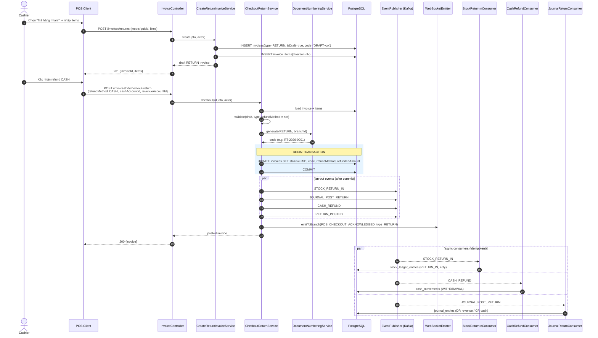
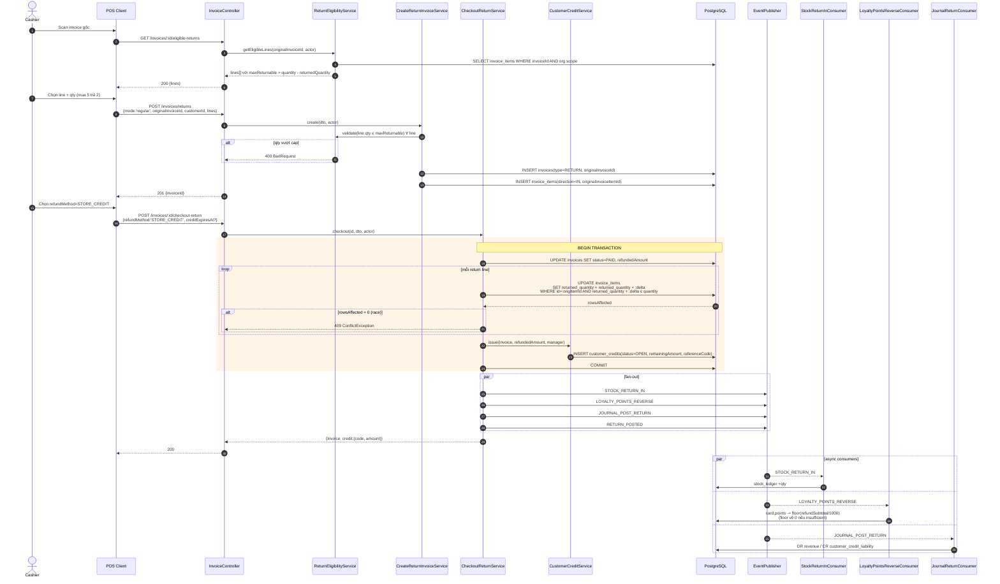
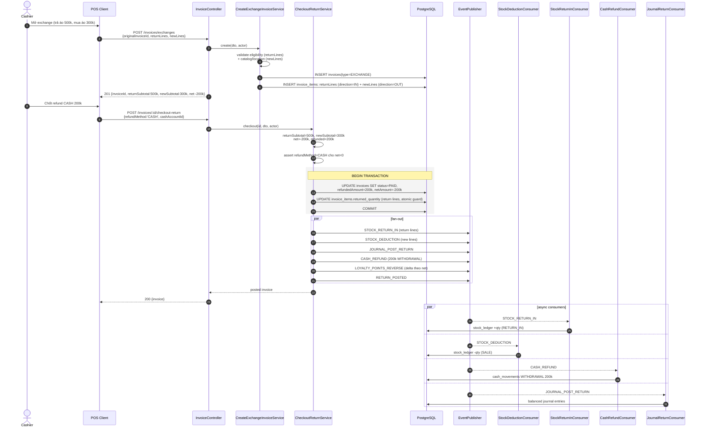
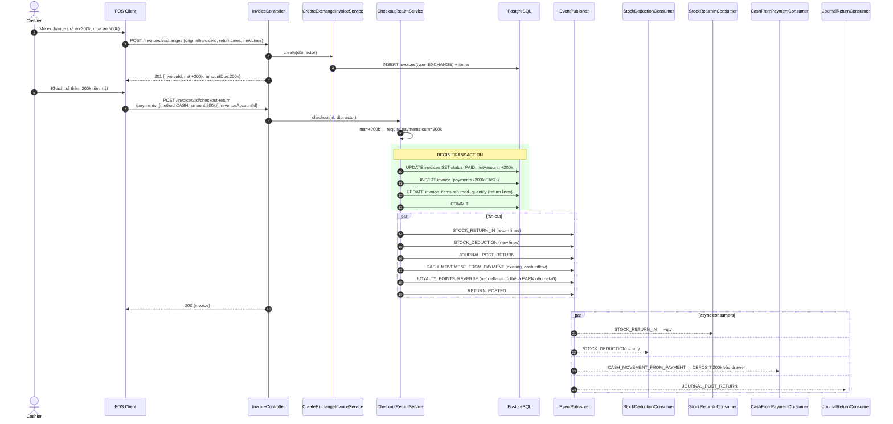

# Plan: Đổi trả hàng (Return / Exchange) Feature

## Context

Hệ thống POS hiện tại đã có luồng `CheckoutInvoiceService` hoàn chỉnh: tạo invoice DRAFT → checkout → fan-out 4 async events (stock deduction, loyalty points, journal sale, cash movement). Một luồng `CancelInvoiceService` cũng tồn tại, publish `INVOICE_CANCELLED` để revert stock + journal (full cancel only). Tuy nhiên:

1. Chưa có luồng **đổi trả hàng từng phần** (partial return) — `CancelInvoiceService` chỉ hủy nguyên invoice.
2. Chưa có luồng **đổi hàng** (exchange) — khách trả 1 món, mua 1 món mới trong cùng giao dịch, tự cấn trừ chênh lệch.
3. **Loyalty reversal** và **cash refund** consumers chưa tồn tại.
4. Trong codebase có **legacy scaffolding** (`SaleEntity`, `ReturnEntity`, `ReturnService`, `ExchangeService` ở `apps/api/src/modules/pos/`) dựa trên data model `sales`/`sale_lines` cũ — không kết nối với `InvoiceEntity` hiện tại. Code này lỗi thời, cần xóa thay vì tận dụng.

**Mục tiêu**: Implement chức năng đổi trả hàng nhanh (không cần invoice gốc — bán hàng âm) và đổi trả hàng thường (có invoice gốc, partial per-item + qty, optional mua thêm hàng mới), reverse tồn kho/điểm thưởng/tiền mặt/sổ cái, hỗ trợ refund qua tiền mặt / store credit / cấn trừ.

## Decisions (đã chốt với user)

- **Đổi trả nhanh** = không cần invoice gốc (bán hàng âm), tự do nhập items
- **Đổi trả hàng** = bắt buộc có invoice gốc, validate qty không vượt qty đã bán
- **Partial scope**: per-item + per-qty (mua 5 trả 2)
- **Chênh lệch giá**: net calculation — mua mới > trả lại → KH trả thêm; ngược lại → hoàn tiền
- **Refund methods**: CASH (cash withdrawal), STORE_CREDIT (công nợ ngược), OFFSET (cấn trừ trực tiếp vào hàng mua mới)

## Assumed defaults (cần user confirm khi review plan)

- **Data model**: extend `InvoiceEntity` với `type: SALE | RETURN | EXCHANGE` thay vì tạo entity mới — reuse toàn bộ hạ tầng checkout/payment/promotion. EXCHANGE = một invoice chứa cả dòng IN (trả lại) và OUT (mua mới).
- **Loyalty**: trừ điểm theo `floor(refundedSubtotal/1000)` (ngược công thức earn). Nếu thẻ KH không đủ điểm, floor về 0 + log warning, không fail giao dịch return.
- **Permission**: reuse `pos.return.create` và `pos.exchange.create` (đã có trong seed).
- **Time window**: bỏ qua v1, schema không thêm column.

## Architecture overview

```
Client (POS) ──► POST /invoices/returns        (mode=quick|regular)  ──► Draft RETURN invoice
              ──► POST /invoices/exchanges                            ──► Draft EXCHANGE invoice
              ──► POST /invoices/:id/checkout-return                  ──► Finalize

CheckoutReturnService.checkout()
   ├─ Validate (draft, type, eligibility, returnedQty caps, refund method matrix)
   ├─ Compute net (returnSubtotal vs newSubtotal for EXCHANGE)
   ├─ Generate code via DocumentType.RETURN
   ├─ Transaction:
   │    ├─ Update invoice (status=PAID, issuedAt, code)
   │    ├─ For each returnLine: SELECT FOR UPDATE original_item;
   │    │   atomically UPDATE invoice_items SET returned_quantity = returned_quantity + :delta
   │    │   WHERE id=:id AND returned_quantity + :delta <= quantity (assert rowsAffected=1)
   │    ├─ Save InvoicePayment rows (positive amounts, only when EXCHANGE net > 0)
   │    ├─ Issue CustomerCreditEntity if refundMethod=STORE_CREDIT
   │    └─ Settle InvoiceDebt if refundMethod=OFFSET against original AR
   └─ Publish events:
        ├─ STOCK_RETURN_IN          → StockReturnInConsumer (RETURN_IN +qty per line)
        ├─ STOCK_DEDUCTION (EXCHANGE only, new lines) → existing StockDeductionConsumer
        ├─ LOYALTY_POINTS_REVERSE   → LoyaltyPointsReverseConsumer (-points or net delta for EXCHANGE)
        ├─ JOURNAL_POST_RETURN      → JournalReturnConsumer (DR revenue, CR cash/AR/credit-liability)
        ├─ CASH_REFUND (when refundMethod=CASH) → CashRefundConsumer (WITHDRAWAL)
        ├─ CASH_MOVEMENT_FROM_PAYMENT (EXCHANGE w/ net>0, cash payments) → existing CashFromPaymentConsumer
        └─ RETURN_POSTED + WebSocket POS_CHECKOUT_ACKNOWLEDGED (type=RETURN|EXCHANGE)
```

## Sequence diagrams

Bốn lưu đồ tuần tự (mermaid) mô tả các nhánh chính của flow. Mỗi flow chia làm 2 phase: **create draft** (tạo invoice nháp + items) và **checkout-return** (finalize + fan-out events). Tất cả consumers chạy **async** sau khi DB transaction commit.

### Flow 1 — Đổi trả nhanh (Quick return, refund CASH)

Không cần invoice gốc, items tự do, refund tiền mặt ngay tại quầy.



### Flow 2 — Đổi trả thường (Regular partial return, refund STORE_CREDIT)

Có invoice gốc, validate `returnedQuantity` cap, phát hành credit cho khách hàng.



### Flow 3 — Đổi hàng (Exchange, net < 0, refund CASH)

Trả món đắt + mua món rẻ → chênh lệch hoàn tiền mặt. Phát đồng thời cả STOCK_RETURN_IN (return lines) và STOCK_DEDUCTION (new lines).



### Flow 4 — Đổi hàng (Exchange, net > 0, khách trả thêm)

Trả món rẻ + mua món đắt → khách trả thêm tiền. Reuse `CashFromPaymentConsumer` hiện hữu cho cash payments, không phát `CASH_REFUND`.



### Notes về thứ tự & invariants

- **Transaction boundary**: Mọi mutation DB (invoice header, returned_quantity guard, customer_credits, invoice_debt settle) phải gom trong **một** `manager.transaction()`. Event publish luôn nằm **ngoài** transaction (after-commit) — nếu commit fail, không có event nào lên Kafka.
- **Atomic returned_quantity guard**: `UPDATE ... WHERE returned_quantity + :delta <= quantity` + assert `rowsAffected === 1` là điểm chống race chính. Hai partial return song song trên cùng original line → một bên thắng, bên kia 409.
- **Consumer idempotency**: Mỗi consumer SELECT theo unique key trước khi INSERT. Replay an toàn vì topic + key gắn `returnInvoiceId` (không phải `originalInvoiceId`), tránh đụng với INVOICE_CANCELLED.
- **Net = 0 case** (EXCHANGE thuần swap): không có nhánh riêng — `refundMethod=OFFSET`, không emit `CASH_REFUND` lẫn `CASH_MOVEMENT_FROM_PAYMENT`. Chỉ stock + loyalty (delta=0) + journal (cân net).

## Implementation steps

### Step 1 — Legacy cleanup (zero behavior change)

Trước hết clear dead code để tránh hai parallel models.

Delete:
- `apps/api/src/modules/pos/entities/sale.entity.ts`, `sale-line.entity.ts`, `payment.entity.ts`
- `apps/api/src/modules/pos/entities/return.entity.ts`, `return-line.entity.ts`
- `apps/api/src/modules/pos/services/return.service.ts`, `exchange.service.ts`, `checkout.service.ts` (+ `.spec.ts`)
- `apps/api/src/modules/pos/dto/return.dto.ts`, `exchange.dto.ts`, `checkout.dto.ts`

Modify:
- `apps/api/src/modules/pos/pos.module.ts` — drop providers/exports/`TypeOrmModule.forFeature` cho các entity/service trên
- `apps/api/src/modules/pos/pos.controller.ts` — xóa routes `POST /sales/:id/return`, `POST /sales/:id/exchange`
- `apps/api/src/modules/pos/entities/index.ts`, `services/index.ts`, `dto/index.ts` — remove các re-export liên quan

Verify: `pnpm --filter @erp/api build` pass; `grep -rn "SaleEntity\|ReturnEntity\|PaymentEntity\|ReturnService\|ExchangeService" apps/api/src` returns 0 hits.

### Step 2 — Schema migrations

Tạo theo thứ tự (timestamp tiếp theo từ `1779600000000`):

**`1779700000000-AddInvoiceTypeAndReturnLinks.ts`** — modify `invoices`:
- `type` enum (`SALE | RETURN | EXCHANGE`), default `SALE`
- `original_invoice_id` uuid nullable, FK `invoices(id)` ON DELETE RESTRICT
- `refund_method` enum (`CASH | STORE_CREDIT | OFFSET`) nullable
- `refunded_amount` numeric(18,2) default 0
- `net_amount` numeric(18,2) default 0
- Index `IDX_invoices_org_original`(`organizationId`, `originalInvoiceId`)

**`1779700001000-AddInvoiceItemReturnFields.ts`** — modify `invoice_items`:
- `original_invoice_item_id` uuid nullable, FK `invoice_items(id)`
- `returned_quantity` numeric(18,2) default 0
- `direction` enum (`OUT | IN`) default `OUT`

**`1779700002000-AddCustomerCreditLedger.ts`** — new table `customer_credits`:
- Standard BaseEntity columns (id, organizationId, branchId, createdBy, createdAt, updatedAt, deletedAt)
- `customer_id` uuid not null, `source_invoice_id` uuid not null, `reference_code` varchar(50)
- `original_amount`, `used_amount` default 0, `remaining_amount` numeric(18,2)
- `status` enum (`OPEN | CONSUMED | EXPIRED`) default `OPEN`
- `issued_at` date, `expires_at` date nullable
- Indexes: `uq_customer_credit_ref`, `idx_customer_credit_customer_status`

**`1779700003000-AddStoreCreditPaymentMethod.ts`** (chỉ chạy nếu confirm store credit redemption):
- `ALTER TYPE invoice_payment_method_enum ADD VALUE 'store_credit'`

Mỗi migration cần `down()` đảo ngược, follow style của `1778600000000-AddInvoiceCancelFields.ts`.

### Step 3 — Entity updates

- `apps/api/src/modules/pos/entities/invoice.entity.ts` — add `InvoiceType`, `RefundMethod` enums + 5 columns mới
- `apps/api/src/modules/pos/entities/invoice-item.entity.ts` — add `ItemDirection` enum + 3 columns mới
- `apps/api/src/modules/customer/entities/customer-credit.entity.ts` — new entity file
- Export `InvoiceType`, `RefundMethod`, `ItemDirection` từ `packages/shared-interfaces/src/pos/index.ts` cho FE consume

### Step 4 — Topics & shared enums

- `packages/shared-kafka-client/src/topics.ts` — add 5 constants:
  - `RETURN_POSTED = 'erp.return.posted'`
  - `STOCK_RETURN_IN = 'erp.stock.return.in'`
  - `LOYALTY_POINTS_REVERSE = 'erp.loyalty.points.reverse'`
  - `CASH_REFUND = 'erp.cash.refund'`
  - `JOURNAL_POST_RETURN = 'erp.journal.post.return'`
- `packages/shared-interfaces/src/events/index.ts` — add tương ứng `DomainEventType` values
- `apps/api/src/modules/events/topics.init.ts` — đăng ký TopicSpec (STOCK_RETURN_IN partitions=6 match STOCK_DEDUCTION, còn lại=3, replication=existing default)

Rebuild shared packages: `pnpm build:shared`.

### Step 5 — Extract shared checkout helpers

Tạo `apps/api/src/modules/pos/services/checkout-shared.ts` chứa helpers thuần (no DI) để cả `CheckoutInvoiceService` và `CheckoutReturnService` cùng dùng:
- `computeInvoiceTotals(items, discount, deposit) → { subtotal, amountDue }`
- `assertAllItemsHaveLocation(items, invoiceId)` (currently inline lines 87–94)
- `roundMoney(v) → number`
- `findActiveDrawerSession(sessionRepo, actor)` (currently inline lines 225–231)

Refactor `checkout-invoice.service.ts` để gọi các helpers — pure mechanical, đảm bảo `checkout-invoice.service.spec.ts` vẫn pass.

### Step 6 — Publishers (new)

Theo template của các publisher hiện hữu (xem `apps/api/src/modules/inventory/publishers/stock-deduction.publisher.ts`):

- `apps/api/src/modules/pos/publishers/return-posted.publisher.ts`
- `apps/api/src/modules/pos/publishers/stock-return-in.publisher.ts` — per-line payload `{ itemId, locationId, quantity }`, partition key `returnInvoiceId`
- `apps/api/src/modules/customer/publishers/loyalty-points-reverse.publisher.ts` — payload `{ invoiceId: returnInvoiceId, customerId, subtotalDelta }`
- `apps/api/src/modules/accounting/publishers/cash-refund.publisher.ts` — payload `{ returnInvoiceId, returnInvoiceCode, cashAccountId, contraAccountId, amount, sessionId? }`
- `apps/api/src/modules/accounting/publishers/journal-return.publisher.ts` — payload tương tự `JournalSalePublisher` nhưng đảo direction

Đăng ký từng publisher trong module tương ứng (`pos.module.ts`, `customer.module.ts`, `accounting.module.ts`).

### Step 7 — Consumers (new)

Mỗi consumer phải **idempotent** — query bảng đích bằng unique reference trước khi insert (template: `stock-return.consumer.ts` lines 33–47, `loyalty-points.consumer.ts` lines 26–35).

| File | Topic | Side effect | Idempotency key |
|---|---|---|---|
| `apps/api/src/modules/inventory/consumers/stock-return-in.consumer.ts` | `STOCK_RETURN_IN` | `StockLedgerService.recordBatchMovements(RETURN_IN, +qty, referenceType='RETURN_INVOICE', referenceId=returnInvoiceId)` | `(referenceType, referenceId, itemId)` in `stock_ledger_entries` |
| `apps/api/src/modules/customer/consumers/loyalty-points-reverse.consumer.ts` | `LOYALTY_POINTS_REVERSE` | Adjust card.points by `-floor(subtotalDelta/1000)`, insert `PointHistoryEntity{type: ADJUST, delta: negative, invoiceId: returnInvoiceId}`; floor to 0 if insufficient | `(invoiceId, organizationId)` in `point_history` |
| `apps/api/src/modules/accounting/consumers/cash-refund.consumer.ts` | `CASH_REFUND` | `CashService.recordMovement(type=WITHDRAWAL, amount, reference=returnInvoiceCode)` | `(reference, cashAccountId, type, organizationId)` in `cash_movements` |
| `apps/api/src/modules/accounting/consumers/journal-return.consumer.ts` | `JOURNAL_POST_RETURN` | Post **new** journal entry (KHÔNG dùng `JournalReverseConsumer` cũ — đó chỉ phục vụ full cancel): DR revenue / CR cash hoặc CR AR hoặc CR credit-liability tùy `refundMethod` | `(sourceReferenceId, source=RETURN)` in `journal_entries` |

Note: KHÔNG reuse `INVOICE_CANCELLED` topic vì `StockReturnConsumer` đã dedup theo `(referenceType='INVOICE_CANCEL', referenceId=invoiceId)` — partial return thứ 2 cùng invoice sẽ bị nuốt. Topic riêng + key theo `returnInvoiceId` mới preserve idempotency cho nhiều partial return.

### Step 8 — Services (new)

Tất cả ở `apps/api/src/modules/pos/services/`:

**`return-eligibility.service.ts`**
- `getEligibleLines(originalInvoiceId, actor)` → mỗi line trả về `{ originalInvoiceItemId, itemId, itemName, soldQuantity, returnedQuantity, maxReturnable, unitPrice, lineDiscount }`. Validate org scope.

**`create-return-invoice.service.ts`**
- `create(dto, actor)` — input: `{ mode: 'quick'|'regular', originalInvoiceId?, customerId?, sessionId, reason, lines: [{ originalInvoiceItemId?, itemId, locationId, quantity, unitPrice }] }`
- Quick mode: bỏ qua eligibility check, items tự do.
- Regular mode: gọi `ReturnEligibilityService` validate từng line.
- Tạo `InvoiceEntity` với `type=RETURN`, `isDraft=true`, `code='DRAFT-<short-uuid>'`, save items với `direction=IN`.

**`create-exchange-invoice.service.ts`**
- `create(dto, actor)` — input gồm `returnLines` (như trên) + `newLines` (reuse `CreateInvoiceItemDto` shape).
- Validate returnLines (regular mode logic), validate newLines qua catalog/location resolver hiện có của `InvoiceService`.
- Tạo invoice `type=EXCHANGE`, save items với `direction=IN` cho return rows, `direction=OUT` cho new rows.

**`checkout-return.service.ts`** — service chính, mirror `CheckoutInvoiceService` nhưng đảo direction. Implementation outline:

```ts
async checkout(id, dto: CheckoutReturnDto, actor): Promise<InvoiceEntity> {
  // 1. Load + validate draft, type ∈ {RETURN, EXCHANGE}
  // 2. Load items, split by direction
  // 3. Compute returnSubtotal (sum lineTotal where direction=IN)
  //    Compute newSubtotal (sum lineTotal where direction=OUT)
  //    netAmount = newSubtotal - returnSubtotal
  //    refundedAmount = max(returnSubtotal - newSubtotal, 0)
  // 4. Validate refundMethod × netAmount:
  //    - netAmount > 0 → require dto.payments summing to netAmount (existing logic)
  //    - netAmount < 0 → require dto.refundMethod ∈ {CASH, STORE_CREDIT}
  //                      (OFFSET vô nghĩa khi không có new lines bù — accept với điều kiện refundedAmount===0 chỉ cho EXCHANGE thuần swap)
  //    - netAmount === 0 → refundMethod=OFFSET, no payments
  // 5. Validate refund method × original invoice status (assertRefundMethodAllowed)
  // 6. Generate code: DocumentType.RETURN
  // 7. Transaction:
  //    a. Update invoice (status=PAID, issuedAt, code, refundMethod, refundedAmount, netAmount)
  //    b. For each return line: atomic UPDATE invoice_items
  //       SET returned_quantity = returned_quantity + :delta
  //       WHERE id=:originalInvoiceItemId AND returned_quantity + :delta <= quantity
  //       assert rowsAffected === 1 else throw ConflictException
  //    c. Save InvoicePayment rows (chỉ khi netAmount > 0)
  //    d. If refundMethod=STORE_CREDIT: CustomerCreditService.issue(invoice, refundedAmount, manager)
  //    e. If refundMethod=OFFSET and originalInvoice.status ∈ {DEBT, PARTIAL_DEBT}:
  //       InvoiceDebtService.settle(originalInvoiceId, refundedAmount, manager)
  // 8. Fan-out events (mirror lines 179-281 of CheckoutInvoiceService):
  //    - stockReturnInPublisher.publish(returnInvoiceId, returnLines, ...)
  //    - If EXCHANGE with new lines: stockDeductionPublisher.publish(returnInvoiceId, newLines, ...)
  //    - loyaltyPointsReversePublisher.publish({ invoiceId, customerId, subtotalDelta: -(returnSubtotal - newSubtotal) }, actor)
  //      Note: for EXCHANGE, delta is net — could end up positive (KH earn thêm) → reuse normal LoyaltyPointsPublisher in that branch
  //    - journalReturnPublisher.publish(...)
  //    - If refundMethod=CASH: cashRefundPublisher.publish(...)
  //    - If netAmount > 0 with cash payments: cashFromPaymentPublisher.publish(...) (existing)
  //    - returnPostedPublisher.publish(RETURN_POSTED domain event)
  //    - wsEmitter.emitToBranch(POS_CHECKOUT_ACKNOWLEDGED with type)
}
```

Reference: copy `CheckoutInvoiceService.checkout()` structure, swap publishers/direction.

**`customer-credit.service.ts`** (in `apps/api/src/modules/customer/services/`)
- `issue(invoice, amount, manager?)` — create `CustomerCreditEntity` với reference code via `DocumentNumberingService` (cần seed thêm `DocumentType.CUSTOMER_CREDIT` hoặc reuse prefix logic — confirm với user)
- `redeem(creditId, amount, invoiceId, manager)` — assert remainingAmount ≥ amount, decrement, mark CONSUMED nếu cạn

### Step 9 — Controllers / DTOs

Modify `apps/api/src/modules/pos/controllers/invoice.controller.ts` thêm:

| Method | Path | Permission | Body |
|---|---|---|---|
| GET | `/invoices/:id/eligible-returns` | `pos.return.create` | — |
| POST | `/invoices/returns` | `pos.return.create` | `CreateReturnInvoiceDto` |
| POST | `/invoices/exchanges` | `pos.exchange.create` | `CreateExchangeInvoiceDto` |
| POST | `/invoices/:id/checkout-return` | `pos.return.create` (or `pos.exchange.create` tùy `type`) | `CheckoutReturnDto` |

Create DTOs in `apps/api/src/modules/pos/dto/`:
- `create-return-invoice.dto.ts` — fields với `class-validator`: `mode` (enum), `originalInvoiceId?` (uuid, required when regular), `customerId?` (uuid, required when refundMethod=STORE_CREDIT), `sessionId` (uuid), `reason` (string), `lines: ReturnInvoiceLineDto[]`
- `create-exchange-invoice.dto.ts` — `sessionId`, `originalInvoiceId`, `reason`, `returnLines: ReturnInvoiceLineDto[]`, `newLines: InvoiceItemInputDto[]`
- `checkout-return.dto.ts` — `refundMethod: 'CASH' | 'STORE_CREDIT' | 'OFFSET'`, `revenueAccountId` (uuid), `cashAccountId?` (uuid, required when CASH and no active session), `creditExpiresAt?` (ISO date), `payments?: InvoicePaymentLineDto[]` (chỉ cho EXCHANGE khi net > 0), `receivableAccountId?`

Mỗi DTO phải có `@ApiProperty` đầy đủ; `ValidationPipe` global đang dùng `forbidNonWhitelisted: true`.

### Step 10 — Module wiring

- `apps/api/src/modules/pos/pos.module.ts` — đăng ký `TypeOrmModule.forFeature([CustomerCreditEntity, ...])`, services mới, publishers mới
- `apps/api/src/modules/customer/customer.module.ts` — register `CustomerCreditService`, `LoyaltyPointsReverseConsumer`, `LoyaltyPointsReversePublisher`
- `apps/api/src/modules/inventory/inventory.module.ts` — register `StockReturnInConsumer`, `StockReturnInPublisher`
- `apps/api/src/modules/accounting/accounting.module.ts` — register `CashRefundConsumer/Publisher`, `JournalReturnConsumer/Publisher`

### Step 11 — Testing

Mirror patterns trong `checkout-invoice.service.spec.ts` (đã có 19KB tests). Co-located `.spec.ts` cho:

- `return-eligibility.service.spec.ts` — pure function tests
- `create-return-invoice.service.spec.ts` — quick vs regular mode, eligibility throws, draft code shape
- `create-exchange-invoice.service.spec.ts` — mixed return + new lines, validation errors
- `checkout-return.service.spec.ts` (largest, ~25-30 cases):
  - Validate not-a-draft, wrong type, no items, missing refund accounts
  - Happy path RETURN + CASH: increment `returnedQuantity`, publish STOCK_RETURN_IN + CASH_REFUND + LOYALTY_REVERSE + JOURNAL_RETURN
  - STORE_CREDIT: tạo `CustomerCreditEntity`, không publish CASH_REFUND
  - OFFSET against DEBT invoice: settle `InvoiceDebt`, không cash event
  - EXCHANGE net > 0: require payments, publish cả 2 stock publishers
  - EXCHANGE net < 0: require refundMethod, publish cả 2 stock publishers + cash refund
  - EXCHANGE net = 0: no payments, no refund
  - Concurrency: 2 returns đồng thời vượt qty → second throws ConflictException
  - Loyalty floor về 0 khi card không đủ điểm
  - WebSocket emit có `type: 'RETURN'` hoặc `'EXCHANGE'`
- Mỗi consumer mới có spec test idempotency + side-effect call (template: `stock-return.consumer.spec.ts`)
- `customer-credit.service.spec.ts` — issue, redeem (insufficient → throws), partial → status remains OPEN

Update existing:
- `cancel-invoice.service.spec.ts` — verify cancel của RETURN invoice bị reject (returns không tự cancel được; nếu cần revert return → ngoài scope v1)

## Files

### Critical files to create

```
apps/api/src/database/migrations/1779700000000-AddInvoiceTypeAndReturnLinks.ts
apps/api/src/database/migrations/1779700001000-AddInvoiceItemReturnFields.ts
apps/api/src/database/migrations/1779700002000-AddCustomerCreditLedger.ts
apps/api/src/database/migrations/1779700003000-AddStoreCreditPaymentMethod.ts

apps/api/src/modules/customer/entities/customer-credit.entity.ts
apps/api/src/modules/customer/services/customer-credit.service.ts
apps/api/src/modules/customer/publishers/loyalty-points-reverse.publisher.ts
apps/api/src/modules/customer/consumers/loyalty-points-reverse.consumer.ts

apps/api/src/modules/pos/services/return-eligibility.service.ts
apps/api/src/modules/pos/services/create-return-invoice.service.ts
apps/api/src/modules/pos/services/create-exchange-invoice.service.ts
apps/api/src/modules/pos/services/checkout-return.service.ts
apps/api/src/modules/pos/services/checkout-shared.ts

apps/api/src/modules/pos/publishers/return-posted.publisher.ts
apps/api/src/modules/pos/publishers/stock-return-in.publisher.ts

apps/api/src/modules/pos/dto/create-return-invoice.dto.ts
apps/api/src/modules/pos/dto/create-exchange-invoice.dto.ts
apps/api/src/modules/pos/dto/checkout-return.dto.ts

apps/api/src/modules/inventory/consumers/stock-return-in.consumer.ts
apps/api/src/modules/accounting/publishers/cash-refund.publisher.ts
apps/api/src/modules/accounting/publishers/journal-return.publisher.ts
apps/api/src/modules/accounting/consumers/cash-refund.consumer.ts
apps/api/src/modules/accounting/consumers/journal-return.consumer.ts

+ co-located *.spec.ts cho mỗi service / consumer mới
```

### Critical files to modify

```
apps/api/src/modules/pos/entities/invoice.entity.ts                 (+ enums, + 5 cols)
apps/api/src/modules/pos/entities/invoice-item.entity.ts            (+ enum, + 3 cols)
apps/api/src/modules/pos/services/checkout-invoice.service.ts       (extract helpers; thêm STORE_CREDIT redemption branch)
apps/api/src/modules/pos/controllers/invoice.controller.ts          (+ 4 endpoints)
apps/api/src/modules/pos/pos.module.ts                              (drop legacy + register new)
apps/api/src/modules/pos/pos.controller.ts                          (drop legacy /sales/:id/return + exchange)
apps/api/src/modules/customer/customer.module.ts                    (register new entity/service/publisher/consumer)
apps/api/src/modules/inventory/inventory.module.ts                  (register publisher + consumer)
apps/api/src/modules/accounting/accounting.module.ts                (register publishers + consumers)
apps/api/src/modules/events/topics.init.ts                          (+ 5 TopicSpec entries)
packages/shared-kafka-client/src/topics.ts                          (+ 5 constants)
packages/shared-interfaces/src/events/index.ts                      (+ 5 DomainEventType values)
packages/shared-interfaces/src/pos/index.ts                         (+ InvoiceType, RefundMethod, ItemDirection)
```

### Files to delete (legacy)

```
apps/api/src/modules/pos/entities/sale.entity.ts
apps/api/src/modules/pos/entities/sale-line.entity.ts
apps/api/src/modules/pos/entities/payment.entity.ts
apps/api/src/modules/pos/entities/return.entity.ts
apps/api/src/modules/pos/entities/return-line.entity.ts
apps/api/src/modules/pos/services/return.service.ts
apps/api/src/modules/pos/services/exchange.service.ts
apps/api/src/modules/pos/services/checkout.service.ts
apps/api/src/modules/pos/services/checkout.service.spec.ts
apps/api/src/modules/pos/dto/return.dto.ts
apps/api/src/modules/pos/dto/exchange.dto.ts
apps/api/src/modules/pos/dto/checkout.dto.ts
```

## Reused utilities

- `DocumentNumberingService.generate(DocumentType.RETURN, branchId, actor)` — đã có
- `EventPublisher.publish(topic, payload, partitionKey)` — đã có
- `WebSocketEmitterService.emitToBranch(...)` — đã có
- `StockLedgerService.recordBatchMovements(...)` — đã có (movement types `RETURN_IN`, `EXCHANGE_IN`, `EXCHANGE_OUT` đã có)
- `CashService.recordMovement(...)` — đã có (WITHDRAWAL type đã có)
- `MembershipCardService.adjustPoints(...)` — đã có
- `InvoiceDebtService.settle/createFromInvoice` — đã có
- `PromotionApplyService.commitPromotions/revertPromotions` — đã có
- Permission keys `pos.return.create`, `pos.exchange.create`, document type `DocumentType.RETURN`, journal sources `JournalSource.RETURN/EXCHANGE`, stock movement types `RETURN_IN/EXCHANGE_IN/EXCHANGE_OUT` — đã có trong seed/enums

## Verification

End-to-end manual test:

1. **Setup**: `docker compose up -d` → `pnpm seed:dev-admin` → `make dev-api`
2. **Tạo invoice gốc**: POST `/invoices` + items → POST `/invoices/:id/checkout` (CASH payment) → status=PAID. Note `code`, `invoiceId`, item ids.
3. **Verify side effects của sale**: kiểm tra stock_balances giảm, point_history thêm EARN, cash_movements thêm DEPOSIT, journal_entries thêm SALE.
4. **Đổi trả nhanh**: POST `/invoices/returns` với `mode='quick'`, items tự do → POST `/invoices/:id/checkout-return` với `refundMethod='CASH'` → assert stock tăng, cash_movements thêm WITHDRAWAL, journal_entries thêm RETURN.
5. **Đổi trả thường (partial)**: POST `/invoices/returns` với `mode='regular'`, `originalInvoiceId`, return 2/5 items → checkout-return → kiểm tra `invoice_items.returned_quantity = 2` trên invoice gốc, stock tăng đúng 2 units, point_history thêm ADJUST với delta âm.
6. **Đổi hàng (exchange) — net > 0**: trả 1 món rẻ + mua 1 món đắt → cần payments → checkout thành công, stock có cả deduction (món mới) lẫn return-in (món trả).
7. **Đổi hàng — net < 0**: trả 1 món đắt + mua 1 món rẻ → `refundMethod='CASH'` → cash_movements thêm WITHDRAWAL đúng số tiền chênh.
8. **Store credit**: invoice gốc → quick return với `refundMethod='STORE_CREDIT'` → assert `customer_credits` row tạo với `remainingAmount` đúng.
9. **Over-return guard**: cố return qty=10 khi đã sold=5 → 400 BadRequest.
10. **Concurrency**: 2 partial returns song song cùng original line → second nhận ConflictException.

Auto tests:
- `pnpm --filter @erp/api test` — toàn bộ unit specs phải pass (bao gồm 8+ specs mới)
- `pnpm --filter @erp/api test:e2e` nếu có cover invoice flows

Type & build:
- `pnpm --filter @erp/api build` pass
- `pnpm openapi:generate` → commit lại `packages/api-client/src/generated/schema.ts` + `openapi.snapshot.json`

## Open questions (cần user confirm trước khi implement)

1. **Chart-of-Accounts cho store credit**: Cần GL account `customer_credit_liability` per organization để `JournalReturnConsumer` post đúng. Có sẵn chưa hay cần seed migration?
2. **COGS reversal**: Sale hiện không post COGS journal (chỉ revenue/cash/AR). Khi return có cần reverse COGS không? Nếu có → `JournalReturnConsumer` cần mirror.
3. **Refund khi không có open POS session**: `CashFromPaymentConsumer` lookup drawer via session. Refund vài ngày sau khi không có session — bắt buộc `cashAccountId` explicit trong DTO?
4. **STORE_CREDIT payment method**: Confirm cần thêm enum value vào `invoice_payment_method` để redeem credit ở checkout sau, hay xử lý qua field `dto.creditId` riêng?
5. **Returning EXCHANGE invoices**: Cho phép trả tiếp items từ một EXCHANGE? Schema đã support (set `originalInvoiceId` = exchange id, chỉ allow `direction=OUT` lines). Có nên implement v1?
6. **DocumentType cho customer credit reference**: Reuse `DocumentType.RETURN` hay tạo `DocumentType.CUSTOMER_CREDIT` riêng cho mã credit (vd `CR-...`)?
