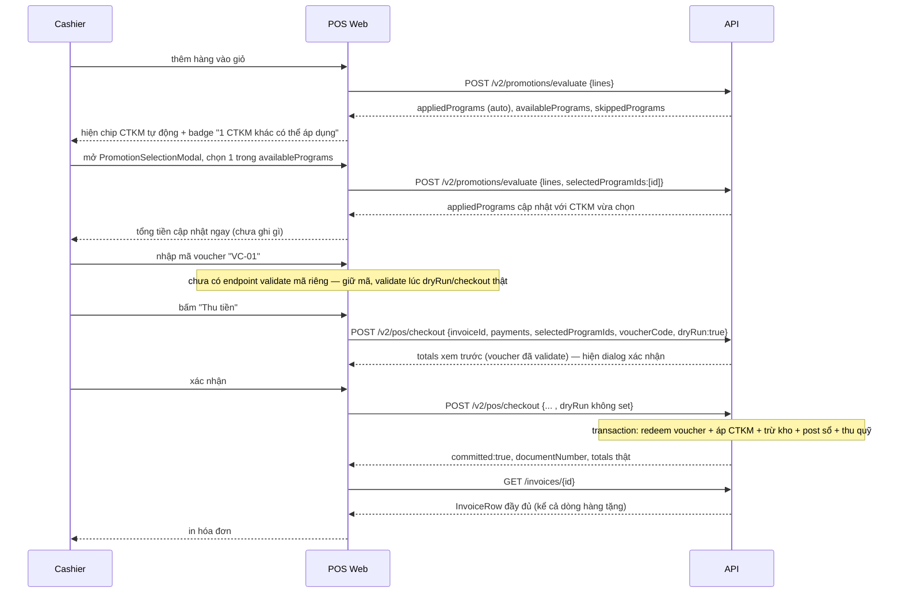

# Khuyến mại & Voucher — FE/POS API Integration

Tài liệu cho FE (`apps/pos-web`) ghép nốt 2 tính năng backend đã xong nhưng UI checkout hiện chưa gọi:

- **Xem trước CTKM + tổng tiền** trước khi bấm "Thu tiền" (không ghi gì lên server).
- **Áp mã voucher thật** vào hóa đơn khi checkout (hiện chỉ đổi state cục bộ, không gửi lên BE — xem `docs/promotions/promotion-voucher-pos-fe-be-gaps.md` để biết bối cảnh gap).

> Backend đã xong, không cần đổi gì thêm ở BE để làm được 2 việc trên. `@erp/api-client` **chưa** regenerate cho `checkout-saga` (nhánh `feat/promotions` đang uncommitted) — FE tạm thời tự khai type tối thiểu như trong các snippet dưới, giống cách `loyalty-pos-fe-api-integration.md` đã làm với `redeem-points`.

---

## 0. Quy ước chung (đọc trước)

- **Auth headers**: `Authorization: Bearer <accessToken>` + `X-Branch-Id: <branchId>`. Dùng wrapper `erpApi` (`lib/common/http.ts`) thì tự inject, không cần set tay.
- **Permissions**: xem trước (`evaluate`) cần `promotion.read`; checkout thật (`/v2/pos/checkout`) cần `pos.invoice.write` — **cùng quyền tài khoản thu ngân đã có** để checkout luồng cũ, không cần cấp thêm quyền mới cho việc gọi `evaluate`... **trừ khi** role thu ngân hiện tại chưa có `promotion.read` (kiểm tra ở RBAC seed trước khi tích hợp; nếu thiếu, xin cấp thêm — không tự ý đổi seed).
- **⚠️ Kiểu số**: mọi field tiền trong response của 2 endpoint dưới đây đã là **number sạch** (không phải `numeric` string như response `GET /invoices/:id`) — khác với `loyalty-pos-fe-api-integration.md` đã cảnh báo cho endpoint hóa đơn. Vẫn nên `Number(...)` phòng hờ nếu render lẫn với field khác của invoice.
- **Lỗi**: theo `HttpExceptionFilter` toàn repo — **không phải** body phẳng `{code, message}`. Xem chi tiết §3.
- Tiền tệ hiển thị: `Intl` locale `vi-VN`. Toàn bộ chuỗi UI tiếng Việt.
- Toàn bộ type dưới đây import được từ `@erp/shared-interfaces`:
  ```ts
  import type {
    EvaluateCartRequest,
    EvaluateCartResponse,
    AppliedProgram,
    AvailableProgram,
    SkippedProgram,
    LineDiscount,
    GiftOffer,
    PromotionProgramType,
    PromotionGiftMode,
  } from "@erp/shared-interfaces";
  ```

---

## 1. Xem trước CTKM + tổng tiền — `POST /v2/promotions/evaluate`

Không cần draft invoice, **không ghi gì**. Gọi lại mỗi khi giỏ hàng / khách hàng / lựa chọn CTKM tùy chọn đổi — nên debounce ~300-500ms theo thay đổi giỏ hàng.

### Request (`EvaluateCartRequest`)

```jsonc
{
  "customerId": "0b1f...",              // optional — bỏ qua nếu khách vãng lai
  "at": "2026-08-06T07:00:00.000Z",     // optional — bỏ qua = giờ server hiện tại
  "selectedProgramIds": ["prog-uuid"],  // optional — id các CTKM auto_apply=false mà thu ngân đã chọn (xem §1.3)
  "lines": [
    {
      "lineId": "line-1",               // do FE tự đặt (vd id dòng trong cart) — trả lại nguyên trong response, KHÔNG cần trùng id thật của invoice_item
      "itemId": "7f71...",              // uuid item
      "quantity": 1,
      "unitPrice": 750000,
      "manualLineDiscount": 0           // optional — chiết khấu tay thu ngân đã nhập cho dòng đó, nếu có
    }
  ]
}
```

### Response 200 (`EvaluateCartResponse`)

```jsonc
{
  "subtotal": 750000,
  "promotionDiscount": 0,                 // tổng giảm giá do CTKM (KHÔNG gồm chiết khấu tay)
  "amountAfterPromotion": 750000,         // subtotal - promotionDiscount (chưa trừ điểm/đặt cọc)
  "appliedPrograms": [                    // CTKM ĐÃ áp — hiển thị badge/chip trên giỏ hàng
    {
      "programId": "60995b5f-...",
      "code": "GIFT-SHOES-01",
      "name": "Tặng dép khi mua giày",
      "type": "GIFT_ITEM",                // enum PromotionProgramType
      "priority": 10,
      "discountAmount": 0,                // GIFT_ITEM thường discountAmount=0, xem `gifts` thay vào đó
      "lineDiscounts": [                  // rỗng nếu CTKM này không giảm giá dòng nào (vd GIFT_ITEM thuần)
        { "lineId": "line-1", "discountAmount": 50000, "unitPriceAfter": 700000 }
      ],
      "gifts": [                          // dòng hàng tặng — hiển thị thêm 1 dòng "quà tặng" trong giỏ, giá 0đ
        { "itemId": "0c24...", "itemCode": "ABA3299-D-38", "itemName": "Giày nam ABA3299-D-38", "unit": "Đôi", "quantity": 1, "unitPrice": 780000, "mode": "ONE_OF" }
      ]
    }
  ],
  "availablePrograms": [                  // auto_apply=false, ĐỦ điều kiện nhưng CHƯA chọn — nguồn cho PromotionSelectionModal
    {
      "programId": "a1b2...",
      "code": "MUA2TANG1",
      "name": "Mua 2 tặng 1",
      "type": "BUY_M_GET_N",
      "autoApply": false,
      "estimatedDiscount": 120000          // ước tính NẾU chọn — hiển thị ngay trong modal để thu ngân so sánh
    }
  ],
  "skippedPrograms": [                    // CTKM đủ điều kiện thời gian nhưng bị loại — hiển thị lý do khi thu ngân hỏi "sao không được áp"
    {
      "programId": "c3d4...",
      "name": "Giảm 10% cuối tuần",
      "reason": "DAY_OF_WEEK",            // xem bảng lý do §1.2
      "takenBy": undefined                 // chỉ có giá trị khi reason=RESOURCE_TAKEN
    }
  ]
}
```

### 1.1 Field quan trọng cho UI

| Field                                       | Dùng để                                                                                                                                                                                                                                                                                                                   |
| ------------------------------------------- | ------------------------------------------------------------------------------------------------------------------------------------------------------------------------------------------------------------------------------------------------------------------------------------------------------------------------- |
| `appliedPrograms[].gifts[]`                 | Vẽ thêm dòng "🎁 Quà tặng" trong giỏ hàng, giá 0đ, không tính vào `subtotal`                                                                                                                                                                                                                                               |
| `appliedPrograms[].gifts[].mode = "ONE_OF"` | Nhiều gift cùng 1 CTKM nhưng khách chỉ được chọn 1 — cần UI cho chọn (BE hiện mặc định lấy ứng viên đầu nếu FE không truyền lựa chọn cụ thể — **chưa có field để FE chỉ định chọn gift nào trong nhiều ONE_OF gift của cùng 1 program**; nếu cần UI chọn tay, hỏi trước khi làm, đây là gap ngoài phạm vi 2 endpoint này) |
| `availablePrograms[]`                       | Đổ thẳng vào `PromotionSelectionModal` (thay `promotions={[]}` đang hard-code)                                                                                                                                                                                                                                            |
| `skippedPrograms[].reason`                  | Map sang message tiếng Việt (bảng dưới) để giải thích cho thu ngân                                                                                                                                                                                                                                                        |

### 1.2 `SkippedProgramReason` → message tiếng Việt (gợi ý)

| reason              | Ý nghĩa                                                                        | Gợi ý hiển thị                                                |
| ------------------- | ------------------------------------------------------------------------------ | ------------------------------------------------------------- |
| `STOPPED`           | CTKM đã bị dừng theo dõi                                                       | "Chương trình đã ngừng"                                       |
| `DATE_WINDOW`       | Ngoài khoảng ngày áp dụng                                                      | "Ngoài thời gian áp dụng"                                     |
| `DAY_OF_WEEK`       | Không đúng thứ trong tuần                                                      | "Không áp dụng hôm nay"                                       |
| `TIME_OF_DAY`       | Ngoài khung giờ                                                                | "Ngoài khung giờ áp dụng"                                     |
| `BRANCH_SCOPE`      | Không áp dụng cho chi nhánh này                                                | "Không áp dụng tại chi nhánh này"                             |
| `CUSTOMER_SCOPE`    | Khách không thuộc nhóm/hạng thẻ áp dụng                                        | "Khách không đủ điều kiện"                                    |
| `CONDITION_NOT_MET` | Chưa đủ điều kiện (số lượng/giá trị đơn)                                       | "Chưa đủ điều kiện áp dụng"                                   |
| `RESOURCE_TAKEN`    | Một CTKM khác có priority cao hơn đã chiếm dòng hàng/tài nguyên chung (BR-001) | "Đã áp dụng chương trình khác ưu tiên hơn"                    |
| `NOT_SELECTED`      | `auto_apply=false` và thu ngân chưa chọn                                       | (không cần hiện — đây chính là nguồn cho `availablePrograms`) |

### 1.3 Chọn CTKM tùy chọn (ONE_OF giữa nhiều chương trình)

Gọi lại `evaluate` với `selectedProgramIds` chứa id chương trình vừa chọn từ `availablePrograms` — response mới sẽ có chương trình đó trong `appliedPrograms` (nếu vẫn còn đủ điều kiện) với `discountAmount`/`gifts` thật.

---

## 2. Áp mã voucher + checkout thật — `POST /v2/pos/checkout`

Đây là endpoint checkout hiện POS **đã gọi** (`invoiceService.checkout()`, `import.meta.env.VITE_CHECKOUT_V2 === "true"`) — chỉ cần bổ sung 3 field đang bị bỏ khi build request.

### Request — bổ sung vào `CheckoutV2Body` hiện có

```ts
// apps/pos-web/src/dtos/invoice.dto.ts — CheckoutV2Body, thêm 3 field optional:
export interface CheckoutV2Body {
  invoiceId: string;
  payments: InvoicePaymentLineBody[];
  dueDate?: string;
  creditDays?: number;
  selectedProgramIds?: string[];   // ➕ mới — id các CTKM đã chọn ở §1.3, giữ nguyên lựa chọn lúc checkout
  voucherCode?: string;            // ➕ mới — mã voucher thu ngân đã nhập/quét
  dryRun?: boolean;                // ➕ mới — xem §2.3
}
```

```ts
// apps/pos-web/src/services/invoice.service.ts — checkout(), forward thêm 3 field:
const v2Body: CheckoutV2Body = {
  invoiceId: id,
  payments: body.payments,
  dueDate: body.dueDate,
  creditDays: body.creditDays,
  selectedProgramIds: body.selectedProgramIds,  // ➕
  voucherCode: body.voucherCode,                // ➕
};
```

> `CheckoutInvoiceBody` (kiểu tham số hiện có của `invoiceService.checkout(id, body)`) cũng cần thêm 2 field `selectedProgramIds?`/`voucherCode?` để có gì mà forward — luồng `/v1` (`VITE_CHECKOUT_V2 !== "true"`) sẽ tự bỏ qua 2 field này vì API cũ (`POST /invoices/:id/checkout`) không đọc chúng, không cần điều kiện riêng.

### Response 201 — commit thật (`dryRun` không set hoặc `false`)

```jsonc
{
  "committed": true,
  "invoiceId": "f73136c5-...",
  "sagaId": "17e84000-...",
  "documentNumber": "INV-202608-00001",
  "totals": {
    "subtotal": 750000,
    "manualDiscountAmount": 0,
    "promotionDiscount": 0,          // CTKM
    "pointsDiscountAmount": 0,       // đổi điểm (xem loyalty-pos-fe-api-integration.md)
    "depositAmount": 0,
    "amountDue": 750000,
    "totalPaid": 750000,
    "remainder": 0,
    "pointsEarned": 75,
    "newStatus": "paid"
  },
  "appliedPrograms": [ /* AppliedProgram[], cùng shape §1 */ ],
  "steps": [
    { "seq": 1, "name": "load-draft", "phase": "preflight", "status": "OK", "durationMs": 13 }
    // … đủ 19 bước khi commit thật, dừng giữa chừng nếu FAILED
  ]
}
```

> Response **không** trả `InvoiceRow` đầy đủ — `invoiceService.checkout()` hiện đã tự gọi thêm `GET /invoices/:id` sau khi commit để lấy `InvoiceRow` cho phần còn lại của app (giữ nguyên, không đổi).

### 2.1 Voucher hợp lệ → hóa đơn có gì

Sau khi `voucherCode` được redeem thành công, hóa đơn (`GET /invoices/:id`) có `discountAmount` đã cộng thêm giá trị voucher (Math.min(faceValue, subtotal)) — **không có field riêng "voucher" trên response invoice**, số tiền đã gộp vào `discountAmount` chung, giống cách chiết khấu tay hoạt động. Nếu UI cần hiện rõ "đã áp voucher ABC (-50.000đ)" tách biệt, phải tự giữ lại `voucherCode` + số tiền ước tính từ lúc thu ngân nhập (BE không trả lại số tiền voucher tách riêng trong response checkout).

### 2.2 Hàng tặng trên hóa đơn đã chốt

`GET /invoices/:id` → `items[]` có thêm dòng với `isGift: true`, `unitPrice: 0`, `promotionProgramId: "<uuid>"` — dòng này **có** trừ kho thật (`stock_ledger_entries`), **không** cộng vào doanh thu.

### 2.3 Xem trước bằng chính endpoint checkout — `dryRun: true`

Thay vì gọi riêng `evaluate` (§1), có thể gọi thẳng `POST /v2/pos/checkout` với `dryRun: true` — chạy **toàn bộ 5 bước preflight** (gồm cả validate voucher thật, không chỉ CTKM) mà **không ghi gì**:

```jsonc
// Request giống hệt §2 nhưng thêm:
{ "invoiceId": "...", "payments": [...], "voucherCode": "VC-01", "dryRun": true }
```

```jsonc
// Response 200 — committed: false, không có invoiceId/sagaId/documentNumber thật:
{
  "committed": false,
  "invoiceId": undefined,
  "sagaId": undefined,
  "documentNumber": undefined,
  "totals": { /* CheckoutTotals đầy đủ — dùng số này để hiện "Tạm tính sau KM/voucher" */ },
  "appliedPrograms": [ /* … */ ],
  "steps": [ /* 5 bước preflight, KHÔNG có bước transactional nào */ ]
}
```

**Khác biệt so với `/promotions/evaluate` (§1)**: `dryRun` validate được **cả voucher lẫn số tiền thanh toán** (`payments` phải khớp `amountDue` mới không lỗi `PAYMENT_INVALID`) trong 1 lần gọi — phù hợp làm bước "Xem trước" ngay trước khi bấm nút "Thu tiền" thật (submit 2 lần: `dryRun:true` để hiện xác nhận, rồi bỏ `dryRun` để commit). `evaluate` (§1) phù hợp hơn để chạy **liên tục khi đang sửa giỏ hàng** (rẻ hơn, không cần voucher/payments đã điền đủ).

---

## 3. Xử lý lỗi

Toàn bộ lỗi đi qua `HttpExceptionFilter` — **không phải** `{code, message}` phẳng:

```jsonc
{
  "code": "HTTP_400",              // luôn là HTTP_<status>, KHÔNG phải business code
  "message": "Voucher \"VC-01\" has already been used",
  "details": {
    "requestId": "...",
    "code": "VOUCHER_INVALID",     // ⚠️ business code THẬT nằm ở đây, trong details
    "message": "Voucher \"VC-01\" has already been used",  // lặp lại
    "sagaId": "17e84000-...",      // chỉ có nếu lỗi xảy ra SAU khi saga đã mở (transactional phase)
    "failedStep": "resolve-funds"  // tên bước gây lỗi — map sang bảng dưới để chọn message tiếng Việt
  }
}
```

**Luôn đọc business code ở `error.details.code`, không phải `error.code`.**

### 3.1 Bảng lỗi liên quan CTKM/voucher (`details.code` → tiếng Việt)

| `details.code`             | HTTP | Xảy ra ở (`details.failedStep`)        | Nguyên nhân                                                                                                                                                                     | Gợi ý message                                                                         |
| -------------------------- | ---- | -------------------------------------- | ------------------------------------------------------------------------------------------------------------------------------------------------------------------------------- | ------------------------------------------------------------------------------------- |
| `VOUCHER_INVALID`          | 400  | `resolve-funds` (preflight)            | 5 lý do gộp chung — đọc `details.message` để phân biệt: *"is not active"*, *"has already been used"*, *"is not yet valid"*, *"has expired"*, *"is not valid for this customer"* | Map theo chuỗi con trong `message`, hoặc hiện chung "Voucher không hợp lệ: {message}" |
| `VOUCHER_ALREADY_USED`     | 409  | (sau `open-saga`, `sagaId` có giá trị) | Hai quầy cùng áp 1 voucher, quầy này thua cuộc đua (AC-21)                                                                                                                      | "Voucher vừa được dùng ở giao dịch khác — vui lòng chọn voucher/CTKM khác"            |
| `CASH_FUND_NOT_CONFIGURED` | 400  | `resolve-funds`                        | Chi nhánh chưa cấu hình quỹ tiền mặt (không liên quan voucher, nhưng cùng bước)                                                                                                 | "Chi nhánh chưa cấu hình quỹ tiền mặt — liên hệ quản trị viên"                        |
| `PAYMENT_INVALID`          | 400  | `compute-totals`                       | Tổng `payments` > `amountDue` sau khi trừ CTKM/voucher/điểm, hoặc còn nợ mà hóa đơn không có khách                                                                              | "Số tiền thanh toán không khớp — kiểm tra lại" / "Chọn khách hàng trước khi ghi nợ"   |
| `GIFT_ITEM_NO_LOCATION`    | 400  | `persist-invoice` (transactional)      | Hàng tặng của CTKM không có vị trí lưu kho tại chi nhánh                                                                                                                        | "Hàng tặng chưa được cấu hình vị trí kho — liên hệ quản trị viên"                     |
| `ACCOUNT_NOT_CONFIGURED`   | 400  | `compute-totals`                       | Thiếu tài khoản công nợ phải thu (không riêng CTKM/voucher)                                                                                                                     | "Chưa cấu hình tài khoản công nợ"                                                     |

### 3.2 Nguyên tắc UI khi gặp lỗi voucher/CTKM lúc checkout thật (không phải `dryRun`)

- **Không tự động retry.** Mọi lỗi ở `resolve-funds` trở về trước (preflight) chưa mở transaction — hóa đơn vẫn còn nguyên trạng draft, an toàn để sửa và bấm lại.
- Với `VOUCHER_ALREADY_USED` (409) — refetch trạng thái voucher/CTKM (`evaluate` lại) trước khi cho bấm lại, vì state cũ trên UI đã sai.
- `sagaId` (nếu có) dùng để tra `GET /v2/pos/checkout/sagas/:id` khi cần debug — không cần hiển thị cho thu ngân.

---

## 4. Sequence (xem trước → chọn CTKM tùy chọn → áp voucher → checkout)



---

## 5. Tóm tắt endpoint

| Method | Path                                | Mục đích                                                       | Permission          | Ghi gì?          |
| ------ | ----------------------------------- | -------------------------------------------------------------- | ------------------- | ---------------- |
| POST   | `/v2/promotions/evaluate`           | Xem trước CTKM khi đang sửa giỏ hàng                           | `promotion.read`    | Không            |
| POST   | `/v2/pos/checkout` (`dryRun: true`) | Xem trước CTKM **+** voucher **+** số tiền ngay trước khi chốt | `pos.invoice.write` | Không            |
| POST   | `/v2/pos/checkout`                  | Chốt hóa đơn — áp CTKM + redeem voucher + mọi bút toán         | `pos.invoice.write` | Có (transaction) |
| GET    | `/v2/pos/checkout/sagas/:id`        | Tra trail 19 bước của một lần checkout (debug)                 | `pos.invoice.read`  | Không            |

## 6. Checklist cho FE

- [ ] Thêm `selectedProgramIds?`, `voucherCode?`, `dryRun?` vào `CheckoutV2Body`/`CheckoutInvoiceBody` (`invoice.dto.ts`).
- [ ] Forward 3 field đó trong `invoiceService.checkout()` (`invoice.service.ts:89-97`) khi build `v2Body`.
- [ ] Thêm hook `usePromotionsEvaluate` (React Query, debounce theo giỏ hàng) gọi `POST /v2/promotions/evaluate`; đổ `availablePrograms` vào `PromotionSelectionModal` thay `promotions={[]}` (`PaymentSummaryPanel.tsx:188`).
- [ ] Map `appliedPrograms[].gifts[]` thành dòng "quà tặng" hiển thị trong giỏ (giá 0đ, không cộng subtotal).
- [ ] Map `skippedPrograms[].reason` sang message tiếng Việt (bảng §1.2) cho tooltip/help text nếu cần.
- [ ] `VoucherDialog` submit → lưu `voucherCode` vào draft **và** forward khi checkout (thay vì chỉ lưu local như hiện tại).
- [ ] Trước khi commit thật, gọi 1 lần `dryRun: true` để validate voucher + CTKM + số tiền, hiện dialog xác nhận tổng tiền cuối.
- [ ] Đọc lỗi từ `error.details.code` / `error.details.failedStep`, **không phải** `error.code` (bảng §3.1).
- [ ] `VOUCHER_ALREADY_USED` (409) → refetch `evaluate` trước khi cho thao tác lại.
- [ ] Toàn bộ chuỗi UI tiếng Việt, số tiền format `vi-VN`.
