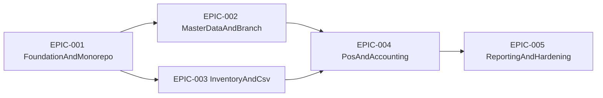
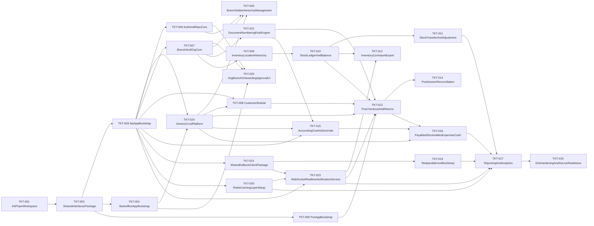

# ERP Delivery Tickets

Jira-style planning artifacts for implementation tracking.

## Folder Structure

- `epics/`: high-level delivery streams.
- `tickets/`: implementable work items mapped to epics.

## Epic Dependency Graph

## Ticket Dependency Graph

## Epics

- [EPIC-001 Foundation and Monorepo](./epics/EPIC-001-foundation-and-monorepo.md)
- [EPIC-002 Master Data and Branch](./epics/EPIC-002-master-data-and-branch.md)
- [EPIC-003 Inventory and CSV](./epics/EPIC-003-inventory-and-csv.md)
- [EPIC-004 POS and Accounting](./epics/EPIC-004-pos-and-accounting.md)
- [EPIC-005 Reporting and Hardening](./epics/EPIC-005-reporting-and-hardening.md)

## Tickets

- [All tickets](./tickets/)
