# ERP Delivery Tickets

Jira-style planning artifacts for implementation tracking.

## Folder Structure

- `epics/`: high-level delivery streams.
- `tickets/`: implementable work items mapped to epics.

## Epic Dependency Graph

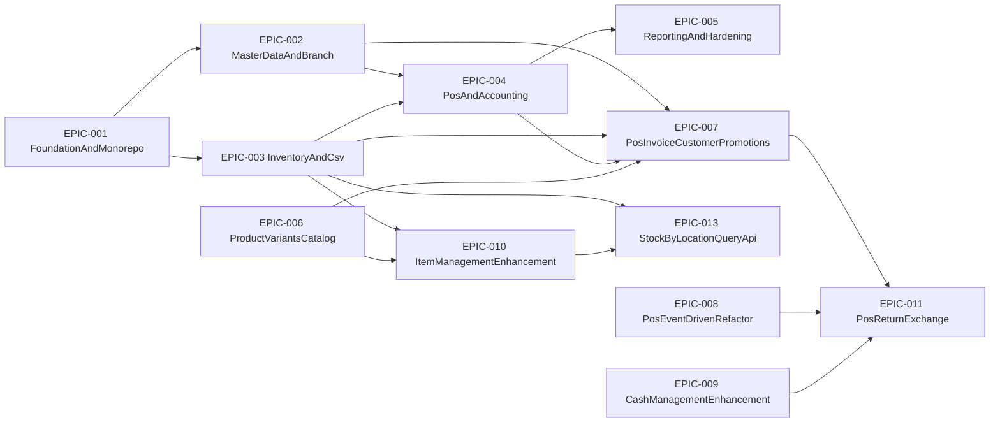

## Ticket Dependency Graph

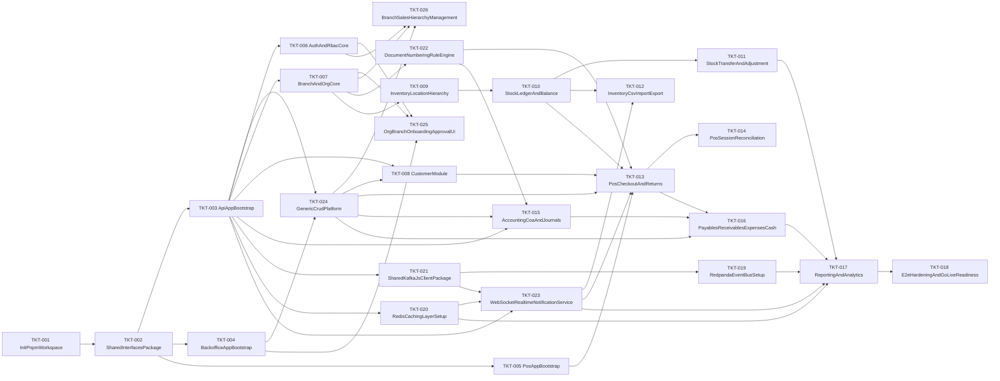

## Epics

- [EPIC-001 Foundation and Monorepo](./epics/EPIC-001-foundation-and-monorepo.md)
- [EPIC-002 Master Data and Branch](./epics/EPIC-002-master-data-and-branch.md)
- [EPIC-003 Inventory and CSV](./epics/EPIC-003-inventory-and-csv.md)
- [EPIC-004 POS and Accounting](./epics/EPIC-004-pos-and-accounting.md)
- [EPIC-005 Reporting and Hardening](./epics/EPIC-005-reporting-and-hardening.md)

## Tickets

- [All tickets](./tickets/)

## EPIC-006 Product variants & catalog

- [EPIC-006 Product variants & catalog](./epics/EPIC-006-product-variants-catalog.md)
- Tickets: [TKT-027](./tickets/TKT-027-inventory-product-schema.md) – [TKT-037](./tickets/TKT-037-product-variants-test-plan.md)
- Dependencies: [TKT-DEP-006-dependencies.md](./TKT-DEP-006-dependencies.md)

## EPIC-007 POS Invoice, Customer Loyalty & Promotions

- [EPIC-007 POS Invoice, Customer Loyalty & Promotions](./epics/EPIC-007-pos-invoice-customer-promotions.md)
- ERD: [docs/pos-erd.md](../docs/pos-erd.md)
- Tickets: [TKT-038](./tickets/TKT-038-invoice-entities-migration.md) – [TKT-046](./tickets/TKT-046-promotion-apply-service.md)

| Ticket                                                     | Mô tả                                           |
| ---------------------------------------------------------- | ----------------------------------------------- |
| [TKT-038](./tickets/TKT-038-invoice-entities-migration.md) | Invoice + InvoiceItem entities & migration      |
| [TKT-039](./tickets/TKT-039-invoice-crud-api.md)           | Invoice CRUD API (draft lifecycle)              |
| [TKT-040](./tickets/TKT-040-invoice-checkout-service.md)   | Invoice checkout service (draft → paid \| debt) |
| [TKT-041](./tickets/TKT-041-customer-module-extensions.md) | Customer extensions + CustomerGroup             |
| [TKT-042](./tickets/TKT-042-membership-card-api.md)        | MembershipCard + PointHistory API               |
| [TKT-043](./tickets/TKT-043-invoice-debt-service.md)       | InvoiceDebt + DebtPayment & debt flow           |
| [TKT-044](./tickets/TKT-044-purchase-history-api.md)       | Purchase history API                            |
| [TKT-045](./tickets/TKT-045-promotion-entities.md)         | Promotion module entities                       |
| [TKT-046](./tickets/TKT-046-promotion-apply-service.md)    | Promotion apply service + InvoicePromotion      |

## EPIC-010 Item Management Enhancement (Phase 1)

- [EPIC-010 Item Management Enhancement](./epics/EPIC-010-item-management-enhancement.md)
- Tickets: [TKT-059](./tickets/TKT-059-item-management-schema.md) – [TKT-066](./tickets/TKT-066-item-management-test-plan.md)

| Ticket                                                       | Mô tả                                                         |
| ------------------------------------------------------------ | ------------------------------------------------------------- |
| [TKT-059](./tickets/TKT-059-item-management-schema.md)       | Schema migration: alter `items` + 3 bảng mới + data migration |
| [TKT-060](./tickets/TKT-060-item-entity-enhancement.md)      | `ItemEntity` / DTO / CrudConfig + filter POS catalog          |
| [TKT-061](./tickets/TKT-061-item-providers-m2m-api.md)       | API M2M `item_providers` (CRUD + set-primary)                 |
| [TKT-062](./tickets/TKT-062-provider-crud-endpoints.md)      | Bổ sung `POST/PATCH/DELETE /inventory/providers`              |
| [TKT-063](./tickets/TKT-063-item-barcodes-api.md)            | API `item_barcodes` (nhiều mã/item + lookup POS)              |
| [TKT-064](./tickets/TKT-064-item-stock-thresholds-api.md)    | API định mức tồn min/max theo `(item, location)`              |
| [TKT-065](./tickets/TKT-065-backoffice-item-form-rebuild.md) | Backoffice UI form 3 tab (Cơ bản / Bổ sung / Kho)             |
| [TKT-066](./tickets/TKT-066-item-management-test-plan.md)    | E2E + migration test + regression + docs                      |

### Ticket dependency graph (EPIC-010)

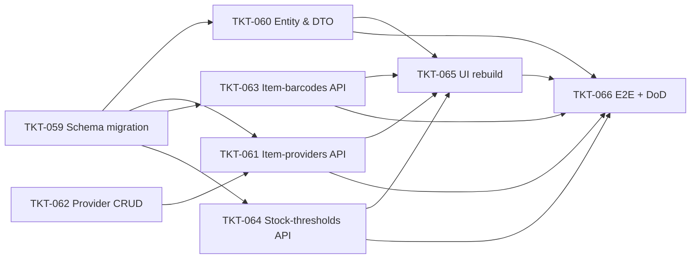

## EPIC-013 Stock-by-Location Query API (Phase 1)

- [EPIC-013 Stock-by-Location Query API](./epics/EPIC-013-stock-by-location-api.md)
- Tickets: [TKT-067](./tickets/TKT-067-stock-by-location-service.md) – [TKT-069](./tickets/TKT-069-stock-by-location-test-plan.md)

| Ticket                                                       | Mô tả                                                                                   |
| ------------------------------------------------------------ | --------------------------------------------------------------------------------------- |
| [TKT-067](./tickets/TKT-067-stock-by-location-service.md)    | DTO + Service: query builder + filter mapping + computed `belowMin`                     |
| [TKT-068](./tickets/TKT-068-stock-by-location-controller.md) | Controller `GET /inventory/locations/:locationId/stock-items` + Swagger + OpenAPI regen |
| [TKT-069](./tickets/TKT-069-stock-by-location-test-plan.md)  | Test plan (unit + e2e) + DoD gate                                                       |

### Ticket dependency graph (EPIC-013)

```mermaid
flowchart LR
  T67["TKT-067 DTO & Service"] --> T68["TKT-068 Controller + OpenAPI"]
  T68 --> T69["TKT-069 Test plan + DoD"]
  T67 --> T69
## EPIC-011 POS Return & Exchange

- [EPIC-011 POS Return & Exchange](./epics/EPIC-011-pos-return-exchange.md)
- Plan: [docs/plan-return-exchange.md](../docs/plan-return-exchange.md)
- Tickets: [TKT-067](./tickets/TKT-067-pos-legacy-scaffolding-cleanup.md) – [TKT-074](./tickets/TKT-074-return-exchange-test-plan.md)

| Ticket                                                                | Mô tả                                                                                                 |
| --------------------------------------------------------------------- | ----------------------------------------------------------------------------------------------------- |
| [TKT-067](./tickets/TKT-067-pos-legacy-scaffolding-cleanup.md)        | Xoá legacy `SaleEntity` / `ReturnService` / `ExchangeService` (zero behavior change)                  |
| [TKT-068](./tickets/TKT-068-return-exchange-schema-migrations.md)     | 4 migration: invoice type/refund fields, item direction, `customer_credits` table                     |
| [TKT-069](./tickets/TKT-069-return-entities-topics-and-enums.md)      | Entity updates + 5 Kafka topics + DomainEventType + shared enums                                      |
| [TKT-070](./tickets/TKT-070-return-publishers-and-consumers.md)       | 5 publishers + 4 idempotent consumers (stock-return-in, cash-refund, loyalty-reverse, journal-return) |
| [TKT-071](./tickets/TKT-071-customer-credit-service.md)               | `CustomerCreditEntity` + service (issue / redeem)                                                     |
| [TKT-072](./tickets/TKT-072-return-eligibility-and-draft-services.md) | `checkout-shared.ts` + eligibility + draft creation services                                          |
| [TKT-073](./tickets/TKT-073-checkout-return-service-and-api.md)       | `CheckoutReturnService` + DTOs + 4 endpoint + module wiring                                           |
| [TKT-074](./tickets/TKT-074-return-exchange-test-plan.md)             | E2E (4 flow) + unit + manual verification + docs update                                               |

### Ticket dependency graph (EPIC-011)

```mermaid
flowchart LR
  T67["TKT-067 Legacy cleanup"] --> T68["TKT-068 Schema migrations"]
  T68 --> T69["TKT-069 Entities + topics"]
  T69 --> T70["TKT-070 Publishers + consumers"]
  T69 --> T71["TKT-071 Customer credit service"]
  T69 --> T72["TKT-072 Eligibility + draft services"]
  T70 --> T73["TKT-073 Checkout-return + API"]
  T71 --> T73
  T72 --> T73
  T73 --> T74["TKT-074 Test plan + DoD"]
```

## EPIC-20052026 Quản lý Nhân viên & Hồ sơ nhân sự (Employee HR Profile)

- [EPIC-20052026 Employee HR Profile](./epics/EPIC-20052026-employee-hr-management.md)
- Mở rộng DB + API backend để lưu/đọc dữ liệu HR mà FE (`pages/employees/`, modal 5 tab) đã thu thập sẵn; gỡ readonly 3 tab HR.

| Ticket     | Mô tả                                                                                                                                                             |
| ---------- | ----------------------------------------------------------------------------------------------------------------------------------------------------------------- |
| TKT-EMP-01 | Migration: 5 bảng (`job_positions`, `employee_profiles`, `employee_addresses`, `employee_emergency_contacts`, `employee_access_schedules`) + enums + index/unique |
| TKT-EMP-02 | shared-interfaces: enums HR + `EmployeeProfilePayload`/`EmployeeProfileView`; mở rộng `CreateUserRequest`/`UpdateUserRequest`/`UserDetail`                        |
| TKT-EMP-03 | Entities + `job_positions` đăng ký `EntityRegistryService` + permissions seed `hr.job_position.*`                                                                 |
| TKT-EMP-04 | DTO `EmployeeProfileDto` + mở rộng `UsersService.create/update/findById` (transaction, validate, inline jobPosition) + unit test                                  |
| TKT-EMP-05 | `pnpm openapi:generate` + commit api-client snapshot                                                                                                              |
| TKT-EMP-06 | FE wiring `user-form.ts` + `employee.mappers.ts`; enable field code/mobile                                                                                        |
| TKT-EMP-07 | FE gỡ readonly 3 tab HR + dropdown vị trí công việc + detail panel                                                                                                |
| TKT-EMP-08 | E2E employee flow + docs                                                                                                                                          |

### Ticket dependency graph (EPIC-20052026)

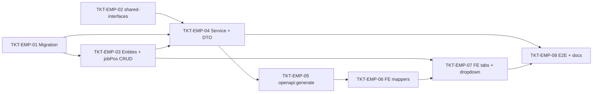

## EPIC-18052026 Phiếu Thu, Phiếu Chi và Sổ Tiền Mặt (Backend-only)

- [EPIC-18052026 Cash Vouchers (Backend-only)](./epics/EPIC-18052026-cash-vouchers.md)
- **Scope: chỉ backend.** Toàn bộ frontend (backoffice pages, form, nav, badge) tách sang FE epic riêng — xem section "Deferred FE work" trong epic.
- Tickets: [TKT-CV-00](./tickets/TKT-CV-00-cash-tx-jeid-refactor.md) (prerequisite), [TKT-CV-01](./tickets/TKT-CV-01-schema-migration.md) – [TKT-CV-23](./tickets/TKT-CV-23-openapi-e2e-auto.md) + [TKT-CV-OB1](./tickets/TKT-CV-OB1-outbox-schema.md) – [TKT-CV-OB3](./tickets/TKT-CV-OB3-wire-publish-outbox.md). Các số 08–11, 19–21 là ticket FE đã defer (không có file).
- Follow-up: [EPIC-21052026 Cash Vouchers — Follow-up Refactor](./epics/EPIC-21052026-cash-vouchers-followup-refactor.md) (gom các scope item #7–#11 phát hiện khi review plan).

### Phase 1 (manual flow + ledger + kiểm kê)

| Ticket                                                          | Mô tả                                                                                                                                                                       |
| --------------------------------------------------------------- | --------------------------------------------------------------------------------------------------------------------------------------------------------------------------- |
| [TKT-CV-00](./tickets/TKT-CV-00-cash-tx-jeid-refactor.md)       | **Prerequisite** — refactor `recordMovement`/`JournalService.post` nhận `manager?` + `recordMovement` trả `journalEntryId` (vá atomic, deadlock cash-count, dual-write gap) |
| [TKT-CV-01](./tickets/TKT-CV-01-schema-migration.md)            | Migration 6 bảng + enums + reversal dedupe index (DocumentType cash đã có sẵn — chỉ verify)                                                                                 |
| [TKT-CV-02](./tickets/TKT-CV-02-module-bootstrap-categories.md) | Entities + DTOs + module + register categories + seed mặc định                                                                                                              |
| [TKT-CV-03](./tickets/TKT-CV-03-cash-receipt-service.md)        | CashReceiptService + Controller (CRUD/post/reverse + 2 internal method)                                                                                                     |
| [TKT-CV-04](./tickets/TKT-CV-04-cash-payment-service.md)        | CashPaymentService + Controller (đối xứng)                                                                                                                                  |
| [TKT-CV-05](./tickets/TKT-CV-05-cash-ledger-service.md)         | CashLedgerService + Controller (cursor pagination, running balance in-RAM)                                                                                                  |
| [TKT-CV-06](./tickets/TKT-CV-06-cash-count-service.md)          | CashCountService + Controller (variance → voucher)                                                                                                                          |
| [TKT-CV-07](./tickets/TKT-CV-07-permissions-coa-seed.md)        | Permissions seed + COA TK 711/811                                                                                                                                           |
| [TKT-CV-12](./tickets/TKT-CV-12-openapi-e2e-manual.md)          | OpenAPI regen + E2E manual flow (gate Phase 1)                                                                                                                              |

### Phase 2 (auto-create vouchers + Transactional Outbox)

| Ticket                                                        | Mô tả                                                                     |
| ------------------------------------------------------------- | ------------------------------------------------------------------------- |
| [TKT-CV-13](./tickets/TKT-CV-13-schema-extension.md)          | Schema extension: unique reference + payment_method/cash/JE link          |
| [TKT-CV-14](./tickets/TKT-CV-14-event-topics-dtos.md)         | Event topics + payload DTOs                                               |
| [TKT-CV-15](./tickets/TKT-CV-15-voucher-consumers.md)         | 4 voucher consumers (POS createAndPost / 3 flow createVoucherForMovement) |
| [TKT-CV-16](./tickets/TKT-CV-16-refactor-pos-consumer.md)     | Refactor CashFromPaymentConsumer → pos-cash-sale consumer                 |
| [TKT-CV-17](./tickets/TKT-CV-17-source-accounting-publish.md) | A-revised source accounting + publish needed (debt/GR/expense)            |
| [TKT-CV-18](./tickets/TKT-CV-18-link-back-consumers.md)       | Link-back consumers (FK back-fill)                                        |
| [TKT-CV-22](./tickets/TKT-CV-22-voucher-source-api.md)        | API delta: source filter + sourceLink (BE-only; UI defer)                 |
| [TKT-CV-23](./tickets/TKT-CV-23-openapi-e2e-auto.md)          | OpenAPI regen + E2E auto flow (gate Phase 2)                              |
| [TKT-CV-OB1](./tickets/TKT-CV-OB1-outbox-schema.md)           | Transactional Outbox — schema                                             |
| [TKT-CV-OB2](./tickets/TKT-CV-OB2-outbox-service-relay.md)    | Transactional Outbox — service + relay                                    |
| [TKT-CV-OB3](./tickets/TKT-CV-OB3-wire-publish-outbox.md)     | Wire publish qua outbox                                                   |

### Ticket dependency graph (EPIC-18052026 — BE-only)

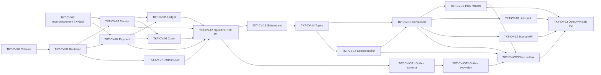

## EPIC-31052026 Inventory Item Form Refactor (KiotViet-style)

- [EPIC-31052026 Inventory Item Form Refactor](./epics/EPIC-31052026-inventory-item-form-refactor.md)
- Mở rộng [EPIC-010 Item Management Enhancement](./epics/EPIC-010-item-management-enhancement.md): refactor form tạo/sửa hàng hóa (`backoffice-web`) cho khớp ảnh tham chiếu + Brand master-data + Item Category (nhóm cha/mô tả/hoa hồng) + multi-provider + đơn vị chuyển đổi + edit mode.

| Ticket                                                        | Mô tả                                                              |
| ------------------------------------------------------------- | ------------------------------------------------------------------ |
| [TKT-IIF-01](./tickets/TKT-IIF-01-brand-master-entity.md)     | BE: `BrandEntity` (`inventory-brands`) + `item.brandId`            |
| [TKT-IIF-02](./tickets/TKT-IIF-02-item-category-extension.md) | BE: Item Category + nhóm cha + mô tả + bảng hoa hồng               |
| [TKT-IIF-03](./tickets/TKT-IIF-03-item-update-nested.md)      | BE: Item update reconcile providers/units + brandId                |
| [TKT-IIF-04](./tickets/TKT-IIF-04-fe-data-hooks.md)           | FE: hooks brand/category/unit/provider (bỏ data hardcode)          |
| [TKT-IIF-05](./tickets/TKT-IIF-05-fe-dialogs.md)              | FE: 4 dialog quick-create + danh sách thương hiệu (#3/#4/#5/#6/#7) |
| [TKT-IIF-06](./tickets/TKT-IIF-06-fe-form-layout.md)          | FE: refactor layout tab cơ bản (#2) + wire dropdown + #9           |
| [TKT-IIF-07](./tickets/TKT-IIF-07-fe-multi-provider-table.md) | FE: bảng nhiều nhà cung cấp (#8)                                   |
| [TKT-IIF-08](./tickets/TKT-IIF-08-fe-edit-mode.md)            | FE: edit mode dùng lại form giàu                                   |
| [TKT-IIF-09](./tickets/TKT-IIF-09-test-plan.md)               | E2E + test plan + DoD gate                                         |

### Ticket dependency graph (EPIC-31052026)

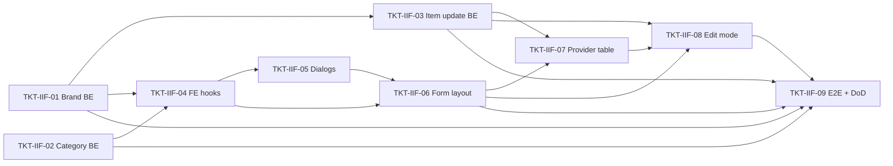

## EPIC-03062026 POS server-side invoice search

- [EPIC-03062026 POS server-side invoice search](./epics/EPIC-03062026-pos-invoice-search.md)
- Chuyển 3 màn danh sách hóa đơn trên `pos-web` từ lọc client-side sang **search server-side** qua các endpoint CQRS riêng (theo skill `cqrs-search-endpoint`), KHÔNG đụng `POST /v2/invoices/search` đang dùng cho `InvoiceListPage`. #5 "Đổi trả nhanh" = SALE+PAID; "Tổng thanh toán" = `totalPaid`; tên cửa hàng/chi nhánh do endpoint mới join branch trả inline.

| Ticket                                                             | Mô tả                                                                       |
| ------------------------------------------------------------------ | --------------------------------------------------------------------------- |
| [TKT-PIS-01](./tickets/TKT-PIS-01-be-returnable-invoice-search.md) | BE: `POST /v2/invoices/returnable/search` (#5, SALE+PAID, branch-scoped)    |
| [TKT-PIS-02](./tickets/TKT-PIS-02-be-purchase-history-search.md)   | BE: `POST /v2/invoices/purchase-history/search` (#2, org-wide / customerId) |
| [TKT-PIS-03](./tickets/TKT-PIS-03-be-draft-invoice-search.md)      | BE: `POST /v2/invoices/drafts/search` (#4, free-text OR + date range)       |
| [TKT-PIS-04](./tickets/TKT-PIS-04-fe-invoice-search-data-layer.md) | FE: DTOs + `invoiceService` + `INVOICE_KEYS` + hooks + filter→body mapper   |
| [TKT-PIS-05](./tickets/TKT-PIS-05-fe-return-goods-search.md)       | FE: wire "Đổi trả nhanh" (#5) server-side                                   |
| [TKT-PIS-06](./tickets/TKT-PIS-06-fe-purchase-history-search.md)   | FE: wire "Lịch sử mua hàng" (#2) server-side                                |
| [TKT-PIS-07](./tickets/TKT-PIS-07-fe-draft-invoices-search.md)     | FE: wire "Hóa đơn chưa thanh toán" (#4) server-side                         |

### Ticket dependency graph (EPIC-03062026)

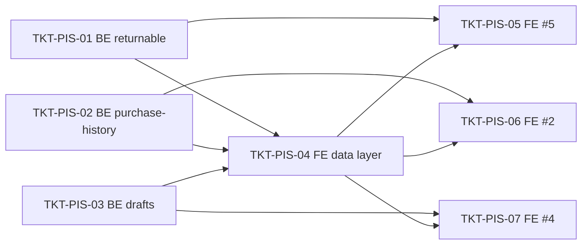

## EPIC-03062026 POS per-line discount breakdown + line note in read APIs

- [EPIC-03062026 POS per-line discount breakdown](./epics/EPIC-03062026-pos-line-discount-breakdown.md)
- Mỗi dòng hàng trên hóa đơn POS mang KM/chiết khấu **thủ công** riêng (vd "KM 10 % (59.000) - cc") + ghi chú riêng, lưu **đầy đủ breakdown** (type/value/amount/reason) vào `invoice_items` và **trả về** ở mọi API đọc. `note` + `lineDiscount` (số tiền) đã có sẵn; thêm `line_discount_type/value/reason`. Ba V2 search posted (search/returnable/purchase-history) được gắn thêm `items[]` theo pattern của draft search. **Chỉ backend** — không đụng FE pos-web; không liên kết PromotionEntity (chiết khấu thủ công, không phải chương trình KM).

| Ticket                                                                  | Mô tả                                                                               |
| ----------------------------------------------------------------------- | ----------------------------------------------------------------------------------- |
| [TKT-LDB-01](./tickets/TKT-LDB-01-be-schema-line-discount-breakdown.md) | BE: migration + entity — thêm `line_discount_type/value/reason` vào `invoice_items` |
| [TKT-LDB-02](./tickets/TKT-LDB-02-be-dto-service-compute.md)            | BE: DTO 3 field mới + `computeLineDiscount()` dùng chung `create()`/`update()`      |
| [TKT-LDB-03](./tickets/TKT-LDB-03-be-read-apis-line-items.md)           | BE: gắn `items[]` vào 3 V2 search posted + verify detail/draft + openapi regen      |
| [TKT-LDB-04](./tickets/TKT-LDB-04-be-tests-e2e.md)                      | BE: unit compute + handler attach specs + E2E round-trip create→read + DoD          |

### Ticket dependency graph (EPIC-03062026 line-discount)

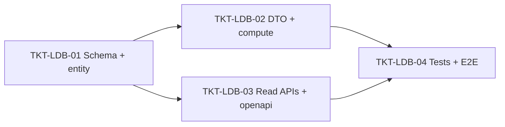

## EPIC-03062026 Loyalty point rate change (earn ÷10000, redeem 1pt = 500đ)

- [EPIC-03062026 Loyalty point rate change](./epics/EPIC-03062026-loyalty-point-rate-change.md)
- Đổi giá trị chương trình tích điểm: 1.000.000đ mua hàng → **100 điểm** (10% ÷ 1.000), đổi **100 điểm = 50.000đ** (1 điểm = 500đ), cashback thực ~**5%** (giảm từ ~100%). Chỉ đổi **2 hằng số** `POINT_EARN_VND_PER_POINT` (1000 → **10000**) + `POINT_REDEMPTION_VALUE_VND` (1000 → **500**) + sửa số magic `1000` trong consumer hoàn điểm khi trả hàng → dùng hằng số. **Không** migration, **không** entity/endpoint/event mới. ⚠️ Yêu cầu gốc chỉ nói redemption, nhưng ví dụ (1tr → 100 điểm) buộc đổi cả earn — chốt ở Step 3.

| Ticket                                                                   | Mô tả                                                                            |
| ------------------------------------------------------------------------ | -------------------------------------------------------------------------------- |
| [TKT-LPR-01](./tickets/TKT-LPR-01-be-rate-constants-and-reversal-fix.md) | BE: đổi 2 hằng số earn/redeem + thay magic `1000` ở reverse consumer + unit test |
| [TKT-LPR-02](./tickets/TKT-LPR-02-fe-pos-redemption-mirror.md)           | FE: cập nhật mirror `POINT_REDEMPTION_VALUE_VND = 500` ở pos-web + copy hiển thị |
| [TKT-LPR-03](./tickets/TKT-LPR-03-e2e-loyalty-rate-regression.md)        | E2E: regression earn 100 / redeem 50.000 / reverse 100 + re-baseline assertions  |

### Ticket dependency graph (EPIC-03062026 loyalty-rate)

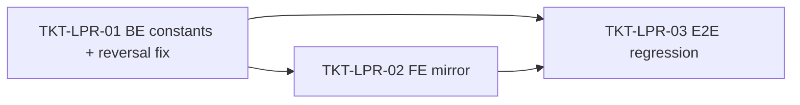

## EPIC-03062026 Backoffice admin list server-side CQRS search

- [EPIC-03062026 Backoffice admin list server-side CQRS search](./epics/EPIC-03062026-admin-list-cqrs-search.md)
- Thêm endpoint **CQRS v2 search** (theo skill `cqrs-search-endpoint`) cho 5 màn danh sách admin hiện do generic CRUD (`/admin/entities/:entityKey/records`) + `/admin/users` phục vụ: `customers`, `inventory-providers`, `job-positions`, `accounts`, `employees`. **Một controller chung** `AdminSearchV2Controller` (module mới `AdminSearchModule`) host cả 5 route `POST /v2/<entity>/search`; 4 module entity cũ KHÔNG đụng. Nâng filter lên **per-column operators** (contains/equals/range/compare) query toàn bộ dataset, phân trang. **Chỉ backend** — KHÔNG rewire FE, KHÔNG đụng `/records` hay `/admin/users`. Ràng buộc cứng: **dữ liệu từng dòng giống hệt hiện tại, không trả thiếu** — giữ `groupName` (NCC), `profile.jobPosition` (nhân viên), `parentAccountId` thô (COA), `code` (KH). Envelope đổi sang `{ data,total,page,limit }` (an toàn vì FE chưa nối). Tất cả scope theo `organizationId` (không branch-scope). Tái dùng permission cũ, không seed mới.

| Ticket                                                              | Mô tả                                                                      |
| ------------------------------------------------------------------- | -------------------------------------------------------------------------- |
| [TKT-ACS-01](./tickets/TKT-ACS-01-be-customers-search.md)           | BE: scaffold `AdminSearchModule`/controller + `POST /v2/customers/search`  |
| [TKT-ACS-02](./tickets/TKT-ACS-02-be-inventory-providers-search.md) | BE: `POST /v2/inventory-providers/search` (giữ `groupName` flatten)        |
| [TKT-ACS-03](./tickets/TKT-ACS-03-be-job-positions-search.md)       | BE: `POST /v2/job-positions/search` (đơn giản, soft-delete excluded)       |
| [TKT-ACS-04](./tickets/TKT-ACS-04-be-accounts-search.md)            | BE: `POST /v2/accounts/search` (giữ `parentAccountId` thô, không join)     |
| [TKT-ACS-05](./tickets/TKT-ACS-05-be-employees-search.md)           | BE: `POST /v2/employees/search` (giữ full `UserListItem`, tái dùng mapper) |
| [TKT-ACS-06](./tickets/TKT-ACS-06-openapi-regen.md)                 | OpenAPI regen + api-client snapshot cho FE epic sau                        |

### Ticket dependency graph (EPIC-03062026 admin-list-cqrs-search)

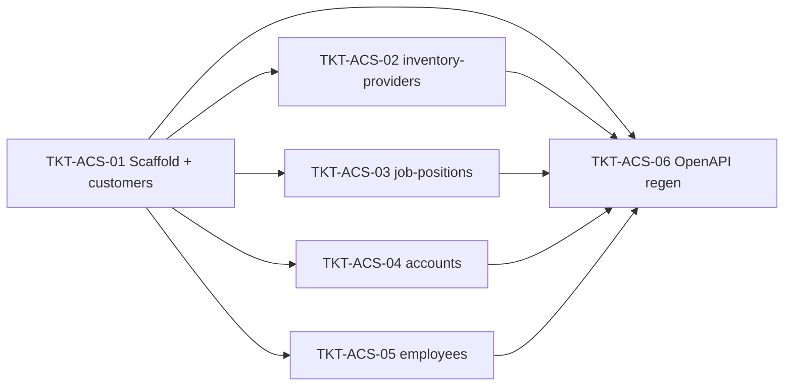

## EPIC-03062026 Backoffice admin list server-side search — FE wiring

- [EPIC-03062026 Backoffice admin list server-side search — FE wiring](./epics/EPIC-03062026-admin-list-cqrs-search-fe.md)
- Nối `backoffice-web` (5 màn admin) vào 5 endpoint CQRS `POST /v2/<entity>/search`: filter theo từng cột query **toàn bộ** dataset + phân trang server-side, bỏ lọc client-side (`applyColumnFilter` cũ chỉ lọc trang đã tải). **Mở rộng `CrudListPage` có cổng (registry 4 entity CRUD)** — entity khác KHÔNG đổi; `EmployeesPage` migrate riêng. Bỏ sort cột (createdAt DESC như POS v2). Thêm filter cell **date-range** cho `createdAt`. Chỉ FE.

| Ticket                                                            | Mô tả                                                                             |
| ----------------------------------------------------------------- | --------------------------------------------------------------------------------- |
| [TKT-ACSFE-01](./tickets/TKT-ACSFE-01-fe-data-layer.md)           | FE: registry + `ColumnFilter→v2 body` mapper + hooks (`useCrudV2Search`/employee) |
| [TKT-ACSFE-02](./tickets/TKT-ACSFE-02-fe-datatable-date-range.md) | FE: thêm filter kind `date-range` vào `BaseDataTable`                             |
| [TKT-ACSFE-03](./tickets/TKT-ACSFE-03-fe-crudlistpage-wiring.md)  | FE: `CrudListPage` server-side v2 search có cổng (4 entity CRUD)                  |
| [TKT-ACSFE-04](./tickets/TKT-ACSFE-04-fe-employees-page.md)       | FE: migrate `EmployeesPage` sang `POST /v2/employees/search`                      |

### Ticket dependency graph (EPIC-03062026 admin-list-cqrs-search-fe)

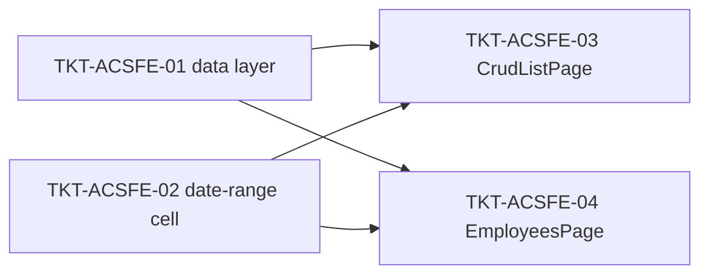

## EPIC-03062026 Inventory item server-side grouped search (v2)

- [EPIC-03062026 Inventory item server-side grouped search (v2)](./epics/EPIC-03062026-inventory-item-search-v2.md)
- Thêm endpoint **CQRS v2 search** (skill `cqrs-search-endpoint`) cho mặt hàng kho: `POST /v2/inventory-items/search`. Đẩy filter của trang `/admin/inventory-items` xuống backend (search toàn cục + `isActive`/`isPosVisible`/`categoryId`/`productId`/`brand`/`itemType`), **trả y hệt shape product-group** mà `listProductGroups` đang trả (`ProductGroupRow`, envelope `{ data,total,page,pageSize }`, sort `code ASC`, gom nhóm product+category, `AVG/bool_and/MIN/COUNT`). **Chỉ backend** — KHÔNG rewire FE (làm sau); chạy `openapi:generate` chuẩn bị cho FE. Scope `organizationId` (không branch-scope), permission `inventory.read`, không seed mới. Đề xuất **Hướng A** (mở rộng SQL `listProductGroups`) để bảo đảm byte-identical; Hướng B (in-memory) nêu kèm — chốt ở Step 3.

| Ticket                                                                | Mô tả                                                                           |
| --------------------------------------------------------------------- | ------------------------------------------------------------------------------- |
| [TKT-IIS-01](./tickets/TKT-IIS-01-be-extend-product-group-filters.md) | BE: mở rộng `listProductGroups` + `ProductGroupsQueryDto` với 5 filter optional |
| [TKT-IIS-02](./tickets/TKT-IIS-02-be-cqrs-grouped-search-endpoint.md) | BE: DTO + Query + Handler + `@Version('2')` controller + wire `CqrsModule`      |
| [TKT-IIS-03](./tickets/TKT-IIS-03-be-openapi-and-tests.md)            | BE: `openapi:generate` + tests (parity/scope/filter) + DoD gate                 |

### Ticket dependency graph (EPIC-03062026 inventory-item-search-v2)

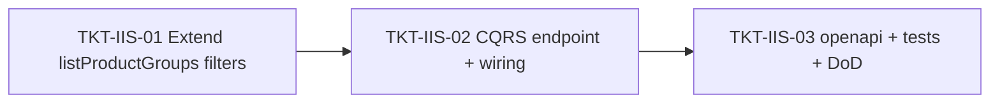

## EPIC-03062026 Inventory list server-side CQRS search (categories + Nhập/Xuất kho)

- [EPIC-03062026 Inventory list server-side CQRS search](./epics/EPIC-03062026-inventory-list-cqrs-search.md)
- Phase-2 of the admin-list CQRS search initiative. Add **CQRS v2 search endpoints** + FE wiring for three more list surfaces: Nhóm hàng hoá (`/admin/inventory-item-categories`), Nhập kho (`/inventory/purchase-orders` → goods-receipts), Xuất kho (`/inventory/goods-issues`). Reuses `FilterBuilder` + shared filter sub-DTOs, envelope `{ data, total, page, limit }`, sort = each page's current default. **Trả y chang** what the FE renders today (goods-receipt/issue keep nested `provider`/`targetBranch`; categories full entity) **plus** a computed `totalAmount` (SQL `SUM(qty×unitPrice)` subquery, filterable). categories search goes in `AdminSearchModule`; goods-receipt/issue in their own modules (`*-v2.controller.ts`, mirroring `inventory-item-v2.controller.ts`). FE: categories = one `CRUD_V2_SEARCH` registry entry; Nhập/Xuất kho = bespoke filter rows on the hand-built pages. No schema/migration/events; org-scope categories, org+branch goods-receipt/issue; reuse `inventory.read`.

| Ticket                                                          | Mô tả                                                                                |
| --------------------------------------------------------------- | ------------------------------------------------------------------------------------ |
| [TKT-ILS-01](./tickets/TKT-ILS-01-be-goods-receipt-search.md)   | BE: `POST /v2/goods-receipts/search` (goods-receipt module) + computed `totalAmount` |
| [TKT-ILS-02](./tickets/TKT-ILS-02-be-goods-issue-search.md)     | BE: `POST /v2/inventory/goods-issues/search` + polymorphic party + `totalAmount`     |
| [TKT-ILS-03](./tickets/TKT-ILS-03-be-item-categories-search.md) | BE: `POST /v2/inventory-item-categories/search` (AdminSearch module)                 |
| [TKT-ILS-04](./tickets/TKT-ILS-04-openapi-regen.md)             | OpenAPI regen + api-client snapshot for the 3 endpoints                              |
| [TKT-ILS-05](./tickets/TKT-ILS-05-fe-goods-receipt-page.md)     | FE: Nhập kho (`PurchaseOrdersPage`) server-side per-column filters + pagination      |
| [TKT-ILS-06](./tickets/TKT-ILS-06-fe-goods-issue-page.md)       | FE: Xuất kho (`GoodsIssuePage`) server-side per-column filters + pagination          |
| [TKT-ILS-07](./tickets/TKT-ILS-07-fe-categories-registry.md)    | FE: add `inventory-item-categories` entry to `CRUD_V2_SEARCH`                        |

### Ticket dependency graph (EPIC-03062026 inventory-list-cqrs-search)

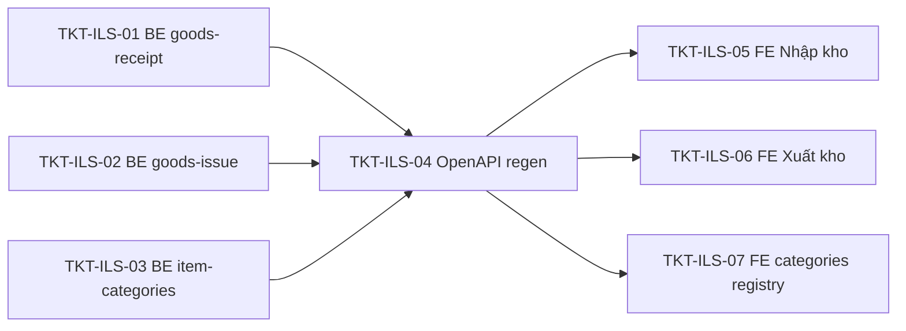

## EPIC-07062026 Phiếu Điều Chuyển Kho (two-phase — extends TransferOrder)

- [EPIC-07062026 Phiếu Điều Chuyển Kho](./epics/EPIC-07062026-inventory-transfer-voucher.md)
- Biến **Lệnh điều chuyển hiện có** (`transfer_orders`) thành phiếu điều chuyển **2 pha**: Store A xác nhận **xuất**, Store B xác nhận **nhập** ở 2 thời điểm khác nhau, phiếu ở `IN_PROGRESS` (đang luân chuyển) ở giữa. State machine mới `DRAFT → IN_PROGRESS → COMPLETED` (+ `CANCELLED`) **thay** `DRAFT→APPROVED→EXECUTED` cũ (migrate `EXECUTED→COMPLETED`, `APPROVED→DRAFT`; bỏ `approve`/`markExecuted`). **Mở rộng tại chỗ** `transfer_orders` + `transfer_order_lines` (KHÔNG bảng mới); thêm **kho nguồn + kho đích theo từng dòng**. 2 chân tồn kho **tái dùng** GoodsIssue(`TRANSFER_OUT`) + GoodsReceipt(`TRANSFER_IN`) ledger-only (không bút toán/công nợ); `import_reference` = id GoodsReceipt nhập. Tồn âm ("xuất kho khống") được phép (ledger không chặn, cảnh báo client-side). Giữ mã `LDC` (`DocumentType.TRANSFER_ORDER`, render QR để in). Chỉ `backoffice-web` (sửa `TransferOrdersPage`), không scanner camera. Cancel `IN_PROGRESS` đảo chân xuất.

| Ticket                                                        | Mô tả                                                                                      |
| ------------------------------------------------------------- | ------------------------------------------------------------------------------------------ |
| [TKT-ITV-01](./tickets/TKT-ITV-01-schema-transfer-voucher.md) | BE: mở rộng `transfer_orders`+lines + rebuild enum `TransferOrderStatus` + data migration  |
| [TKT-ITV-02](./tickets/TKT-ITV-02-shared-interfaces.md)       | Shared: rebuild `TransferOrderStatus` + thêm field `TransferOrder`/`TransferOrderLine`     |
| [TKT-ITV-03](./tickets/TKT-ITV-03-service.md)                 | BE: viết lại service create/getByCode/update/export/import/cancel; bỏ approve/markExecuted |
| [TKT-ITV-04](./tickets/TKT-ITV-04-controller-module.md)       | BE: controller thay approve/execute → export/import + by-code; module wiring + events      |
| [TKT-ITV-05](./tickets/TKT-ITV-05-permissions.md)             | BE: seed `inventory.transfer.export` + `.import` + VI labels                               |
| [TKT-ITV-06](./tickets/TKT-ITV-06-openapi.md)                 | OpenAPI regen + api-client snapshot (bỏ approve/execute, thêm export/import)               |
| [TKT-ITV-07](./tickets/TKT-ITV-07-fe-data-layer.md)           | FE: mở rộng hook transfer-order (export/import/by-code) + cảnh báo tồn âm                  |
| [TKT-ITV-08](./tickets/TKT-ITV-08-fe-ui.md)                   | FE: cải tạo `TransferOrdersPage` — kho nguồn/đích theo dòng + xuất/nhập + QR               |
| [TKT-ITV-09](./tickets/TKT-ITV-09-e2e.md)                     | E2E round-trip 2 pha + migration remap + tồn âm + cancel-reverse + idempotency + DoD       |

### Ticket dependency graph (EPIC-07062026)

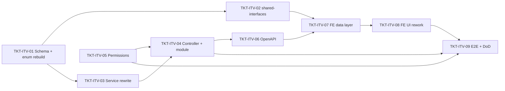

## EPIC-08062026 Lập phiếu xuất kho từ Lệnh điều chuyển ("Tiện ích" MISA)

- [EPIC-08062026 Lập phiếu xuất kho từ Lệnh điều chuyển](./epics/EPIC-08062026-goods-issue-from-transfer.md)
- Thêm menu **Tiện ích** (MISA-style) vào form **Phiếu xuất kho** (`GoodsIssueFormDialog`, `backoffice-web`), mục **"Lập từ lệnh điều chuyển"** → dialog "Chọn lệnh điều chuyển" liệt kê lệnh `DRAFT` của **chi nhánh nguồn** → chọn → nạp dòng vào form → **Lưu = chân xuất (export)** của EPIC-07062026 (spawn 1 GoodsIssue `TRANSFER_OUT` có `referenceType=TRANSFER_ORDER`, lệnh `DRAFT→IN_PROGRESS`). **Một lần trừ kho duy nhất, KHÔNG migration** (cột `goods_issues.reference_*`/`target_branch_id` đã có). **Phụ thuộc EPIC-07062026 đã land**; mở rộng `POST /:id/export` để nhận dòng đã sửa + gắn reference.

| Ticket                                                       | Mô tả                                                                                                                   |
| ------------------------------------------------------------ | ----------------------------------------------------------------------------------------------------------------------- |
| [TKT-IFT-01](./tickets/TKT-IFT-01-shared-interfaces.md)      | Shared: `GoodsIssueReferenceType.TRANSFER_ORDER` + `IssuableTransferOrderListItem` + `ExportTransferOrderRequest`       |
| [TKT-IFT-02](./tickets/TKT-IFT-02-be-issuable-and-export.md) | BE: `GET /issuable` (DRAFT + source branch + date) + `confirmExport` nhận dòng đã sửa + gắn reference (KHÔNG migration) |
| [TKT-IFT-03](./tickets/TKT-IFT-03-openapi.md)                | OpenAPI regen + api-client snapshot                                                                                     |
| [TKT-IFT-04](./tickets/TKT-IFT-04-fe-data-layer.md)          | FE: `useIssuableTransferOrders` + `useExportTransferOrder` (export-with-lines) + mapper                                 |
| [TKT-IFT-05](./tickets/TKT-IFT-05-fe-ui.md)                  | FE: dropdown Tiện ích + `SelectTransferOrderDialog` + prefill + save-as-export                                          |
| [TKT-IFT-06](./tickets/TKT-IFT-06-e2e.md)                    | E2E: issuable scope + export-from-form + no-double-issue + idempotency + DoD gate                                       |

### Ticket dependency graph (EPIC-08062026)

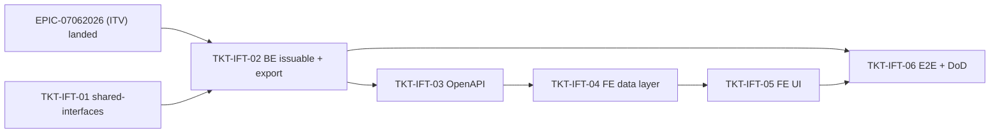

## EPIC-08062026 Phiếu xuất kho — round-trip đầy đủ trường

- [EPIC-08062026 Phiếu xuất kho — round-trip đầy đủ trường](./epics/EPIC-08062026-goods-issue-form-roundtrip.md)
- Form **Phiếu xuất kho** (`GoodsIssueFormDialog`, `backoffice-web`) mất dữ liệu giữa lúc tạo và xem lại: **Kho/Vị trí/Cửa hàng đích/Đối tượng/Tham chiếu** trống, **Người giao/Ngày-Giờ xuất** không lưu. Epic chuẩn hoá round-trip: **CÓ migration** thêm `goods_issues.deliverer` (varchar, Người giao text), `references` (jsonb `string[]`, danh sách mã tham chiếu FE gửi), `occurred_at` (timestamptz, ngày/giờ nhập). Fix read-path (v2 search thiếu `lines.location` → Kho/Vị trí trống) và FE map (`targetBranchLabel` không init; DetailPanel dùng location header cho mọi dòng). Provider giữ nguyên cho `TRANSFER_OUT`.

| Ticket                                                    | Mô tả                                                                                        |
| --------------------------------------------------------- | -------------------------------------------------------------------------------------------- |
| [TKT-GIR-01](./tickets/TKT-GIR-01-schema-entity.md)       | Migration + entity: `deliverer` / `references` (jsonb) / `occurred_at`                       |
| [TKT-GIR-02](./tickets/TKT-GIR-02-be-dto-service-read.md) | BE: DTO + service persist 3 trường + read-path join `lines.location` (fix Kho/Vị trí)        |
| [TKT-GIR-03](./tickets/TKT-GIR-03-openapi.md)             | OpenAPI regen + api-client snapshot                                                          |
| [TKT-GIR-04](./tickets/TKT-GIR-04-fe-roundtrip.md)        | FE: gửi + load lại đủ trường; fix Cửa hàng đích label, Kho/Vị trí từng dòng, Tham chiếu list |
| [TKT-GIR-05](./tickets/TKT-GIR-05-e2e.md)                 | E2E round-trip + test plan + DoD gate                                                        |

### Ticket dependency graph (EPIC-08062026 round-trip)

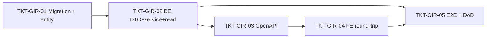

## EPIC-08062026 Lập phiếu nhập kho từ chứng từ điều chuyển ("Chọn chứng từ điều chuyển")

- [EPIC-08062026 Lập phiếu nhập kho từ chứng từ điều chuyển](./epics/EPIC-08062026-goods-receipt-from-transfer.md)
- Chân **nhập** đối xứng chân xuất: trên form **Phiếu nhập kho** (`PurchaseOrderFormDialog`, `backoffice-web`), bật nút **"Chọn chứng từ điều chuyển"** (đang `disabled`) → dialog "Chọn chứng từ xuất kho điều chuyển" liệt kê lệnh `IN_PROGRESS` của **chi nhánh đích** (số phiếu **XK** + tổng tiền) → chọn → nạp dòng (khóa) + chọn **Kho nhận** → **Lưu = chân nhập** (`POST /:id/import`, lệnh `IN_PROGRESS→COMPLETED`, spawn GoodsReceipt `TRANSFER_IN`). **CÓ migration** `goods_receipts.references` jsonb (provider/deliveredBy/received_at đã có); mở rộng `confirmImport` nhận kho nhận + header round-trip. **Phụ thuộc EPIC-07062026 + goods-issue-from-transfer đã land.**

| Ticket                                                     | Mô tả                                                                                                     |
| ---------------------------------------------------------- | --------------------------------------------------------------------------------------------------------- |
| [TKT-GRT-01](./tickets/TKT-GRT-01-schema-shared.md)        | Schema `goods_receipts.references` + `ImportableTransferOrderListItem` + `ImportTransferOrderRequest` ext |
| [TKT-GRT-02](./tickets/TKT-GRT-02-be-importable-import.md) | BE: `GET /importable` (IN_PROGRESS + dest branch + XK số/tổng) + `confirmImport` nhận kho nhận + header   |
| [TKT-GRT-03](./tickets/TKT-GRT-03-openapi.md)              | OpenAPI regen + api-client snapshot                                                                       |
| [TKT-GRT-04](./tickets/TKT-GRT-04-fe-data-layer.md)        | FE: `useImportableTransferOrders` + transfer detail mapper                                                |
| [TKT-GRT-05](./tickets/TKT-GRT-05-fe-ui.md)                | FE: `SelectTransferReceiptDialog` + bật nút + prefill khóa + Kho nhận + save-as-import                    |
| [TKT-GRT-06](./tickets/TKT-GRT-06-e2e.md)                  | E2E: importable scope + import-from-form + no-double-receipt + idempotency + DoD gate                     |

### Ticket dependency graph (EPIC-08062026 goods-receipt-from-transfer)

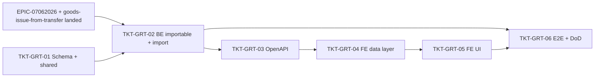

## EPIC-09062026 Chuyển kho giữa các kho trong cùng chi nhánh

- [EPIC-09062026 Chuyển kho giữa các kho trong cùng chi nhánh](./epics/EPIC-09062026-inter-warehouse-transfer.md)
- Nâng form **Chuyển kho** (`/inventory/stock-transfers`, module `inventory/transfer`) từ _chuyển giữa **vị trí** trong **một kho**_ sang _chuyển **kho → kho** trong **cùng chi nhánh**_, bám form mShopKeeper. **Mỗi dòng** mang `source_storage_id`/`destination_storage_id` riêng (+ vị trí tùy chọn; bỏ trống → location `is_unassigned` "Mặc định"). Ràng buộc cứng: mọi kho phải thuộc `actor.branchId` (liên chi nhánh vẫn là `transfer-order`). Khi **Lưu** = tạo + post nguyên tử: ghi `TRANSFER_OUT` rồi `TRANSFER_IN` trong **1 transaction** (`recordBatchMovements`, thêm khóa bi quan chống bán âm). Bổ sung `transporter_user_id` (Người vận chuyển — picker NV qua `/v2/employees/search`), `unit_price`/`line_value` (Đơn giá/Thành tiền; bỏ trống Đơn giá → snapshot giá vốn), `attachment_ids` (theo convention `jsonb` sẵn có), `transferred_at`. **Extend** entity/service/page sẵn có — KHÔNG module/permission mới. **CÓ migration** + backfill `*_storage_id` từ storage của location cũ.

| Ticket                                                                     | Mô tả                                                                                                         |
| -------------------------------------------------------------------------- | ------------------------------------------------------------------------------------------------------------- |
| [TKT-IWT-01](./tickets/TKT-IWT-01-schema-storage-valuation-transporter.md) | Migration + entity: per-line storage, đơn giá/thành tiền, transporter, attachments, transferred_at + backfill |
| [TKT-IWT-02](./tickets/TKT-IWT-02-service-kho-to-kho-posting.md)           | DTO + Service: resolve vị trí mặc định, ràng buộc cùng chi nhánh, định giá, post 2 chân ledger 1 tx           |
| [TKT-IWT-03](./tickets/TKT-IWT-03-controller-and-response-shaping.md)      | Controller + Swagger DTO + inline quan hệ (storages/locations/transporter)                                    |
| [TKT-IWT-04](./tickets/TKT-IWT-04-openapi-regen.md)                        | `pnpm openapi:generate` + commit snapshot api-client                                                          |
| [TKT-IWT-05](./tickets/TKT-IWT-05-fe-unified-kho-to-kho-form.md)           | FE: rebuild form Chuyển kho kho→kho (header + cột chi tiết + pickers + payload)                               |
| [TKT-IWT-06](./tickets/TKT-IWT-06-tests-and-dod.md)                        | Service spec + E2E + DoD gate                                                                                 |

### Ticket dependency graph (EPIC-09062026 inter-warehouse-transfer)

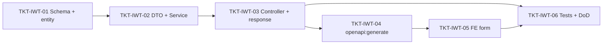

## EPIC-09062026 Danh sách Chuyển kho theo mẫu mShopKeeper (v2 search + master-detail)

- [EPIC-09062026 Danh sách Chuyển kho theo mẫu mShopKeeper](./epics/EPIC-09062026-stock-transfer-list-v2.md)
- Clone UI **trang danh sách** Chuyển kho (`/inventory/stock-transfers`) theo mShopKeeper, mirror trang `Phiếu nhập`/`Xuất kho`: **CQRS v2 search** (`POST /v2/inventory/stock/transfers/search`) lọc theo từng cột (`=`/`*`/`≤`) toàn dataset + phân trang; cột **Ngày / Số phiếu chuyển (link) / Đối tượng (= Người vận chuyển) / Tổng tiền (∑ line_value) / Diễn giải** (bỏ Trạng thái/Số dòng/Tổng số lượng); **footer cộng Tổng tiền**; **panel "Chi tiết" master-detail** (dòng hàng kho/vị trí/đơn giá/thành tiền); toolbar **Thêm mới / Nhân bản / Xem / Sửa / Xóa / Nạp**. **Nhân bản** = mở form Thêm mới prefill (FE). **Xóa** = đảo bút toán + set `CANCELLED` (ledger bất biến, không hard-delete, không migration). Tái dùng `cqrs-search-endpoint`, `BaseDataTable` column filters + `useCrudV2Search`, `GoodsIssuePage`. Phụ thuộc [EPIC-09062026 Chuyển kho giữa các kho](./epics/EPIC-09062026-inter-warehouse-transfer.md) (transporter + line_value).

| Ticket                                                    | Mô tả                                                                                   |
| --------------------------------------------------------- | --------------------------------------------------------------------------------------- |
| [TKT-STL-01](./tickets/TKT-STL-01-be-cqrs-v2-search.md)   | BE: `POST /v2/inventory/stock/transfers/search` (DTO + Query + Handler + controller)    |
| [TKT-STL-02](./tickets/TKT-STL-02-be-reverse-and-void.md) | BE: Xóa = đảo bút toán + set CANCELLED (mở rộng `cancel` cho POSTED)                    |
| [TKT-STL-03](./tickets/TKT-STL-03-openapi-regen.md)       | `pnpm openapi:generate` + commit snapshot (DTO v2 introspect được)                      |
| [TKT-STL-04](./tickets/TKT-STL-04-fe-list-redesign.md)    | FE: redesign danh sách (cột + column filters + footer + master-detail + Nhân bản + Xóa) |
| [TKT-STL-05](./tickets/TKT-STL-05-tests-and-dod.md)       | Handler spec + reverse spec + DoD gate                                                  |

### Ticket dependency graph (EPIC-09062026 stock-transfer-list-v2)

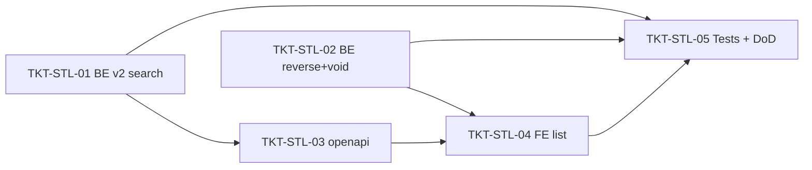

## EPIC-09062026 Sửa phiếu chuyển kho (POSTED) — đảo + ghi lại tồn kho

- [EPIC-09062026 Sửa phiếu chuyển kho (POSTED)](./epics/EPIC-09062026-stock-transfer-edit.md)
- Cho phép **sửa phiếu chuyển kho đã POSTED** (sửa mọi thông tin trừ `Số phiếu chuyển`). Vì sổ kho bất biến: khi lưu, hệ thống **đảo bút toán phiếu cũ (rollback tồn) rồi ghi bút toán mới** theo dữ liệu sửa trong **1 transaction**, giữ nguyên `id` + `Số phiếu chuyển` + POSTED. **Chặn nếu thiếu tồn** (khóa bi quan + kiểm tra net-delta mỗi `(item, location)`; kho xuất mới không đủ hoặc hàng đã rời kho nhập cũ → 400, rollback, phiếu gốc nguyên vẹn). Sửa CANCELLED → 400; DRAFT vẫn thay dòng no-ledger. **Mở rộng `update()`** (đang chỉ cho DRAFT) — tái dùng `resolveBranchScopedTransfer` + pattern đảo từ `cancel()` + khóa từ `post()` + `PATCH /:id`/DTO/`TransferFormDialog` edit đã có. **Không migration, không đổi OpenAPI, không permission mới.** Phụ thuộc [EPIC inter-warehouse-transfer](./epics/EPIC-09062026-inter-warehouse-transfer.md) + [EPIC list-v2](./epics/EPIC-09062026-stock-transfer-list-v2.md).

| Ticket                                                       | Mô tả                                                                            |
| ------------------------------------------------------------ | -------------------------------------------------------------------------------- |
| [TKT-STE-01](./tickets/TKT-STE-01-be-edit-reverse-repost.md) | BE: mở rộng `update()` cho POSTED — đảo + ghi lại 1 tx, net-delta chặn thiếu tồn |
| [TKT-STE-02](./tickets/TKT-STE-02-fe-enable-edit.md)         | FE: bật nút "Sửa" cho POSTED + reload danh sách/Chi tiết                         |
| [TKT-STE-03](./tickets/TKT-STE-03-tests-and-dod.md)          | Service spec (đảo+ghi / chặn tồn / giữ số phiếu) + DoD gate                      |

### Ticket dependency graph (EPIC-09062026 stock-transfer-edit)

```mermaid
flowchart LR
  T1["TKT-STE-01 BE update() POSTED"] --> T2["TKT-STE-02 FE bật Sửa"]
  T1 --> T3["TKT-STE-03 Tests + DoD"]
  T2 --> T3
```

## EPIC-11062026 Báo cáo tổng hợp bán hàng theo ngày (cột động theo phương thức thanh toán + template, full CQRS)

- [EPIC-11062026 Báo cáo tổng hợp bán hàng theo ngày](./epics/EPIC-11062026-invoice-report-builder.md)
- Trang **Tổng hợp bán hàng theo ngày** (`backoffice-web`) tự dựng (KiotViet-style), **2 API tách biệt**: **(1)** `GET /reports/invoices/columns` → **chỉ** `{ headers }` = toàn bộ catalog cột — cột **cố định** whitelist trong registry server (`INVOICE_REPORT_SUMMARY_COLUMNS`: Tiền hàng/Tiền phí/Khuyến mại/Tổng/Tỷ lệ KM %/Thực thu… có cột **computed**) **+ cột động** sinh runtime từ `PaymentAccountEntity` (một cột / một phương thức thanh toán của org/branch), dưới 2 band "Doanh thu" / "Khách hàng thanh toán"; header `{ col, name, desc, type, group }`. **(2)** `POST /reports/invoices/search` → **chỉ** `{ dataRaw: ReportCell[][], totals, total, page, limit }` (cell tự mô tả `{col,type,value}`, **không** kèm headers) = **aggregate một dòng/một ngày** + **dòng tổng**, lọc theo cửa hàng (branch) hoặc toàn chuỗi (consolidated). Filter 2 tầng (giống search hiện tại): **scope** `issuedAt`(bắt buộc)/`status`/`type`/`branch` (pre-aggregate, SQL `FilterBuilder`) + **per-column** `columnFilters[]` widget `=`/`≤` dưới mỗi header (post-aggregate, JS — áp cả cột computed/động). Aggregate **tính trên RAM (JS), không `GROUP BY` SQL** (feedback `prefer_in_memory_aggregation`). **Template** = entity org-shared mang **bộ cột riêng + bộ filter riêng** (`columns` jsonb gồm key động + `filters` jsonb gồm `columnFilters`). **TOÀN BỘ theo chuẩn CQRS** trên **1 controller riêng** `InvoiceReportController`. Export Excel = ngoài scope v1.

| Ticket                                                            | Mô tả                                                                              |
| ----------------------------------------------------------------- | ---------------------------------------------------------------------------------- |
| [TKT-IRB-01](./tickets/TKT-IRB-01-be-schema-entity-module.md)     | BE: migration `invoice_report_templates` (columns+filters jsonb) + entity + module CQRS skeleton + controller shell |
| [TKT-IRB-02](./tickets/TKT-IRB-02-shared-interfaces.md)           | Shared: contract descriptor+cell (`ReportColumnHeader`/`ReportCell`/`dataRaw[][]`/`totals`) + rich `ReportColumnDataType` + `INVOICE_REPORT_COLUMN_LABELS_VI` + shape search/template |
| [TKT-IRB-03](./tickets/TKT-IRB-03-be-column-registry-catalog.md)  | BE: registry cố định `INVOICE_REPORT_SUMMARY_COLUMNS` + cột động (pivot `PaymentAccountEntity`) + `GetInvoiceReportColumnsQuery` + `GET columns` |
| [TKT-IRB-04](./tickets/TKT-IRB-04-be-cqrs-report-search.md)       | BE: `SearchInvoiceReportQuery` + handler (validate cột, aggregate theo ngày trong JS, pivot payment-account, computed, scope, totals) |
| [TKT-IRB-05](./tickets/TKT-IRB-05-be-template-cqrs-crud.md)       | BE: template queries (List/Get) + commands (Create/Update/Delete) + handlers, org-scope, soft-delete |
| [TKT-IRB-06](./tickets/TKT-IRB-06-be-permissions-openapi.md)      | BE: seed 3 permission (`reporting.invoice.branch.read`/`.consolidated.read`/`invoice-template.manage`) + VI labels + openapi:generate |
| [TKT-IRB-07](./tickets/TKT-IRB-07-fe-data-layer.md)               | FE: api wrapper + hooks (columns/search/template) + `formatCell`(theo type)/`groupHeaders` |
| [TKT-IRB-08](./tickets/TKT-IRB-08-fe-report-page.md)              | FE: trang báo cáo (bảng 2 tầng header band + cột động + dòng tổng + khoảng ngày + save/load template) + Route + Nav |
| [TKT-IRB-09](./tickets/TKT-IRB-09-tests-e2e.md)                   | Tests handler/command + spec đối chiếu registry cố định⟷label + E2E round-trip aggregate + DoD gate  |

### Ticket dependency graph (EPIC-11062026 invoice-report-builder)

```mermaid
flowchart LR
  T1["TKT-IRB-01 Schema + entity + module"] --> T3["TKT-IRB-03 Registry cố định + động + columns query"]
  T1 --> T4["TKT-IRB-04 Aggregate search query"]
  T1 --> T5["TKT-IRB-05 Template CQRS CRUD"]
  T2["TKT-IRB-02 shared-interfaces (contract)"] --> T3
  T2 --> T4
  T2 --> T5
  T2 --> T7["TKT-IRB-07 FE data layer"]
  T3 --> T4
  T4 --> T6["TKT-IRB-06 Permissions + openapi"]
  T5 --> T6
  T6 --> T7
  T7 --> T8["TKT-IRB-08 FE page + nav"]
  T4 --> T9["TKT-IRB-09 Tests + E2E + DoD"]
  T5 --> T9
  T8 --> T9
```

## EPIC-14062026 Bảng kê hóa đơn và đơn hàng (report type thứ 2 — một dòng/hóa đơn, backend-only)

- [EPIC-14062026 Bảng kê hóa đơn và đơn hàng](./epics/EPIC-14062026-invoice-order-listing-report.md)
- **Follow-up** của EPIC-11062026: thêm **report type thứ 2** `invoice-order-listing` (clone màn hình MISA eShop "BẢNG KÊ HÓA ĐƠN VÀ ĐƠN HÀNG") vào registry báo cáo generic có sẵn. Khác `daily-sales-summary` (một dòng/**ngày**), báo cáo này là **một dòng / một hóa đơn** (detail), trải bộ cột MISA: nền (Ngày/Giờ/Số hóa đơn/Trạng thái) + band **Doanh thu** + band **Khách hàng thanh toán** (gồm cột động `payment.method.<id>` từ `PaymentAccountEntity`) + band **Doanh thu sàn TMĐT**. **Sandbox = chỉ backend** (FE là renderer generic, không đổi). Cột thiếu backing (sàn TMĐT, Thu hộ, Tài khoản ngân hàng, Kênh bán hàng, Tiền phí) → **placeholder 0/null** (chốt với user). **Thuần additive**: KHÔNG entity/migration/endpoint mới — chỉ thêm 1 `ReportDefinition` + registry cột riêng + nhãn VI (shared-interfaces) + wiring. Tái dùng nguyên `InvoiceReportController` + handler search/columns/types + template CQRS. Ước lượng **~6 dev-days**.

| Ticket                                                              | Mô tả                                                                              |
| ------------------------------------------------------------------- | ---------------------------------------------------------------------------------- |
| [TKT-IOL-01](./tickets/TKT-IOL-01-shared-interfaces-labels.md)      | Shared: nhãn VI report type `invoice-order-listing` + key cột mới + band `platform`="Doanh thu sàn TMĐT" (additive) |
| [TKT-IOL-02](./tickets/TKT-IOL-02-column-registry-aggregator.md)    | BE: registry cột per-invoice `INVOICE_LISTING_COLUMNS` + aggregator/row-builder (JS) + classification BACKED/DERIVED/PLACEHOLDER |
| [TKT-IOL-03](./tickets/TKT-IOL-03-report-definition.md)             | BE: `InvoiceOrderListingReport` (buildColumns cố định+động+placeholder; buildData một dòng/hóa đơn, inline FK, scope, per-column filter, totals) |
| [TKT-IOL-04](./tickets/TKT-IOL-04-module-wiring-openapi.md)         | BE: wiring providers+`ReportRegistry` factory + seed report-type + `forFeature` repo (Customer/Branch/Employee) + openapi:generate |
| [TKT-IOL-05](./tickets/TKT-IOL-05-tests-e2e-dod.md)                 | Tests + E2E round-trip (types/columns/search/template) + no-regress daily-sales + DoD gate |

### Ticket dependency graph (EPIC-14062026 invoice-order-listing-report)

```mermaid
flowchart LR
  T1["TKT-IOL-01 Shared labels"] --> T2["TKT-IOL-02 Registry + aggregator"]
  T1 --> T3["TKT-IOL-03 ReportDefinition"]
  T2 --> T3
  T3 --> T4["TKT-IOL-04 Wiring + openapi"]
  T4 --> T5["TKT-IOL-05 Tests + E2E + DoD"]
  T2 --> T5
```

## EPIC-14062026 Chi tiết doanh thu theo hóa đơn và mặt hàng (report type thứ 3 — một dòng/dòng hàng, backend-only)

- [EPIC-14062026 Chi tiết doanh thu theo hóa đơn và mặt hàng](./epics/EPIC-14062026-invoice-item-revenue-detail-report.md)
- **Follow-up** của EPIC-14062026 (invoice-order-listing) + EPIC-11062026: thêm **report type thứ 3** `invoice-item-revenue-detail` (clone màn hình MISA eShop "CHI TIẾT DOANH THU THEO HÓA ĐƠN VÀ MẶT HÀNG") vào registry báo cáo generic. Khác 2 type trước (một dòng/**ngày**, một dòng/**hóa đơn**), báo cáo này là **một dòng / một dòng hàng (invoice line item)**, trải ~33 cột MISA (Ngày/Giờ/Số HĐ/Mã SKU/Tên hàng/Nhóm hàng/ĐVT/SL/Đơn giá/Tiền hàng/Tiền KM/Điểm KM/Doanh thu/Tham chiếu/Vị trí/TK ngân hàng/Khách hàng/Kênh bán/Thu ngân/NV bán hàng/Người nhận/Cửa hàng/Ghi chú/Nhà cung cấp). Catalog **phẳng** (không band, không cột động). **Sandbox = chỉ backend** (FE renderer generic, không đổi). Cột thiếu backing (Điểm KM theo dòng, Tham chiếu, TK ngân hàng, Kênh bán hàng, Người nhận/SĐT) → **placeholder 0/null**. **Thuần additive**: KHÔNG entity/migration/endpoint mới — thêm 1 `ReportDefinition` + registry/aggregator riêng + nhãn VI + **3 filter optional** (customer/cashier/salesperson) + wiring. Branch scope = single + consolidated; checkbox combo = out of scope. Ước lượng **~5.5 dev-days**.

| Ticket                                                              | Mô tả                                                                              |
| ------------------------------------------------------------------- | ---------------------------------------------------------------------------------- |
| [TKT-IRD-01](./tickets/TKT-IRD-01-shared-interfaces-labels.md)      | Shared: nhãn VI report type `invoice-item-revenue-detail` + key cột line-item mới + 3 filter optional (customer/cashier/salesperson) (additive) |
| [TKT-IRD-02](./tickets/TKT-IRD-02-column-registry-aggregator.md)    | BE: registry cột per-line-item `INVOICE_ITEM_REVENUE_COLUMNS` + aggregator/row-builder (JS) + classification BACKED/DERIVED/PLACEHOLDER |
| [TKT-IRD-03](./tickets/TKT-IRD-03-report-definition.md)             | BE: `InvoiceItemRevenueDetailReport` (buildColumns phẳng; buildData một dòng/dòng hàng, inline FK, scope, 3 filter, per-column filter, totals) |
| [TKT-IRD-04](./tickets/TKT-IRD-04-module-wiring-openapi.md)         | BE: wiring providers+`ReportRegistry` factory + seed report-type (sortOrder 30) + `forFeature` 8 repo mới + openapi:generate (có diff) |
| [TKT-IRD-05](./tickets/TKT-IRD-05-tests-e2e-dod.md)                 | Tests + E2E round-trip (types/columns/search/columnFilters) + no-regress 2 type cũ + DoD gate |

### Ticket dependency graph (EPIC-14062026 invoice-item-revenue-detail-report)

```mermaid
flowchart LR
  T1["TKT-IRD-01 Shared labels + filters"] --> T2["TKT-IRD-02 Registry + aggregator"]
  T1 --> T3["TKT-IRD-03 ReportDefinition"]
  T2 --> T3
  T3 --> T4["TKT-IRD-04 Wiring + openapi"]
  T4 --> T5["TKT-IRD-05 Tests + E2E + DoD"]
  T2 --> T5
```

## EPIC-15062026 Cấu hình cột báo cáo theo template (mỗi cột = 1 record, backend-only)

- [EPIC-15062026 Cấu hình cột báo cáo theo template](./epics/EPIC-15062026-report-template-column-config.md)
- **Follow-up** của EPIC-11062026 (invoice-report-builder): nâng `invoice_report_templates.columns` từ `string[]` → **mảng record** `{col, displayName, visible, frozen, order}` để khớp màn cấu hình cột MISA (Tên cột hiển thị / Hiển thị / Cố định cột / sắp xếp), **generic cho cả 3 report type**. **Tại chỗ** — KHÔNG bảng mới, KHÔNG đổi DDL (cột vẫn `jsonb`); chỉ **data-transform migration** + đổi type entity. Đồng thời **vá** validate cột ở 2 handler template từ `isAcceptedColumnKey` (daily-sales-only) sang validate theo **catalog của `reportType`** (`ReportRegistry.buildColumns`). **Chỉ backend** — FE renderer/màn cấu hình defer; `search` vẫn nhận `columns: string[]`. Không event/permission mới, org-scope.

| Ticket                                                                       | Mô tả                                                                                          |
| ---------------------------------------------------------------------------- | ---------------------------------------------------------------------------------------------- |
| [TKT-RTC-01](./tickets/TKT-RTC-01-shared-interfaces-column-record.md)        | Shared: `ReportTemplateColumn` + đổi `columns` ở `InvoiceReportTemplateView`/`Payload`         |
| [TKT-RTC-02](./tickets/TKT-RTC-02-be-migration-entity.md)                    | BE: data-transform migration `string[]`→record[] (idempotent, có `down`) + đổi type entity     |
| [TKT-RTC-03](./tickets/TKT-RTC-03-be-dto-validation-handlers.md)             | BE: `ReportTemplateColumnDto` + validate cột theo `reportType` (catalog) + 2 handler + view     |
| [TKT-RTC-04](./tickets/TKT-RTC-04-be-openapi-tests-dod.md)                   | BE: openapi regen + unit + E2E round-trip (3 report type + migration assert) + DoD gate          |

### Ticket dependency graph (EPIC-15062026 report-template-column-config)

```mermaid
flowchart LR
  T1["TKT-RTC-01 shared-interfaces"] --> T3["TKT-RTC-03 DTO + validate + handlers"]
  T2["TKT-RTC-02 migration + entity"] --> T3
  T3 --> T4["TKT-RTC-04 openapi + tests + DoD"]
```

## EPIC-15062026 Doanh thu theo mặt hàng (report type #4 — pivot item·nhóm·thương hiệu, backend-only)

- [EPIC-15062026 Doanh thu theo mặt hàng](./epics/EPIC-15062026-revenue-by-item-report.md)
- **Follow-up** của EPIC-11062026 + EPIC-14062026: thêm **report type thứ 4** `revenue-by-item` ("Doanh thu theo mặt hàng" — ảnh #1) vào registry generic. Khác type #3 (một dòng/**dòng hàng**), báo cáo này **gộp một dòng / một mặt hàng** với chiều thống kê chuyển đổi được ("Thống kê theo": **mặt hàng / nhóm hàng / thương hiệu**) qua param `groupBy` (để trong `filters` để template lưu được). Lọc thêm `categoryId` (Nhóm hàng hóa) + `brand` (Thương hiệu), gộp/cộng **trong JS**. **Thuần additive, chỉ backend** — KHÔNG entity/migration/endpoint/permission mới; tái dùng `InvoiceReportController` + template CQRS + `resolveBranchScope`; `forFeature` đã có `ItemEntity`/`ItemCategoryEntity`. Band "Khách hàng thanh toán", checkbox chi nhánh/combo, filter "Loại hàng hóa" → out of scope v1.

| Ticket                                                              | Mô tả                                                                                       |
| ------------------------------------------------------------------ | ------------------------------------------------------------------------------------------- |
| [TKT-RBI-01](./tickets/TKT-RBI-01-shared-interfaces-labels.md)     | Shared: nhãn VI `revenue-by-item` + nhãn cột (`brand`…) + enum `ReportGroupBy` + 3 filter additive |
| [TKT-RBI-02](./tickets/TKT-RBI-02-column-registry-aggregator.md)   | BE: registry cột `REVENUE_BY_ITEM_COLUMNS` + aggregator group-and-sum theo `groupBy` (JS, pure) |
| [TKT-RBI-03](./tickets/TKT-RBI-03-report-definition.md)            | BE: `RevenueByItemReport` (buildColumns; buildData scope+load+lọc category/brand+gộp+filter+totals) + filter DTO |
| [TKT-RBI-04](./tickets/TKT-RBI-04-module-wiring-openapi.md)        | BE: wiring provider+`ReportRegistry` factory + seed report-type (sortOrder 40) + openapi:generate |
| [TKT-RBI-05](./tickets/TKT-RBI-05-tests-e2e-dod.md)               | Tests + E2E round-trip (3 groupBy + filter + columnFilters) + no-regress 3 type cũ + DoD gate |

### Ticket dependency graph (EPIC-15062026 revenue-by-item-report)

```mermaid
flowchart LR
  T1["TKT-RBI-01 shared labels + groupBy + filters"] --> T2["TKT-RBI-02 Registry + aggregator"]
  T1 --> T3["TKT-RBI-03 ReportDefinition + filter DTO"]
  T2 --> T3
  T3 --> T4["TKT-RBI-04 Wiring + seed + openapi"]
  T4 --> T5["TKT-RBI-05 Tests + E2E + DoD"]
  T2 --> T5
```

## EPIC-14062026 POS branch-scoped product-location resolver (fix cross-branch stock deduction)

- [EPIC-14062026 POS branch-scoped product-location resolver](./epics/EPIC-14062026-pos-branch-scoped-location-resolver.md)
- **Bug fix:** checkout/exchange trừ kho nhầm **chi nhánh** khi một sản phẩm (org-wide) có dòng vị trí ưu tiên `product_storage_locations` (PSL) ở storage của **nhiều chi nhánh**. Hai chỗ resolve trong POS (`invoice.service.ts` `resolveProductLocations`, `create-exchange-invoice.service.ts` `buildNewLineEntities`) lookup PSL **chỉ theo `productId`**, không scope branch/storage, rồi `new Map()` lấy **dòng cuối** → checkout chi nhánh B có thể resolve `locationId` nằm trong storage chi nhánh A → `SALE_ISSUE` ghi lệch branch/location. Fix: gom về **một helper chung** scope PSL theo **storage của `actor.branchId`** (`storageId IN`), **ưu tiên `isMainStorage`** (showroom); product không có mapping trong chi nhánh → bỏ khỏi map → guard checkout cũ ném 400 (fail-closed). **Không** entity/migration/event/FE/permission/OpenAPI; chỉ sửa tầng service + unit test.

| Ticket                                                           | Mô tả                                                                                                                                                               |
| ---------------------------------------------------------------- | ------------------------------------------------------------------------------------------------------------------------------------------------------------------- |
| [TKT-PBL-01](./tickets/TKT-PBL-01-branch-scoped-psl-resolver.md) | BE: helper `resolveBranchProductLocations` (scope storage theo branch, ưu tiên main) + rewire 2 chỗ POS + regression test cross-branch / main-storage / fail-closed |

### Ticket dependency graph (EPIC-14062026 pos-branch-scoped-location-resolver)

```mermaid
flowchart LR
  T1["TKT-PBL-01 Branch-scoped resolver + rewire + tests"]
```

## EPIC-16062026 Active branch trong token (switch-branch mint token mới + actor đọc branch từ JWT)

- [EPIC-16062026 Active branch trong token](./epics/EPIC-16062026-active-branch-token.md)
- Gắn **chi nhánh đang chọn vào token** thay vì chỉ gửi header `X-Branch-Id`. `JwtPayload` + Redis session mang `branchId` (active); **login bake `branchIds[0]`**, **refresh giữ active branch**. Endpoint mới **`POST /auth/switch-branch`** (auth bằng access token hiện tại) validate `branchId ∈ branchIds[]`, **rotate session (jti mới)** và trả **access + refresh token mới** mang chi nhánh đã chọn. `@Actor()` **ưu tiên đọc branch từ JWT**, giữ `X-Branch-Id` làm **fallback** (rồi `branchIds[0]`) — không phá request cũ. FE **cả `backoffice-web` + `pos-web`** đổi chi nhánh = gọi switch-branch → lưu token mới (backoffice reload, pos navigate). **Không migration / không permission mới** (active branch sống trong JWT + Redis session). Tái dùng `AuthService` rotate-session pattern, `SessionStore`, `@Actor()`, global `IdempotencyInterceptor`.

| Ticket                                                                | Mô tả                                                                           |
| --------------------------------------------------------------------- | ------------------------------------------------------------------------------- |
| [TKT-ABT-01](./tickets/TKT-ABT-01-shared-interfaces-active-branch.md) | shared-interfaces: `JwtPayload.branchId?` + `SwitchBranchRequest/Response`      |
| [TKT-ABT-02](./tickets/TKT-ABT-02-auth-service-active-branch.md)      | AuthService + SessionStore: login/refresh mang active branch + `switchBranch()` |
| [TKT-ABT-03](./tickets/TKT-ABT-03-controller-and-actor.md)            | `POST /auth/switch-branch` (DTO + controller) + `@Actor()` ưu tiên JWT branch   |
| [TKT-ABT-04](./tickets/TKT-ABT-04-openapi-regen.md)                   | `pnpm openapi:generate` + commit snapshot api-client                            |
| [TKT-ABT-05](./tickets/TKT-ABT-05-fe-backoffice-switch-branch.md)     | FE backoffice-web: BranchSelector → switch-branch → lưu token → reload          |
| [TKT-ABT-06](./tickets/TKT-ABT-06-fe-pos-switch-branch.md)            | FE pos-web: BranchSelectPage → switch-branch → lưu token → navigate             |
| [TKT-ABT-07](./tickets/TKT-ABT-07-tests-and-dod.md)                   | Service/actor spec + E2E (login→switch→scoped call) + DoD gate                  |

### Ticket dependency graph (EPIC-16062026 active-branch-token)

```mermaid
flowchart LR
  T1["TKT-ABT-01 shared types"] --> T2["TKT-ABT-02 AuthService + session"]
  T2 --> T3["TKT-ABT-03 Controller + @Actor()"]
  T3 --> T4["TKT-ABT-04 openapi:generate"]
  T4 --> T5["TKT-ABT-05 FE backoffice"]
  T4 --> T6["TKT-ABT-06 FE pos"]
  T2 --> T7["TKT-ABT-07 Tests + DoD"]
  T3 --> T7
  T5 --> T7
  T6 --> T7
```

## EPIC-16062026 POS partial debt checkout (net "Tính vào công nợ" against cash tendered)

- [EPIC-16062026 POS partial debt checkout](./epics/EPIC-16062026-pos-partial-debt-checkout.md)
- **Bug fix (FE-only):** dòng "Tính vào công nợ" tại POS checkout hiển thị **sai** và post **sai** — ví dụ tổng 1.500.000, đặt cọc 50.000, tiền mặt 145.000 → hiện **1.450.000** thay vì **1.305.000**. Checkbox đang code kiểu *nợ toàn phần*: khi tick, FE bỏ hết dòng tiền mặt/chuyển khoản (`buildCheckoutInvoiceApiPayload` trả `payments:[]`), `derivePaymentDisplay` trả `debtAmount = settlementAbs`, và `checkoutReceiptFactory` ép `effectiveTotalPaid = 0`. **Backend đã hỗ trợ sẵn nợ một phần** (`payments` không rỗng < `amountDue` → ghi payment + auto-book phần dư vào `invoice_debts`, status `PARTIAL_DEBT` tại `checkout-invoice.service.ts:180-228`); `validateCheckout` cũng đã cho debt + trả thiếu qua `debtCovered`. Fix theo hướng **"respect entered payments"**: `debtAmount = max(0, amountDue − ∑ payment lines)`, gửi đúng dòng thanh toán khi nợ, sửa receipt + chặn auto-fill ghi đè khi đang nợ. **Không** entity/migration/event/BE/permission/OpenAPI; chỉ 4 file `apps/pos-web`.

| Ticket                                                                       | Mô tả                                                                                              |
| ---------------------------------------------------------------------------- | -------------------------------------------------------------------------------------------------- |
| [TKT-PDC-01](./tickets/TKT-PDC-01-settlement-residual-debt.md)               | FE: `derivePaymentDisplay` (sale) trả `debtAmount = rawUnder` (residual) + spec settlement         |
| [TKT-PDC-02](./tickets/TKT-PDC-02-checkout-payload-send-payments.md)         | FE: bỏ short-circuit `payments:[]` khi debt → gửi dòng thanh toán thật + cập nhật caller + spec     |
| [TKT-PDC-03](./tickets/TKT-PDC-03-receipt-and-autofill-parity.md)            | FE: receipt dùng `totalPaid` thật + chặn auto-fill ghi đè dòng đầu khi đang nợ                      |
| [TKT-PDC-04](./tickets/TKT-PDC-04-verify-and-dod.md)                         | Verify: tsc build + chạy spec (vitest ad-hoc) + checkout thủ công (PARTIAL_DEBT, nợ 1.305.000) + DoD |

### Ticket dependency graph (EPIC-16062026 pos-partial-debt-checkout)

```mermaid
flowchart LR
  T1["TKT-PDC-01 Settlement residual"] --> T3["TKT-PDC-03 Receipt + auto-fill"]
  T2["TKT-PDC-02 Payload sends payments"] --> T3
  T1 --> T4["TKT-PDC-04 Verify + DoD"]
  T2 --> T4
  T3 --> T4
```

## EPIC-16062026 POS công nợ — Hạn thanh toán (per-invoice due date + org default + overdue)

- [EPIC-16062026 POS công nợ — Hạn thanh toán](./epics/EPIC-16062026-pos-debt-due-date.md)
- Tại POS checkout, chọn **"Hạn thanh toán"** cho công nợ rồi confirm modal nhưng (a) **không hiển thị lại** giá trị ra checkout section (KQHT) và (b) **không lưu xuống BE** (`paymentDueDate` chỉ là FE state). Số ngày được nợ **tính per-invoice** (thu ngân nhập từng hóa đơn), org `defaultCreditDays` chỉ để **prefill**. Epic: (1) FE hiển thị `Hạn thanh toán: dd/MM/yyyy (N ngày)`; (2) gửi + lưu `dueDate`/`creditDays` vào `invoice_debts` (cột `due_date` đã có, thêm `credit_days`); (3) org `defaultCreditDays` (cột mới) read/update + prefill modal; (4) cron hằng ngày đánh dấu `OVERDUE` + phát `debt.overdue`. **Phối hợp** EPIC-16062026 partial-debt-checkout (cùng `buildCheckoutInvoiceApiPayload`/`CheckoutInvoiceBody`). Thêm `@nestjs/schedule` (repo chưa có scheduler).

| Ticket                                                                          | Mô tả                                                                              |
| ------------------------------------------------------------------------------- | ---------------------------------------------------------------------------------- |
| [TKT-DUE-01](./tickets/TKT-DUE-01-schema-credit-days-org-default.md)            | BE: migration + entity — `invoice_debts.credit_days` + `organizations.default_credit_days` |
| [TKT-DUE-02](./tickets/TKT-DUE-02-checkout-dto-persist-debt-terms.md)           | BE: `CheckoutInvoiceDto` (`dueDate`/`creditDays`) + `createFromInvoice` lưu lên debt |
| [TKT-DUE-03](./tickets/TKT-DUE-03-org-default-credit-days-api.md)               | BE: org `defaultCreditDays` — GET (POS prefill) + PATCH (admin)                     |
| [TKT-DUE-04](./tickets/TKT-DUE-04-overdue-cron-and-event.md)                    | BE: cron `@nestjs/schedule` đánh dấu OVERDUE + event `debt.overdue` (idempotent)    |
| [TKT-DUE-05](./tickets/TKT-DUE-05-openapi-regen.md)                             | OpenAPI regen + api-client snapshot                                                |
| [TKT-DUE-06](./tickets/TKT-DUE-06-fe-checkout-send-and-display.md)              | FE: gửi `dueDate`/`creditDays` + hiển thị trong checkout section (bug KQMM)         |
| [TKT-DUE-07](./tickets/TKT-DUE-07-fe-modal-prefill-org-default.md)              | FE: prefill modal "Hạn thanh toán" từ org default                                  |
| [TKT-DUE-08](./tickets/TKT-DUE-08-tests-e2e-dod.md)                             | E2E checkout due-date + org default + cron + DoD gate                              |

### Ticket dependency graph (EPIC-16062026 pos-debt-due-date)

```mermaid
flowchart LR
  T1["TKT-DUE-01 Schema + entities"] --> T2["TKT-DUE-02 Checkout DTO + persist"]
  T1 --> T3["TKT-DUE-03 Org default API"]
  T1 --> T4["TKT-DUE-04 Overdue cron + event"]
  T2 --> T5["TKT-DUE-05 openapi regen"]
  T3 --> T5
  T5 --> T6["TKT-DUE-06 FE send + display"]
  T3 --> T7["TKT-DUE-07 FE prefill org default"]
  T5 --> T7
  T2 --> T8["TKT-DUE-08 Tests + E2E + DoD"]
  T3 --> T8
  T4 --> T8
  T6 --> T8
  T7 --> T8
```

## EPIC-16062026 POS "In tạm tính" — không lưu draft + receipt parity (đặt cọc / công nợ / phương thức / khuyến mãi)

- [EPIC-16062026 POS "In tạm tính"](./epics/EPIC-16062026-pos-estimate-print.md)
- **Bug fix (FE-only, `apps/pos-web`):** nút "In tạm tính" (1) gọi `POST /invoices` tạo **draft** mỗi lần bấm — sai, chỉ nên in xem trước; (2) bản in hiển thị **Đặt cọc / Tính vào công nợ / Phương thức thanh toán / Khuyến mãi sai/thiếu**. Renderer + factory **dùng chung** 2 luồng in nên fix áp dụng cho cả "In tạm tính" lẫn "In hóa đơn". Chốt: đặt cọc **net-out không dòng** (`settlementGrandTotal`), khuyến mãi = **gross Tiền hàng + "Khuyến mãi" + "KM theo mặt hàng"** (per-line) theo [Image #2], **fold** phần receipt của TKT-PDC-03 (bỏ `effectiveTotalPaid = 0`). Không entity/migration/event/BE/permission/OpenAPI.

| Ticket                                                          | Mô tả                                                                                                  |
| -------------------------------------------------------------- | ----------------------------------------------------------------------------------------------------- |
| [TKT-EPT-01](./tickets/TKT-EPT-01-receipt-parity.md)           | FE: factory+DTO+renderer+call sites — đặt cọc net-out + `totalPaid` thật + gross Tiền hàng + Khuyến mãi/KM theo mặt hàng |
| [TKT-EPT-02](./tickets/TKT-EPT-02-estimate-no-draft.md)        | FE: "In tạm tính" bỏ tạo draft, in thuần từ state hiện tại (không reset giỏ)                            |
| [TKT-EPT-03](./tickets/TKT-EPT-03-verify-and-dod.md)           | Verify: tsc build + flow thủ công (no-draft + parity 2 bản in: Image #2 / đặt cọc / nợ một phần / không KM) + DoD |

### Ticket dependency graph (EPIC-16062026 pos-estimate-print)

```mermaid
flowchart LR
  T1["TKT-EPT-01 Receipt parity"] --> T3["TKT-EPT-03 Verify + DoD"]
  T2["TKT-EPT-02 In tạm tính: no draft"] --> T3
```

