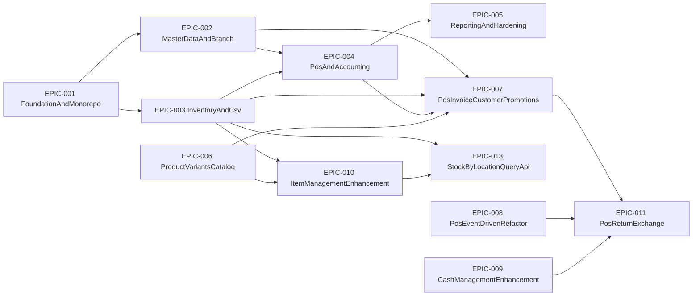
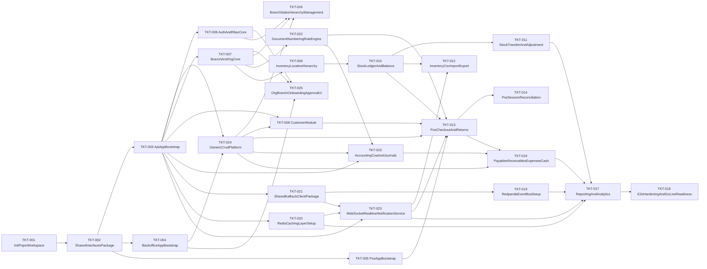
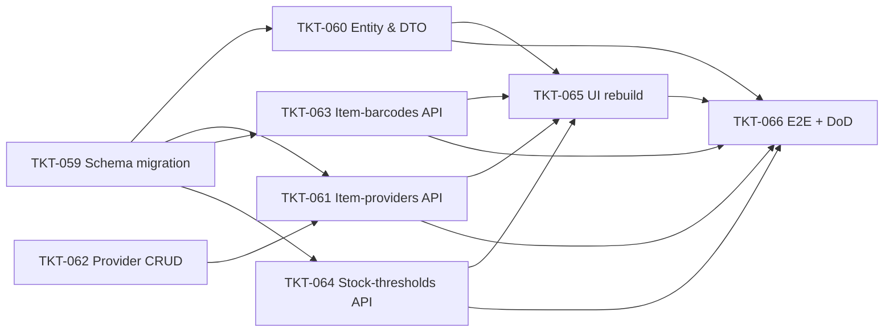

# ERP Delivery Tickets

Jira-style planning artifacts for implementation tracking.

## Folder Structure

- `epics/`: high-level delivery streams.
- `tickets/`: implementable work items mapped to epics.

## Epic Dependency Graph



## Ticket Dependency Graph



## Epics

- [EPIC-001 Foundation and Monorepo](./epics/EPIC-001-foundation-and-monorepo.md)
- [EPIC-002 Master Data and Branch](./epics/EPIC-002-master-data-and-branch.md)
- [EPIC-003 Inventory and CSV](./epics/EPIC-003-inventory-and-csv.md)
- [EPIC-004 POS and Accounting](./epics/EPIC-004-pos-and-accounting.md)
- [EPIC-005 Reporting and Hardening](./epics/EPIC-005-reporting-and-hardening.md)

## Tickets

- [All tickets](./tickets/)

## EPIC-006 Product variants & catalog

- [EPIC-006 Product variants & catalog](./epics/EPIC-006-product-variants-catalog.md)
- Tickets: [TKT-027](./tickets/TKT-027-inventory-product-schema.md) – [TKT-037](./tickets/TKT-037-product-variants-test-plan.md)
- Dependencies: [TKT-DEP-006-dependencies.md](./TKT-DEP-006-dependencies.md)

## EPIC-007 POS Invoice, Customer Loyalty & Promotions

- [EPIC-007 POS Invoice, Customer Loyalty & Promotions](./epics/EPIC-007-pos-invoice-customer-promotions.md)
- ERD: [docs/pos-erd.md](../docs/pos-erd.md)
- Tickets: [TKT-038](./tickets/TKT-038-invoice-entities-migration.md) – [TKT-046](./tickets/TKT-046-promotion-apply-service.md)

| Ticket                                                     | Mô tả                                           |
| ---------------------------------------------------------- | ----------------------------------------------- |
| [TKT-038](./tickets/TKT-038-invoice-entities-migration.md) | Invoice + InvoiceItem entities & migration      |
| [TKT-039](./tickets/TKT-039-invoice-crud-api.md)           | Invoice CRUD API (draft lifecycle)              |
| [TKT-040](./tickets/TKT-040-invoice-checkout-service.md)   | Invoice checkout service (draft → paid \| debt) |
| [TKT-041](./tickets/TKT-041-customer-module-extensions.md) | Customer extensions + CustomerGroup             |
| [TKT-042](./tickets/TKT-042-membership-card-api.md)        | MembershipCard + PointHistory API               |
| [TKT-043](./tickets/TKT-043-invoice-debt-service.md)       | InvoiceDebt + DebtPayment & debt flow           |
| [TKT-044](./tickets/TKT-044-purchase-history-api.md)       | Purchase history API                            |
| [TKT-045](./tickets/TKT-045-promotion-entities.md)         | Promotion module entities                       |
| [TKT-046](./tickets/TKT-046-promotion-apply-service.md)    | Promotion apply service + InvoicePromotion      |

## EPIC-010 Item Management Enhancement (Phase 1)

- [EPIC-010 Item Management Enhancement](./epics/EPIC-010-item-management-enhancement.md)
- Tickets: [TKT-059](./tickets/TKT-059-item-management-schema.md) – [TKT-066](./tickets/TKT-066-item-management-test-plan.md)

| Ticket                                                       | Mô tả                                                         |
| ------------------------------------------------------------ | ------------------------------------------------------------- |
| [TKT-059](./tickets/TKT-059-item-management-schema.md)       | Schema migration: alter `items` + 3 bảng mới + data migration |
| [TKT-060](./tickets/TKT-060-item-entity-enhancement.md)      | `ItemEntity` / DTO / CrudConfig + filter POS catalog          |
| [TKT-061](./tickets/TKT-061-item-providers-m2m-api.md)       | API M2M `item_providers` (CRUD + set-primary)                 |
| [TKT-062](./tickets/TKT-062-provider-crud-endpoints.md)      | Bổ sung `POST/PATCH/DELETE /inventory/providers`              |
| [TKT-063](./tickets/TKT-063-item-barcodes-api.md)            | API `item_barcodes` (nhiều mã/item + lookup POS)              |
| [TKT-064](./tickets/TKT-064-item-stock-thresholds-api.md)    | API định mức tồn min/max theo `(item, location)`              |
| [TKT-065](./tickets/TKT-065-backoffice-item-form-rebuild.md) | Backoffice UI form 3 tab (Cơ bản / Bổ sung / Kho)             |
| [TKT-066](./tickets/TKT-066-item-management-test-plan.md)    | E2E + migration test + regression + docs                      |

### Ticket dependency graph (EPIC-010)



## EPIC-013 Stock-by-Location Query API (Phase 1)

- [EPIC-013 Stock-by-Location Query API](./epics/EPIC-013-stock-by-location-api.md)
- Tickets: [TKT-067](./tickets/TKT-067-stock-by-location-service.md) – [TKT-069](./tickets/TKT-069-stock-by-location-test-plan.md)

| Ticket                                                       | Mô tả                                                                                   |
| ------------------------------------------------------------ | --------------------------------------------------------------------------------------- |
| [TKT-067](./tickets/TKT-067-stock-by-location-service.md)    | DTO + Service: query builder + filter mapping + computed `belowMin`                     |
| [TKT-068](./tickets/TKT-068-stock-by-location-controller.md) | Controller `GET /inventory/locations/:locationId/stock-items` + Swagger + OpenAPI regen |
| [TKT-069](./tickets/TKT-069-stock-by-location-test-plan.md)  | Test plan (unit + e2e) + DoD gate                                                       |

### Ticket dependency graph (EPIC-013)

```mermaid
flowchart LR
  T67["TKT-067 DTO & Service"] --> T68["TKT-068 Controller + OpenAPI"]
  T68 --> T69["TKT-069 Test plan + DoD"]
  T67 --> T69
## EPIC-011 POS Return & Exchange

- [EPIC-011 POS Return & Exchange](./epics/EPIC-011-pos-return-exchange.md)
- Plan: [docs/plan-return-exchange.md](../docs/plan-return-exchange.md)
- Tickets: [TKT-067](./tickets/TKT-067-pos-legacy-scaffolding-cleanup.md) – [TKT-074](./tickets/TKT-074-return-exchange-test-plan.md)

| Ticket                                                                | Mô tả                                                                                                 |
| --------------------------------------------------------------------- | ----------------------------------------------------------------------------------------------------- |
| [TKT-067](./tickets/TKT-067-pos-legacy-scaffolding-cleanup.md)        | Xoá legacy `SaleEntity` / `ReturnService` / `ExchangeService` (zero behavior change)                  |
| [TKT-068](./tickets/TKT-068-return-exchange-schema-migrations.md)     | 4 migration: invoice type/refund fields, item direction, `customer_credits` table                     |
| [TKT-069](./tickets/TKT-069-return-entities-topics-and-enums.md)      | Entity updates + 5 Kafka topics + DomainEventType + shared enums                                      |
| [TKT-070](./tickets/TKT-070-return-publishers-and-consumers.md)       | 5 publishers + 4 idempotent consumers (stock-return-in, cash-refund, loyalty-reverse, journal-return) |
| [TKT-071](./tickets/TKT-071-customer-credit-service.md)               | `CustomerCreditEntity` + service (issue / redeem)                                                     |
| [TKT-072](./tickets/TKT-072-return-eligibility-and-draft-services.md) | `checkout-shared.ts` + eligibility + draft creation services                                          |
| [TKT-073](./tickets/TKT-073-checkout-return-service-and-api.md)       | `CheckoutReturnService` + DTOs + 4 endpoint + module wiring                                           |
| [TKT-074](./tickets/TKT-074-return-exchange-test-plan.md)             | E2E (4 flow) + unit + manual verification + docs update                                               |

### Ticket dependency graph (EPIC-011)

```mermaid
flowchart LR
  T67["TKT-067 Legacy cleanup"] --> T68["TKT-068 Schema migrations"]
  T68 --> T69["TKT-069 Entities + topics"]
  T69 --> T70["TKT-070 Publishers + consumers"]
  T69 --> T71["TKT-071 Customer credit service"]
  T69 --> T72["TKT-072 Eligibility + draft services"]
  T70 --> T73["TKT-073 Checkout-return + API"]
  T71 --> T73
  T72 --> T73
  T73 --> T74["TKT-074 Test plan + DoD"]
```

