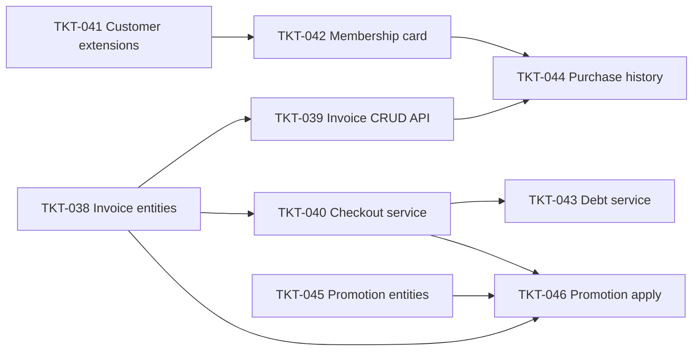

# EPIC-007 POS Invoice, Customer Loyalty & Promotions

## Summary

Mở rộng POS module với vòng đời hóa đơn đầy đủ (draft → paid | debt), nâng cấp Customer module (thêm thông tin cá nhân, thẻ thành viên, điểm tích lũy), quản lý công nợ khách hàng, và module ưu đãi (mã giảm giá, voucher, chương trình khuyến mãi).

ERD chi tiết: [`docs/pos-erd.md`](../../docs/pos-erd.md).

## Dependencies (epic-level)

- [EPIC-002 Master Data and Branch](./EPIC-002-master-data-and-branch.md) — Branch, User entities.
- [EPIC-003 Inventory and CSV](./EPIC-003-inventory-and-csv.md) — ItemEntity (sellable SKU).
- [EPIC-004 POS and Accounting](./EPIC-004-pos-and-accounting.md) — DocumentNumberingModule, PosSession, SaleEntity (coexist).
- [EPIC-006 Product variants & catalog](./EPIC-006-product-variants-catalog.md) — ItemEntity có `product_id`.

## Tickets trong epic

| Ticket | Mô tả ngắn |
|--------|------------|
| [TKT-038](../tickets/TKT-038-invoice-entities-migration.md) | Invoice + InvoiceItem entities & migration |
| [TKT-039](../tickets/TKT-039-invoice-crud-api.md) | Invoice CRUD API (draft lifecycle) |
| [TKT-040](../tickets/TKT-040-invoice-checkout-service.md) | Invoice checkout service (draft → paid \| debt) |
| [TKT-041](../tickets/TKT-041-customer-module-extensions.md) | Customer extensions + CustomerGroup entity |
| [TKT-042](../tickets/TKT-042-membership-card-api.md) | MembershipCard + PointHistory entities & API |
| [TKT-043](../tickets/TKT-043-invoice-debt-service.md) | InvoiceDebt + DebtPayment entities & debt flow |
| [TKT-044](../tickets/TKT-044-purchase-history-api.md) | Purchase history API (lịch sử mua hàng) |
| [TKT-045](../tickets/TKT-045-promotion-entities.md) | Promotion module — DiscountCode, Voucher, Promotion entities |
| [TKT-046](../tickets/TKT-046-promotion-apply-service.md) | Promotion apply service + InvoicePromotion |

## Ticket dependency graph

## Epic acceptance criteria

- [ ] Tạo và lưu được hóa đơn nháp (draft), khôi phục và thanh toán.
- [ ] Bán hàng ghi công nợ: tạo `invoice_debt` atomically cùng `invoice`.
- [ ] Thu nợ (`debt_payment`) cập nhật `remaining_amount` chính xác; khi đủ → `status = paid`.
- [ ] Customer có đủ thông tin cá nhân, nhóm khách hàng, nhân viên phụ trách.
- [ ] Phát hành và tra cứu thẻ thành viên; tích/tiêu điểm atomic với lịch sử.
- [ ] Áp dụng mã ưu đãi / voucher / khuyến mãi vào hóa đơn; ghi `invoice_promotions`.
- [ ] Xem lịch sử mua hàng của khách hàng (tất cả chi nhánh).

## Epic Definition of Done

- [ ] Mọi ticket TKT-038–046 đạt DoD riêng.
- [ ] Migration chạy thành công trên staging replica — không mất data hiện có.
- [ ] `SaleEntity` / checkout cũ không bị regression (coexist).
- [ ] Không có orphan `invoice_debt` (bảo đảm atomic).
