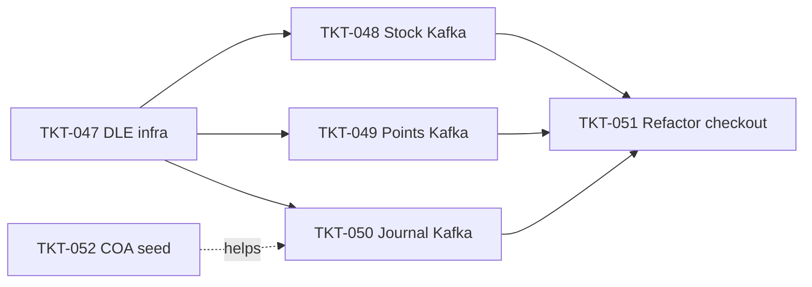

# EPIC-008 POS Event-Driven Refactor

## Summary

Refactor `CheckoutInvoiceService` từ mô hình synchronous (try-catch + compensating transaction) sang event-driven với Kafka. Tách 3 downstream operations (stock deduction, loyalty points award, journal posting) thành các Kafka events độc lập với DLQ + `dead_letter_events` recovery. Mục tiêu: decouple checkout flow khỏi downstream services, tăng độ tin cậy, cho phép admin replay khi consumer fail vĩnh viễn.

Thảo luận chi tiết: [`docs/architecture-cash-flow.md`](../../docs/architecture-cash-flow.md) — Section 2 và 3.

## Dependencies (epic-level)

- [EPIC-001 Foundation and Monorepo](./EPIC-001-foundation-and-monorepo.md) — TKT-019 (Redpanda), TKT-021 (Kafka client), `EventConsumerManager`, `@OnDomainEvent` decorator.
- [EPIC-007 POS Invoice, Customer Loyalty & Promotions](./EPIC-007-pos-invoice-customer-promotions.md) — `CheckoutInvoiceService` (TKT-040), `MembershipCardService`, `InvoiceDebtService`.
- [EPIC-004 POS and Accounting](./EPIC-004-pos-and-accounting.md) — `JournalService`, `StockLedgerService`.

## Tickets trong epic

| Ticket | Mô tả ngắn |
|--------|------------|
| [TKT-047](../tickets/TKT-047-dead-letter-events-infrastructure.md) | Bảng `dead_letter_events` + service + admin replay API |
| [TKT-048](../tickets/TKT-048-stock-deduction-kafka-migration.md) | Stock deduction sang Kafka (`erp.stock.deduction`, key=productId) |
| [TKT-049](../tickets/TKT-049-loyalty-points-kafka-migration.md) | Loyalty points sang Kafka (`erp.loyalty.points.award`, key=customerId) |
| [TKT-050](../tickets/TKT-050-journal-posting-kafka-migration.md) | Journal posting sang Kafka (`erp.journal.post.sale`, key=branchId) |
| [TKT-051](../tickets/TKT-051-checkout-invoice-event-driven-refactor.md) | Refactor `CheckoutInvoiceService` — bỏ sync calls + compensating transaction |
| [TKT-052](../tickets/TKT-052-coa-and-document-numbering-seed.md) | Auto-seed COA + document numbering sequence cho org/branch mới |

## Ticket dependency graph

## Epic acceptance criteria

- [ ] Checkout invoice trả response ngay sau khi commit DB, không đợi stock/points/journal.
- [ ] Stock deduction được xử lý tuần tự theo `productId` (Kafka partition key) — không có concurrent write conflict.
- [ ] Loyalty points award được xử lý tuần tự theo `customerId` — balance không bị race condition.
- [ ] Journal posting được xử lý tuần tự theo `branchId` — document numbering đảm bảo thứ tự.
- [ ] Consumer fail 3 lần (DLQ) → row trong `dead_letter_events` với metadata đầy đủ (topic, key, payload, error).
- [ ] Admin có thể list, replay, hoặc ignore dead letter events qua API.
- [ ] Idempotency được đảm bảo cho cả 3 consumer (re-process không gây duplicate).
- [ ] Organization mới được auto-seed COA → journal posting không fail silently.

## Epic Definition of Done

- [ ] Mọi ticket TKT-047–052 đạt DoD riêng.
- [ ] Integration test full flow: checkout → 3 events publish → 3 consumers process thành công.
- [ ] Chaos test: force consumer fail → verify dead_letter_events → replay → verify idempotent.
- [ ] `CheckoutInvoiceService` không còn import `StockLedgerService`, `MembershipCardService`, `JournalService`.
- [ ] Migration chạy thành công trên staging — không mất data hiện có.
