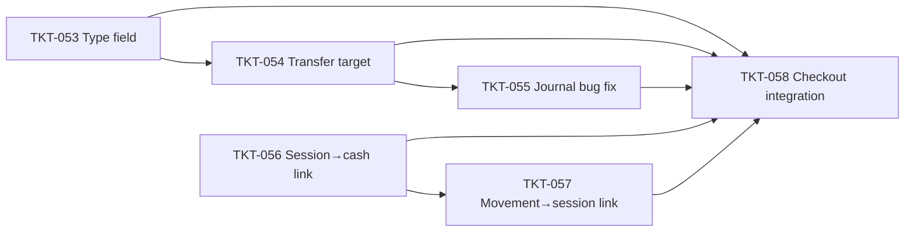

# EPIC-009 Cash Management Enhancement

## Summary

Hoàn thiện nghiệp vụ quản lý tiền mặt (cash flow) trong hệ thống:
- Phân loại `cash_accounts` theo type (REGISTER / SAFE / PETTY_CASH) để phân biệt két quầy POS, két chính chi nhánh, quỹ lẻ.
- Hỗ trợ TRANSFER giữa các két với `toAccountId` — cập nhật cả két nguồn và két đích atomically.
- Fix bug journal trong `CashService.recordMovement` (đang debit & credit cùng 1 account → bút toán vô nghĩa).
- Link `cash_account` với `pos_session` để truy vết ca làm việc đang dùng két nào.
- Tích hợp `cash_movements` vào checkout invoice — khi khách trả tiền mặt, tự động tạo movement DEPOSIT vào két của session hiện tại.

Thảo luận chi tiết: [`docs/architecture-cash-flow.md`](../../docs/architecture-cash-flow.md) — Section 4 và 5.

## Dependencies (epic-level)

- [EPIC-004 POS and Accounting](./EPIC-004-pos-and-accounting.md) — TKT-014 (session reconciliation), TKT-015 (COA & journals), TKT-016 (cash service).
- [EPIC-007 POS Invoice, Customer Loyalty & Promotions](./EPIC-007-pos-invoice-customer-promotions.md) — `CheckoutInvoiceService` (TKT-040), `invoice_payments`.

## Tickets trong epic

| Ticket | Mô tả ngắn |
|--------|------------|
| [TKT-053](../tickets/TKT-053-cash-account-type-field.md) | Thêm `type` enum (REGISTER/SAFE/PETTY_CASH) vào `cash_accounts` |
| [TKT-054](../tickets/TKT-054-cash-movement-transfer-target.md) | Thêm `toAccountId` vào `cash_movements` — TRANSFER cập nhật cả 2 két |
| [TKT-055](../tickets/TKT-055-cash-service-journal-bug-fix.md) | Fix bug journal trong `CashService.recordMovement` (DR = CR same account) |
| [TKT-056](../tickets/TKT-056-pos-session-cash-account-link.md) | Link `cash_account_id` vào `pos_sessions` (required) |
| [TKT-057](../tickets/TKT-057-cash-movement-session-link.md) | Thêm `session_id` vào `cash_movements` — filter movements theo ca khi reconcile |
| [TKT-058](../tickets/TKT-058-checkout-cash-movement-integration.md) | Tích hợp checkout invoice → tạo `cash_movement` cho payments CASH |

## Ticket dependency graph

## Epic acceptance criteria

- [ ] `cash_accounts` phân biệt được REGISTER / SAFE / PETTY_CASH.
- [ ] TRANSFER giữa 2 két: balance source giảm, balance destination tăng đúng số tiền, trong cùng 1 transaction.
- [ ] Journal entry cho TRANSFER đúng nghiệp vụ: DR `toAccount`, CR `fromAccount` (không còn debit/credit cùng 1 account).
- [ ] Mỗi `pos_session` gắn với 1 `cash_account` (type=REGISTER) — không 2 session OPEN trên cùng 1 két.
- [ ] Mọi `cash_movement` tạo ra trong context của session đều có `session_id` set.
- [ ] Chốt ca: `expected_cash = openingCashAmount + sum(movements WHERE session_id = X)` tính chính xác.
- [ ] Checkout invoice với CASH payment → tự động tạo `cash_movement DEPOSIT` vào két của session.
- [ ] Backward compatible: data hiện có không vỡ; default cho `cash_accounts.type` = REGISTER.

## Epic Definition of Done

- [ ] Mọi ticket TKT-053–058 đạt DoD riêng.
- [ ] Migration chạy thành công trên staging — data hiện có giữ nguyên balance.
- [ ] Integration test: open session → checkout cash → close session → verify reconciliation chính xác.
- [ ] `CashService.recordMovement` không còn debit/credit cùng account (bug fix verified).
- [ ] Audit trail: từ 1 `cash_movement` có thể trace ngược về `invoice_payment` (qua reference) và `pos_session`.
