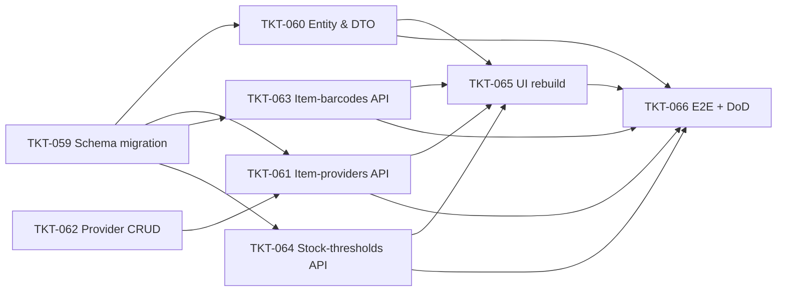

# EPIC-010 Item Management Enhancement (Phase 1)

## Summary

Mở rộng module quản lý hàng hoá (`ItemEntity`) để bám sát form "Thêm mới Mặt hàng kho" trong backoffice (URL `/admin/inventory-items/new`). Bao gồm 4 nhóm thay đổi schema/API và 1 đợt rebuild UI form:

1. **Field cơ bản bổ sung** trên `items`: physical specs (weight/dimension/manufactureYear/composition), `isPosVisible`.
2. **`items.category` (string) → `category_id` (FK)** liên kết bảng `inventory_item_categories` đã có.
3. **`items.provider_id` (1-1) → bảng nối `item_providers` (M2M)**, hỗ trợ 1 item có nhiều NCC, đánh dấu 1 NCC `is_primary`.
4. **3 bảng mới**: `item_barcodes` (nhiều mã/item), `item_stock_thresholds` (định mức tồn min/max theo `item × location`).
5. **POS catalog** lọc theo `is_pos_visible`.
6. **Backoffice form** rebuild theo 3 tab (Thông tin cơ bản, Thông tin bổ sung, Thông tin kho). Tab Hoa hồng hoãn sang Phase 2.

**Out of scope (Phase 2)**:
- Unit conversion (đa đơn vị quy đổi) — bán giày chỉ 1 đơn vị.
- Hoa hồng theo vị trí công việc.
- Upload ảnh hàng hoá (TBD).
- Cờ "mặt hàng vàng bạc".
- Background job cảnh báo khi tồn chạm ngưỡng (chỉ lưu data Phase 1).

## Dependencies (epic-level)

- Hoàn thành [EPIC-003 Inventory and CSV](./EPIC-003-inventory-and-csv.md) — `items`, `locations`, `inventory_providers`, `inventory_item_categories` đã có.
- Phụ thuộc [EPIC-006 Product variants & catalog](./EPIC-006-product-variants-catalog.md) — `items.product_id`, `variant_label` đã có; **không thay đổi** trong epic này.

## Tickets trong epic

| Ticket | Mô tả ngắn |
|--------|------------|
| [TKT-059](../tickets/TKT-059-item-management-schema.md) | Migration: alter `items` + 3 bảng mới + data migration |
| [TKT-060](../tickets/TKT-060-item-entity-enhancement.md) | Cập nhật `ItemEntity` / DTO / CrudConfig + filter POS catalog |
| [TKT-061](../tickets/TKT-061-item-providers-m2m-api.md) | API M2M `item_providers` (CRUD + set-primary) |
| [TKT-062](../tickets/TKT-062-provider-crud-endpoints.md) | Bổ sung `POST/PATCH/DELETE /inventory/providers` cho UX inline-create |
| [TKT-063](../tickets/TKT-063-item-barcodes-api.md) | API `item_barcodes` (CRUD nhiều mã/item) |
| [TKT-064](../tickets/TKT-064-item-stock-thresholds-api.md) | API `item_stock_thresholds` + auto-create row khi tạo location |
| [TKT-065](../tickets/TKT-065-backoffice-item-form-rebuild.md) | Backoffice UI form 3 tab (Cơ bản / Bổ sung / Kho) |
| [TKT-066](../tickets/TKT-066-item-management-test-plan.md) | E2E + DoD gate |

## Graph phụ thuộc ticket

## Epic acceptance criteria

- [ ] Form "Thêm mới Mặt hàng kho" tạo được hàng hoá với toàn bộ field thuộc 3 tab Phase 1.
- [ ] 1 item có thể link nhiều NCC; đúng 1 NCC `is_primary` mỗi item (DB constraint enforce).
- [ ] Danh mục là entity tách rời, cho phép tạo inline từ picker trong form.
- [ ] Mỗi item có thể có nhiều barcode, unique trong org.
- [ ] Định mức tồn min/max lưu theo `(item, location)`; row được tạo khi cần.
- [ ] POS catalog chỉ hiển thị item có `is_pos_visible = true`.
- [ ] Data legacy: 100% item cũ giữ được liên kết NCC (qua `is_primary`) và danh mục (qua FK mới).

## Epic Definition of Done

- [ ] Mọi ticket TKT-059–066 đạt DoD riêng.
- [ ] Migration chạy trên staging, không mất dữ liệu, rollback hoạt động.
- [ ] OpenAPI snapshot regenerate, `pnpm openapi:generate` cập nhật `packages/api-client`.
- [ ] Không regression: PO nhận hàng, POS checkout, stock transfer, goods issue, adjustment vẫn pass test cũ.
- [ ] Backoffice form qua review UX với team nghiệp vụ.
