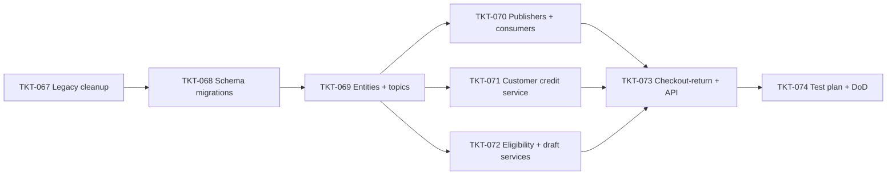

# EPIC-011 POS Return & Exchange

## Summary

Implement luồng đổi trả hàng (return/exchange) trên POS, mở rộng `InvoiceEntity` với `type: SALE | RETURN | EXCHANGE` thay vì tạo entity riêng. Plan chi tiết: [docs/plan-return-exchange.md](../../docs/plan-return-exchange.md).

**Hai chế độ return**:
1. **Đổi trả nhanh** (quick) — không cần invoice gốc, items tự do (bán hàng âm).
2. **Đổi trả thường** (regular) — bắt buộc invoice gốc, validate per-item + per-qty (mua 5 trả 2).

**Exchange** = một invoice chứa cả dòng IN (trả lại) + dòng OUT (mua mới), tự cấn trừ chênh lệch.

**Refund methods**:
- `CASH` — rút tiền mặt từ drawer (cash withdrawal).
- `STORE_CREDIT` — phát hành credit cho khách (công nợ ngược, ledger `customer_credits`).
- `OFFSET` — cấn trừ trực tiếp vào hàng mua mới hoặc công nợ AR gốc.

**Async fan-out** sau khi commit DB transaction: stock return-in, loyalty points reverse, cash refund, journal post return, RETURN_POSTED event + WebSocket POS_CHECKOUT_ACKNOWLEDGED.

**Side scope**:
- Cleanup legacy `SaleEntity`/`ReturnEntity`/`ExchangeService` (Step 1 plan) — không kết nối với `InvoiceEntity` hiện hữu, cần xoá để tránh hai parallel model.
- Bảng mới `customer_credits` ledger để track store credit lifecycle.

**Out of scope (v2)**:
- COGS reversal trong journal entry (sale hiện không post COGS).
- Time window restrict (cấm return sau N ngày).
- Returning từ EXCHANGE invoice (chain).
- Cancel/revert một RETURN invoice đã posted.
- Background job EXPIRE customer credit khi quá `expires_at`.

## Dependencies (epic-level)

- [EPIC-007 POS Invoice, Customer Loyalty & Promotions](./EPIC-007-pos-invoice-customer-promotions.md) — `InvoiceEntity`, `InvoicePayment`, `MembershipCard`, `InvoiceDebt` đã có.
- [EPIC-008 POS event-driven refactor](./EPIC-008-pos-event-driven-refactor.md) — reuse `StockDeductionConsumer`, `JournalSalePublisher` pattern, dead-letter infra.
- [EPIC-009 Cash management enhancement](./EPIC-009-cash-management-enhancement.md) — `CashService.recordMovement(WITHDRAWAL)`, drawer session, `CashFromPaymentConsumer`.

## Tickets trong epic

| Ticket | Mô tả ngắn |
|--------|------------|
| [TKT-067](../tickets/TKT-067-pos-legacy-scaffolding-cleanup.md) | Xoá legacy `SaleEntity`/`ReturnService`/`ExchangeService` (zero behavior change) |
| [TKT-068](../tickets/TKT-068-return-exchange-schema-migrations.md) | 4 migration: invoice type/refund fields, item direction, `customer_credits` table |
| [TKT-069](../tickets/TKT-069-return-entities-topics-and-enums.md) | Entity updates + 5 Kafka topics + DomainEventType + shared-interfaces enums |
| [TKT-070](../tickets/TKT-070-return-publishers-and-consumers.md) | 5 publishers + 4 idempotent consumers (stock-return-in, cash-refund, loyalty-reverse, journal-return) |
| [TKT-071](../tickets/TKT-071-customer-credit-service.md) | `CustomerCreditEntity` + `CustomerCreditService` (issue / redeem) |
| [TKT-072](../tickets/TKT-072-return-eligibility-and-draft-services.md) | Extract `checkout-shared.ts` + `ReturnEligibilityService` + 2 service tạo draft invoice |
| [TKT-073](../tickets/TKT-073-checkout-return-service-and-api.md) | `CheckoutReturnService` (transaction + fan-out) + DTOs + 4 controller endpoints + module wiring |
| [TKT-074](../tickets/TKT-074-return-exchange-test-plan.md) | Unit + E2E (4 flow trong sequence diagrams) + manual verification + docs update |

## Graph phụ thuộc ticket

## Epic acceptance criteria

- [ ] **Đổi trả nhanh** (Flow 1): tạo RETURN invoice không cần invoice gốc, checkout refund CASH → stock tăng, cash drawer giảm đúng số tiền.
- [ ] **Đổi trả thường — partial** (Flow 2): trả 2/5 unit → `invoice_items.returned_quantity = 2` trên invoice gốc; second concurrent partial return cùng line → 409.
- [ ] **Exchange net < 0** (Flow 3): trả món đắt + mua món rẻ → cash refund chênh lệch, cả 2 stock publisher fire.
- [ ] **Exchange net > 0** (Flow 4): trả món rẻ + mua món đắt → require payments, cash drawer tăng đúng, reuse `CashFromPaymentConsumer`.
- [ ] **Exchange net = 0** (`refundMethod=OFFSET`): không cash event, stock vẫn đúng.
- [ ] **STORE_CREDIT**: phát hành `customer_credits` row với `remainingAmount = refundedAmount`, reference code unique per org.
- [ ] **OFFSET vs DEBT invoice**: `InvoiceDebtService.settle` đúng số.
- [ ] **Loyalty reverse**: card.points giảm `floor(refundedSubtotal/1000)`, floor về 0 nếu insufficient (không fail giao dịch).
- [ ] **Journal entry RETURN**: cân bằng, `source=RETURN`, không vô tình reuse logic `INVOICE_CANCELLED`.
- [ ] **Idempotency**: replay mỗi topic không double-effect (verify qua spec test + manual replay).

## Epic Definition of Done

- [ ] Tất cả ticket TKT-067–074 đạt DoD riêng.
- [ ] Migrations chạy trên staging với data thực, không mất dữ liệu, rollback (down) hoạt động.
- [ ] `pnpm openapi:generate` regenerate, commit `packages/api-client` + `openapi.snapshot.json`.
- [ ] Không regression: SALE checkout, INVOICE_CANCELLED, debt flow, promotion, loyalty earn vẫn pass test cũ.
- [ ] 4 sequence diagram trong [plan-return-exchange.md](../../docs/plan-return-exchange.md#sequence-diagrams) đã verified e2e trên staging.
- [ ] 6 open question trong plan đã có answer + reflect vào ticket/code (CoA store credit, COGS reversal, refund không session, store_credit payment method, returning EXCHANGE, DocumentType cho credit).
- [ ] Docs cập nhật: [docs/10-pos-module.md](../../docs/10-pos-module.md), [docs/13-workflows-and-state-machines.md](../../docs/13-workflows-and-state-machines.md), entity docs regenerate.
