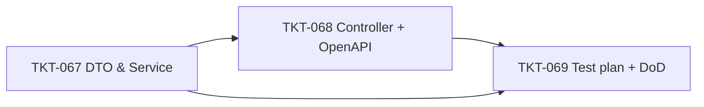

# EPIC-013 Stock-by-Location Query API (Phase 1)

## Summary

Bổ sung một API đọc tồn kho theo **góc nhìn location**: cho 1 `locationId`, trả về danh sách toàn bộ mặt hàng đang lưu tại location đó (bao gồm cả `quantity < 0`), kèm đầy đủ metadata phục vụ trang "Tồn kho theo vị trí" của backoffice trong các epic UI sau.

Hiện tại hai endpoint liên quan đều thiếu thông tin cần thiết cho use case quản lý kho theo location:

1. `GET /inventory/stock/balances` (CRUD `inventory-stock-balances`) trả flat rows, chỉ có item code/name/product, **không** có barcode, category name, threshold (min/max), provider, trạng thái tồn.
2. `GET /pos/catalog` gom theo item cho POS, lọc `isPosVisible = true`, không phục vụ backoffice.

EPIC-013 giới thiệu endpoint mới `GET /inventory/locations/:locationId/stock-items` với 8 bộ filter và response trả về `{ data, meta: { location, ... } }`. **Phase 1 chỉ làm backend** — UI tách thành epic riêng.

## Dependencies (epic-level)

- Hoàn thành [EPIC-003 Inventory and CSV](./EPIC-003-inventory-and-csv.md) — `items`, `locations`, `storages`, `stock_balances` đã có.
- Hoàn thành [EPIC-010 Item Management Enhancement](./EPIC-010-item-management-enhancement.md) — `item_barcodes`, `item_stock_thresholds`, `item_providers` đã có.

## Tickets trong epic

| Ticket | Mô tả ngắn |
|--------|------------|
| [TKT-067](../tickets/TKT-067-stock-by-location-service.md) | DTO + Service: query builder + filter mapping + computed fields |
| [TKT-068](../tickets/TKT-068-stock-by-location-controller.md) | Controller endpoint + Swagger + OpenAPI snapshot regen |
| [TKT-069](../tickets/TKT-069-stock-by-location-test-plan.md) | Test plan (unit + e2e) + DoD gate |

## Graph phụ thuộc ticket

## Epic acceptance criteria

- [ ] `GET /inventory/locations/:locationId/stock-items` trả về 200 với shape `{ data, meta: { location, total, page, pageSize } }`.
- [ ] `meta.location` chứa `{ id, code, name, type, isActive, storage: { id, name }, branch: { id, name } }`.
- [ ] Mỗi item row chứa: `itemId, code, name, unit, categoryId, categoryName, productId, variantLabel, isPosVisible, isActive, sellingPrice, purchasePrice, barcodes[], providers[{providerId, providerName, isPrimary}], quantity, minQty, maxQty, belowMin, lastMovementAt`.
- [ ] Hỗ trợ 8 filter: `search` (code+name partial), `barcode` (exact), `categoryId`, `providerId`, `isPosVisible`, `isActive`, `stockState` (all/positive/zero/negative/below-min), pagination (page/pageSize/sortBy/sortOrder).
- [ ] Stock âm (`quantity < 0`) được trả về mặc định (`stockState=all`).
- [ ] 404 khi `locationId` không tồn tại hoặc không thuộc `actor.organizationId`.
- [ ] 403 khi location không thuộc branch scope của actor (qua `BranchScopeGuard`).
- [ ] Thiếu permission `inventory.read` → 403.
- [ ] OpenAPI snapshot có endpoint mới, `@erp/api-client` regen có method tương ứng.

## Epic Definition of Done

- [ ] Mọi ticket TKT-067–069 đạt DoD riêng.
- [ ] Test unit + e2e xanh trên CI.
- [ ] `pnpm openapi:generate` cập nhật `packages/api-client/openapi.snapshot.json` và `packages/api-client/src/generated/schema.ts`.
- [ ] Không regression: e2e của `inventory-stock-balances`, `pos-catalog`, `stock-ledger` vẫn pass.
- [ ] Performance smoke test: 5,000 stock_balances trong 1 location → response < 500ms p95.
- [ ] Code review qua, không TODO/FIXME mới ngoài kế hoạch.

## Out of scope (Phase 2)

- Backoffice UI `/admin/inventory/locations/:id/stock` — tách thành epic UI riêng.
- Export CSV/Excel kết quả.
- WebSocket realtime push khi tồn thay đổi.
- Endpoint reverse `GET /inventory/items/:itemId/locations` (list location của 1 item).
- Schema constraint "1 item ↔ 1 location" — chưa thay đổi `stock_balances`.
- Aggregate cấp organization (`GET /inventory/stock-overview` không kèm `locationId`).
