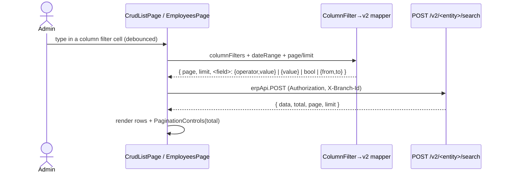
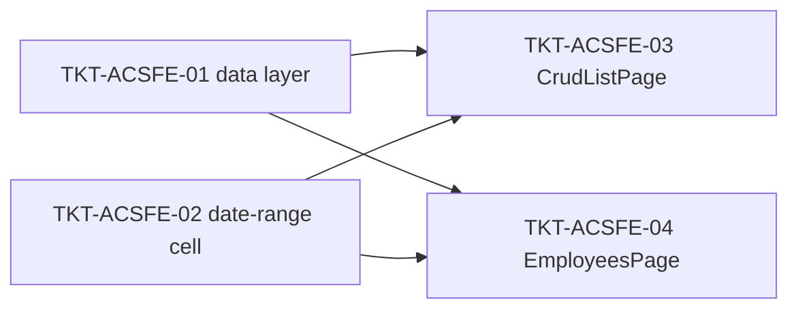

# EPIC-03062026 Backoffice admin list server-side search — FE wiring

## Goal

Wire the backoffice-web admin lists to the CQRS search endpoints delivered by [EPIC-03062026 Backoffice admin list server-side CQRS search](./EPIC-03062026-admin-list-cqrs-search.md), so the per-column filters query the **whole** org dataset with server-side pagination instead of filtering the loaded page in memory.

Today `CrudListPage` (and the custom `EmployeesPage`) already render the per-column filter row (`BaseDataTable`, operator chips `* = + - !`) but apply `applyColumnFilter` **client-side** over `records.data` — so filtering only narrows the current page and pagination/total are wrong. This epic makes those same filters server-side.

The five surfaces (entityKey → target endpoint):

| Surface | entityKey / page | Target endpoint |
| ------- | ---------------- | --------------- |
| Khách hàng | `customers` (CrudListPage) | `POST /v2/customers/search` |
| Nhà cung cấp | `inventory-providers` (CrudListPage) | `POST /v2/inventory-providers/search` |
| Vị trí công việc | `job-positions` (CrudListPage) | `POST /v2/job-positions/search` |
| Tài khoản | `accounts` (CrudListPage) | `POST /v2/accounts/search` |
| Nhân viên | `employees` (custom `EmployeesPage`) | `POST /v2/employees/search` |

## Decisions (locked)

- **Approach: extend the shared `CrudListPage`, gated by a small FE registry.** For the 4 CRUD entityKeys in `CRUD_V2_SEARCH`, `CrudListPage` fetches via `POST /v2/<entity>/search` (server-side filter + pagination) and **drops** the client-side `filteredRecords`. For every other entityKey it is **byte-identical** to today (still `GET /records` + client filter). `EmployeesPage` (not a CrudListPage) is migrated separately.
- **Sort: createdAt DESC only.** The v2 endpoints have no `sortBy`; the 5 migrated lists lose clickable column-header sorting (consistent with the POS v2 screens). No backend change.
- **Date filtering: add a `date-range` filter cell.** `BaseDataTable` gains a `date-range` filter kind (two date inputs → `{ from, to }`) wired to the v2 `createdAt` `DateRangeFilter`. Only columns that actually render a date column get it (e.g. `job-positions.createdAt`).
- **Filterable columns = v2 DTO fields only.** A column gets a server-side filter cell only if its key is in the entity's `CRUD_V2_SEARCH.fields` map (the backend `forbidNonWhitelisted` rejects unknown keys). Columns not in the map render but are non-filterable (`filterKind: "none"`). Note: providers' `groupName` becomes non-filterable (the v2 endpoint filters `groupId`, not the joined name).
- **Row data unchanged.** The v2 responses already return the same row fields the FE renders (providers' `groupName`, employees' `profile.jobPosition`, accounts' raw `parentAccountId`, full entities), so columns render exactly as before.
- **Envelope:** v2 returns `{ data, total, page, limit }`; the FE hook maps `limit ↔ pageSize` for `PaginationControls`.

## Scope

- **backoffice-web only.** New FE data layer (registry + `ColumnFilter → v2 body` mapper + `useCrudV2Search`/employee hook), a `date-range` filter kind in `BaseDataTable`, gated wiring in `CrudListPage`, and the `EmployeesPage` swap. No backend change, no new endpoints.
- Reuses the regenerated `@erp/api-client` types (the 5 `/v2/.../search` operations) via `erpApi.POST`, and the existing `BaseDataTable` / `PaginationControls` / column-filter UI.
- UI strings stay **Vietnamese**.

## Success Metrics

- Typing in any per-column filter on the 5 lists narrows results against the **whole** org dataset; `PaginationControls` reflects the server `total` (not the loaded-page count).
- Debounced filter input → one request per settle; changing any filter resets to page 1.
- The other ~20 CrudListPage entities and all create/edit/delete flows behave exactly as before.
- App builds + runs; the 5 lists load, filter, and paginate against the live API.

## Flows

## Tickets

- [TKT-ACSFE-01 FE data layer: v2 search registry + filter→body mapper + hooks](../tickets/TKT-ACSFE-01-fe-data-layer.md)
- [TKT-ACSFE-02 BaseDataTable: date-range filter kind](../tickets/TKT-ACSFE-02-fe-datatable-date-range.md)
- [TKT-ACSFE-03 CrudListPage: gated server-side v2 search (4 CRUD entities)](../tickets/TKT-ACSFE-03-fe-crudlistpage-wiring.md)
- [TKT-ACSFE-04 EmployeesPage: migrate to server-side v2 search](../tickets/TKT-ACSFE-04-fe-employees-page.md)

## Dependencies

- Depends on: [EPIC-03062026 Backoffice admin list server-side CQRS search](./EPIC-03062026-admin-list-cqrs-search.md) (the 5 endpoints + regenerated `@erp/api-client`).
- Reuses: `BaseDataTable` + `ColumnFilterModeControl` (operator chips), `PaginationControls`, `useCrudConfig` (column/filter config), `erpApi`/`requireErpData`, the `COLUMN_FILTER_MODE_OPTIONS` symbol map.

### Ticket dependency graph

## Out of scope

- Backend changes (sort support, new filters, new endpoints).
- Making providers' `groupName` or other non-v2-DTO columns server-filterable.
- Migrating any list other than the 5 named; the generic GET `/records` path stays for all others.
