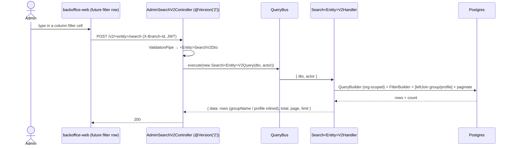
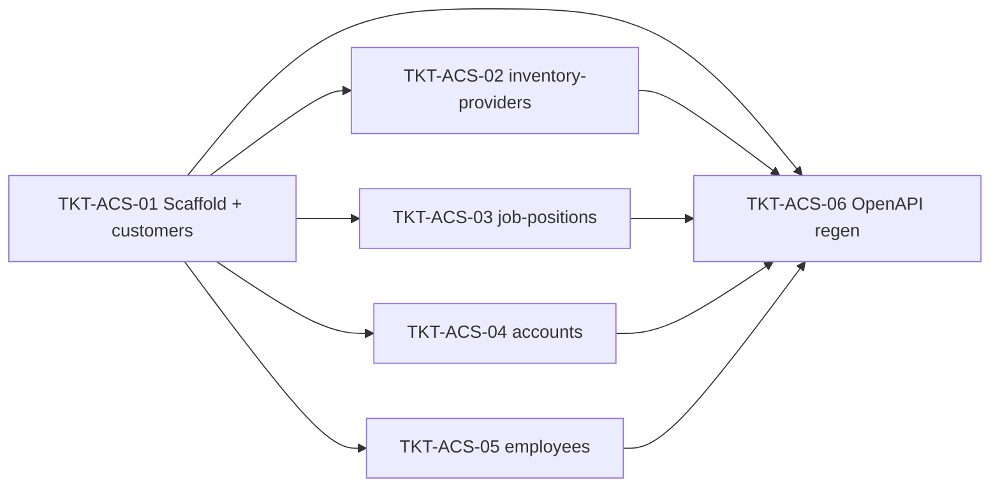

# EPIC-03062026 Backoffice admin list server-side CQRS search

## Goal

Add dedicated **CQRS v2 search endpoints** for five backoffice admin list surfaces currently served by the generic CRUD platform (`GET /admin/entities/:entityKey/records`) and, for employees, by `GET /admin/users`. Reuses the `invoice-v2` CQRS pattern (`cqrs-search-endpoint` skill) — `FilterBuilder` + the shared filter sub-DTOs — to give each column **per-field operators** (contains / equals / starts / ends, date range, compare) querying the **whole** dataset with pagination.

**Backend only.** The FE is **not** rewired in this epic — the existing `CrudListPage` / `useCrudRecords` pages and `useUsers()` keep hitting the current `/records` and `/admin/users` endpoints, which are **left untouched**. The new endpoints are additive, ready for a follow-up FE-migration epic.

The five surfaces:

| #   | Surface          | entityKey / route today | Endpoint today                                    | Target endpoint                       |
| --- | ---------------- | ----------------------- | ------------------------------------------------- | ------------------------------------- |
| 1   | Khách hàng       | `customers`             | `GET /admin/entities/customers/records`           | `POST /v2/customers/search`           |
| 2   | Nhà cung cấp     | `inventory-providers`   | `GET /admin/entities/inventory-providers/records` | `POST /v2/inventory-providers/search` |
| 3   | Vị trí công việc | `job-positions`         | `GET /admin/entities/job-positions/records`       | `POST /v2/job-positions/search`       |
| 4   | Tài khoản (COA)  | `accounts`              | `GET /admin/entities/accounts/records`            | `POST /v2/accounts/search`            |
| 5   | Nhân viên        | `employees` (custom)    | `GET /admin/users`                                | `POST /v2/employees/search`           |

## Decisions (locked)

- **Row data is byte-identical to today.** Every field the FE currently renders or combines must survive (the hard constraint: *không được trả thiếu*):
  - **customers / job-positions / accounts** — return the **full entity** (all columns, e.g. customers' `code`, `groupId`, `assignedStaffId`, …; accounts' raw `parentAccountId` UUID — the parent name is resolved client-side via `LookupField`, no join today).
  - **inventory-providers** — preserve the flattened **`groupName`** (← `group.name`) and **do not** return the nested `group` object, exactly as `InventoryProviderCrudService.transformListResults()` does today.
  - **employees** — preserve the full `UserListItem` shape: `code`, `fullName` parts (`firstName`/`lastName`), `isActive`, `lastLoginAt`, and the nested **`profile { code, jobPosition {id,name}, photoUrl, mobile, employmentStatus }`** — reuse `UsersService`' existing mapper, do not re-implement it.
- **Response envelope = `{ data, total, page, limit }`** (POS v2 convention), not the generic CRUD `{ …, pageSize }`. Safe because no FE consumer is rewired here; a later FE epic adapts to `limit`.
- **Filters upgrade to per-column operators** via the shared sub-DTOs. The filterable columns are derived from each entity's current `searchableFields` + `filterDefinitions`, plus a standard `createdAt` `DateRangeFilterDto` (every list sorts by `createdAt DESC`). Booleans (`isActive`, `isCustomer`) are accepted as plain optional `boolean` body fields (JSON body → native boolean, no transform) — **no** new shared filter primitive is added.
- **All five entities are `ORGANIZATION`-scoped.** Handlers scope by `actor.organizationId` only; **no `branchId` scope**. (customers' `branchId` is an optional exact *filter*, not a scope.)
- **One shared controller.** All five searches live on a single `AdminSearchV2Controller` (`@Version('2')` at class level, class-level `@UseGuards(PermissionGuard)`, per-method `@Post('<entity>/search')` + per-method `@RequirePermission`), hosted by a **new `AdminSearchModule`**. Per-entity controllers/modules are **not** created; the four existing entity modules (`customer`, `inventory-location`, `job-position`, `coa`) are left untouched. The five query+handler pairs + DTOs are colocated in `AdminSearchModule`.
- **No new permissions.** Reuse the existing per-entity keys, set per route: `customer.read`, `inventory.read`, `iam.user.read` (job-positions + employees), `accounting.journal.post` (accounts).

## Scope

- **API:** one new `AdminSearchModule` (`apps/api/src/modules/admin-search/`) holding **one** `AdminSearchV2Controller` + five CQRS query+handler pairs + five request DTOs. The module imports `CqrsModule`, `TypeOrmModule.forFeature([CustomerEntity, ProviderEntity, JobPositionEntity, AccountEntity, UserEntity])`, and `RbacModule` (for the employees mapper); it is registered in `AppModule`. No schema change, no new entity, no migration, no events, no idempotency surface (read-only). The four existing entity modules are not modified.
- **employees** is the one non-CRUD surface: the handler queries `UserEntity` (per-column filters over `leftJoin EmployeeProfileEntity`), then reuses an extracted **public** `UsersService.toListItems()` mapper to build identical `UserListItem` rows (batch-loads profiles with `relations: ["jobPosition"]`, mirroring the current `list()`). `RbacModule` must `export` `UsersService`.
- **OpenAPI hygiene:** regenerate `openapi.snapshot.json` + the api-client `schema.ts` so the new endpoints are typed for the follow-up FE epic. No FE consumer is wired now.
- **No FE changes. No backoffice changes.** Backend identifiers/comments/Swagger/errors stay **English**.

## Success Metrics

- For each of the five entities, `POST /v2/<entity>/search` with per-column filters narrows results against the **whole** org dataset and paginates against the server `total`.
- The returned rows are field-for-field equal to today's list rows (incl. providers' `groupName`, employees' `profile.jobPosition`, accounts' raw `parentAccountId`) — only the envelope key differs (`limit`).
- The existing `GET /admin/entities/:entityKey/records` and `GET /admin/users` are **byte-for-byte unchanged**; all current backoffice pages render exactly as before.
- `pnpm --filter @erp/api test` green incl. new handler specs (org scoping + each filter operator + preserved join fields).

## Flows

## Tickets

- [TKT-ACS-01 BE: AdminSearch module/controller scaffold + Customer search (#1)](../tickets/TKT-ACS-01-be-customers-search.md)
- [TKT-ACS-02 BE: Inventory-provider search endpoint (#2, preserve `groupName`)](../tickets/TKT-ACS-02-be-inventory-providers-search.md)
- [TKT-ACS-03 BE: Job-position search endpoint (#3)](../tickets/TKT-ACS-03-be-job-positions-search.md)
- [TKT-ACS-04 BE: Account (COA) search endpoint (#4)](../tickets/TKT-ACS-04-be-accounts-search.md)
- [TKT-ACS-05 BE: Employee search endpoint (#5, preserve full `UserListItem`)](../tickets/TKT-ACS-05-be-employees-search.md)
- [TKT-ACS-06 OpenAPI regen + api-client snapshot](../tickets/TKT-ACS-06-openapi-regen.md)

## Dependencies

- Depends on: [EPIC-03062026 POS server-side invoice search](./EPIC-03062026-pos-invoice-search.md) (established the `invoice-v2` CQRS + `FilterBuilder` pattern this epic clones), [EPIC-20052026 Employee/HR management](./EPIC-20052026-employee-hr-management.md) (the `UserEntity`/`EmployeeProfileEntity`/`JobPositionEntity` shape + `UsersService` mapper), [EPIC-29052026 Supplier management](./EPIC-29052026-supplier-management.md) (`ProviderEntity` + supplier group).
- Reuses: `common/filters/FilterBuilder` + `filter.dto` sub-DTOs; `@Actor()`/`ActorContext`; `@nestjs/cqrs` `CqrsModule`; the `cqrs-search-endpoint` skill; existing permissions (`customer.read`, `inventory.read`, `iam.user.read`, `accounting.journal.post`) — no new seeding; `UsersService.toListItem`/`toView` mapping for employees.

### Ticket dependency graph

## Out of scope

- **Any FE change.** Rewiring `CrudListPage` / `useCrudRecords` / `EmployeesPage` / `useUsers` to the new endpoints, and the per-column filter UI, are a separate follow-up epic.
- Modifying the generic CRUD `/records` endpoint, `BaseCrudService`, the per-entity `CrudEntityConfig`, or `GET /admin/users` — all left untouched.
- Mutations (create/update/delete) — they stay on the generic CRUD platform / `UsersService`.
- Schema/migration changes, new entities, events, new permissions.
- Adding a status/type **IN-list** to `FilterBuilder` (current filters are single-value enums; not needed).
- Joining the parent account name for `accounts` (today returns raw `parentAccountId`; the FE resolves the name client-side — keep parity).
