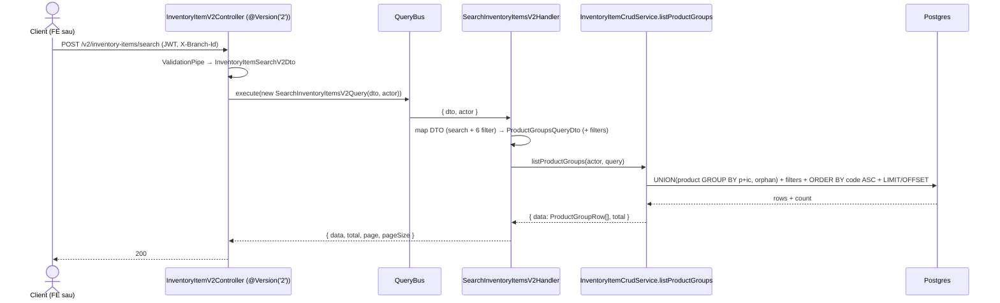
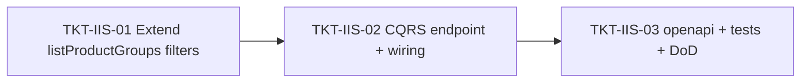

# EPIC-03062026 Inventory item server-side grouped search (v2)

## ⚠️ Revision (rebuild — chốt 2026-06-03)

Bản dựng **đã thay đổi hướng** so với phần "## Goal/Decisions" gốc bên dưới (giữ lại để tham chiếu):

- **KHÔNG dùng lại `listProductGroups`.** Handler `SearchInventoryItemsV2Handler` tự build: fetch item của org (join `product` + `barcodes`) rồi **aggregate in-memory bằng JS** (gom nhóm theo `productId`, orphan = item không có product) — đúng feedback "ưu tiên in-memory, tránh SQL GROUP BY". `listProductGroups` + `ProductGroupsQueryDto` đã được **revert về nguyên bản**.
- **Thêm cột `barcode`** = tất cả barcode của nhóm, distinct, sort, nối `", "` (`""` nếu không có). `ItemBarcodeEntity.code` là giá trị barcode (không có cờ primary).
- **Cột & filter theo Image #1**: `code, barcode, name, unit, brand, purchasePrice, sellingPrice, isPosVisible, isActive`. **Bỏ** `categoryName` (Nhóm hàng hóa) + `itemType` (Loại hàng hóa) khỏi bảng. Filter per-column: code/barcode/name/unit/brand = `StringFilter`; purchasePrice/sellingPrice = `CompareFilter` (UI `≤`); isPosVisible/isActive = boolean select.
- **Envelope = `{ data, total, page, limit }`** (theo convention backoffice v2 `buildV2Body`/`useCrudV2Search`, KHÔNG phải `pageSize`). Sort mặc định `code ASC`. Org-scoped (không branch).
- **Scope = Backend + FE.** FE: đăng ký `inventory-items` vào `CRUD_V2_SEARCH` (`crudV2Search.ts`) → `CrudListPage` tự chuyển sang server-side search; thêm v2 field kind `"compare"` + nhánh `buildV2Body`; thêm filter-cell `"number-range"` (≤) vào `BaseDataTable`; cập nhật `INVENTORY_ITEM_ENTITY_CONFIG.fields` (thêm `barcode` readOnly list-only, ẩn categoryName/itemType, reorder) + `ENTITY_COLUMN_CONFIGS`.

Các ticket TKT-IIS-01/02/03 bên dưới mô tả hướng A (reuse SQL) đã **bị thay thế** bởi bản rebuild này.

## Goal

Thêm một endpoint **CQRS search server-side** cho mặt hàng kho theo đúng pattern `invoice-v2` (skill `cqrs-search-endpoint`): `POST /v2/inventory-items/search`. Endpoint nhận `search` toàn cục + các filter theo từng field (đẩy filter của trang `/admin/inventory-items` xuống backend, thay vì lọc client-side như hiện tại) và **trả về y hệt** shape **product-group** mà `InventoryItemCrudService.list()` (qua `listProductGroups`) đang trả cho `GET /admin/entities/inventory-items/records`.

**Yêu cầu khóa cứng (không được khác):** mỗi row giữ nguyên `ProductGroupRow` hiện tại — `{ type, id, code, name, categoryId, categoryName, unit, purchasePrice, sellingPrice, brand, itemType, isPosVisible, isActive, itemCount }` — envelope `{ data, total, page, pageSize }`, sort `code ASC`, gom nhóm theo **product + category**, tổng hợp `AVG(price)::float` / `bool_and` / `MIN(brand|itemType|unit)` / `COUNT(items)` đúng như SQL hiện tại. `categoryName`/`brand`/`itemType` là `null` khi rỗng (đây là shape grouped — KHÔNG phải shape flat per-item).

## Decisions (locked)

- **Shape = grouped product-groups** (chốt ở Step 1, sau khi đối chiếu với JSON flat user dán). Không trả shape flat per-item.
- **Scope = backend only.** Sau khi implement xong → chạy `pnpm openapi:generate`, commit snapshot. **FE wiring làm sau** (ticket riêng, không thuộc epic này).
- **Filter (đẩy xuống server):** `search` toàn cục (ILIKE `code`/`name`/`category.name`, riêng product-group thì theo `p.code`/`p.name`/`ic.name`) **+** 6 filter của trang: `isActive`, `isPosVisible` (boolean — option `true`/`false`), `categoryId`, `productId` (UUID, exact), `brand`, `itemType` (text — ILIKE contains). Filter áp **ở mức item, TRƯỚC khi gom nhóm**: item không khớp bị loại khỏi nhóm; nhóm còn 0 item thì biến mất; `itemCount`/`bool_and`/`AVG` phản ánh đúng tập item còn lại.
- **Tenant scope = organization-only.** Không filter `branchId` (đúng `scopingPolicy: ORGANIZATION` của config; dữ liệu mẫu trộn `branchId: null` lẫn branch thật trong cùng response).
- **Envelope = `{ data, total, page, pageSize }`** — dùng `pageSize` (KHÔNG phải `limit` như template skill) để khớp response hiện tại.
- **Permission = `inventory.read`** (đúng `INVENTORY_ITEM_ENTITY_CONFIG.permissions.read`). Không seed permission mới.
- **Endpoint mới là phụ trợ (additive).** `GET /admin/entities/inventory-items/records` và `GET /inventory/items/products` giữ nguyên hành vi.

## Cách đảm bảo "response không được khác" — 2 hướng (chốt ở Step 3)

- **Hướng A (đề xuất): tái dùng SQL `listProductGroups`.** Mở rộng `listProductGroups` (+ `ProductGroupsQueryDto`) nhận thêm 5 filter optional (`isActive`, `isPosVisible`, `brand`, `itemType`, `productId`); thêm predicate `($n IS NULL OR …)` vào **cả** nhánh product, nhánh orphan và count query. Handler v2 chỉ map DTO → gọi method này. → Output base **đảm bảo y hệt** (cùng một nguồn SQL, cùng collation `ORDER BY code ASC`, cùng `AVG/bool_and/MIN/COUNT`), DRY, một nguồn sự thật. **Đánh đổi:** đi ngược feedback "ưu tiên aggregate in-memory, tránh SQL GROUP BY".
- **Hướng B: aggregate in-memory** (đúng feedback). Handler dùng QueryBuilder + `FilterBuilder` fetch raw item rows (join category/product, scope org, áp filter), rồi gom nhóm bằng JS theo `(productId, categoryId)` + dựng orphan rows, tự tính `AVG/bool_and/MIN/COUNT`, sort `code ASC`, paginate trên RAM. **Rủi ro tái lập y hệt cao:** khác biệt collation `ORDER BY`/`MIN` giữa Postgres và JS, làm tròn `AVG`, và bẫy "group key gồm cả category" — dễ lệch byte so với SQL hiện tại.

> Vì yêu cầu tối thượng là **byte-identical** với view đang chạy (vốn đã là raw SQL), epic đề xuất **Hướng A** và nêu rõ xung đột với feedback in-memory để user chốt ở Step 3.

## Scope

- **API (`modules/inventory/location`):** 1 DTO request v2 + 1 Query + 1 `@QueryHandler` + 1 `@Version('2')` controller; mở rộng `listProductGroups`/`ProductGroupsQueryDto`; wire `CqrsModule` + handler (providers) + controller (controllers) vào `InventoryLocationModule`. Không schema change, không entity mới, không migration. Read-only — không event, không idempotency surface.
- **Multi-tenant:** handler scope `actor.organizationId`; KHÔNG branch-scope.
- **FE:** KHÔNG đụng trong epic này. `openapi:generate` chạy để cập nhật `@erp/api-client` (chuẩn bị cho FE sau).
- **Ngôn ngữ:** prose ticket tiếng Việt; toàn bộ code/identifier/Swagger/comment/log backend **tiếng Anh**; UI string (khi FE làm sau) tiếng Việt.

## Success Metrics

- `POST /v2/inventory-items/search` không filter → trả **đúng** `{ data, total, page, pageSize }` y hệt `GET /admin/entities/inventory-items/records` (cùng org, cùng page/pageSize): cùng số row, cùng thứ tự `code ASC`, cùng giá trị từng field của `ProductGroupRow`.
- Áp `search` / `categoryId` cho cùng kết quả như `listProductGroups` hiện tại (đã có sẵn 2 filter này).
- Áp `isActive`/`isPosVisible`/`brand`/`itemType`/`productId` thu hẹp tập item trước khi gom nhóm; nhóm rỗng biến mất; `itemCount`/aggregate đúng tập còn lại.
- Truy vấn chỉ trả dữ liệu của `actor.organizationId` — không rò chéo tenant.
- `pnpm --filter @erp/api test` xanh, gồm spec mới (scope org + từng filter + parity với `listProductGroups`).
- Sau đổi endpoint: `pnpm openapi:generate` đã chạy, `openapi.snapshot.json` + `schema.ts` đã commit (không sửa tay).

## Flows

## Tickets

- [TKT-IIS-01 BE: Mở rộng listProductGroups với per-field filters](../tickets/TKT-IIS-01-be-extend-product-group-filters.md)
- [TKT-IIS-02 BE: CQRS grouped search endpoint (DTO + Query + Handler + Controller + wiring)](../tickets/TKT-IIS-02-be-cqrs-grouped-search-endpoint.md)
- [TKT-IIS-03 BE: openapi:generate + tests + DoD](../tickets/TKT-IIS-03-be-openapi-and-tests.md)

## Dependencies

- Depends on: [EPIC-010 ItemManagementEnhancement](./EPIC-010-item-management-enhancement.md) (ItemEntity + product-group view), [EPIC-006 ProductVariantsCatalog](./EPIC-006-product-variants-catalog.md) (product↔variant + `variantLabel`), [TKT-024 generic CRUD platform](../tickets/TKT-024-generic-crud-platform.md) (config hiện tại).
- Reuses: `InventoryItemCrudService.listProductGroups` + `ProductGroupRow`/`ProductGroupsQueryDto`; `common/filters` `FilterBuilder` + sub-DTOs (nếu chọn Hướng B); `@Actor()`/`ActorContext`; `CqrsModule` (@nestjs/cqrs); skill `cqrs-search-endpoint`; permission `inventory.read` (không seed mới).

### Ticket dependency graph

## Out of scope

- Mọi thay đổi FE (`backoffice-web`) — wire trang `/admin/inventory-items` sang endpoint mới là ticket/epic sau.
- Sửa shape của `GET /admin/entities/inventory-items/records` hay `GET /inventory/items/products`.
- Trả shape flat per-item (đã chốt grouped).
- Filter `branchId`, thêm sort field khác `code ASC`, thêm filter ngoài 6 filter của trang.
- Thêm CQRS command/mutation (epic này read-only).
